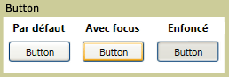

# Bouton
Un contrôle <xref:System.Windows.Controls.Button> réagit à l'utilisation d'une souris, d'un clavier, d'un stylet ou d'un autre périphérique d'entrée et déclenche un événement <xref:System.Windows.Controls.Primitives.ButtonBase.Click>.  Un <xref:System.Windows.Controls.Button> est un composant [!INCLUDE[TLA#tla_ui](../../../../includes/tlasharptla-ui-md.md)] de base qui peut contenir un contenu simple \(texte, par exemple\) ou complexe \(images et contrôles <xref:System.Windows.Controls.Panel>, par exemple\).  
  
   
  
## Dans cette section  
 [Créer un bouton comportant une image](../../../../docs/framework/wpf/controls/how-to-create-a-button-that-has-an-image.md)  
  
## Référence  
 <xref:System.Windows.Controls.Button>  
 <xref:System.Windows.Controls.Primitives.ButtonBase>  
 <xref:System.Windows.Controls.RadioButton>  
 <xref:System.Windows.Controls.Primitives.RepeatButton>