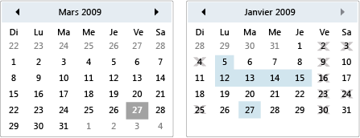

# Calendar
Un calendrier permet à un utilisateur de sélectionner une date à l'aide d'un affichage de calendrier visuel.  
  
 Un contrôle <xref:System.Windows.Controls.Calendar> peut être utilisé seul ou comme partie déroulante d'un contrôle <xref:System.Windows.Controls.DatePicker>.  Pour plus d'informations, consultez <xref:System.Windows.Controls.DatePicker>.  
  
 L'illustration suivante montre deux contrôles <xref:System.Windows.Controls.Calendar>, l'un avec des sélections et des dates d'indisponibilité, et l'autre sans ces éléments.  
  
   
Contrôles Calendar  
  
 Le tableau suivant fournit des informations relatives aux tâches qui sont généralement associées à <xref:System.Windows.Controls.Calendar>.  
  
|Tâche|Implémentation|  
|-----------|--------------------|  
|Spécifier des dates qui ne peuvent pas être sélectionnées.|Utilisez la propriété <xref:System.Windows.Controls.Calendar.BlackoutDates%2A>.|  
|Inviter le <xref:System.Windows.Controls.Calendar> à afficher un mois, une année entière ou une décennie.|Affectez la valeur Mois, Année ou Décennie à la propriété <xref:System.Windows.Controls.Calendar.DisplayMode%2A>.|  
|Spécifier si l'utilisateur peut sélectionner une date, une plage de dates ou plusieurs plages de dates.|Utilisez <xref:System.Windows.Controls.Calendar.SelectionMode%2A>.|  
|Spécifier la plage des dates que le <xref:System.Windows.Controls.Calendar> affiche.|Utilisez les propriétés <xref:System.Windows.Controls.Calendar.DisplayDateStart%2A> et <xref:System.Windows.Controls.Calendar.DisplayDateEnd%2A>.|  
|Spécifier si la date courante est mise en surbrillance.|Utilisez la propriété <xref:System.Windows.Controls.Calendar.IsTodayHighlighted%2A>.  Par défaut, <xref:System.Windows.Controls.Calendar.IsTodayHighlighted%2A> a la valeur `true`.|  
|Modifier la taille du <xref:System.Windows.Controls.Calendar>.|Utilisez un <xref:System.Windows.Controls.Viewbox> ou définissez la propriété <xref:System.Windows.FrameworkElement.LayoutTransform%2A> sur un <xref:System.Windows.Media.ScaleTransform>.  Notez que si vous définissez les propriétés <xref:System.Windows.FrameworkElement.Width%2A> et <xref:System.Windows.FrameworkElement.Height%2A> d'un <xref:System.Windows.Controls.Calendar>, le calendrier réel ne change pas de taille.|  
  
 Le contrôle <xref:System.Windows.Controls.Calendar> fournit une navigation de base à l'aide de la souris ou du clavier.  Le tableau suivant résume la navigation à l'aide du clavier.  
  
|Combinaison de touches|<xref:System.Windows.Controls.Calendar.DisplayMode%2A>|Action|  
|----------------------------|-----------------------------------------------------------------------------------------------------------------------------------------------------------|------------|  
|TOUCHE DE DIRECTION|<xref:System.Windows.Controls.CalendarMode>|Modifie la propriété <xref:System.Windows.Controls.Calendar.SelectedDate%2A> si la propriété <xref:System.Windows.Controls.Calendar.SelectionMode%2A> n'a pas la valeur <xref:System.Windows.Controls.CalendarSelectionMode>.|  
|TOUCHE DE DIRECTION|<xref:System.Windows.Controls.CalendarMode>|Modifie le mois de la propriété <xref:System.Windows.Controls.Calendar.DisplayDate%2A>.  Notez que la <xref:System.Windows.Controls.Calendar.SelectedDate%2A> ne change pas.|  
|TOUCHE DE DIRECTION|<xref:System.Windows.Controls.CalendarMode>|Modifie l'année du <xref:System.Windows.Controls.Calendar.DisplayDate%2A>.  Notez que la <xref:System.Windows.Controls.Calendar.SelectedDate%2A> ne change pas.|  
|MAJ\+TOUCHE DE DIRECTION|<xref:System.Windows.Controls.CalendarMode>|Si <xref:System.Windows.Controls.Calendar.SelectionMode%2A> n'a pas la valeur <xref:System.Windows.Controls.CalendarSelectionMode> ou <xref:System.Windows.Controls.CalendarSelectionMode>, étend la plage de dates sélectionnées.|  
|DÉBUT|<xref:System.Windows.Controls.CalendarMode>|Modifie le <xref:System.Windows.Controls.Calendar.SelectedDate%2A> en premier jour du mois actuel.|  
|DÉBUT|<xref:System.Windows.Controls.CalendarMode>|Modifie le mois du <xref:System.Windows.Controls.Calendar.DisplayDate%2A> en premier mois de l'année.  Le <xref:System.Windows.Controls.Calendar.SelectedDate%2A> ne change pas.|  
|DÉBUT|<xref:System.Windows.Controls.CalendarMode>|Modifie l'année du <xref:System.Windows.Controls.Calendar.DisplayDate%2A> en la première année de la décennie.  Le <xref:System.Windows.Controls.Calendar.SelectedDate%2A> ne change pas.|  
|FIN|<xref:System.Windows.Controls.CalendarMode>|Modifie le <xref:System.Windows.Controls.Calendar.SelectedDate%2A> en dernier jour du mois actuel.|  
|FIN|<xref:System.Windows.Controls.CalendarMode>|Modifie le mois du <xref:System.Windows.Controls.Calendar.DisplayDate%2A> en dernier mois de l'année.  Le <xref:System.Windows.Controls.Calendar.SelectedDate%2A> ne change pas.|  
|FIN|<xref:System.Windows.Controls.CalendarMode>|Modifie l'année du <xref:System.Windows.Controls.Calendar.DisplayDate%2A> en la dernière année de la décennie.  Le <xref:System.Windows.Controls.Calendar.SelectedDate%2A> ne change pas.|  
|CTRL\+HAUT|Any|Fait passer au <xref:System.Windows.Controls.Calendar.DisplayMode%2A> supérieur suivant.  Si <xref:System.Windows.Controls.Calendar.DisplayMode%2A> est déjà <xref:System.Windows.Controls.CalendarMode>, aucune action n'est effectuée.|  
|CTRL\+BAS|Any|Fait passer au <xref:System.Windows.Controls.Calendar.DisplayMode%2A> inférieur suivant.  Si <xref:System.Windows.Controls.Calendar.DisplayMode%2A> est déjà <xref:System.Windows.Controls.CalendarMode>, aucune action n'est effectuée.|  
|ESPACE ou ENTRÉE|<xref:System.Windows.Controls.CalendarMode> ou <xref:System.Windows.Controls.CalendarMode>|Fait passer <xref:System.Windows.Controls.Calendar.DisplayMode%2A> au <xref:System.Windows.Controls.CalendarMode> ou <xref:System.Windows.Controls.CalendarMode> représenté par l'élément ayant le focus.|  
  
## Voir aussi  
 [Contrôles](../../../../docs/framework/wpf/controls/index.md)   
 [Application d'un style et création de modèles](../../../../docs/framework/wpf/controls/styling-and-templating.md)