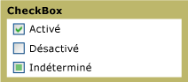

# Case à cocher
Vous pouvez utiliser un <xref:System.Windows.Controls.CheckBox> dans les [!INCLUDE[TLA#tla_ui](../../../../includes/tlasharptla-ui-md.md)] de votre application pour représenter les options qu’un utilisateur peut sélectionner ou effacer. Vous pouvez utiliser une case à cocher unique ou regrouper deux ou plusieurs cases à cocher.  
  
 Le graphique suivant illustre les différents États d’un <xref:System.Windows.Controls.CheckBox>.  
  
   
Contrôles de case à cocher dans différents États  
  
## Référence  
 <xref:System.Windows.Controls.CheckBox>  
  <xref:System.Windows.Controls.RadioButton>  
  <xref:System.Windows.Controls.Primitives.ButtonBase>  
  <xref:System.Windows.Controls.Primitives.RepeatButton>  
  
## Rubriques connexes
