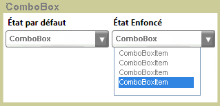

# ComboBoxComboBox
Le <xref:System.Windows.Controls.ComboBox> contrôle présente aux utilisateurs une liste d’options.The <xref:System.Windows.Controls.ComboBox> control presents users with a list of options. La liste est affichée et masquée lorsque le contrôle se développe et réduit.The list is shown and hidden as the control expands and collapses. Dans son état par défaut, la liste est réduite pour afficher les choix qu’un seul.In its default state, the list is collapsed, displaying only one choice. L’utilisateur clique sur un bouton pour afficher la liste complète des options.The user clicks a button to see the complete list of options.  
  
 L’illustration suivante montre un <xref:System.Windows.Controls.ComboBox> dans différents états.The following illustration shows a <xref:System.Windows.Controls.ComboBox> in different states.  
  
   
Réduit et développéCollapsed and expanded  
  
## Dans cette sectionIn This Section  
 [Comment : obtenir un ComboBoxItemHow to: Get a ComboBoxItem](http://msdn.microsoft.com/library/8a0d2622-64b6-41fc-bf80-9669a1eacb53)  
  
## RéférenceReference  
 <xref:System.Windows.Controls.ComboBox>
