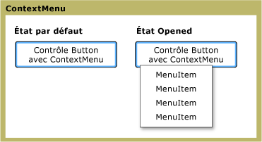

# ContextMenu
Le <xref:System.Windows.Controls.ContextMenu> permet à un contrôle d'afficher un <xref:System.Windows.Controls.Menu> qui est spécifique au contexte du contrôle.  En général, le <xref:System.Windows.Controls.ContextMenu> est exposé dans le [!INCLUDE[TLA#tla_ui](../../../../includes/tlasharptla-ui-md.md)] par le biais du bouton droit de la souris ou du bouton de menu du clavier.  
  
 L'illustration suivante montre un <xref:System.Windows.Controls.ContextMenu> dans deux états différents : l'état par défaut et l'état ouvert.  Dans l'état par défaut, le contrôle est réduit.  Lorsque l'on appuie sur le bouton droit de la souris au dessus du parent du menu, le contrôle se développe et affiche les éléments de menu.  
  
   
ContextMenu dans différents états  
  
## Dans cette section  
 [Vue d'ensemble de ContextMenu](../../../../docs/framework/wpf/controls/contextmenu-overview.md)  
  
## Référence  
 <xref:System.Windows.Controls.ContextMenu>  
  
## Rubriques connexes