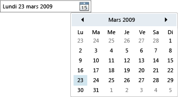

# Sélecteur de dates
Le <xref:System.Windows.Controls.DatePicker> contrôle permet à l’utilisateur de sélectionner une date en la tapant dans un champ de texte ou à l’aide d’une liste déroulante <xref:System.Windows.Controls.Calendar> contrôle.  
  
 L’illustration suivante montre un <xref:System.Windows.Controls.DatePicker>.  
  
   
Contrôle DatePicker  
  
 Un grand nombre d’un <xref:System.Windows.Controls.DatePicker> sont des propriétés de contrôle pour la gestion de son intégré <xref:System.Windows.Controls.Calendar>et la fonction identique à la propriété équivalente dans <xref:System.Windows.Controls.Calendar>. En particulier, la <xref:System.Windows.Controls.DatePicker.IsTodayHighlighted%2A?displayProperty=nameWithType>, <xref:System.Windows.Controls.DatePicker.FirstDayOfWeek%2A?displayProperty=nameWithType>, <xref:System.Windows.Controls.DatePicker.BlackoutDates%2A?displayProperty=nameWithType>, <xref:System.Windows.Controls.DatePicker.DisplayDateStart%2A?displayProperty=nameWithType>, <xref:System.Windows.Controls.DatePicker.DisplayDateEnd%2A?displayProperty=nameWithType>, <xref:System.Windows.Controls.DatePicker.DisplayDate%2A?displayProperty=nameWithType>, et <xref:System.Windows.Controls.DatePicker.SelectedDate%2A?displayProperty=nameWithType> propriétés fonctionnent de manière identique à leurs <xref:System.Windows.Controls.Calendar> équivalents. Pour plus d'informations, consultez <xref:System.Windows.Controls.Calendar>.  
  
 Les utilisateurs peuvent taper une date directement dans un champ de texte, qui définit le <xref:System.Windows.Controls.DatePicker.Text%2A> propriété. Si le <xref:System.Windows.Controls.DatePicker> Impossible de convertir la chaîne d’entrée à une date valide, la <xref:System.Windows.Controls.DatePicker.DateValidationError> événement sera déclenché. Par défaut, cela provoque une exception, mais un gestionnaire d’événements <xref:System.Windows.Controls.DatePicker.DateValidationError> peut définir le <xref:System.Windows.Controls.DatePickerDateValidationErrorEventArgs.ThrowException%2A> propriété `false` et empêcher la levée d’une exception.  
  
## Voir aussi  
 [Contrôles](../../../../docs/framework/wpf/controls/index.md)  
 [Application d’un style et création de modèles](../../../../docs/framework/wpf/controls/styling-and-templating.md)
