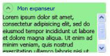

# Vue d'ensemble de l'expanseurExpander Overview
Un <xref:System.Windows.Controls.Expander> contrôle permet de fournir le contenu d’une zone développable qui ressemble à une fenêtre et inclut un en-tête.An <xref:System.Windows.Controls.Expander> control provides a way to provide content in an expandable area that resembles a window and includes a header.  
  
  
   
## Créer un Expander simpleCreating a Simple Expander  
 L’exemple suivant montre comment créer un simple <xref:System.Windows.Controls.Expander> contrôle.The following example shows how to create a simple <xref:System.Windows.Controls.Expander> control. Cet exemple crée un <xref:System.Windows.Controls.Expander> qui ressemble à l’illustration précédente.This example creates an <xref:System.Windows.Controls.Expander> that looks like the previous illustration.  
  
 [!code-xaml[ExpanderExample#2](../../../../samples/snippets/csharp/VS_Snippets_Wpf/ExpanderExample/CSharp/Page1.xaml#2)]  
  
 Le <xref:System.Windows.Controls.ContentControl.Content%2A> et <xref:System.Windows.Controls.HeaderedContentControl.Header%2A> d’un <xref:System.Windows.Controls.Expander> peut également contenir un contenu complexe, tel que <xref:System.Windows.Controls.RadioButton> et <xref:System.Windows.Controls.Image> objets.The <xref:System.Windows.Controls.ContentControl.Content%2A> and <xref:System.Windows.Controls.HeaderedContentControl.Header%2A> of an <xref:System.Windows.Controls.Expander> can also contain complex content, such as <xref:System.Windows.Controls.RadioButton> and <xref:System.Windows.Controls.Image> objects.  
  
   
## Définir la direction de la zone de contenu extensibleSetting the Direction of the Expanding Content Area  
 Vous pouvez définir la zone de contenu d’un <xref:System.Windows.Controls.Expander> contrôle à développer dans une des quatre directions (<xref:System.Windows.Controls.ExpandDirection.Down>, <xref:System.Windows.Controls.ExpandDirection.Up>, <xref:System.Windows.Controls.ExpandDirection.Left>, ou <xref:System.Windows.Controls.ExpandDirection.Right>) à l’aide de la <xref:System.Windows.Controls.ExpandDirection> propriété.You can set the content area of an <xref:System.Windows.Controls.Expander> control to expand in one of four directions (<xref:System.Windows.Controls.ExpandDirection.Down>, <xref:System.Windows.Controls.ExpandDirection.Up>, <xref:System.Windows.Controls.ExpandDirection.Left>, or <xref:System.Windows.Controls.ExpandDirection.Right>) by using the <xref:System.Windows.Controls.ExpandDirection> property. Lorsque la zone de contenu est réduite, seul le <xref:System.Windows.Controls.Expander> <xref:System.Windows.Controls.HeaderedContentControl.Header%2A> et son bouton bascule apparaissent.When the content area is collapsed, only the <xref:System.Windows.Controls.Expander><xref:System.Windows.Controls.HeaderedContentControl.Header%2A> and its toggle button appear. A <xref:System.Windows.Controls.Button> contrôle qui affiche une flèche directionnelle est utilisé comme un bouton bascule pour développer ou réduire la zone de contenu.A <xref:System.Windows.Controls.Button> control that displays a directional arrow is used as a toggle button to expand or collapse the content area. Quand il est développé, le <xref:System.Windows.Controls.Expander> essaie d’afficher tout son contenu dans une zone de fenêtre similaire.When expanded, the <xref:System.Windows.Controls.Expander> tries to display all of its content in a window-like area.  
  
   
## Contrôler la taille d’un Expander dans un panneauControlling the Size of an Expander in a Panel  
 Si un <xref:System.Windows.Controls.Expander> contrôle se trouve dans un contrôle de disposition qui hérite de <xref:System.Windows.Controls.Panel>, tel que <xref:System.Windows.Controls.StackPanel>, ne spécifiez pas un <xref:System.Windows.FrameworkElement.Height%2A> sur le <xref:System.Windows.Controls.Expander> lorsque le <xref:System.Windows.Controls.Expander.ExpandDirection%2A> est définie sur <xref:System.Windows.Controls.ExpandDirection.Down> ou <xref:System.Windows.Controls.ExpandDirection.Up>.If an <xref:System.Windows.Controls.Expander> control is inside a layout control that inherits from <xref:System.Windows.Controls.Panel>, such as <xref:System.Windows.Controls.StackPanel>, do not specify a <xref:System.Windows.FrameworkElement.Height%2A> on the <xref:System.Windows.Controls.Expander> when the <xref:System.Windows.Controls.Expander.ExpandDirection%2A> property is set to <xref:System.Windows.Controls.ExpandDirection.Down> or <xref:System.Windows.Controls.ExpandDirection.Up>. De même, ne spécifiez pas un <xref:System.Windows.FrameworkElement.Width%2A> sur la <xref:System.Windows.Controls.Expander> lors de la <xref:System.Windows.Controls.Expander.ExpandDirection%2A> est définie sur <xref:System.Windows.Controls.ExpandDirection.Left> ou <xref:System.Windows.Controls.ExpandDirection.Right>.Similarly, do not specify a <xref:System.Windows.FrameworkElement.Width%2A> on the <xref:System.Windows.Controls.Expander> when the <xref:System.Windows.Controls.Expander.ExpandDirection%2A> property is set to <xref:System.Windows.Controls.ExpandDirection.Left> or <xref:System.Windows.Controls.ExpandDirection.Right>.  
  
 Lorsque vous définissez une dimension sur un <xref:System.Windows.Controls.Expander> contrôle dans la direction que le contenu développé s’affiche, le <xref:System.Windows.Controls.Expander> prend le contrôle de la zone qui est utilisée par le contenu et affiche une bordure autour de lui.When you set a size dimension on an <xref:System.Windows.Controls.Expander> control in the direction that the expanded content is displayed, the <xref:System.Windows.Controls.Expander> takes control of the area that is used by the content and displays a border around it. La bordure s’affiche même lorsque le contenu est réduit.The border shows even when the content is collapsed. Pour définir la taille de la zone de contenu développée, définissez des dimensions dans le contenu de la <xref:System.Windows.Controls.Expander>, ou si vous souhaitez que le défilement de la fonctionnalité, sur le <xref:System.Windows.Controls.ScrollViewer> qui englobe le contenu.To set the size of the expanded content area, set size dimensions on the content of the <xref:System.Windows.Controls.Expander>, or if you want scrolling capability, on the <xref:System.Windows.Controls.ScrollViewer> that encloses the content.  
  
 Lorsqu’un <xref:System.Windows.Controls.Expander> contrôle est le dernier élément dans un <xref:System.Windows.Controls.DockPanel>, [!INCLUDE[TLA#tla_winclient](../../../../includes/tlasharptla-winclient-md.md)] définit automatiquement le <xref:System.Windows.Controls.Expander> dimensions pour être égale à la zone restante de la <xref:System.Windows.Controls.DockPanel>.When an <xref:System.Windows.Controls.Expander> control is the last element in a <xref:System.Windows.Controls.DockPanel>, [!INCLUDE[TLA#tla_winclient](../../../../includes/tlasharptla-winclient-md.md)] automatically sets the <xref:System.Windows.Controls.Expander> dimensions to equal the remaining area of the <xref:System.Windows.Controls.DockPanel>. Pour éviter ce comportement par défaut, définissez la <xref:System.Windows.Controls.DockPanel.LastChildFill%2A> propriété sur le <xref:System.Windows.Controls.DockPanel> objet `false`, ou assurez-vous que le <xref:System.Windows.Controls.Expander> n’est pas le dernier élément dans un <xref:System.Windows.Controls.DockPanel>.To prevent this default behavior, set the <xref:System.Windows.Controls.DockPanel.LastChildFill%2A> property on the <xref:System.Windows.Controls.DockPanel> object to `false`, or make sure that the <xref:System.Windows.Controls.Expander> is not the last element in a <xref:System.Windows.Controls.DockPanel>.  
  
   
## Créer du contenu déroulantCreating Scrollable Content  
 Si le contenu est trop grand pour la taille de la zone de contenu, vous pouvez encapsuler le contenu d’un <xref:System.Windows.Controls.Expander> dans un <xref:System.Windows.Controls.ScrollViewer> afin de fournir un contenu déroulant.If the content is too large for the size of the content area, you can wrap the content of an <xref:System.Windows.Controls.Expander> in a <xref:System.Windows.Controls.ScrollViewer> in order to provide scrollable content. Le <xref:System.Windows.Controls.Expander> contrôle ne fournit pas automatiquement la fonction de défilement.The <xref:System.Windows.Controls.Expander> control does not automatically provide scrolling capability. L’illustration suivante montre un <xref:System.Windows.Controls.Expander> contrôle contenant un <xref:System.Windows.Controls.ScrollViewer> contrôle.The following illustration shows an <xref:System.Windows.Controls.Expander> control that contains a <xref:System.Windows.Controls.ScrollViewer> control.  
  
 **Expander dans un ScrollViewer****Expander in a ScrollViewer**  
  
   
  
 Lorsque vous placez un <xref:System.Windows.Controls.Expander> contrôler dans un <xref:System.Windows.Controls.ScrollViewer>, définissez le <xref:System.Windows.Controls.ScrollViewer> dimension de propriété qui correspond à la direction dans laquelle le <xref:System.Windows.Controls.Expander> contenu s’ouvre à la taille de la <xref:System.Windows.Controls.Expander> zone de contenu.When you place an <xref:System.Windows.Controls.Expander> control in a <xref:System.Windows.Controls.ScrollViewer>, set the <xref:System.Windows.Controls.ScrollViewer> dimension property that corresponds to the direction in which the <xref:System.Windows.Controls.Expander> content opens to the size of the <xref:System.Windows.Controls.Expander> content area. Par exemple, si vous définissez la <xref:System.Windows.Controls.Expander.ExpandDirection%2A> propriété sur le <xref:System.Windows.Controls.Expander> à <xref:System.Windows.Controls.ExpandDirection.Down> (la zone de contenu s’ouvre vers le bas), définir le <xref:System.Windows.FrameworkElement.Height%2A> propriété sur le <xref:System.Windows.Controls.ScrollViewer> contrôle la hauteur requise pour la zone de contenu.For example, if you set the <xref:System.Windows.Controls.Expander.ExpandDirection%2A> property on the <xref:System.Windows.Controls.Expander> to <xref:System.Windows.Controls.ExpandDirection.Down> (the content area opens down), set the <xref:System.Windows.FrameworkElement.Height%2A> property on the <xref:System.Windows.Controls.ScrollViewer> control to the required height for the content area. Si vous définissez à la place la hauteur sur le contenu lui-même, <xref:System.Windows.Controls.ScrollViewer> ne reconnaît pas ce paramètre et par conséquent, ne fournit pas de contenu déroulant.If you instead set the height dimension on the content itself, <xref:System.Windows.Controls.ScrollViewer> does not recognize this setting and therefore, does not provide scrollable content.  
  
 L’exemple suivant montre comment créer un <xref:System.Windows.Controls.Expander> contrôle qui a du contenu complexe et contenant un <xref:System.Windows.Controls.ScrollViewer> contrôle.The following example shows how to create an <xref:System.Windows.Controls.Expander> control that has complex content and that contains a <xref:System.Windows.Controls.ScrollViewer> control. Cet exemple crée un <xref:System.Windows.Controls.Expander> qui ressemble à l’illustration au début de cette section.This example creates an <xref:System.Windows.Controls.Expander> that is like the illustration at the beginning of this section.  
  
 [!code-csharp[ExpanderRichContent#1](../../../../samples/snippets/csharp/VS_Snippets_Wpf/ExpanderRichContent/CSharp/Window1.xaml.cs#1)]
 [!code-vb[ExpanderRichContent#1](../../../../samples/snippets/visualbasic/VS_Snippets_Wpf/ExpanderRichContent/VisualBasic/Window1.xaml.vb#1)]
 [!code-xaml[ExpanderRichContent#1](../../../../samples/snippets/csharp/VS_Snippets_Wpf/ExpanderRichContent/CSharp/Window1.xaml#1)]  
  
   
## Utiliser les propriétés d’alignementUsing the Alignment Properties  
 Vous pouvez aligner le contenu en définissant le <xref:System.Windows.Controls.Control.HorizontalContentAlignment%2A> et <xref:System.Windows.Controls.Control.VerticalContentAlignment%2A> propriétés sur le <xref:System.Windows.Controls.Expander> contrôle.You can align content by setting the <xref:System.Windows.Controls.Control.HorizontalContentAlignment%2A> and <xref:System.Windows.Controls.Control.VerticalContentAlignment%2A> properties on the <xref:System.Windows.Controls.Expander> control. Lorsque vous définissez ces propriétés, l’alignement s’applique à l’en-tête ainsi qu’au contenu développé.When you set these properties, the alignment applies to the header and also to the expanded content.  
  
## Voir aussiSee Also  
 <xref:System.Windows.Controls.Expander>  
 <xref:System.Windows.Controls.ExpandDirection>  
 [Guides pratiquesHow-to Topics](../../../../docs/framework/wpf/controls/expander-how-to-topics.md)
