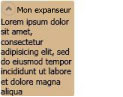

# Expander
Un <xref:System.Windows.Controls.Expander> permet à l'utilisateur d'afficher un en\-tête et de le développer pour consulter des informations supplémentaires, ou de réduire une section à un en\-tête.  
  
 L'illustration suivante fournit un exemple de ce contrôle dans sa position développée.  
  
   
Contrôle Expander  
  
## Dans cette section  
 [Vue d'ensemble de l'expanseur](../../../../docs/framework/wpf/controls/expander-overview.md)  
 [Rubriques Comment](../../../../docs/framework/wpf/controls/expander-how-to-topics.md)  
  
## Référence  
 <xref:System.Windows.Controls.Expander>  
  
## Rubriques connexes