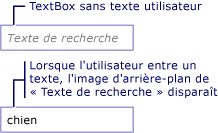

# Comment&#160;: ajouter un filigrane &#224; un TextBox
L'exemple suivant indique comment faciliter l'utilisation d'un <xref:System.Windows.Controls.TextBox> en affichant une image d'arrière\-plan explicative dans le <xref:System.Windows.Controls.TextBox> jusqu'à ce que l'utilisateur entre du texte, après quoi l'image est supprimée.  De plus, l'image d'arrière\-plan est restaurée si l'utilisateur supprime son entrée.  Voyez l'illustration ci\-dessous.  
  
   
  
> [!NOTE]
>  Cet exemple utilise une image d'arrière\-plan au lieu de simplement manipuler la propriété <xref:System.Windows.Controls.TextBox.Text%2A> du <xref:System.Windows.Controls.TextBox>, parce qu'une image d'arrière\-plan n'interfère pas avec la liaison de données.  
  
## Exemple  
 [!code-xml[TextBoxMiscSnippets_snip#TextBoxBackgroundExampleWholePage](../../../../samples/snippets/csharp/VS_Snippets_Wpf/TextBoxMiscSnippets_snip/csharp/textbox_with_background_image.xaml#textboxbackgroundexamplewholepage)]  
  
 [!code-csharp[TextBoxMiscSnippets_snip#TextBoxBackgroundCodeExampleWholePage](../../../../samples/snippets/csharp/VS_Snippets_Wpf/TextBoxMiscSnippets_snip/csharp/textbox_with_background_image.xaml.cs#textboxbackgroundcodeexamplewholepage)]
 [!code-vb[TextBoxMiscSnippets_snip#TextBoxBackgroundCodeExampleWholePage](../../../../samples/snippets/visualbasic/VS_Snippets_Wpf/TextBoxMiscSnippets_snip/visualbasic/textbox_with_background_image.xaml.vb#textboxbackgroundcodeexamplewholepage)]  
  
## Voir aussi  
 [Vue d'ensemble de TextBox](../../../../docs/framework/wpf/controls/textbox-overview.md)   
 [Vue d'ensemble de RichTextBox](../../../../docs/framework/wpf/controls/richtextbox-overview.md)