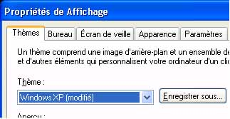

# Ajouter des contrôles
<xref:System.Windows.Controls.Label>contrôles fournissent généralement des informations dans le [!INCLUDE[TLA#tla_ui](../../../../includes/tlasharptla-ui-md.md)].  Historiquement, un <xref:System.Windows.Controls.Label> contenait que du texte, mais étant donné que la <xref:System.Windows.Controls.Label> qui est fourni avec [!INCLUDE[TLA#tla_winclient](../../../../includes/tlasharptla-winclient-md.md)] est un <xref:System.Windows.Controls.ContentControl>, il peut contenir du texte ou un <xref:System.Windows.UIElement>.  
  
 A <xref:System.Windows.Controls.Label> fournit la prise en charge visuelle et fonctionnelle pour les clés d’accès. Il est fréquemment utilisé pour activer les touches d’accès rapide à des contrôles comme une <xref:System.Windows.Controls.TextBox>. Pour affecter un <xref:System.Windows.Controls.Label> à un <xref:System.Windows.Controls.Control>, définissez le <xref:System.Windows.Controls.Label.Target%2A?displayProperty=nameWithType> propriété au contrôle qui doit recevoir le focus lorsque l’utilisateur appuie sur la clé d’accès.  
  
 L’illustration suivante montre un <xref:System.Windows.Controls.Label> « Thèmes » qui cible un <xref:System.Windows.Controls.ComboBox>.  Lorsque l’utilisateur appuie sur, la <xref:System.Windows.Controls.ComboBox> reçoit le focus.  Pour plus d’informations, consultez [Comment : définir la propriété de cible d’une étiquette](http://msdn.microsoft.com/en-us/b24c6977-ebcb-4855-a9bb-3fd4435af8f8).  
  
   
  
## Dans cette section  
 [How to: Set the Target Property of a Label](http://msdn.microsoft.com/en-us/b24c6977-ebcb-4855-a9bb-3fd4435af8f8) (Comment : définir la propriété Target d’une étiquette)  
  
## Référence  
 <xref:System.Windows.Controls.Label>
