# Comportement de positionnement de Popup
A <xref:System.Windows.Controls.Primitives.Popup> contrôle affiche le contenu dans une fenêtre distincte qui flotte au-dessus d’une application. Vous pouvez spécifier la position d’un <xref:System.Windows.Controls.Primitives.Popup> par rapport à un contrôle, la souris ou de l’écran à l’aide de la <xref:System.Windows.Controls.Primitives.Popup.PlacementTarget%2A>, <xref:System.Windows.Controls.Primitives.Popup.Placement%2A>, <xref:System.Windows.Controls.Primitives.Popup.PlacementRectangle%2A>, <xref:System.Windows.Controls.Primitives.Popup.HorizontalOffset%2A>, et <xref:System.Windows.Controls.Primitives.Popup.VerticalOffset%2A> propriétés.  Ces propriétés fonctionnent ensemble afin de vous donner une grande souplesse en spécifiant la position de la <xref:System.Windows.Controls.Primitives.Popup>.  
  
> [!NOTE]
>  Le <xref:System.Windows.Controls.ToolTip> et <xref:System.Windows.Controls.ContextMenu> classes également définir ces cinq propriétés et se comportent de la même façon.  
  

  
   
## Positionnement de la fenêtre contextuelle  
 Le placement d’un <xref:System.Windows.Controls.Primitives.Popup> peut être relatif à un <xref:System.Windows.UIElement> ou à la totalité de l’écran.  L’exemple suivant crée quatre <xref:System.Windows.Controls.Primitives.Popup> les contrôles qui sont relatives à un <xref:System.Windows.UIElement>: dans ce cas, une image. Tous le <xref:System.Windows.Controls.Primitives.Popup> les contrôles ont le <xref:System.Windows.Controls.Primitives.Popup.PlacementTarget%2A> propriété la valeur `image1`, mais chaque <xref:System.Windows.Controls.Primitives.Popup> a une valeur différente pour la propriété de positionnement.  
  
 [!code-xaml[PopupPositionSnippet#3](../../../../samples/snippets/csharp/VS_Snippets_Wpf/PopupPositionSnippet/CS/Window1.xaml#3)]  
  
 L’illustration suivante montre l’image et le <xref:System.Windows.Controls.Primitives.Popup> contrôles  
  
   
Image avec quatre contrôles Popup  
  
 Cet exemple montre comment définir la <xref:System.Windows.Controls.Primitives.Popup.PlacementTarget%2A> et <xref:System.Windows.Controls.Primitives.Popup.Placement%2A> propriétés, mais à l’aide de la <xref:System.Windows.Controls.Primitives.Popup.PlacementRectangle%2A>, <xref:System.Windows.Controls.Primitives.Popup.HorizontalOffset%2A>, et <xref:System.Windows.Controls.Primitives.Popup.VerticalOffset%2A> propriétés, vous avez davantage de contrôle sur l’emplacement le <xref:System.Windows.Controls.Primitives.Popup> est positionné.  
  
   
## Définitions des termes : anatomie d’une fenêtre contextuelle  
 Les termes suivants sont utiles pour comprendre comment les <xref:System.Windows.Controls.Primitives.Popup.PlacementTarget%2A>, <xref:System.Windows.Controls.Primitives.Popup.Placement%2A>, <xref:System.Windows.Controls.Primitives.Popup.PlacementRectangle%2A>, <xref:System.Windows.Controls.Primitives.Popup.HorizontalOffset%2A>, et <xref:System.Windows.Controls.Primitives.Popup.VerticalOffset%2A> propriétés sont liés entre eux et <xref:System.Windows.Controls.Primitives.Popup>:  
  
-   Objet cible  
  
-   Zone cible  
  
-   Origine de la cible  
  
-   Point d’alignement de la fenêtre contextuelle  
  
 Ces termes fournissent un moyen pratique pour faire référence aux différents aspects de la <xref:System.Windows.Controls.Primitives.Popup> et le contrôle auquel il est associé.  
  
### Objet cible  
 Le *objet cible* est l’élément qui le <xref:System.Windows.Controls.Primitives.Popup> est associé. Si la <xref:System.Windows.Controls.Primitives.Popup.PlacementTarget%2A> est définie, elle spécifie l’objet cible.  Si <xref:System.Windows.Controls.Primitives.Popup.PlacementTarget%2A> n’est pas définie et la <xref:System.Windows.Controls.Primitives.Popup> a un parent, le parent est l’objet cible.  S’il existe aucune <xref:System.Windows.Controls.Primitives.Popup.PlacementTarget%2A> valeur et pas de parent, il n’existe aucun objet cible et le <xref:System.Windows.Controls.Primitives.Popup> est positionné par rapport à l’écran.  
  
 L’exemple suivant crée un <xref:System.Windows.Controls.Primitives.Popup> qui est l’enfant d’un <xref:System.Windows.Controls.Canvas>.  L’exemple ne définit pas le <xref:System.Windows.Controls.Primitives.Popup.PlacementTarget%2A> propriété sur le <xref:System.Windows.Controls.Primitives.Popup>. La valeur par défaut <xref:System.Windows.Controls.Primitives.Popup.Placement%2A> est <xref:System.Windows.Controls.Primitives.PlacementMode.Bottom?displayProperty=nameWithType>, donc le <xref:System.Windows.Controls.Primitives.Popup> apparaît sous le <xref:System.Windows.Controls.Canvas>.  
  
 [!code-xaml[PopupPositionSnippet#1](../../../../samples/snippets/csharp/VS_Snippets_Wpf/PopupPositionSnippet/CS/Window1.xaml#1)]  
  
 L’illustration suivante montre que le <xref:System.Windows.Controls.Primitives.Popup> est positionné par rapport à la <xref:System.Windows.Controls.Canvas>.  
  
   
Contrôle Popup sans PlacementTarget  
  
 L’exemple suivant crée un <xref:System.Windows.Controls.Primitives.Popup> qui est l’enfant d’un <xref:System.Windows.Controls.Canvas>, mais cette fois le <xref:System.Windows.Controls.Primitives.Popup.PlacementTarget%2A> a la valeur `ellipse1`, de sorte que la fenêtre contextuelle apparaît sous le <xref:System.Windows.Shapes.Ellipse>.  
  
 [!code-xaml[PopupPositionSnippet#2](../../../../samples/snippets/csharp/VS_Snippets_Wpf/PopupPositionSnippet/CS/Window1.xaml#2)]  
  
 L’illustration suivante montre que le <xref:System.Windows.Controls.Primitives.Popup> est positionné par rapport à la <xref:System.Windows.Shapes.Ellipse>.  
  
   
Fenêtre contextuelle avec PlacementTarget  
  
> [!NOTE]
>  Pour <xref:System.Windows.Controls.ToolTip>, la valeur par défaut <xref:System.Windows.Controls.Primitives.Popup.Placement%2A> est <xref:System.Windows.Controls.Primitives.PlacementMode.Mouse>.  Pour <xref:System.Windows.Controls.ContextMenu>, la valeur par défaut <xref:System.Windows.Controls.Primitives.Popup.Placement%2A> est <xref:System.Windows.Controls.Primitives.PlacementMode.MousePoint>. Ces valeurs sont expliquées plus loin, dans la section « Comment les propriétés fonctionnent ensemble ».  
  
### Zone cible  
 Le *cible zone* est la zone de l’écran qui la <xref:System.Windows.Controls.Primitives.Popup> est relatif au. Dans les exemples précédents, le <xref:System.Windows.Controls.Primitives.Popup> est aligné sur les limites de l’objet cible, mais dans certains cas, le <xref:System.Windows.Controls.Primitives.Popup> est aligné sur d’autres limites, même si le <xref:System.Windows.Controls.Primitives.Popup> a un objet cible.  Si la <xref:System.Windows.Controls.Primitives.Popup.PlacementRectangle%2A> est définie, la zone de la cible est différente des limites de l’objet cible.  
  
 L’exemple suivant crée deux <xref:System.Windows.Controls.Canvas> d’objets, chacun d’eux contenant un <xref:System.Windows.Shapes.Rectangle> et un <xref:System.Windows.Controls.Primitives.Popup>.  Dans les deux cas, la cible de l’objet pour le <xref:System.Windows.Controls.Primitives.Popup> est le <xref:System.Windows.Controls.Canvas>. Le <xref:System.Windows.Controls.Primitives.Popup> dans la première <xref:System.Windows.Controls.Canvas> a le <xref:System.Windows.Controls.Primitives.Popup.PlacementRectangle%2A> défini, avec ses <xref:System.Windows.Rect.X%2A>, <xref:System.Windows.Rect.Y%2A>, <xref:System.Windows.Rect.Width%2A>, et <xref:System.Windows.Rect.Height%2A> propriétés la valeur 50, 50, 50 et 100, respectivement. Le <xref:System.Windows.Controls.Primitives.Popup> dans la seconde <xref:System.Windows.Controls.Canvas> n’a pas le <xref:System.Windows.Controls.Primitives.Popup.PlacementRectangle%2A> défini.  Par conséquent, la première <xref:System.Windows.Controls.Primitives.Popup> est positionnée au-dessous de la <xref:System.Windows.Controls.Primitives.Popup.PlacementRectangle%2A> et le second <xref:System.Windows.Controls.Primitives.Popup> se trouve sous le <xref:System.Windows.Controls.Canvas>. Chaque <xref:System.Windows.Controls.Canvas> contient également un <xref:System.Windows.Shapes.Rectangle> qui a les mêmes limites que le <xref:System.Windows.Controls.Primitives.Popup.PlacementRectangle%2A> pour la première <xref:System.Windows.Controls.Primitives.Popup>.  Notez que la <xref:System.Windows.Controls.Primitives.Popup.PlacementRectangle%2A> ne crée pas d’élément visible dans l’application, l’exemple crée un <xref:System.Windows.Shapes.Rectangle> pour représenter le <xref:System.Windows.Controls.Primitives.Popup.PlacementRectangle%2A>.  
  
 [!code-xaml[PopupPositionSnippet#4](../../../../samples/snippets/csharp/VS_Snippets_Wpf/PopupPositionSnippet/CS/Window1.xaml#4)]  
  
 L’illustration suivante montre le résultat de l’exemple précédent.  
  
   
Popup avec et sans PlacementRectangle  
  
### Origine de la cible et point d’alignement de la fenêtre contextuelle  
 *L’origine de la cible* et le *point d’alignement de la fenêtre contextuelle* sont des points de référence sur la zone cible et la fenêtre contextuelle respectivement, qui sont utilisés pour le positionnement. Vous pouvez utiliser la <xref:System.Windows.Controls.Primitives.Popup.HorizontalOffset%2A> et <xref:System.Windows.Controls.Primitives.Popup.VerticalOffset%2A> propriétés pour le décalage de la fenêtre contextuelle à partir de la zone cible.  Le <xref:System.Windows.Controls.Primitives.Popup.HorizontalOffset%2A> et <xref:System.Windows.Controls.Primitives.Popup.VerticalOffset%2A> sont par rapport à l’origine de la cible et le point d’alignement. La valeur de la <xref:System.Windows.Controls.Primitives.Popup.Placement%2A> propriété détermine où se trouvent le point d’alignement de fenêtre contextuelle et d’origine cible.  
  
 L’exemple suivant crée un <xref:System.Windows.Controls.Primitives.Popup> et définit les <xref:System.Windows.Controls.Primitives.Popup.HorizontalOffset%2A> et <xref:System.Windows.Controls.Primitives.Popup.VerticalOffset%2A> 20 aux propriétés.  Le <xref:System.Windows.Controls.Primitives.Popup.Placement%2A> est définie sur <xref:System.Windows.Controls.Primitives.PlacementMode.Bottom> (la valeur par défaut), donc l’origine de la cible est l’angle inférieur gauche de la zone cible et le point d’alignement est l’angle supérieur gauche de la <xref:System.Windows.Controls.Primitives.Popup>.  
  
 [!code-xaml[PopupPositionSnippet#5](../../../../samples/snippets/csharp/VS_Snippets_Wpf/PopupPositionSnippet/CS/Window1.xaml#5)]  
  
 L’illustration suivante montre le résultat de l’exemple précédent.  
  
 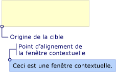  
Fenêtre contextuelle avec HorizontalOffset et VerticalOffset  
  
   
## Comment les propriétés fonctionnent ensemble  
 Les valeurs de <xref:System.Windows.Controls.Primitives.Popup.PlacementTarget%2A>, <xref:System.Windows.Controls.Primitives.Popup.PlacementRectangle%2A>, et <xref:System.Windows.Controls.Primitives.Popup.Placement%2A> doivent être pris en considération conjointement pour déterminer la zone de la cible, l’origine de la cible et point d’alignement.  Par exemple, si la valeur de <xref:System.Windows.Controls.Primitives.Popup.Placement%2A> est <xref:System.Windows.Controls.Primitives.PlacementMode.Mouse>, il n’existe aucun objet de cible, le <xref:System.Windows.Controls.Primitives.Popup.PlacementRectangle%2A> est ignoré, et la zone de la cible est les limites du pointeur de la souris. En revanche, si <xref:System.Windows.Controls.Primitives.Popup.Placement%2A> est <xref:System.Windows.Controls.Primitives.PlacementMode.Bottom>, le <xref:System.Windows.Controls.Primitives.Popup.PlacementTarget%2A> ou parent détermine l’objet cible et <xref:System.Windows.Controls.Primitives.Popup.PlacementRectangle%2A> détermine la zone cible.  
  
 Le tableau suivant décrit l’objet cible, zone de la cible, origine de la cible et point d’alignement et indique si <xref:System.Windows.Controls.Primitives.Popup.PlacementTarget%2A> et <xref:System.Windows.Controls.Primitives.Popup.PlacementRectangle%2A> sont utilisés pour chaque <xref:System.Windows.Controls.Primitives.PlacementMode> valeur d’énumération.  
  
|PlacementMode|Objet cible|Zone cible|Origine de la cible|Point d’alignement de la fenêtre contextuelle|  
|-------------------|-------------------|-----------------|-------------------|---------------------------|  
|<xref:System.Windows.Controls.Primitives.PlacementMode.Absolute>|Non applicable. <xref:System.Windows.Controls.Primitives.Popup.PlacementTarget%2A>est ignoré.|L’écran, ou <xref:System.Windows.Controls.Primitives.Popup.PlacementRectangle%2A> si elle est définie.  Le <xref:System.Windows.Controls.Primitives.Popup.PlacementRectangle%2A> est relative à l’écran.|L’angle supérieur gauche de la zone cible.|L’angle supérieur gauche de la <xref:System.Windows.Controls.Primitives.Popup>.|  
|<xref:System.Windows.Controls.Primitives.PlacementMode.AbsolutePoint>|Non applicable. <xref:System.Windows.Controls.Primitives.Popup.PlacementTarget%2A>est ignoré.|L’écran, ou <xref:System.Windows.Controls.Primitives.Popup.PlacementRectangle%2A> si elle est définie.  Le <xref:System.Windows.Controls.Primitives.Popup.PlacementRectangle%2A> est relative à l’écran.|L’angle supérieur gauche de la zone cible.|L’angle supérieur gauche de la <xref:System.Windows.Controls.Primitives.Popup>.|  
|<xref:System.Windows.Controls.Primitives.PlacementMode.Bottom>|<xref:System.Windows.Controls.Primitives.Popup.PlacementTarget%2A>ou le parent.|L’objet cible, ou <xref:System.Windows.Controls.Primitives.Popup.PlacementRectangle%2A> si elle est définie.  Le <xref:System.Windows.Controls.Primitives.Popup.PlacementRectangle%2A> est relatif à l’objet cible.|L’angle inférieur gauche de la zone cible.|L’angle supérieur gauche de la <xref:System.Windows.Controls.Primitives.Popup>.|  
|<xref:System.Windows.Controls.Primitives.PlacementMode.Center>|<xref:System.Windows.Controls.Primitives.Popup.PlacementTarget%2A>ou le parent.|L’objet cible, ou <xref:System.Windows.Controls.Primitives.Popup.PlacementRectangle%2A> si elle est définie.  Le <xref:System.Windows.Controls.Primitives.Popup.PlacementRectangle%2A> est relatif à l’objet cible.|Le centre de la zone cible.|Le centre de la <xref:System.Windows.Controls.Primitives.Popup>.|  
|<xref:System.Windows.Controls.Primitives.PlacementMode.Custom>|<xref:System.Windows.Controls.Primitives.Popup.PlacementTarget%2A>ou le parent.|L’objet cible, ou <xref:System.Windows.Controls.Primitives.Popup.PlacementRectangle%2A> si elle est définie.  Le <xref:System.Windows.Controls.Primitives.Popup.PlacementRectangle%2A> est relatif à l’objet cible.|Défini par le <xref:System.Windows.Controls.Primitives.CustomPopupPlacementCallback>.|Défini par le <xref:System.Windows.Controls.Primitives.CustomPopupPlacementCallback>.|  
|<xref:System.Windows.Controls.Primitives.PlacementMode.Left>|<xref:System.Windows.Controls.Primitives.Popup.PlacementTarget%2A>ou le parent.|L’objet cible, ou <xref:System.Windows.Controls.Primitives.Popup.PlacementRectangle%2A> si elle est définie.  Le <xref:System.Windows.Controls.Primitives.Popup.PlacementRectangle%2A> est relatif à l’objet cible.|L’angle supérieur gauche de la zone cible.|L’angle supérieur droit de la <xref:System.Windows.Controls.Primitives.Popup>.|  
|<xref:System.Windows.Controls.Primitives.PlacementMode.Mouse>|Non applicable. <xref:System.Windows.Controls.Primitives.Popup.PlacementTarget%2A>est ignoré.|Les limites du pointeur de souris. <xref:System.Windows.Controls.Primitives.Popup.PlacementRectangle%2A>est ignoré.|L’angle inférieur gauche de la zone cible.|L’angle supérieur gauche de la <xref:System.Windows.Controls.Primitives.Popup>.|  
|<xref:System.Windows.Controls.Primitives.PlacementMode.MousePoint>|Non applicable. <xref:System.Windows.Controls.Primitives.Popup.PlacementTarget%2A>est ignoré.|Les limites du pointeur de souris. <xref:System.Windows.Controls.Primitives.Popup.PlacementRectangle%2A>est ignoré.|L’angle supérieur gauche de la zone cible.|L’angle supérieur gauche de la <xref:System.Windows.Controls.Primitives.Popup>.|  
|<xref:System.Windows.Controls.Primitives.PlacementMode.Relative>|<xref:System.Windows.Controls.Primitives.Popup.PlacementTarget%2A>ou le parent.|L’objet cible, ou <xref:System.Windows.Controls.Primitives.Popup.PlacementRectangle%2A> si elle est définie.  Le <xref:System.Windows.Controls.Primitives.Popup.PlacementRectangle%2A> est relatif à l’objet cible.|L’angle supérieur gauche de la zone cible.|L’angle supérieur gauche de la <xref:System.Windows.Controls.Primitives.Popup>.|  
|<xref:System.Windows.Controls.Primitives.PlacementMode.RelativePoint>|<xref:System.Windows.Controls.Primitives.Popup.PlacementTarget%2A>ou le parent.|L’objet cible, ou <xref:System.Windows.Controls.Primitives.Popup.PlacementRectangle%2A> si elle est définie.  Le <xref:System.Windows.Controls.Primitives.Popup.PlacementRectangle%2A> est relatif à l’objet cible.|L’angle supérieur gauche de la zone cible.|L’angle supérieur gauche de la <xref:System.Windows.Controls.Primitives.Popup>.|  
|<xref:System.Windows.Controls.Primitives.PlacementMode.Right>|<xref:System.Windows.Controls.Primitives.Popup.PlacementTarget%2A>ou le parent.|L’objet cible, ou <xref:System.Windows.Controls.Primitives.Popup.PlacementRectangle%2A> si elle est définie.  Le <xref:System.Windows.Controls.Primitives.Popup.PlacementRectangle%2A> est relatif à l’objet cible.|L’angle supérieur droit de la zone cible.|L’angle supérieur gauche de la <xref:System.Windows.Controls.Primitives.Popup>.|  
|<xref:System.Windows.Controls.Primitives.PlacementMode.Top>|<xref:System.Windows.Controls.Primitives.Popup.PlacementTarget%2A>ou le parent.|L’objet cible, ou <xref:System.Windows.Controls.Primitives.Popup.PlacementRectangle%2A> si elle est définie.  Le <xref:System.Windows.Controls.Primitives.Popup.PlacementRectangle%2A> est relatif à l’objet cible.|L’angle supérieur gauche de la zone cible.|L’angle inférieur gauche de la <xref:System.Windows.Controls.Primitives.Popup>.|  
  
 Les illustrations suivantes montrent le <xref:System.Windows.Controls.Primitives.Popup>, point de zone de la cible, origine de la cible et l’alignement de la fenêtre contextuelle pour chaque <xref:System.Windows.Controls.Primitives.PlacementMode> valeur. Dans chacune des figures, la zone de la cible est en jaune et le <xref:System.Windows.Controls.Primitives.Popup> est bleu.  
  
 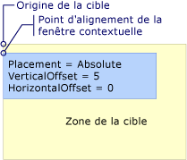  
Le positionnement est Absolute ou AbsolutePoint  
  
 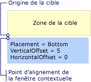  
Le positionnement est Bottom  
  
 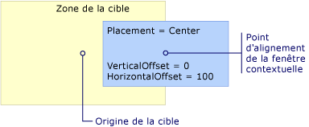  
Le positionnement est Center  
  
 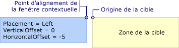  
Le positionnement est Left  
  
 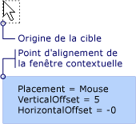  
Le positionnement est Mouse  
  
 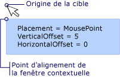  
Le positionnement est MousePoint  
  
 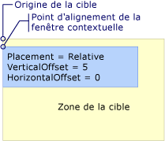  
Le positionnement est Relative ou RelativePoint  
  
 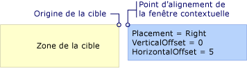  
Le positionnement est Right  
  
 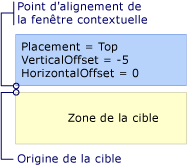  
Le positionnement est Top  
  
   
## Lorsque la fenêtre contextuelle est en contact avec le bord de l’écran  
 Pour des raisons de sécurité, un <xref:System.Windows.Controls.Primitives.Popup> ne peut pas être masqué par le bord de l’écran. Une des trois actions suivantes se produit lorsque le <xref:System.Windows.Controls.Primitives.Popup> rencontre un bord de l’écran :  
  
-   La fenêtre contextuelle aligne le long du bord de l’écran qui la <xref:System.Windows.Controls.Primitives.Popup>.  
  
-   La fenêtre contextuelle utilise un point d’alignement différent.  
  
-   La fenêtre contextuelle utilise une origine de cible et un point d’alignement différents.  
  
 Ces options sont décrites plus loin dans cette section.  
  
 Le comportement de la <xref:System.Windows.Controls.Primitives.Popup> lorsqu’il rencontre un bord de l’écran dépend de la valeur de la <xref:System.Windows.Controls.Primitives.Popup.Placement%2A> propriété et qui écran bord rencontre de la fenêtre contextuelle. Le tableau suivant récapitule le comportement lorsque le <xref:System.Windows.Controls.Primitives.Popup> rencontre un bord de l’écran pour chaque <xref:System.Windows.Controls.Primitives.PlacementMode> valeur.  
  
|PlacementMode|Bord supérieur|Bord inférieur|Bord gauche|Bord droit|  
|-------------------|--------------|-----------------|---------------|----------------|  
|<xref:System.Windows.Controls.Primitives.PlacementMode.Absolute>|Alignement sur le bord supérieur.|Alignement sur le bord inférieur.|Alignement sur le bord gauche.|Alignement sur le bord droit.|  
|<xref:System.Windows.Controls.Primitives.PlacementMode.AbsolutePoint>|Alignement sur le bord supérieur.|Le point d’alignement passe à l’angle inférieur gauche de la <xref:System.Windows.Controls.Primitives.Popup>.|Alignement sur le bord gauche.|Le point d’alignement passe à l’angle supérieur droit de la <xref:System.Windows.Controls.Primitives.Popup>.|  
|<xref:System.Windows.Controls.Primitives.PlacementMode.Bottom>|Alignement sur le bord supérieur.|L’origine de la cible devient l’angle supérieur gauche de la zone cible et devient le point d’alignement en bas à gauche de la <xref:System.Windows.Controls.Primitives.Popup>.|Alignement sur le bord gauche.|Alignement sur le bord droit.|  
|<xref:System.Windows.Controls.Primitives.PlacementMode.Center>|Alignement sur le bord supérieur.|Alignement sur le bord inférieur.|Alignement sur le bord gauche.|Alignement sur le bord droit.|  
|<xref:System.Windows.Controls.Primitives.PlacementMode.Left>|Alignement sur le bord supérieur.|Alignement sur le bord inférieur.|L’origine de la cible devient l’angle supérieur droit de la zone cible et le point d’alignement passe à l’angle supérieur gauche de la <xref:System.Windows.Controls.Primitives.Popup>.|Alignement sur le bord droit.|  
|<xref:System.Windows.Controls.Primitives.PlacementMode.Mouse>|Alignement sur le bord supérieur.|L’origine de la cible devient l’angle supérieur gauche de la zone cible (les limites du pointeur de la souris) et le point d’alignement passe à l’angle inférieur gauche de la <xref:System.Windows.Controls.Primitives.Popup>.|Alignement sur le bord gauche.|Alignement sur le bord droit.|  
|<xref:System.Windows.Controls.Primitives.PlacementMode.MousePoint>|Alignement sur le bord supérieur.|Le point d’alignement passe à l’angle inférieur gauche de la <xref:System.Windows.Controls.Primitives.Popup>.|Alignement sur le bord gauche.|Le point d’alignement de la fenêtre contextuelle devient l’angle supérieur droit de la fenêtre contextuelle.|  
|<xref:System.Windows.Controls.Primitives.PlacementMode.Relative>|Alignement sur le bord supérieur.|Alignement sur le bord inférieur.|Alignement sur le bord gauche.|Alignement sur le bord droit.|  
|<xref:System.Windows.Controls.Primitives.PlacementMode.RelativePoint>|Alignement sur le bord supérieur.|Le point d’alignement passe à l’angle inférieur gauche de la <xref:System.Windows.Controls.Primitives.Popup>.|Alignement sur le bord gauche.|Le point d’alignement de la fenêtre contextuelle devient l’angle supérieur droit de la fenêtre contextuelle.|  
|<xref:System.Windows.Controls.Primitives.PlacementMode.Right>|Alignement sur le bord supérieur.|Alignement sur le bord inférieur.|Alignement sur le bord gauche.|L’origine de la cible devient l’angle supérieur gauche de la zone cible et le point d’alignement passe à l’angle supérieur droit de la <xref:System.Windows.Controls.Primitives.Popup>.|  
|<xref:System.Windows.Controls.Primitives.PlacementMode.Top>|L’origine de la cible devient l’angle inférieur gauche de la zone cible et le point d’alignement passe à l’angle supérieur gauche de la <xref:System.Windows.Controls.Primitives.Popup>. En effet, il s’agit du même que lorsque <xref:System.Windows.Controls.Primitives.Popup.Placement%2A> est <xref:System.Windows.Controls.Primitives.PlacementMode.Bottom>.|Alignement sur le bord inférieur.|Alignement sur le bord gauche.|Alignement sur le bord droit.|  
  
### Alignement sur le bord de l’écran  
 A <xref:System.Windows.Controls.Primitives.Popup> peut s’aligner sur le bord de l’écran en repositionnant lui-même, par conséquent, l’ensemble du <xref:System.Windows.Controls.Primitives.Popup> est visible à l’écran.  Lorsque cela se produit, la distance entre le point d’alignement de fenêtre contextuelle et d’origine cible peut-être différer des valeurs de <xref:System.Windows.Controls.Primitives.Popup.HorizontalOffset%2A> et <xref:System.Windows.Controls.Primitives.Popup.VerticalOffset%2A>. Lorsque <xref:System.Windows.Controls.Primitives.Popup.Placement%2A> est <xref:System.Windows.Controls.Primitives.PlacementMode.Absolute>, <xref:System.Windows.Controls.Primitives.PlacementMode.Center>, ou <xref:System.Windows.Controls.Primitives.PlacementMode.Relative>, le <xref:System.Windows.Controls.Primitives.Popup> s’aligne sur chaque bord de l’écran.  Par exemple, supposons qu’un <xref:System.Windows.Controls.Primitives.Popup> a <xref:System.Windows.Controls.Primitives.Popup.Placement%2A> la valeur <xref:System.Windows.Controls.Primitives.PlacementMode.Relative> et <xref:System.Windows.Controls.Primitives.Popup.VerticalOffset%2A> défini à 100.  Si le bord inférieur de l’écran masque tout ou partie de la <xref:System.Windows.Controls.Primitives.Popup>, le <xref:System.Windows.Controls.Primitives.Popup> se repositionne le long du bord inférieur de l’écran et la distance verticale entre l’origine de la cible et le menu contextuel point d’alignement est inférieur à 100. L’illustration suivante démontre ce comportement.  
  
 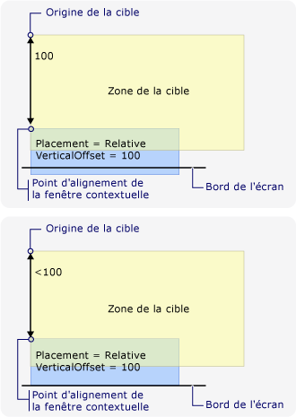  
La fenêtre contextuelle s’aligne sur le bord de l’écran  
  
### Modification du point d’alignement de la fenêtre contextuelle  
 Si <xref:System.Windows.Controls.Primitives.Popup.Placement%2A> est <xref:System.Windows.Controls.Primitives.PlacementMode.AbsolutePoint>, <xref:System.Windows.Controls.Primitives.PlacementMode.RelativePoint>, ou <xref:System.Windows.Controls.Primitives.PlacementMode.MousePoint>, le point d’alignement change lorsque la fenêtre contextuelle rencontre du bord inférieur ou droit de l’écran.  
  
 L’illustration suivante montre que lorsque le bord inférieur de l’écran masque tout ou partie de la <xref:System.Windows.Controls.Primitives.Popup>, le point d’alignement est l’angle inférieur gauche de la <xref:System.Windows.Controls.Primitives.Popup>.  
  
 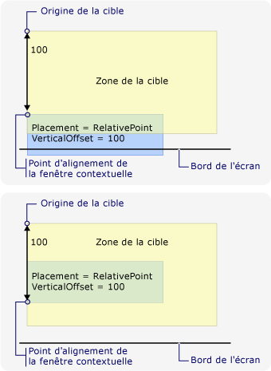  
La fenêtre contextuelle est en contact avec le bord inférieur de l’écran et modifie son point d’alignement  
  
 L’illustration suivante montre que lorsque la <xref:System.Windows.Controls.Primitives.Popup> est masqué par le bord droit de l’écran, le point d’alignement est l’angle supérieur droit de la <xref:System.Windows.Controls.Primitives.Popup>.  
  
 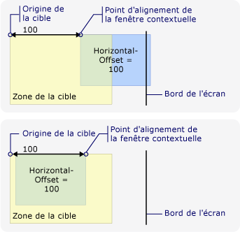  
La fenêtre contextuelle est en contact avec le bord droit de l’écran et modifie son point d’alignement  
  
 Si le <xref:System.Windows.Controls.Primitives.Popup> rencontre les bords inférieur et droit de l’écran, le point d’alignement est l’angle inférieur droit de la <xref:System.Windows.Controls.Primitives.Popup>.  
  
### Modification de l’origine de la cible et du point d’alignement de la fenêtre contextuelle  
 Lorsque <xref:System.Windows.Controls.Primitives.Popup.Placement%2A> est <xref:System.Windows.Controls.Primitives.PlacementMode.Bottom>, <xref:System.Windows.Controls.Primitives.PlacementMode.Left>, <xref:System.Windows.Controls.Primitives.PlacementMode.Mouse>, <xref:System.Windows.Controls.Primitives.PlacementMode.Right>, ou <xref:System.Windows.Controls.Primitives.PlacementMode.Top>, point de l’alignement d’origine et popup cible change si un certain bord de l’écran est rencontré.  Le bord de l’écran qui provoque la modification de position varie selon le <xref:System.Windows.Controls.Primitives.PlacementMode> valeur.  
  
 L’illustration suivante montre que lorsque <xref:System.Windows.Controls.Primitives.Popup.Placement%2A> est <xref:System.Windows.Controls.Primitives.PlacementMode.Bottom> et <xref:System.Windows.Controls.Primitives.Popup> rencontre le bord inférieur de l’écran, l’origine de la cible est l’angle supérieur gauche de la zone cible et le point d’alignement est l’angle inférieur gauche de la <xref:System.Windows.Controls.Primitives.Popup>.  
  
 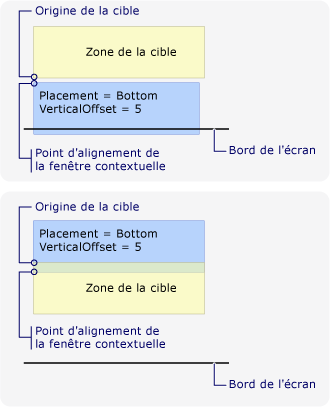  
Le positionnement a la valeur Bottom et la fenêtre contextuelle est en contact avec le bord inférieur de l’écran  
  
 L’illustration suivante montre que lorsque <xref:System.Windows.Controls.Primitives.Popup.Placement%2A> est <xref:System.Windows.Controls.Primitives.PlacementMode.Left> et <xref:System.Windows.Controls.Primitives.Popup> rencontre le bord gauche de l’écran, l’origine de la cible est l’angle supérieur droit de la zone cible et le point d’alignement est l’angle supérieur gauche de la <xref:System.Windows.Controls.Primitives.Popup>.  
  
 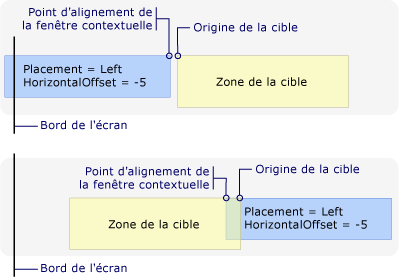  
Le positionnement a la valeur Left et la fenêtre contextuelle est en contact avec le bord gauche de l’écran  
  
 L’illustration suivante montre que lorsque <xref:System.Windows.Controls.Primitives.Popup.Placement%2A> est <xref:System.Windows.Controls.Primitives.PlacementMode.Right> et <xref:System.Windows.Controls.Primitives.Popup> rencontre le bord droit de l’écran, l’origine de la cible est l’angle supérieur gauche de la zone cible et le point d’alignement est l’angle supérieur droit de la <xref:System.Windows.Controls.Primitives.Popup>.  
  
 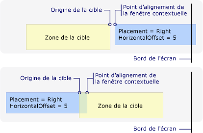  
Le positionnement a la valeur Right et la fenêtre contextuelle est en contact avec le bord droit de l’écran  
  
 L’illustration suivante montre que lorsque <xref:System.Windows.Controls.Primitives.Popup.Placement%2A> est <xref:System.Windows.Controls.Primitives.PlacementMode.Top> et <xref:System.Windows.Controls.Primitives.Popup> rencontre le bord supérieur de l’écran, l’origine de la cible est l’angle inférieur gauche de la zone cible et le point d’alignement est l’angle supérieur gauche de la <xref:System.Windows.Controls.Primitives.Popup>.  
  
 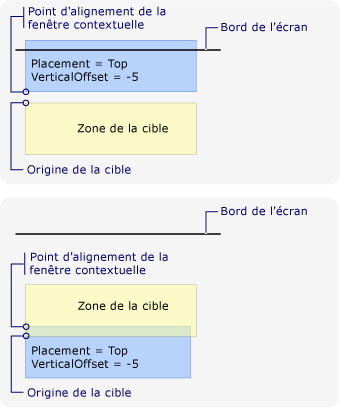  
Le positionnement a la valeur Top et la fenêtre contextuelle est en contact avec le bord supérieur de l’écran  
  
 L’illustration suivante montre que lorsque <xref:System.Windows.Controls.Primitives.Popup.Placement%2A> est <xref:System.Windows.Controls.Primitives.PlacementMode.Mouse> et <xref:System.Windows.Controls.Primitives.Popup> rencontre le bord inférieur de l’écran, l’origine de la cible est l’angle supérieur gauche de la zone cible (les limites du pointeur de la souris) et l’alignement de la fenêtre contextuelle point est l’angle inférieur gauche de la <xref:System.Windows.Controls.Primitives.Popup>.  
  
 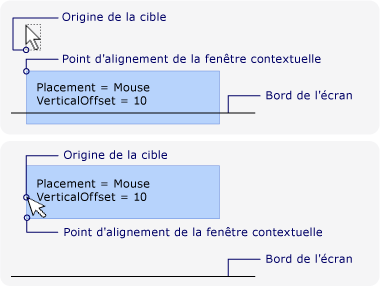  
Le positionnement a la valeur Mouse et la fenêtre contextuelle est en contact avec le bord inférieur de l’écran  
  
### Personnalisation du positionnement d’un contrôle Popup  
 Vous pouvez personnaliser le point d’alignement de fenêtre contextuelle et d’origine cible en définissant le <xref:System.Windows.Controls.Primitives.Popup.Placement%2A> propriété <xref:System.Windows.Controls.Primitives.PlacementMode.Custom>. Définissez ensuite un <xref:System.Windows.Controls.Primitives.CustomPopupPlacementCallback> délégué qui retourne un ensemble de points de positionnement possibles et les axes principaux (dans l’ordre de préférence) pour le <xref:System.Windows.Controls.Primitives.Popup>. Le point qui montre la plus grande partie de la <xref:System.Windows.Controls.Primitives.Popup> est sélectionnée.  La position de la <xref:System.Windows.Controls.Primitives.Popup> est ajustée automatiquement si la <xref:System.Windows.Controls.Primitives.Popup> est masqué par le bord de l’écran. Pour obtenir un exemple, consultez [Spécifier une position de menu contextuel personnalisée](../../../../docs/framework/wpf/controls/how-to-specify-a-custom-popup-position.md).  
  
## Voir aussi  
 [Popup Placement Sample](http://go.microsoft.com/fwlink/?LinkID=160032) (Exemple de positionnement de fenêtre contextuelle)
