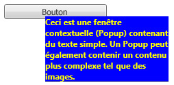

# Popup
Le contrôle <xref:System.Windows.Controls.Primitives.Popup> affiche le contenu dans une fenêtre distincte qui flotte au dessus de la fenêtre d'application actuelle.  
  
 L'illustration suivante montre un <xref:System.Windows.Controls.Primitives.Popup> contrôle positionné par rapport à un <xref:System.Windows.Controls.Button> qui est son parent.  
  
   
  
## Dans cette section  
 [Vue d'ensemble de Popup](../../../../docs/framework/wpf/controls/popup-overview.md)  
 [Comportement de positionnement de Popup](../../../../docs/framework/wpf/controls/popup-placement-behavior.md)  
 [Rubriques Comment](../../../../docs/framework/wpf/controls/popup-how-to-topics.md)  
  
## Référence  
 <xref:System.Windows.Controls.Primitives.Popup>  
  
## Rubriques connexes