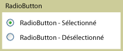

# RadioButton
Les contrôles <xref:System.Windows.Controls.RadioButton> sont généralement regroupés pour offrir aux utilisateurs un choix unique parmi plusieurs options ; un seul bouton à la fois peut être sélectionné.  
  
 L'illustration suivante affiche l'exemple d'un contrôle <xref:System.Windows.Controls.RadioButton>.  
  
   
RadioButton classique  
  
## Référence  
 <xref:System.Windows.Controls.Primitives.ToggleButton>  
  
## Rubriques connexes