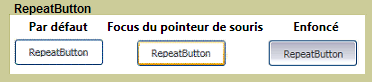

# RepeatButtonRepeatButton
Le <xref:System.Windows.Controls.Primitives.RepeatButton> est similaire à un <xref:System.Windows.Controls.Button>.The <xref:System.Windows.Controls.Primitives.RepeatButton> is similar to a <xref:System.Windows.Controls.Button>. Toutefois, <xref:System.Windows.Controls.Primitives.RepeatButton> éléments vous permettent de vérifier sur quand et comment la <xref:System.Windows.Controls.Primitives.ButtonBase.Click> événement se produit.However, <xref:System.Windows.Controls.Primitives.RepeatButton> elements give you control over when and how the <xref:System.Windows.Controls.Primitives.ButtonBase.Click> event occurs.  
  
 L’illustration suivante montre un exemple des trois états d’un contrôle de bouton Répéter par défaut, PointerFocused et enfoncé.The following graphic shows an example of the three states of a repeat button control, Default, PointerFocused, and Pressed. Le premier bouton montre l’état par défaut de la <xref:System.Windows.Controls.Primitives.RepeatButton>.The first button shows the default state of the <xref:System.Windows.Controls.Primitives.RepeatButton>. Le second exemple illustre comment l’apparence du bouton change lorsque le pointeur de la souris pointe sur le bouton, en lui donnant le focus.The second shows how the appearance of the button changes when the mouse pointer hovers over the button, giving it focus. Le dernier bouton montre l’apparence de la <xref:System.Windows.Controls.Primitives.RepeatButton> lorsque l’utilisateur appuie sur le bouton de la souris sur le contrôle.The last button shows the appearance of the <xref:System.Windows.Controls.Primitives.RepeatButton> when the user presses the mouse button over the control.  
  
   
RepeatButton classiqueTypical RepeatButton  
  
## Dans cette sectionIn This Section  
  
## RéférenceReference  
 <xref:System.Windows.Controls.Primitives.RepeatButton>  
  
## Rubriques connexesRelated Sections
