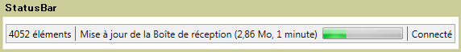

# StatusBar
Une <xref:System.Windows.Controls.Primitives.StatusBar> est une zone horizontale située en bas d'une fenêtre dans laquelle une application peut afficher différentes informations d'état.  
  
 L'illustration suivante montre un exemple de <xref:System.Windows.Controls.Primitives.StatusBar>.  
  
   
  
## Dans cette section  
  
## Référence  
 <xref:System.Windows.Controls.Primitives.StatusBar>  
 <xref:System.Windows.Controls.Primitives.StatusBarItem>  
  
## Rubriques connexes