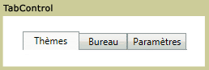

# TabControlTabControl
<xref:System.Windows.Controls.TabControl>éléments affichent le contenu dans des pages séparées accédés en sélectionnant l’onglet approprié. Chaque onglet contient un <xref:System.Windows.Controls.TabItem>.<xref:System.Windows.Controls.TabControl> elements display content on discrete pages accessed by selecting the appropriate tab. Each tab contains a <xref:System.Windows.Controls.TabItem>.  
  
 L’illustration suivante montre un <xref:System.Windows.Controls.TabControl>.The following illustration shows a <xref:System.Windows.Controls.TabControl>.  
  
   
TabControl classiqueTypical TabControl  
  
## RéférenceReference  
 <xref:System.Windows.Controls.TabControl>  
  <xref:System.Windows.Controls.TabItem>  
  
## Rubriques connexesRelated Sections
