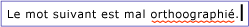
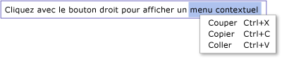

# Vue d'ensemble de TextBox
La <xref:System.Windows.Controls.TextBox> classe vous permet d’afficher ou modifier le texte non formaté. Une utilisation courante d’un <xref:System.Windows.Controls.TextBox> est la modification sans mise en forme de texte dans un formulaire. Par exemple, un formulaire qui demande le nom de l’utilisateur, le numéro de téléphone, etc. utiliserait <xref:System.Windows.Controls.TextBox> contrôles pour l’entrée de texte. Cette rubrique présente la <xref:System.Windows.Controls.TextBox> classe et fournit des exemples de son utilisation dans les deux [!INCLUDE[TLA#tla_xaml](../../../../includes/tlasharptla-xaml-md.md)] et [!INCLUDE[TLA#tla_lhcshrp](../../../../includes/tlasharptla-lhcshrp-md.md)].  
  
 
  
   
## TextBox ou RichTextBox ?  
 Les deux <xref:System.Windows.Controls.TextBox> et <xref:System.Windows.Controls.RichTextBox> permettent aux utilisateurs d’entrer du texte mais les deux contrôles sont utilisés pour différents scénarios. A <xref:System.Windows.Controls.TextBox> nécessite moins de ressources système un <xref:System.Windows.Controls.RichTextBox> afin qu’il est idéal lorsque seul du texte brut doit être modifié (autrement dit, l’utilisation dans un formulaire). A <xref:System.Windows.Controls.RichTextBox> est un meilleur choix lorsqu’il est nécessaire pour l’utilisateur de modifier le texte mis en forme, des images, des tables ou autres pris en charge contenu. Par exemple, la modification d’un document, un article ou un blog qui nécessite une mise en forme, des images, etc. est mieux réalisée à l’aide un <xref:System.Windows.Controls.RichTextBox>. Le tableau ci-dessous résume les fonctionnalités principales de <xref:System.Windows.Controls.TextBox> et <xref:System.Windows.Controls.TextBox>.  
  
|Contrôle|Vérification de l’orthographe en temps réel|Menu contextuel|Mise en forme des commandes telles que <xref:System.Windows.Documents.EditingCommands.ToggleBold%2A> (CTRL + B)|<xref:System.Windows.Documents.FlowDocument>contenu tels que des images, des paragraphes, des tables, etc.|  
|-------------|------------------------------|------------------|------------------------------------------------------------------------------------------------------------------------------------------------------------------------------------------------------|--------------------------------------------------------------------------------------------------------------------------------------------------------------------------------------------------|  
|<xref:System.Windows.Controls.TextBox>|Oui|Oui|Non|Non.|  
|<xref:System.Windows.Controls.RichTextBox>|Oui|Oui|Oui (voir [Vue d’ensemble de RichTextBox](../../../../docs/framework/wpf/controls/richtextbox-overview.md))|Oui (voir [Vue d’ensemble de RichTextBox](../../../../docs/framework/wpf/controls/richtextbox-overview.md))|  
  
> [!NOTE]
>  Bien que <xref:System.Windows.Controls.TextBox> est pas prise en charge de modification relatives de la mise en forme des commandes telles que <xref:System.Windows.Documents.EditingCommands.ToggleBold%2A> (CTRL + B), de nombreuses commandes de base sont pris en charge par les deux contrôles tels que <xref:System.Windows.Documents.EditingCommands.MoveToLineEnd%2A>. Pour plus d'informations, voir <xref:System.Windows.Documents.EditingCommands>.  
  
 Fonctionnalités prises en charge par <xref:System.Windows.Controls.TextBox> sont traités dans les sections ci-dessous. Pour plus d’informations sur <xref:System.Windows.Controls.RichTextBox>, consultez [vue d’ensemble de RichTextBox](../../../../docs/framework/wpf/controls/richtextbox-overview.md).  
  
### Vérification de l’orthographe en temps réel  
 Vous pouvez activer la vérification de l’orthographe en temps réel dans une <xref:System.Windows.Controls.TextBox> ou <xref:System.Windows.Controls.RichTextBox>. Lorsque la vérification de l’orthographe est activée, une ligne rouge apparaît sous les mots mal orthographiés (voir l’illustration ci-dessous).  
  
   
  
 Pour savoir comment activer la vérification de l’orthographe, consultez [Activer la vérification de l’orthographe dans un contrôle d’édition de texte](../../../../docs/framework/wpf/controls/how-to-enable-spell-checking-in-a-text-editing-control.md).  
  
### Menu contextuel  
 Par défaut, les deux <xref:System.Windows.Controls.TextBox> et <xref:System.Windows.Controls.RichTextBox> ont un menu contextuel qui s’affiche quand un utilisateur clique dans le contrôle. Ce menu contextuel permet à l’utilisateur de couper, de copier ou de coller du texte (voir l’image ci-dessous).  
  
   
  
 Vous pouvez créer votre propre menu contextuel personnalisé pour remplacer le comportement par défaut. Pour plus d’informations, consultez [Utiliser un menu contextuel personnalisé avec un TextBox](../../../../docs/framework/wpf/controls/how-to-use-a-custom-context-menu-with-a-textbox.md).  
  
   
## Création de contrôles TextBox  
 Un <xref:System.Windows.Controls.TextBox> peut être une ligne unique en hauteur ou comprendre plusieurs lignes. Une seule ligne <xref:System.Windows.Controls.TextBox> est préférable pour la saisie de petites quantités de texte brut (c.-à-d.) « Nom », « Numéro de téléphone », etc. dans un formulaire). L’exemple suivant montre comment créer une ligne unique <xref:System.Windows.Controls.TextBox>.  
  
 [!code-xaml[TextBoxMiscSnippets_snip#BasicTextBoxExampleWholePage](../../../../samples/snippets/csharp/VS_Snippets_Wpf/TextBoxMiscSnippets_snip/csharp/basictextboxexample.xaml#basictextboxexamplewholepage)]  
  
 Vous pouvez également créer un <xref:System.Windows.Controls.TextBox> qui permet à l’utilisateur d’entrer plusieurs lignes de texte. Par exemple, si votre formulaire demande une esquisse personnelles de l’utilisateur, vous souhaiteriez utiliser un <xref:System.Windows.Controls.TextBox> qui prend en charge plusieurs lignes de texte. L’exemple suivant montre comment utiliser [!INCLUDE[TLA#tla_xaml](../../../../includes/tlasharptla-xaml-md.md)] pour définir un <xref:System.Windows.Controls.TextBox> contrôle s’étend automatiquement pour s’adapter à plusieurs lignes de texte.  
  
 [!code-xaml[TextBox_MiscCode#_MultilineTextBoxXAML](../../../../samples/snippets/csharp/VS_Snippets_Wpf/TextBox_MiscCode/CSharp/Window1.xaml#_multilinetextboxxaml)]  
  
 Définition de la <xref:System.Windows.Controls.TextBox.TextWrapping%2A> attribut `Wrap` provoque le texte à la ligne vers une nouvelle ligne lorsque le bord de la <xref:System.Windows.Controls.TextBox> contrôle est atteinte, développer automatiquement le <xref:System.Windows.Controls.TextBox> contrôle pour faire place pour une nouvelle ligne, si nécessaire.  
  
 Définition de la <xref:System.Windows.Controls.Primitives.TextBoxBase.AcceptsReturn%2A> attribut `true` provoque une nouvelle ligne à insérer lorsque la touche retournée est activée, développer à nouveau automatiquement le <xref:System.Windows.Controls.TextBox> pour faire place pour une nouvelle ligne, si nécessaire.  
  
 Le <xref:System.Windows.Controls.Primitives.TextBoxBase.VerticalScrollBarVisibility%2A> attribut ajoute une barre de défilement à la <xref:System.Windows.Controls.TextBox>, de sorte que le contenu de la <xref:System.Windows.Controls.TextBox> puisse être défilé si le <xref:System.Windows.Controls.TextBox> s’étend au-delà de la taille de la trame ou fenêtre qui l’entoure.  
  
 Pour plus d’informations sur les différentes tâches associées à l’aide un <xref:System.Windows.Controls.TextBox>, consultez [rubriques](../../../../docs/framework/wpf/controls/textbox-how-to-topics.md).  
  
   
## Détecter la modification du contenu  
 Généralement les <xref:System.Windows.Controls.Primitives.TextBoxBase.TextChanged> événement doit être utilisé pour détecter chaque fois que le texte dans un <xref:System.Windows.Controls.TextBox> ou <xref:System.Windows.Controls.RichTextBox> modifié, et non <xref:System.Windows.UIElement.KeyDown> comme prévu. Pour obtenir un exemple, consultez [Détecter la modification du texte figurant dans un TextBox](../../../../docs/framework/wpf/controls/how-to-detect-when-text-in-a-textbox-has-changed.md).  
  
## Voir aussi  
 [Rubriques de guide pratique](../../../../docs/framework/wpf/controls/textbox-how-to-topics.md)  
 [Vue d’ensemble de RichTextBox](../../../../docs/framework/wpf/controls/richtextbox-overview.md)
