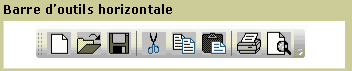
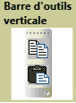

# ToolBarToolBar
Le <xref:System.Windows.Controls.ToolBar> contrôle est un conteneur pour un groupe de commandes ou des contrôles qui sont généralement associés dans leur fonction.The <xref:System.Windows.Controls.ToolBar> control is a container for a group of commands or controls that are typically related in their function.  
  
 Les illustrations suivantes montrent horizontal et vertical <xref:System.Windows.Controls.ToolBar> contrôles.The following illustrations show horizontal and vertical <xref:System.Windows.Controls.ToolBar> controls.  
  
   
Barre d’outils horizontaleHorizontal Toolbar  
  
   
Barre d’outils verticaleVertical Toolbar  
  
## Dans cette sectionIn This Section  
 [Vue d'ensemble de ToolBarToolBar Overview](../../../../docs/framework/wpf/controls/toolbar-overview.md)  
  [Donner un style aux contrôles d'une barre d'outilsStyle Controls on a ToolBar](../../../../docs/framework/wpf/controls/how-to-style-controls-on-a-toolbar.md)  
  
## RéférenceReference  
 <xref:System.Windows.Controls.ToolBar>  
  <xref:System.Windows.Controls.ToolBarTray>  
  
## Rubriques connexesRelated Sections
