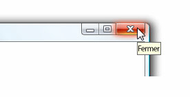

# Info-bulle
Une info-bulle est une petite fenêtre contextuelle qui apparaît lorsqu’un utilisateur place le pointeur de la souris au-dessus d’un élément, tel qu’un <xref:System.Windows.Controls.Button>.  
  
 L’illustration suivante montre un pointeur de souris qui pointe vers le **fermer**<xref:System.Windows.Controls.Button>, qui affiche ensuite son identification <xref:System.Windows.Controls.ToolTip>.  
  
 Bouton Fermer avec son info-bulle  
  
   
  
## Dans cette section  
 [Vue d’ensemble de l’info-bulle](../../../../docs/framework/wpf/controls/tooltip-overview.md)  
  [Rubriques de guide pratique](../../../../docs/framework/wpf/controls/tooltip-how-to-topics.md)  
  
## Référence  
 <xref:System.Windows.Controls.ToolTip>  
  <xref:System.Windows.Controls.ToolTipService>  
  <xref:System.Windows.Controls.Primitives.Popup>  
  
## Rubriques connexes  
 [Vue d’ensemble de Popup](../../../../docs/framework/wpf/controls/popup-overview.md)  
  [Rubriques de guide pratique](../../../../docs/framework/wpf/controls/popup-how-to-topics.md)
