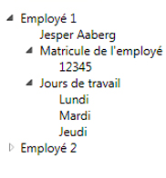

# TreeView
Le contrôle <xref:System.Windows.Controls.TreeView> affiche des informations dans une structure hiérarchique à l'aide de nœuds réductibles.  
  
 L'illustration suivante est un exemple de contrôle <xref:System.Windows.Controls.TreeView> dans lequel des contrôles <xref:System.Windows.Controls.TreeViewItem> sont imbriqués.  
  
   
  
## Dans cette section  
 [Vue d'ensemble de TreeView](../../../../docs/framework/wpf/controls/treeview-overview.md)  
 [Rubriques Comment](../../../../docs/framework/wpf/controls/treeview-how-to-topics.md)  
  
## Référence  
 <xref:System.Windows.Controls.TreeView>  
 <xref:System.Windows.Controls.TreeViewItem>  
  
## Rubriques connexes  
 [Vue d'ensemble de la liaison de données](../../../../docs/framework/wpf/data/data-binding-overview.md)  
 [Vue d'ensemble des modèles de données](../../../../docs/framework/wpf/data/data-templating-overview.md)