# Procédure pas à pas : création d'un bouton à l'aide de Microsoft Expression Blend
Cette procédure pas à pas vous guide tout au long des processus de création d’un [!INCLUDE[TLA2#tla_wpf](../../../../includes/tla2sharptla-wpf-md.md)] bouton personnalisé à l’aide de Microsoft Expression Blend.  
  
> [!IMPORTANT]
>  Microsoft Expression Blend fonctionne en générant de [!INCLUDE[TLA#tla_xaml](../../../../includes/tlasharptla-xaml-md.md)] qui est ensuite compilé pour que le programme exécutable. Si vous préférez travailler avec [!INCLUDE[TLA#tla_xaml](../../../../includes/tlasharptla-xaml-md.md)] directement, il existe une autre procédure pas à pas qui crée la même application que celle-ci en utilisant [!INCLUDE[TLA#tla_xaml](../../../../includes/tlasharptla-xaml-md.md)] avec [!INCLUDE[vs_current_short](../../../../includes/vs-current-short-md.md)] plutôt que Blend. Consultez [créer un bouton à l’aide de XAML](../../../../docs/framework/wpf/controls/walkthrough-create-a-button-by-using-xaml.md) pour plus d’informations.  
  
 L’illustration suivante montre le bouton personnalisé que vous allez créer.  
  
   
  
## Convertir une forme en bouton  
 Dans la première partie de cette procédure pas à pas, vous créez l’apparence personnalisée du bouton personnalisé. Pour ce faire, vous d’abord convertissez un rectangle à un bouton. Vous ajoutez des formes supplémentaires pour le modèle de bouton de création d’un bouton de recherche plus complexe. Pourquoi ne pas commencer par un bouton normal et le personnaliser ? Comme un bouton a des fonctionnalités intégrées que vous n’avez pas besoin ; pour les boutons personnalisés, il est plus facile de commencer par un rectangle.  
  
#### Pour créer un nouveau projet dans Expression Blend  
  
1.  Lancez Expression Blend. (Cliquez sur **Démarrer**, pointez sur **tous les programmes**, pointez sur **Microsoft Expression**, puis cliquez sur **Microsoft Expression Blend**.)  
  
2.  Optimisez l’application si nécessaire.  
  
3.  Dans le menu **Fichier**, cliquez sur **Nouveau projet**.  
  
4.  Sélectionnez **Application Standard (.exe)**.  
  
5.  Nommez le projet `CustomButton` et appuyez sur **OK**.  
  
 À ce stade, vous avez une valeur vide [!INCLUDE[TLA2#tla_wpf](../../../../includes/tla2sharptla-wpf-md.md)] projet. Vous pouvez appuyer sur F5 pour exécuter l’application. Comme vous pouvez vous attendre, l’application comprend uniquement une fenêtre vide. Ensuite, vous créez un rectangle arrondi et convertissez en un bouton.  
  
#### Pour convertir un Rectangle à un bouton  
  
1.  **Définissez la propriété de l’arrière-plan de la fenêtre sur noir :** sélectionnez la fenêtre, cliquez sur le **onglet Propriétés**et définissez la <xref:System.Windows.Controls.Control.Background%2A> propriété `Black`.  
  
     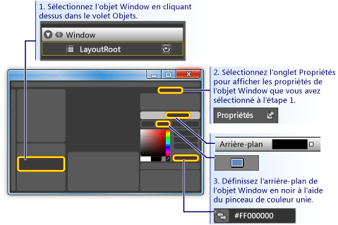  
  
2.  **Dessiner un rectangle environ la taille d’un bouton dans la fenêtre :** sélectionner l’outil rectangle sur le panneau de l’outil de gauche et faites glisser le rectangle sur la fenêtre.  
  
     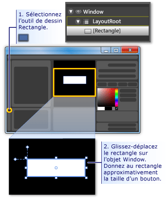  
  
3.  **Complètent les angles du rectangle :** faites glisser les points de contrôle du rectangle ou définir directement la <xref:System.Windows.Shapes.Rectangle.RadiusX%2A> et <xref:System.Windows.Shapes.Rectangle.RadiusY%2A> propriétés. Définir les valeurs de <xref:System.Windows.Shapes.Rectangle.RadiusX%2A> et <xref:System.Windows.Shapes.Rectangle.RadiusY%2A> à 20.  
  
     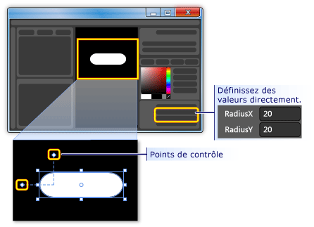  
  
4.  **Modifier le rectangle en bouton :** sélectionnez le rectangle. Sur le **outils** menu, cliquez sur **créer un bouton**.  
  
     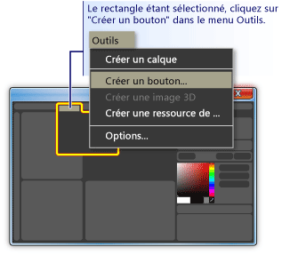  
  
5.  **Spécifiez la portée du style/modèle :** une boîte de dialogue comme suit s’affiche.  
  
     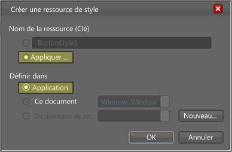  
  
     Pour **nom de la ressource (clé)**, sélectionnez **appliquer à tous les**.  Cela rend le modèle de bouton s’appliquent à tous les objets qui sont des boutons et le style qui en résulte. Pour **définir dans**, sélectionnez **Application**. Cela rend le modèle de bouton ont une portée sur l’ensemble de l’application et le style qui en résulte. Lorsque vous définissez les valeurs dans ces deux zones, le style de bouton et le modèle s’appliquent à tous les boutons de l’application et un bouton que vous créez dans l’application utilisera par défaut, ce modèle.  
  
## Modifier le modèle de bouton  
 Vous avez maintenant un rectangle qui a été remplacé par un bouton. Dans cette section, vous allez modifier le modèle du bouton et personnaliser son apparence.  
  
#### Pour modifier le modèle de bouton pour modifier l’apparence du bouton  
  
1.  **Passez en vue de modèle d’édition :** pour personnaliser davantage l’apparence de notre bouton, nous avons besoin de modifier le modèle de bouton. Ce modèle a été créé lorsque nous avons converti le rectangle en bouton. Pour modifier le modèle de bouton, cliquez avec le bouton droit et sélectionnez **modifier des parties du contrôle (modèle)** , puis **modifier le modèle**.  
  
     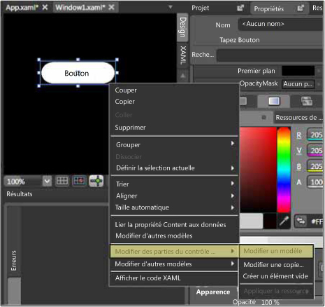  
  
     Dans l’éditeur de modèle, notez que le bouton est désormais divisé en un <xref:System.Windows.Shapes.Rectangle> et <xref:System.Windows.Controls.ContentPresenter>. Le <xref:System.Windows.Controls.ContentPresenter> est utilisé pour présenter le contenu dans le bouton (par exemple, la chaîne « Bouton »). Le rectangle et <xref:System.Windows.Controls.ContentPresenter> sont placés à l’intérieur d’un <xref:System.Windows.Controls.Grid>.  
  
     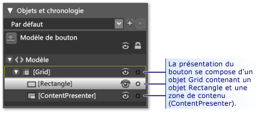  
  
2.  **Modifier les noms des composants de modèle :** avec le bouton droit du rectangle dans l’inventaire de modèle, modifier le <xref:System.Windows.Shapes.Rectangle> nom à partir de « [Rectangle] » pour « RectangleExterne » et « [ContentPresenter] » par « MaZoneDeContenu ».  
  
     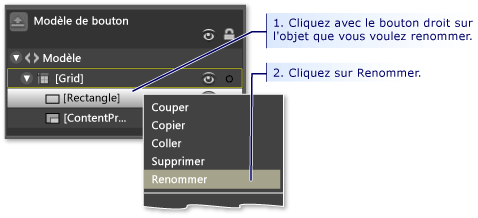  
  
3.  **Modifiez le rectangle afin qu’il soit vide à l’intérieur de (comme une bouée) :** sélectionnez **RectangleExterne** et <xref:System.Windows.Shapes.Shape.Fill%2A> « Transparent » et <xref:System.Windows.Shapes.Shape.StrokeThickness%2A> à 5.  
  
     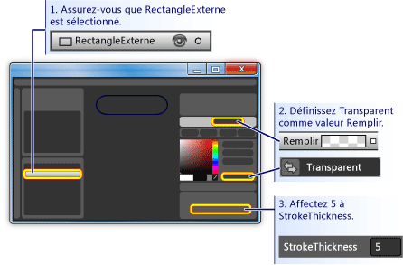  
  
     Définissez ensuite la <xref:System.Windows.Shapes.Shape.Stroke%2A> à la couleur choisie pour le modèle. Pour ce faire, cliquez sur la petite case blanche en regard **trait**, sélectionnez **expression personnalisée**, tapez « {TemplateBinding Background} » dans la boîte de dialogue.  
  
     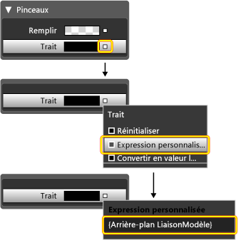  
  
4.  **Créer un rectangle interne :** maintenant, créez un autre rectangle (nommez-le « RectangleInterne ») et placez-le symétriquement à l’intérieur de **RectangleExterne** . Pour ce type de travail, vous souhaiterez probablement effectuer un zoom pour agrandir le bouton dans la zone d’édition.  
  
    > [!NOTE]
    >  Votre rectangle peut être différent de celui de la figure (par exemple, il peut avoir des angles arrondis).  
  
     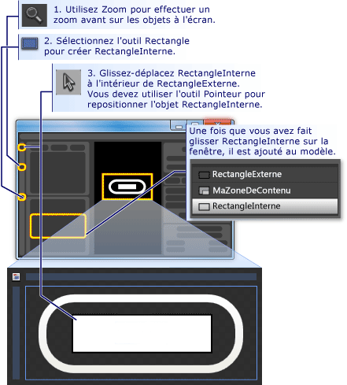  
  
5.  **Déplacez ContentPresenter vers le haut :** à ce stade, il est possible que le texte « Bouton » ne soit pas visible plus. Si c’est le cas, cela signifie que **RectangleInterne** est au-dessus de la **MaZoneDeContenu**. Pour résoudre ce problème, faites glisser **MaZoneDeContenu** ci-dessous **RectangleInterne**. Repositionner les rectangles et **MaZoneDeContenu** à présentera comme ci-dessous.  
  
    > [!NOTE]
    >  Ou bien, vous pouvez également placer **MaZoneDeContenu** haut par dessus et en appuyant sur **avancer**.  
  
     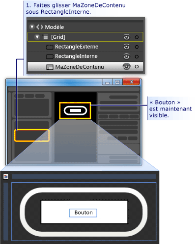  
  
6.  **Modifier l’apparence de RectangleInterne :** définir le <xref:System.Windows.Shapes.Rectangle.RadiusX%2A>, <xref:System.Windows.Shapes.Rectangle.RadiusY%2A>, et <xref:System.Windows.Shapes.Shape.StrokeThickness%2A> valeurs à 20. En outre, définissez la <xref:System.Windows.Shapes.Shape.Fill%2A> à l’arrière-plan du modèle à l’aide de l’expression personnalisée « {TemplateBinding Background} ») et la valeur <xref:System.Windows.Shapes.Shape.Stroke%2A> « transparent ». Notez que les paramètres pour le <xref:System.Windows.Shapes.Shape.Fill%2A> et <xref:System.Windows.Shapes.Shape.Stroke%2A> de **RectangleInterne** sont le contraire de ceux **RectangleExterne**.  
  
     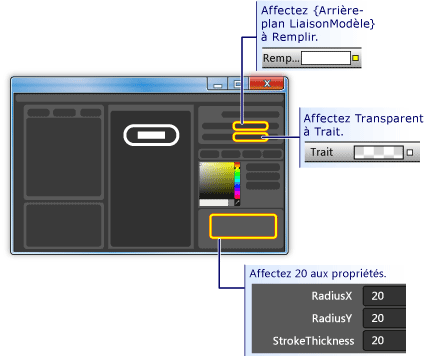  
  
7.  **Ajouter une couche de verre haut :** la dernière partie de la personnalisation de l’aspect du bouton consiste à ajouter une couche de verre en haut. Cette couche de verre se compose d’un rectangle de tiers. Étant donné que le verre recouvre tout le bouton, le rectangle transparent est similaire dans les dimensions pour la **RectangleExterne**. Par conséquent, créer le rectangle simplement en effectuant une copie de la **RectangleExterne**. Mettez en surbrillance **RectangleExterne** et utilisez CTRL + C et CTRL + V pour effectuer une copie. Nom de ce nouveau rectangle « glassCube ».  
  
8.  **Repositionner glassCube si nécessaire :** si **glassCube** est pas déjà positionné afin qu’elle couvre tout le bouton, faites-le glisser dans la position.  
  
9. **Donner glassCube une forme légèrement différente de celle RectangleExterne :** modifier les propriétés de **glassCube**. Commencez par définir la <xref:System.Windows.Shapes.Rectangle.RadiusX%2A> et <xref:System.Windows.Shapes.Rectangle.RadiusY%2A> propriétés à 10 et <xref:System.Windows.Shapes.Shape.StrokeThickness%2A> à 2.  
  
     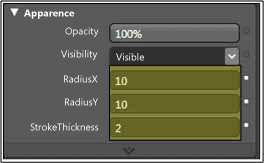  
  
10. **Donner à glassCube verre :** définir le <xref:System.Windows.Shapes.Shape.Fill%2A> à un aspect vitreux en utilisant un dégradé linéaire est opaque à 75 % et alterne entre la couleur blanc et Transparent 6 environ uniformément espacés intervalles. C’est ce qu’il faut définir les points de dégradé :  
  
    -   Point de dégradé 1 : Blanc avec valeur Alpha de 75 %  
  
    -   Dégradé 2 : Transparent  
  
    -   Point de dégradé 3 : Blanc avec valeur Alpha de 75 %  
  
    -   Dégradé 4 : Transparent  
  
    -   Point de dégradé 5 : Blanc avec valeur Alpha de 75 %  
  
    -   Dégradé 6 : Transparent  
  
     Cette opération crée une apparence de verre « ondulé ».  
  
     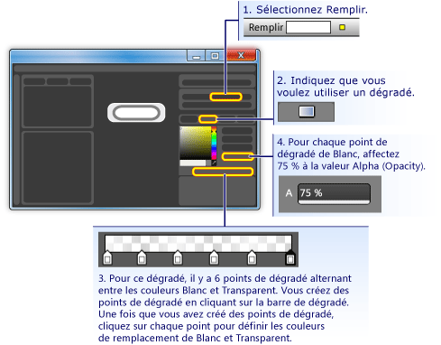  
  
11. **Masquer la couche de verre :** maintenant que vous voyez à quoi ressemble la couche vitreux, accédez à la **volet apparence** de la **panneau Propriétés** et définir l’opacité sur 0 % pour la masquer. Dans les sections suivantes, nous allons utiliser des déclencheurs de propriété et d’événements pour afficher et manipuler la couche de verre.  
  
     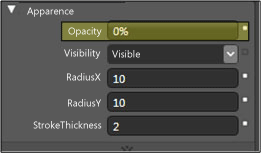  
  
## Personnaliser le comportement du bouton  
 À ce stade, vous avez personnalisé la présentation du bouton en modifiant son modèle, mais le bouton ne réagit pas aux actions de l’utilisateur comme des boutons standard (par exemple, changer d’apparence au passage de la souris, reçoit le focus et en cliquant sur.) Les deux procédures suivantes montrent comment générer des comportements tels que ceux-là dans le bouton personnalisé. Nous allons commencer par les déclencheurs de propriétés simples et ajouter des animations et les déclencheurs d’événements.  
  
#### Pour définir des déclencheurs de propriété  
  
1.  **Créer un nouveau déclencheur de propriété :** avec **glassCube** sélectionnée, cliquez sur **+ propriété** dans les **déclencheurs** Panneau de configuration (voir la figure qui suit l’étape suivante). Cela crée un déclencheur de propriété avec un déclencheur de propriété par défaut.  
  
2.  **Définissez la propriété utilisée par le déclencheur que IsMouseOver :** affectez à la propriété <xref:System.Windows.UIElement.IsMouseOver%2A>. Cela rend le déclencheur de propriété activer lorsque le <xref:System.Windows.UIElement.IsMouseOver%2A> propriété `true` (lorsque l’utilisateur pointe sur le bouton de la souris).  
  
       
  
3.  **IsMouseOver déclenche une opacité de 100 % glassCube :** Notez que la **l’enregistrement du déclencheur est activé** (voir la figure précédente). Cela signifie que toutes les modifications apportées aux valeurs des propriétés de **glassCube** alors que l’enregistrement est activé devient une action qui a lieu lorsque <xref:System.Windows.UIElement.IsMouseOver%2A> est `true`. Lors de l’enregistrement, vous devez modifier le <xref:System.Windows.UIElement.Opacity%2A> de **glassCube** à 100 %.  
  
     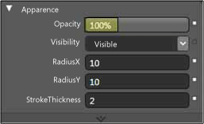  
  
     Vous venez de créer votre premier déclencheur de propriété. Notez que la **panneau déclencheurs** de l’éditeur a enregistré le <xref:System.Windows.UIElement.Opacity%2A> en cours de modification à 100 %.  
  
       
  
     Appuyez sur F5 pour exécuter l’application, puis déplacez le pointeur de la souris sur et désactiver le bouton. La couche de verre doit s’afficher lorsque le bouton de souris et disparaissent lorsque le pointeur quitte.  
  
4.  **IsMouseOver déclenche un trait modification de valeur :** nous allons associer d’autres actions avec le <xref:System.Windows.UIElement.IsMouseOver%2A> déclencheur. Lors de l’enregistrement se poursuit, basculez votre sélection de **glassCube** à **RectangleExterne**. Définissez ensuite la <xref:System.Windows.Shapes.Shape.Stroke%2A> de **RectangleExterne** l’expression personnalisée de « {DynamicResource {x : Static SystemColors.HighlightBrushKey}} ». Cela permet de définir la <xref:System.Windows.Shapes.Shape.Stroke%2A> couleur utilisée par les boutons de sélection pour le type. Appuyez sur F5 pour voir l’effet lorsque vous placez la souris sur le bouton.  
  
     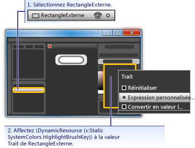  
  
5.  **IsMouseOver déclenche un texte flou :** nous allons associer une action supplémentaire à la <xref:System.Windows.UIElement.IsMouseOver%2A> déclencheur de propriété. Vérifiez le contenu du bouton un peu flou lorsque le verre dessus. Pour ce faire, nous pouvons appliquer un effet de flou <xref:System.Windows.Media.Effects.BitmapEffect> à la <xref:System.Windows.Controls.ContentPresenter> (**MaZoneDeContenu**).  
  
     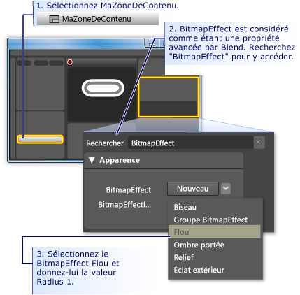  
  
    > [!NOTE]
    >  Pour retourner le **panneau Propriétés** à ce qu’il était avant que vous avez effectué la recherche de <xref:System.Windows.Media.Effects.BitmapEffect>, effacez le texte à partir de la **zone de recherche**.  
  
     À ce stade, nous avons utilisé un déclencheur de propriété avec plusieurs actions associées pour créer le comportement de mise en surbrillance pour quand le pointeur de la souris entre et sort de la zone de bouton. Un autre comportement habituel pour un bouton consiste à mettre en surbrillance lorsqu’il a le focus (comme une fois que vous cliquez dessus). Nous pouvons ajouter ce comportement en ajoutant un autre déclencheur de propriété pour le <xref:System.Windows.UIElement.IsFocused%2A> propriété.  
  
6.  **Créer un déclencheur de propriété pour IsFocused :** à l’aide de la même procédure que pour <xref:System.Windows.UIElement.IsMouseOver%2A> (voir la première étape de cette section), créez un autre déclencheur de propriété pour le <xref:System.Windows.UIElement.IsFocused%2A> propriété. Alors que **l’enregistrement du déclencheur est activé**, ajoutez les actions suivantes au déclencheur :  
  
    -   **glassCube** Obtient un <xref:System.Windows.UIElement.Opacity%2A> de 100 %.  
  
    -   **RectangleExterne** Obtient un <xref:System.Windows.Shapes.Shape.Stroke%2A> valeur d’expression personnalisée de « {DynamicResource {x : Static SystemColors.HighlightBrushKey}} ».  
  
 Comme l’étape finale de cette procédure pas à pas, nous ajouterons des animations au bouton. Ces animations seront déclenchées par des événements, en particulier, la <xref:System.Windows.UIElement.MouseEnter> et <xref:System.Windows.Controls.Primitives.ButtonBase.Click> les événements.  
  
#### Pour utiliser des déclencheurs d’événements et des animations pour ajouter une interactivité  
  
1.  **Créer un déclencheur d’événement MouseEnter :** ajouter un déclencheur d’événements, puis sélectionnez <xref:System.Windows.UIElement.MouseEnter> en tant que l’événement à utiliser dans le déclencheur.  
  
     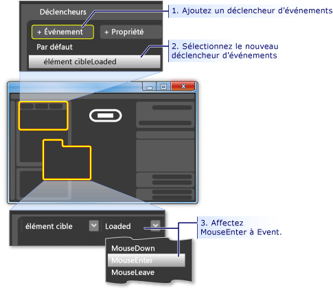  
  
2.  **Créer une chronologie d’animation :** ensuite, associez une chronologie d’animation pour le <xref:System.Windows.UIElement.MouseEnter> événement.  
  
     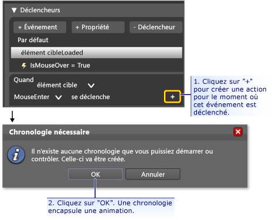  
  
     Après avoir appuyé sur **OK** pour créer une nouvelle chronologie, un **panneau Montage** s’affiche et « Chronologie de l’enregistrement est activé » est visible dans le volet de conception. Cela signifie que nous pouvons commencer l’enregistrement des modifications apportées aux propriétés dans la chronologie (propriété animer les modifications).  
  
    > [!NOTE]
    >  Vous devrez peut-être redimensionner votre fenêtre et/ou les volets pour afficher les données.  
  
     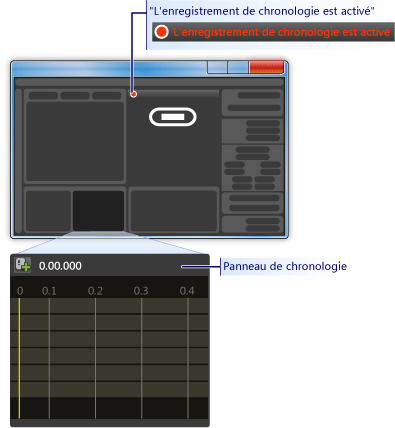  
  
3.  **Créer une image clé :** pour créer une animation, sélectionnez l’objet à animer, créez deux ou plusieurs images clés sur la chronologie et ces images clés, définir les valeurs de propriété que vous voulez que l’animation pour interpoler entre. La figure suivante vous guide tout au long de la création d’une image clé.  
  
     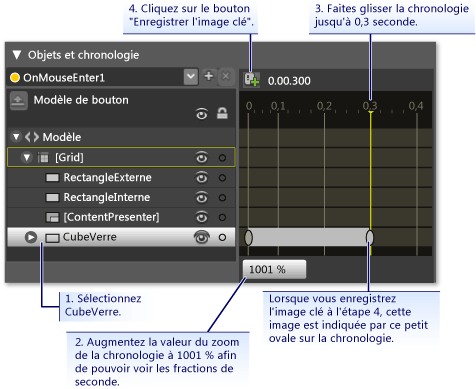  
  
4.  **Réduire glassCube à cette image clé :** avec l’image clé deuxième sélectionné, réduire la taille de la **glassCube** à 90 % de sa taille complète à l’aide de la **taille transformer**.  
  
     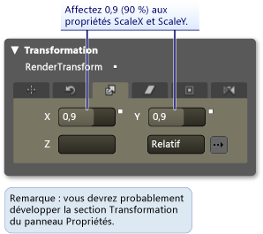  
  
     Appuyez sur F5 pour exécuter l'application. Déplacez le pointeur de la souris sur le bouton. Notez que la couche de verre se réduit sur le bouton.  
  
5.  **Créer un autre déclencheur d’événement et lui associer une autre animation :** ajoutons une animation plus. Utiliser une procédure similaire à ce qui vous permet de créer l’animation de déclencheur d’événements précédent :  
  
    1.  Créer un nouvel événement déclencheur à l’aide de la <xref:System.Windows.Controls.Primitives.ButtonBase.Click> événement.  
  
    2.  Associez une nouvelle chronologie avec la <xref:System.Windows.Controls.Primitives.ButtonBase.Click> événement.  
  
     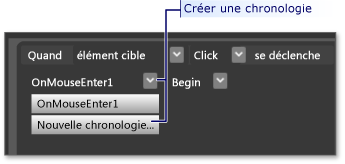  
  
    1.  Pour ce scénario, créez deux images clés, une à 0,0 secondes et l’autre à 0,3 secondes.  
  
    2.  Avec l’image clé à 0,3 secondes mis en surbrillance, définissez la **pivoter un Angle de transformation** à 360 degrés.  
  
     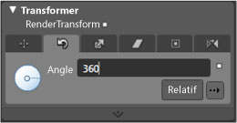  
  
    1.  Appuyez sur F5 pour exécuter l'application. Cliquez sur le bouton. Notez que la couche de verre tourne.  
  
## Conclusion  
 Vous avez terminé un bouton personnalisé. Vous l’avez fait à l’aide d’un modèle de bouton qui a été appliqué à tous les boutons dans l’application. Si vous quittez le mode de modification de modèle (voir la figure suivante) et créer des boutons de plus, vous verrez que leur apparence et le comportement de votre bouton personnalisé plutôt que comme bouton par défaut.  
  
 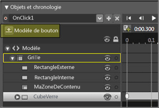  
  
 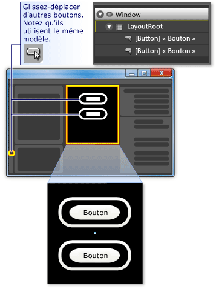  
  
 Appuyez sur F5 pour exécuter l'application. Cliquez sur les boutons et notez la façon dont ils ont le même comportement.  
  
 N’oubliez pas que lorsque vous avez personnalisé le modèle, vous le <xref:System.Windows.Shapes.Shape.Fill%2A> propriété du **RectangleInterne** et <xref:System.Windows.Shapes.Shape.Stroke%2A> propriété **RectangleExterne** à l’arrière-plan du modèle ({} TemplateBinding Background}). Pour cette raison, lorsque vous définissez la couleur d’arrière-plan des boutons individuels, l’arrière-plan que vous définissez est utilisée pour chacune des propriétés. Essayez de modifier les arrière-plans maintenant. Dans la figure suivante, différents dégradés sont utilisés. Par conséquent, même si un modèle est utile pour la personnalisation globale de contrôles de bouton, contrôles avec modèles peuvent être modifiés pour différer les uns des autres.  
  
 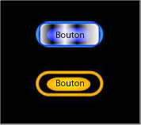  
  
 En conclusion, en cours de personnalisation d’un modèle de bouton, vous avez appris comment effectuer les opérations suivantes dans Microsoft Expression Blend :  
  
-   Personnaliser l’apparence d’un contrôle.  
  
-   Définir des déclencheurs de propriété. Déclencheurs de propriété sont très utiles, car ils peuvent être utilisés sur la plupart des objets, pas seulement sur les contrôles.  
  
-   Définissez les déclencheurs d’événements. Les déclencheurs d’événements sont très utiles, car ils peuvent être utilisés sur la plupart des objets, pas seulement sur les contrôles.  
  
-   Créer des animations.  
  
-   Divers : créer des dégradés, ajouter des effets bitmap, utiliser des transformations et définir les propriétés de base des objets.  
  
## Voir aussi  
 [Créer un bouton avec XAML](../../../../docs/framework/wpf/controls/walkthrough-create-a-button-by-using-xaml.md)  
 [Application d’un style et création de modèles](../../../../docs/framework/wpf/controls/styling-and-templating.md)  
 [Vue d’ensemble de l’animation](../../../../docs/framework/wpf/graphics-multimedia/animation-overview.md)  
 [Vue d’ensemble de la peinture avec des couleurs unies ou des dégradés](../../../../docs/framework/wpf/graphics-multimedia/painting-with-solid-colors-and-gradients-overview.md)  
 [Vue d’ensemble des effets bitmap](../../../../docs/framework/wpf/graphics-multimedia/bitmap-effects-overview.md)
