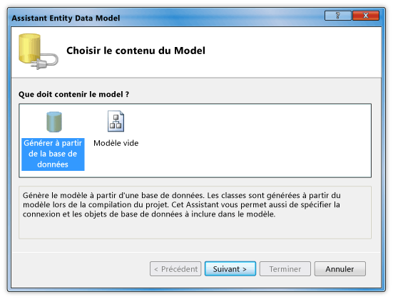
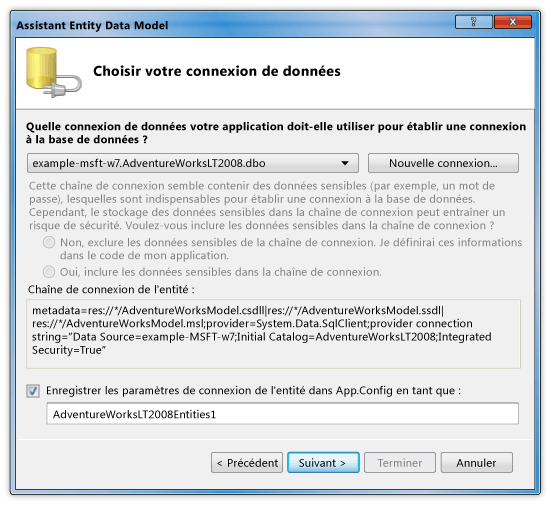
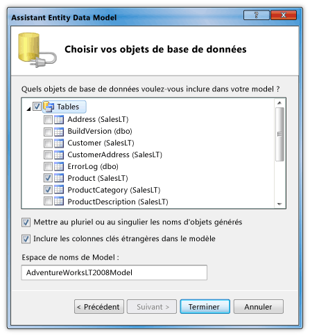
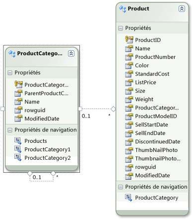

# Procédure pas à pas : affichage de données d'une base de données SQL Server dans un contrôle DataGridWalkthrough: Display Data from a SQL Server Database in a DataGrid Control
Dans cette procédure pas à pas, vous récupérer des données d’une base de données SQL Server et afficher ces données dans un <xref:System.Windows.Controls.DataGrid> contrôle.In this walkthrough, you retrieve data from a SQL Server database and display that data in a <xref:System.Windows.Controls.DataGrid> control. ADO.NET Entity Framework vous permet de créer les classes d’entité qui représentent les données et utilisent LINQ pour écrire une requête qui Récupère les données spécifiées à partir d’une classe d’entité.You use the ADO.NET Entity Framework to create the entity classes that represent the data, and use LINQ to write a query that retrieves the specified data from an entity class.  
  
## Conditions préalablesPrerequisites  
 Pour exécuter cette procédure pas à pas, vous devez disposer des composants suivants :You need the following components to complete this walkthrough:  
  
-   [!INCLUDE[vs_dev11_long](../../../../includes/vs-dev11-long-md.md)]..  
  
-   Accès à une instance en cours d’exécution de SQL Server ou SQL Server Express qui possède la base de données AdventureWorks attaché.Access to a running instance of SQL Server or SQL Server Express that has the AdventureWorks sample database attached to it. Vous pouvez télécharger la base de données AdventureWorks à partir de la [GitHub](https://github.com/Microsoft/sql-server-samples/releases).You can download the AdventureWorks database from the [GitHub](https://github.com/Microsoft/sql-server-samples/releases).  
  
### Pour créer des classes d’entitéTo create entity classes  
  
1.  Créer un nouveau projet d’Application WPF dans Visual Basic ou c# et nommez-le `DataGridSQLExample`.Create a new WPF Application project in Visual Basic or C#, and name it `DataGridSQLExample`.  
  
2.  Dans l’Explorateur de solutions, cliquez sur votre projet, pointez sur **ajouter**, puis sélectionnez **un nouvel élément**.In Solution Explorer, right-click your project, point to **Add**, and then select **New Item**.  
  
     La boîte de dialogue Ajouter un nouvel élément s’affiche.The Add New Item dialog box appears.  
  
3.  Dans le volet Modèles installés, sélectionnez **données** et dans la liste des modèles, sélectionnez **Mode de données d’entité ADO.NET**l.In the Installed Templates pane, select **Data** and in the list of templates, select **ADO.NET Entity Data Mode**l.  
  
       
  
4.  Nommez le fichier `AdventureWorksModel.edmx` puis cliquez sur **ajouter**.Name the file `AdventureWorksModel.edmx` and then click **Add**.  
  
     L'Assistant Entity Data Model s'affiche.The Entity Data Model Wizard appears.  
  
5.  Dans l’écran de choisir le contenu du modèle, sélectionnez **générer à partir de la base de données** puis cliquez sur **suivant**.In the Choose Model Contents screen, select **Generate from database** and then click **Next**.  
  
       
  
6.  Dans l’écran Choisir votre connexion de données, fournissez la connexion à votre base de données AdventureWorksLT2008.In the Choose Your Data Connection screen, provide the connection to your AdventureWorksLT2008 database. Pour plus d’informations, consultez [boîte de dialogue Choisir votre connexion de données](http://go.microsoft.com/fwlink/?LinkId=160190).For more information, see [Choose Your Data Connection Dialog Box](http://go.microsoft.com/fwlink/?LinkId=160190).  
  
       
  
7.  Assurez-vous que le nom est `AdventureWorksLT2008Entities` et que le **enregistrer les paramètres de connexion de l’entité dans App.Config en tant que** case à cocher est sélectionnée, puis cliquez sur **suivant**.Make sure that the name is `AdventureWorksLT2008Entities` and that the **Save entity connection settings in App.Config as** check box is selected, and then click **Next**.  
  
8.  Dans l’écran Choisir vos objets de base de données, développez le nœud Tables, puis sélectionnez le **produit** et **ProductCategory** tables.In the Choose Your Database Objects screen, expand the Tables node, and select the **Product** and **ProductCategory** tables.  
  
     Vous pouvez générer des classes d’entité pour toutes les tables ; Toutefois, dans cet exemple vous uniquement récupérer des données à partir de ces deux tables.You can generate entity classes for all of the tables; however, in this example you only retrieve data from those two tables.  
  
       
  
9. Cliquez sur **Terminer**.Click **Finish**.  
  
     Les entités Product et ProductCategory sont affichées dans le Concepteur d’entités.The Product and ProductCategory entities are displayed in the Entity Designer.  
  
       
  
### Pour récupérer et présenter les donnéesTo retrieve and present the data  
  
1.  Ouvrez le fichier MainWindow.xaml.Open the MainWindow.xaml file.  
  
2.  Définir le <xref:System.Windows.FrameworkElement.Width%2A> propriété sur le <xref:System.Windows.Window> à 450.Set the <xref:System.Windows.FrameworkElement.Width%2A> property on the <xref:System.Windows.Window> to 450.  
  
3.  Dans l’éditeur XAML, ajoutez le code suivant <xref:System.Windows.Controls.DataGrid> balise entre le `<Grid>` et `</Grid>` balises pour ajouter un <xref:System.Windows.Controls.DataGrid> nommé `dataGrid1`.In the XAML editor, add the following <xref:System.Windows.Controls.DataGrid> tag between the `<Grid>` and `</Grid>` tags to add a <xref:System.Windows.Controls.DataGrid> named `dataGrid1`.  
  
     [!code-xaml[DataGrid_SQL_EF_Walkthrough#3](../../../../samples/snippets/csharp/VS_Snippets_Wpf/DataGrid_SQL_EF_Walkthrough/CS/MainWindow.xaml#3)]  
  
       
  
4.  Sélectionnez le contrôle <xref:System.Windows.Window>.Select the <xref:System.Windows.Window>.  
  
5.  À l’aide de la fenêtre Propriétés ou l’éditeur XAML, créez un gestionnaire d’événements pour le <xref:System.Windows.Window> nommé `Window_Loaded` pour la <xref:System.Windows.FrameworkElement.Loaded> événement.Using the Properties window or XAML editor, create an event handler for the <xref:System.Windows.Window> named `Window_Loaded` for the <xref:System.Windows.FrameworkElement.Loaded> event. Pour plus d’informations, consultez [Comment : créer un gestionnaire d’événements Simple](http://msdn.microsoft.com/en-us/b1456e07-9dec-4354-99cf-18666b64f480).For more information, see [How to: Create a Simple Event Handler](http://msdn.microsoft.com/en-us/b1456e07-9dec-4354-99cf-18666b64f480).  
  
     Le code suivant illustre le code XAML pour MainWindow.xaml.The following shows the XAML for MainWindow.xaml.  
  
    > [!NOTE]
    >  Si vous utilisez Visual Basic, dans la première ligne de MainWindow.xaml, remplacez `x:Class="DataGridSQLExample.MainWindow"` avec `x:Class="MainWindow"`.If you are using Visual Basic, in the first line of MainWindow.xaml, replace `x:Class="DataGridSQLExample.MainWindow"` with `x:Class="MainWindow"`.  
  
     [!code-xaml[DataGrid_SQL_EF_Walkthrough#1](../../../../samples/snippets/csharp/VS_Snippets_Wpf/DataGrid_SQL_EF_Walkthrough/CS/MainWindow.xaml#1)]  
  
6.  Ouvrez le fichier code-behind (MainWindow.xaml.vb ou MainWindow.xaml.cs) pour le <xref:System.Windows.Window>.Open the code-behind file (MainWindow.xaml.vb or MainWindow.xaml.cs) for the <xref:System.Windows.Window>.  
  
7.  Ajoutez le code suivant pour extraire uniquement les valeurs spécifiques des tables jointes et pour configurer le <xref:System.Windows.Controls.ItemsControl.ItemsSource%2A> propriété de la <xref:System.Windows.Controls.DataGrid> aux résultats de la requête.Add the following code to retrieve only specific values from the joined tables and set the <xref:System.Windows.Controls.ItemsControl.ItemsSource%2A> property of the <xref:System.Windows.Controls.DataGrid> to the results of the query.  
  
     [!code-csharp[DataGrid_SQL_EF_Walkthrough#2](../../../../samples/snippets/csharp/VS_Snippets_Wpf/DataGrid_SQL_EF_Walkthrough/CS/MainWindow.xaml.cs#2)]
     [!code-vb[DataGrid_SQL_EF_Walkthrough#2](../../../../samples/snippets/visualbasic/VS_Snippets_Wpf/DataGrid_SQL_EF_Walkthrough/VB/MainWindow.xaml.vb#2)]  
  
8.  Exécutez l'exemple.Run the example.  
  
     Vous devez voir un <xref:System.Windows.Controls.DataGrid> qui affiche des données.You should see a <xref:System.Windows.Controls.DataGrid> that displays data.  
  
       
  
## Étapes suivantesNext Steps  
  
## Voir aussiSee Also  
 <xref:System.Windows.Controls.DataGrid>  
 [Comment faire pour démarrer avec Entity Framework dans les Applications WPF ?How Do I: Get Started with Entity Framework in WPF Applications?](http://go.microsoft.com/fwlink/?LinkId=159868)
