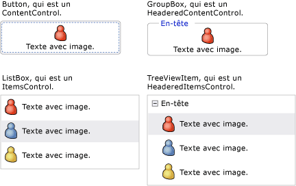
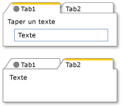
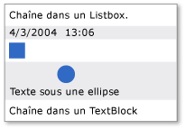
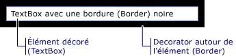

# Modèle de contenu WPFWPF Content Model
[!INCLUDE[TLA#tla_winclient](../../../../includes/tlasharptla-winclient-md.md)] est une plateforme de présentation qui fournit de nombreux contrôles et des éléments de type contrôle dont le principal objectif est d’afficher différents types de contenu. is a presentation platform that provides many controls and control-like types whose primary purpose is to display different types of content. Pour déterminer le contrôle à utiliser ou le contrôle d’où dériver, vous devez comprendre les types d’objets qu’un contrôle donné peut afficher de manière optimale.To determine which control to use or which control to derive from, you should understand the kinds of objects a particular control can best display.  
  
 Cette rubrique présente de manière synthétique le modèle de contenu pour les contrôles et les éléments de type contrôle [!INCLUDE[TLA2#tla_winclient](../../../../includes/tla2sharptla-winclient-md.md)].This topic summarizes the content model for [!INCLUDE[TLA2#tla_winclient](../../../../includes/tla2sharptla-winclient-md.md)] control and control-like types. Le modèle de contenu décrit le contenu qui peut être utilisé dans un contrôle.The content model describes what content can be used in a control. Cette rubrique répertorie également les propriétés de contenu pour chaque modèle de contenu.This topic also lists the content properties for each content model. Une propriété de contenu est une propriété qui est utilisée pour stocker le contenu de l’objet.A content property is a property that is used to store the content of the object.  
  
 
  
   
## Classes qui contiennent du contenu arbitraireClasses That Contain Arbitrary Content  
 Certains contrôles peuvent contenir un objet de tout type, tel qu’une chaîne, un <xref:System.DateTime> objet, ou un <xref:System.Windows.UIElement> qui est un conteneur pour d’autres éléments.Some controls can contain an object of any type, such as a string, a <xref:System.DateTime> object, or a <xref:System.Windows.UIElement> that is a container for additional items. Par exemple, un <xref:System.Windows.Controls.Button> peut contenir une image et du texte ; ou une <xref:System.Windows.Controls.CheckBox> peut contenir la valeur de <xref:System.DateTime.Now%2A?displayProperty=nameWithType>.For example, a <xref:System.Windows.Controls.Button> can contain an image and some text; or a <xref:System.Windows.Controls.CheckBox> can contain the value of <xref:System.DateTime.Now%2A?displayProperty=nameWithType>.  
  
 [!INCLUDE[TLA2#tla_winclient](../../../../includes/tla2sharptla-winclient-md.md)] proposent quatre classes qui contiennent du contenu arbitraire. has four classes that can contain arbitrary content. Le tableau suivant répertorie les classes qui héritent de <xref:System.Windows.Controls.Control>.The following table lists the classes, which inherit from <xref:System.Windows.Controls.Control>.  
  
|Classe qui contient du contenu arbitraireClass that contains arbitrary content|ContenuContent|  
|-------------------------------------------|-------------|  
|<xref:System.Windows.Controls.ContentControl>|Objet arbitraire unique.A single arbitrary object.|  
|<xref:System.Windows.Controls.HeaderedContentControl>|En-tête et élément unique, correspondant tous deux à des objets arbitraires.A header and a single item, both of which are arbitrary objects.|  
|<xref:System.Windows.Controls.ItemsControl>|Collection d’objets arbitraires.A collection of arbitrary objects.|  
|<xref:System.Windows.Controls.HeaderedItemsControl>|En-tête et collection d’éléments, correspondant tous deux à des objets arbitraires.A header and a collection of items, all of which are arbitrary objects.|  
  
 Les contrôles qui héritent de ces classes peuvent contenir le même type de contenu et traiter le contenu de la même façon.Controls that inherit from these classes can contain the same type of content and treat the content in the same way. L’illustration suivante montre un contrôle dérivé de chaque modèle de contenu qui contient une image et du texte.The following illustration shows one control from each content model that contains an image and some text.  
  
   
  
### Contrôles qui contiennent un objet arbitraire uniqueControls That Contain a Single Arbitrary Object  
 La <xref:System.Windows.Controls.ContentControl> classe contient un morceau unique de contenu arbitraire.The <xref:System.Windows.Controls.ContentControl> class contains a single piece of arbitrary content. Sa propriété de contenu est <xref:System.Windows.Controls.ContentControl.Content%2A>.Its content property is <xref:System.Windows.Controls.ContentControl.Content%2A>. Les contrôles suivants héritent de <xref:System.Windows.Controls.ContentControl> et utiliser son modèle de contenu :The following controls inherit from <xref:System.Windows.Controls.ContentControl> and use its content model:  
  
-   <xref:System.Windows.Controls.Button>  
  
-   <xref:System.Windows.Controls.Primitives.ButtonBase>  
  
-   <xref:System.Windows.Controls.CheckBox>  
  
-   <xref:System.Windows.Controls.ComboBoxItem>  
  
-   <xref:System.Windows.Controls.ContentControl>  
  
-   <xref:System.Windows.Controls.Frame>  
  
-   <xref:System.Windows.Controls.GridViewColumnHeader>  
  
-   <xref:System.Windows.Controls.GroupItem>  
  
-   <xref:System.Windows.Controls.Label>  
  
-   <xref:System.Windows.Controls.ListBoxItem>  
  
-   <xref:System.Windows.Controls.ListViewItem>  
  
-   <xref:System.Windows.Navigation.NavigationWindow>  
  
-   <xref:System.Windows.Controls.RadioButton>  
  
-   <xref:System.Windows.Controls.Primitives.RepeatButton>  
  
-   <xref:System.Windows.Controls.ScrollViewer>  
  
-   <xref:System.Windows.Controls.Primitives.StatusBarItem>  
  
-   <xref:System.Windows.Controls.Primitives.ToggleButton>  
  
-   <xref:System.Windows.Controls.ToolTip>  
  
-   <xref:System.Windows.Controls.UserControl>  
  
-   <xref:System.Windows.Window>  
  
 L’illustration suivante montre quatre boutons dont <xref:System.Windows.Controls.ContentControl.Content%2A> est définie sur une chaîne, un <xref:System.DateTime> objet, un <xref:System.Windows.Shapes.Rectangle>et un <xref:System.Windows.Controls.Panel> qui contient un <xref:System.Windows.Shapes.Ellipse> et un <xref:System.Windows.Controls.TextBlock>.The following illustration shows four buttons whose <xref:System.Windows.Controls.ContentControl.Content%2A> is set to a string, a <xref:System.DateTime> object, a <xref:System.Windows.Shapes.Rectangle>, and a <xref:System.Windows.Controls.Panel> that contains an <xref:System.Windows.Shapes.Ellipse> and a <xref:System.Windows.Controls.TextBlock>.  
  
   
Quatre boutons ayant différents types de contenuFour buttons that have different types of content  
  
 Pour obtenir un exemple montrant comment définir le <xref:System.Windows.Controls.ContentControl.Content%2A> propriété, consultez <xref:System.Windows.Controls.ContentControl>.For an example of how to set the <xref:System.Windows.Controls.ContentControl.Content%2A> property, see <xref:System.Windows.Controls.ContentControl>.  
  
### Contrôles qui contiennent un en-tête et un objet arbitraire uniqueControls That Contain a Header and a Single Arbitrary Object  
 Le <xref:System.Windows.Controls.HeaderedContentControl> hérite de la classe <xref:System.Windows.Controls.ContentControl> et affiche le contenu avec un en-tête.The <xref:System.Windows.Controls.HeaderedContentControl> class inherits from <xref:System.Windows.Controls.ContentControl> and displays content with a header. Il hérite de la propriété de contenu, <xref:System.Windows.Controls.ContentControl.Content%2A>, à partir de <xref:System.Windows.Controls.ContentControl> et définit les <xref:System.Windows.Controls.HeaderedContentControl.Header%2A> propriété qui est de type <xref:System.Object>; par conséquent, les deux peuvent être un objet arbitraire.It inherits the content property, <xref:System.Windows.Controls.ContentControl.Content%2A>, from <xref:System.Windows.Controls.ContentControl> and defines the <xref:System.Windows.Controls.HeaderedContentControl.Header%2A> property that is of type <xref:System.Object>; therefore, both can be an arbitrary object.  
  
 Les contrôles suivants héritent de <xref:System.Windows.Controls.HeaderedContentControl> et utiliser son modèle de contenu :The following controls inherit from <xref:System.Windows.Controls.HeaderedContentControl> and use its content model:  
  
-   <xref:System.Windows.Controls.Expander>  
  
-   <xref:System.Windows.Controls.GroupBox>  
  
-   <xref:System.Windows.Controls.TabItem>  
  
 L’illustration suivante montre deux <xref:System.Windows.Controls.TabItem> objets.The following illustration shows two <xref:System.Windows.Controls.TabItem> objects. La première <xref:System.Windows.Controls.TabItem> a <xref:System.Windows.UIElement> des objets en tant que le <xref:System.Windows.Controls.HeaderedContentControl.Header%2A> et <xref:System.Windows.Controls.ContentControl.Content%2A>.The first <xref:System.Windows.Controls.TabItem> has <xref:System.Windows.UIElement> objects as the <xref:System.Windows.Controls.HeaderedContentControl.Header%2A> and the <xref:System.Windows.Controls.ContentControl.Content%2A>. Le <xref:System.Windows.Controls.HeaderedContentControl.Header%2A> est définie sur une <xref:System.Windows.Controls.StackPanel> qui contient un <xref:System.Windows.Shapes.Ellipse> et un <xref:System.Windows.Controls.TextBlock>.The <xref:System.Windows.Controls.HeaderedContentControl.Header%2A> is set to a <xref:System.Windows.Controls.StackPanel> that contains an <xref:System.Windows.Shapes.Ellipse> and a <xref:System.Windows.Controls.TextBlock>. Le <xref:System.Windows.Controls.ContentControl.Content%2A> est définie sur une <xref:System.Windows.Controls.StackPanel> qui contient un <xref:System.Windows.Controls.TextBlock> et un <xref:System.Windows.Controls.Label>.The <xref:System.Windows.Controls.ContentControl.Content%2A> is set to a <xref:System.Windows.Controls.StackPanel> that contains a <xref:System.Windows.Controls.TextBlock> and a <xref:System.Windows.Controls.Label>. La seconde <xref:System.Windows.Controls.TabItem> a une chaîne le <xref:System.Windows.Controls.HeaderedContentControl.Header%2A> et un <xref:System.Windows.Controls.TextBlock> dans le <xref:System.Windows.Controls.ContentControl.Content%2A>.The second <xref:System.Windows.Controls.TabItem> has a string in the <xref:System.Windows.Controls.HeaderedContentControl.Header%2A> and a <xref:System.Windows.Controls.TextBlock> in the <xref:System.Windows.Controls.ContentControl.Content%2A>.  
  
   
TabControl qui utilise différents types dans la propriété d’en-têteTabControl that uses different types in the Header property  
  
 Pour obtenir un exemple montrant comment créer <xref:System.Windows.Controls.TabItem> , consultez <xref:System.Windows.Controls.HeaderedContentControl>.For an example of how to create <xref:System.Windows.Controls.TabItem> objects, see <xref:System.Windows.Controls.HeaderedContentControl>.  
  
### Contrôles qui contiennent une collection d’objets arbitrairesControls That Contain a Collection of Arbitrary Objects  
 Le <xref:System.Windows.Controls.ItemsControl> hérite de la classe <xref:System.Windows.Controls.Control> et peut contenir plusieurs éléments, tels que des chaînes, des objets ou des autres éléments.The <xref:System.Windows.Controls.ItemsControl> class inherits from <xref:System.Windows.Controls.Control> and can contain multiple items, such as strings, objects, or other elements. Ses propriétés de contenu sont <xref:System.Windows.Controls.ItemsControl.ItemsSource%2A> et <xref:System.Windows.Controls.ItemsControl.Items%2A>.Its content properties are <xref:System.Windows.Controls.ItemsControl.ItemsSource%2A> and <xref:System.Windows.Controls.ItemsControl.Items%2A>. <xref:System.Windows.Controls.ItemsControl.ItemsSource%2A>est généralement utilisé pour remplir le <xref:System.Windows.Controls.ItemsControl> avec une collection de données.<xref:System.Windows.Controls.ItemsControl.ItemsSource%2A> is typically used to populate the <xref:System.Windows.Controls.ItemsControl> with a data collection. Si vous ne souhaitez pas utiliser une collection pour remplir le <xref:System.Windows.Controls.ItemsControl>, vous pouvez ajouter des éléments à l’aide de la <xref:System.Windows.Controls.ItemsControl.Items%2A> propriété.If you do not want to use a collection to populate the <xref:System.Windows.Controls.ItemsControl>, you can add items by using the <xref:System.Windows.Controls.ItemsControl.Items%2A> property.  
  
 Les contrôles suivants héritent de <xref:System.Windows.Controls.ItemsControl> et utiliser son modèle de contenu :The following controls inherit from <xref:System.Windows.Controls.ItemsControl> and use its content model:  
  
-   <xref:System.Windows.Controls.Menu>  
  
-   <xref:System.Windows.Controls.Primitives.MenuBase>  
  
-   <xref:System.Windows.Controls.ContextMenu>  
  
-   <xref:System.Windows.Controls.ComboBox>  
  
-   <xref:System.Windows.Controls.ItemsControl>  
  
-   <xref:System.Windows.Controls.ListBox>  
  
-   <xref:System.Windows.Controls.ListView>  
  
-   <xref:System.Windows.Controls.TabControl>  
  
-   <xref:System.Windows.Controls.TreeView>  
  
-   <xref:System.Windows.Controls.Primitives.Selector>  
  
-   <xref:System.Windows.Controls.Primitives.StatusBar>  
  
 L’illustration suivante montre un <xref:System.Windows.Controls.ListBox> qui contient ces types d’éléments :The following illustration shows a <xref:System.Windows.Controls.ListBox> that contains these types of items:  
  
-   Chaîne.A string.  
  
-   Objet <xref:System.DateTime>.A <xref:System.DateTime> object.  
  
-   <xref:System.Windows.UIElement>A <xref:System.Windows.UIElement>.  
  
-   A <xref:System.Windows.Controls.Panel> qui contient un <xref:System.Windows.Shapes.Ellipse> et un <xref:System.Windows.Controls.TextBlock>.A <xref:System.Windows.Controls.Panel> that contains an <xref:System.Windows.Shapes.Ellipse> and a <xref:System.Windows.Controls.TextBlock>.  
  
   
ListBox contenant plusieurs types de contenuListBox that contains multiple types of objects  
  
### Contrôles qui contiennent un en-tête et une collection d’objets arbitrairesControls That Contain a Header and a Collection of Arbitrary Objects  
 Le <xref:System.Windows.Controls.HeaderedItemsControl> hérite de la classe <xref:System.Windows.Controls.ItemsControl> et peut contenir plusieurs éléments, tels que des chaînes, objets, ou autres éléments et un en-tête.The <xref:System.Windows.Controls.HeaderedItemsControl> class inherits from <xref:System.Windows.Controls.ItemsControl> and can contain multiple items, such as strings, objects, or other elements, and a header. Elle hérite la <xref:System.Windows.Controls.ItemsControl> propriétés, du contenu <xref:System.Windows.Controls.ItemsControl.ItemsSource%2A>, et <xref:System.Windows.Controls.ItemsControl.Items%2A>, et définit le <xref:System.Windows.Controls.HeaderedItemsControl.Header%2A> propriété qui peut être un objet arbitraire.It inherits the <xref:System.Windows.Controls.ItemsControl> content properties, <xref:System.Windows.Controls.ItemsControl.ItemsSource%2A>, and <xref:System.Windows.Controls.ItemsControl.Items%2A>, and it defines the <xref:System.Windows.Controls.HeaderedItemsControl.Header%2A> property that can be an arbitrary object.  
  
 Les contrôles suivants héritent de <xref:System.Windows.Controls.HeaderedItemsControl> et utiliser son modèle de contenu :The following controls inherit from <xref:System.Windows.Controls.HeaderedItemsControl> and use its content model:  
  
-   <xref:System.Windows.Controls.MenuItem>  
  
-   <xref:System.Windows.Controls.ToolBar>  
  
-   <xref:System.Windows.Controls.TreeViewItem>  
  
   
## Classes qui contiennent une collection d’objets UIElementClasses That Contain a Collection of UIElement Objects  
 Le <xref:System.Windows.Controls.Panel> classe positionne et réorganise les enfants <xref:System.Windows.UIElement> objets.The <xref:System.Windows.Controls.Panel> class positions and arranges child <xref:System.Windows.UIElement> objects. Sa propriété de contenu est <xref:System.Windows.Controls.Panel.Children%2A>.Its content property is <xref:System.Windows.Controls.Panel.Children%2A>.  
  
 Les classes suivantes héritent de la <xref:System.Windows.Controls.Panel> classe et utiliser son modèle de contenu :The following classes inherit from the <xref:System.Windows.Controls.Panel> class and use its content model:  
  
-   <xref:System.Windows.Controls.Canvas>  
  
-   <xref:System.Windows.Controls.DockPanel>  
  
-   <xref:System.Windows.Controls.Grid>  
  
-   <xref:System.Windows.Controls.Primitives.TabPanel>  
  
-   <xref:System.Windows.Controls.Primitives.ToolBarOverflowPanel>  
  
-   <xref:System.Windows.Controls.Primitives.ToolBarPanel>  
  
-   <xref:System.Windows.Controls.Primitives.UniformGrid>  
  
-   <xref:System.Windows.Controls.StackPanel>  
  
-   <xref:System.Windows.Controls.VirtualizingPanel>  
  
-   <xref:System.Windows.Controls.VirtualizingStackPanel>  
  
-   <xref:System.Windows.Controls.WrapPanel>  
  
 Pour plus d’informations, consultez la page [Vue d’ensemble de Panel](../../../../docs/framework/wpf/controls/panels-overview.md).For more information, see [Panels Overview](../../../../docs/framework/wpf/controls/panels-overview.md).  
  
   
## Classes qui affectent l’apparence d’un UIElementClasses That Affect the Appearance of a UIElement  
 Le <xref:System.Windows.Controls.Decorator> classe applique des effets visuels sur ou autour d’un seul enfant <xref:System.Windows.UIElement>.The <xref:System.Windows.Controls.Decorator> class applies visual effects onto or around a single child <xref:System.Windows.UIElement>. Sa propriété de contenu est <xref:System.Windows.Controls.Decorator.Child%2A>.Its content property is <xref:System.Windows.Controls.Decorator.Child%2A>. Les classes suivantes héritent de <xref:System.Windows.Controls.Decorator> et utiliser son modèle de contenu :The following classes inherit from <xref:System.Windows.Controls.Decorator> and use its content model:  
  
-   <xref:System.Windows.Documents.AdornerDecorator>  
  
-   <xref:System.Windows.Controls.Border>  
  
-   <xref:System.Windows.Controls.Primitives.BulletDecorator>  
  
-   <xref:Microsoft.Windows.Themes.ButtonChrome>  
  
-   <xref:Microsoft.Windows.Themes.ClassicBorderDecorator>  
  
-   <xref:System.Windows.Controls.InkPresenter>  
  
-   <xref:Microsoft.Windows.Themes.ListBoxChrome>  
  
-   <xref:Microsoft.Windows.Themes.SystemDropShadowChrome>  
  
-   <xref:System.Windows.Controls.Viewbox>  
  
 L’illustration suivante montre un <xref:System.Windows.Controls.TextBox> qui a (est décoré avec) un <xref:System.Windows.Controls.Border> autour de lui.The following illustration shows a <xref:System.Windows.Controls.TextBox> that has (is decorated with) a <xref:System.Windows.Controls.Border> around it.  
  
   
TextBlock avec une bordureTextBlock that has a Border  
  
   
## Classes qui fournissent des commentaires visuels sur un UIElementClasses That Provide Visual Feedback About a UIElement  
 La <xref:System.Windows.Documents.Adorner> classe fournit des signaux visuels à un utilisateur.The <xref:System.Windows.Documents.Adorner> class provides visual cues to a user. Par exemple, utiliser un <xref:System.Windows.Documents.Adorner> pour ajouter des handles fonctionnels aux éléments ou fournir les informations d’état sur un contrôle.For example, use an <xref:System.Windows.Documents.Adorner> to add functional handles to elements or provide state information about a control. La <xref:System.Windows.Documents.Adorner> classe fournit une infrastructure afin que vous pouvez créer vos propres ornements.The <xref:System.Windows.Documents.Adorner> class provides a framework so that you can create your own adorners. [!INCLUDE[TLA2#tla_winclient](../../../../includes/tla2sharptla-winclient-md.md)] ne fournit aucun ornement implémenté. does not provide any implemented adorners. Pour plus d’informations, consultez [Vue d’ensemble des ornements](../../../../docs/framework/wpf/controls/adorners-overview.md).For more information, see [Adorners Overview](../../../../docs/framework/wpf/controls/adorners-overview.md).  
  
   
## Classes qui permettent aux utilisateurs d’entrer du texteClasses That Enable Users to Enter Text  
 WPF fournit trois principaux contrôles qui permettent aux utilisateurs d’entrer du texte.WPF provides three primary controls that enable users to enter text. Chaque contrôle affiche le texte de manière différente.Each control displays the text differently. Le tableau suivant répertorie ces trois contrôles liés au texte, leurs fonctions lors de l’affichage du texte et leurs propriétés qui contiennent le texte du contrôle.The following table lists these three text-related controls, their capabilities when they display text, and their properties that contain the control's text.  
  
|ContrôleControl|Texte affiché en tant queText is displayed as|Propriété de contenuContent property|  
|-------------|--------------------------|----------------------|  
|<xref:System.Windows.Controls.TextBox>|Texte brutPlain text|<xref:System.Windows.Controls.TextBox.Text%2A>|  
|<xref:System.Windows.Controls.RichTextBox>|Texte mis en formeFormatted text|<xref:System.Windows.Controls.RichTextBox.Document%2A>|  
|<xref:System.Windows.Controls.PasswordBox>|Texte masqué (les caractères sont masqués)Hidden text (characters are masked)|<xref:System.Windows.Controls.PasswordBox.Password%2A>|  
  
   
## Classes qui affichent votre texteClasses That Display Your Text  
 Plusieurs classes peuvent être utilisées pour afficher du texte brut ou mis en forme.Several classes can be used to display plain or formatted text. Vous pouvez utiliser <xref:System.Windows.Controls.TextBlock> pour afficher de petites quantités de texte.You can use <xref:System.Windows.Controls.TextBlock> to display small amounts of text. Si vous souhaitez afficher de grandes quantités de texte, utilisez la <xref:System.Windows.Controls.FlowDocumentReader>, <xref:System.Windows.Controls.FlowDocumentPageViewer>, ou <xref:System.Windows.Controls.FlowDocumentScrollViewer> contrôles.If you want to display large amounts of text, use the <xref:System.Windows.Controls.FlowDocumentReader>, <xref:System.Windows.Controls.FlowDocumentPageViewer>, or <xref:System.Windows.Controls.FlowDocumentScrollViewer> controls.  
  
 Le <xref:System.Windows.Controls.TextBlock> a deux propriétés de contenu : <xref:System.Windows.Controls.TextBlock.Text%2A> et <xref:System.Windows.Controls.TextBlock.Inlines%2A>.The <xref:System.Windows.Controls.TextBlock> has two content properties: <xref:System.Windows.Controls.TextBlock.Text%2A> and <xref:System.Windows.Controls.TextBlock.Inlines%2A>. Lorsque vous souhaitez afficher du texte qui utilise la mise en forme cohérente, la <xref:System.Windows.Controls.TextBlock.Text%2A> propriété est souvent le meilleur choix.When you want to display text that uses consistent formatting, the <xref:System.Windows.Controls.TextBlock.Text%2A> property is often your best choice. Si vous envisagez d’utiliser la mise en forme différente dans tout le texte, utilisez le <xref:System.Windows.Controls.TextBlock.Inlines%2A> propriété.If you plan to use different formatting throughout the text, use the <xref:System.Windows.Controls.TextBlock.Inlines%2A> property. Le <xref:System.Windows.Controls.TextBlock.Inlines%2A> propriété est une collection de <xref:System.Windows.Documents.Inline> objets, qui spécifient la mise en forme de texte.The <xref:System.Windows.Controls.TextBlock.Inlines%2A> property is a collection of <xref:System.Windows.Documents.Inline> objects, which specify how to format text.  
  
 Le tableau suivant répertorie la propriété de contenu pour <xref:System.Windows.Controls.FlowDocumentReader>, <xref:System.Windows.Controls.FlowDocumentPageViewer>, et <xref:System.Windows.Controls.FlowDocumentScrollViewer> classes.The following table lists the content property for <xref:System.Windows.Controls.FlowDocumentReader>, <xref:System.Windows.Controls.FlowDocumentPageViewer>, and <xref:System.Windows.Controls.FlowDocumentScrollViewer> classes.  
  
|ContrôleControl|Propriété de contenuContent property|Type de propriété de contenuContent property type|  
|-------------|----------------------|---------------------------|  
|<xref:System.Windows.Controls.FlowDocumentPageViewer>|DocumentDocument|<xref:System.Windows.Documents.IDocumentPaginatorSource>|  
|<xref:System.Windows.Controls.FlowDocumentReader>|DocumentDocument|<xref:System.Windows.Documents.FlowDocument>|  
|<xref:System.Windows.Controls.FlowDocumentScrollViewer>|DocumentDocument|<xref:System.Windows.Documents.FlowDocument>|  
  
 Le <xref:System.Windows.Documents.FlowDocument> implémente la <xref:System.Windows.Documents.IDocumentPaginatorSource> interface ; par conséquent, les trois classes peuvent accepter un <xref:System.Windows.Documents.FlowDocument> en tant que contenu.The <xref:System.Windows.Documents.FlowDocument> implements the <xref:System.Windows.Documents.IDocumentPaginatorSource> interface; therefore, all three classes can take a <xref:System.Windows.Documents.FlowDocument> as content.  
  
   
## Classes de mise en forme du texteClasses That Format Your Text  
 <xref:System.Windows.Documents.TextElement>et ses classes connexes vous permettent de mettre en forme texte.<xref:System.Windows.Documents.TextElement> and its related classes allow you to format text. <xref:System.Windows.Documents.TextElement>les objets contiennent et mettre en forme le texte dans <xref:System.Windows.Controls.TextBlock> et <xref:System.Windows.Documents.FlowDocument> objets.<xref:System.Windows.Documents.TextElement> objects contain and format text in <xref:System.Windows.Controls.TextBlock> and <xref:System.Windows.Documents.FlowDocument> objects. Les deux principaux types de <xref:System.Windows.Documents.TextElement> sont des objets <xref:System.Windows.Documents.Block> éléments et <xref:System.Windows.Documents.Inline> éléments.The two primary types of <xref:System.Windows.Documents.TextElement> objects are <xref:System.Windows.Documents.Block> elements and <xref:System.Windows.Documents.Inline> elements. A <xref:System.Windows.Documents.Block> élément représente un bloc de texte, tel qu’un paragraphe ou d’une liste.A <xref:System.Windows.Documents.Block> element represents a block of text, such as a paragraph or list. Un <xref:System.Windows.Documents.Inline> élément représente une partie du texte dans un bloc.An <xref:System.Windows.Documents.Inline> element represents a portion of text in a block. Nombreux <xref:System.Windows.Documents.Inline> classes spécifient la mise en forme du texte dans lequel ils sont appliqués.Many <xref:System.Windows.Documents.Inline> classes specify formatting for the text to which they are applied. Chaque <xref:System.Windows.Documents.TextElement> possède son propre modèle de contenu.Each <xref:System.Windows.Documents.TextElement> has its own content model. Pour plus d’informations, consultez la page [Vue d’ensemble du modèle de contenu de TextElement](../../../../docs/framework/wpf/advanced/textelement-content-model-overview.md).For more information, see the [TextElement Content Model Overview](../../../../docs/framework/wpf/advanced/textelement-content-model-overview.md).  
  
## Voir aussiSee Also  
 [AvancéAdvanced](../../../../docs/framework/wpf/advanced/index.md)
