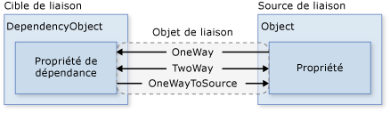
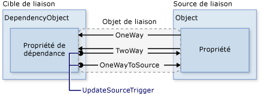
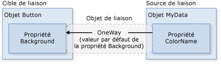
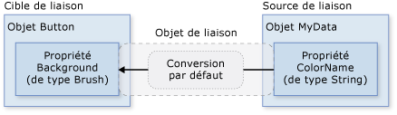
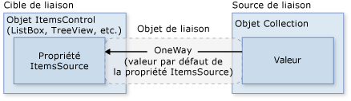

# Vue d&#39;ensemble de la liaison de donn&#233;es
La liaison de données [!INCLUDE[TLA#tla_winclient](../../../../includes/tlasharptla-winclient-md.md)] offre un moyen simple et cohérent aux applications de présenter et d'interagir avec les données.  Les éléments peuvent être liés aux données de diverses sources de données sous la forme d'objets [!INCLUDE[TLA#tla_clr](../../../../includes/tlasharptla-clr-md.md)] et [!INCLUDE[TLA#tla_xml](../../../../includes/tlasharptla-xml-md.md)].  Les <xref:System.Windows.Controls.ContentControl> tels que <xref:System.Windows.Controls.Button> et les <xref:System.Windows.Controls.ItemsControl> tels que <xref:System.Windows.Controls.ListBox> et <xref:System.Windows.Controls.ListView> possèdent des fonctionnalités intégrées pour permettre l'application de styles flexibles aux éléments de données uniques ou aux collections d'éléments de données.  Des vues de tri, de filtre et de groupe peuvent être générées en plus des données.  
  
 La fonctionnalité de liaison de données dans [!INCLUDE[TLA2#tla_winclient](../../../../includes/tla2sharptla-winclient-md.md)] présente plusieurs avantages sur les modèles traditionnels, y compris une large gamme de propriétés qui prennent fondamentalement en charge la liaison des données, la représentation flexible des données via une [!INCLUDE[TLA2#tla_ui](../../../../includes/tla2sharptla-ui-md.md)] et la séparation propre de la logique métier de l'[!INCLUDE[TLA2#tla_ui](../../../../includes/tla2sharptla-ui-md.md)].  
  
 Cette rubrique traite d'abord des concepts fondamentaux de la liaison de données [!INCLUDE[TLA2#tla_winclient](../../../../includes/tla2sharptla-winclient-md.md)], puis traite ensuite de l'utilisation de la classe <xref:System.Windows.Data.Binding> et d'autres fonctionnalités de liaison de données.  
  
   
  
<a name="what_is_data_binding"></a>   
## Qu'est\-ce que la liaison de données ?  
 La liaison de données est le processus qui établit une connexion entre l'[!INCLUDE[TLA2#tla_ui](../../../../includes/tla2sharptla-ui-md.md)] de l'application et la logique métier.  Si la liaison possède les paramètres corrects et que les données fournissent les notifications requises, lorsque les données modifient leur valeur, les éléments liés aux données reflètent automatiquement ces modifications.  La liaison de données peut également signifier que si une représentation externe des données dans un élément change, les données sous\-jacentes peuvent être mises à jour automatiquement pour refléter la modification.  Par exemple, si l'utilisateur modifie la valeur dans un élément <xref:System.Windows.Controls.TextBox>, la valeur de données sous\-jacente est mise à jour automatiquement pour refléter cette modification.  
  
 Une utilisation typique de liaison de données consiste à placer des données de configuration locales ou d'un serveur dans des formulaires ou d'autres contrôles d'[!INCLUDE[TLA2#tla_ui](../../../../includes/tla2sharptla-ui-md.md)].  Ce concept est développé pour inclure la liaison d'une large gamme de propriétés à diverses sources de données dans [!INCLUDE[TLA2#tla_winclient](../../../../includes/tla2sharptla-winclient-md.md)].  Dans [!INCLUDE[TLA2#tla_winclient](../../../../includes/tla2sharptla-winclient-md.md)], [des propriétés de dépendance](GTMT) d'éléments peuvent être liées à des objets [!INCLUDE[TLA2#tla_clr](../../../../includes/tla2sharptla-clr-md.md)] \(y compris des objets [!INCLUDE[TLA#tla_adonet](../../../../includes/tlasharptla-adonet-md.md)] ou des objets associés à des services Web et à des propriétés Web\) et des données [!INCLUDE[TLA2#tla_xml](../../../../includes/tla2sharptla-xml-md.md)].  
  
 Pour obtenir un exemple de liaison de données, consultez l'[!INCLUDE[TLA2#tla_ui](../../../../includes/tla2sharptla-ui-md.md)] de l'application suivante de la section [Liaison de données, démonstration](http://go.microsoft.com/fwlink/?LinkID=163703) :  
  
   
  
 Ce qui précède est l'[!INCLUDE[TLA2#tla_ui](../../../../includes/tla2sharptla-ui-md.md)] d'une application qui affiche une liste d'éléments de vente aux enchères.  L'application montre les fonctionnalités suivantes de liaison de données :  
  
-   Le contenu de <xref:System.Windows.Controls.ListBox> est lié à une collection d'objets *AuctionItem*.  Un objet *AuctionItem* possède des propriétés telles que *Description*, *StartPrice*, *StartDate*, *Category*, *SpecialFeatures*, etc.  
  
-   Les données \(objets *AuctionItem*\) affichées dans le <xref:System.Windows.Controls.ListBox> sont basées sur des modèles de sorte que la description et le prix actuel soient indiqués pour chaque élément.  Cela est fait à l'aide d'un <xref:System.Windows.DataTemplate>.  De plus, l'apparence de chaque élément dépend de la valeur *SpecialFeatures* du *AuctionItem* affiché.  Si la valeur *SpecialFeatures* de *AuctionItem* est *Color*, l'élément a une bordure bleue.  Si la valeur est *Highlight*, l'élément a une bordure orange et une étoile.  La section [Modèles de données](#data_templating) fournit des informations sur les modèles de données.  
  
-   L'utilisateur peut grouper, filtrer ou trier les données à l'aide des <xref:System.Windows.Controls.CheckBox> fournis.  Dans l'image ci\-dessus, "Grouper par catégorie" et "Trier par catégorie et date" <xref:System.Windows.Controls.CheckBox> sont sélectionnés.  Vous avez pu remarquer que les données sont groupées selon la catégorie du produit et que le nom de catégorie est en ordre alphabétique.  C'est difficile à observer dans l'image, mais les éléments sont également triés par date de début dans chaque catégorie.  Ce résultat est obtenu à l'aide d'une *vue de collection*.  La section [Liaison avec des collections](#binding_to_collections) traite des vues de collection.  
  
-   Lorsque l'utilisateur sélectionne un élément, le <xref:System.Windows.Controls.ContentControl> affiche les détails de l'élément sélectionné.  Cela s'appelle le *scénario maître\/détail*.  La section [Scénario maître\/détail](#master_detail_scenario) fournit des informations sur ce type de scénario de liaison.  
  
-   Le type de la propriété *StartDate* est <xref:System.DateTime>, qui retourne une date incluant l'heure à la milliseconde près.  Dans cette application, un convertisseur personnalisé a été utilisé afin d'afficher une chaîne de date plus courte.  La section [Conversion de données](#data_conversion) fournit des informations sur les convertisseurs.  
  
 Lorsque l'utilisateur clique sur le bouton *Add product*, le formulaire suivant s'affiche :  
  
   
  
 L'utilisateur peut modifier les champs dans le formulaire, consulter la liste des produits à l'aide de l'aperçu court et les volets d'aperçu plus détaillés, puis cliquer sur *submit* pour ajouter la liste des nouveaux produits.  Toutes les fonctionnalités de regroupement, de filtrage et de tri existantes s'appliqueront à la nouvelle entrée.  Dans ce cas particulier, l'élément entré dans l'image ci\-dessus sera affiché comme deuxième élément dans la catégorie *Ordinateur*.  
  
 La logique de validation fournie dans la <xref:System.Windows.Controls.TextBox> *Start Date* n'est pas représentée dans cette image.  Si l'utilisateur entre une date non valide \(format non valide ou date révolue\), l'utilisateur sera notifié avec un <xref:System.Windows.Controls.ToolTip> et un point d'exclamation rouge à côté de la <xref:System.Windows.Controls.TextBox>.  La section [Validation des données](#data_validation) traite de la création de la logique de validation.  
  
 Avant d'étudier plus en détail les différentes fonctionnalités de liaison de données décrites ci\-dessus, nous couvrirons en premier dans la section suivante les concepts fondamentaux qui sont critiques pour la compréhension de la liaison de données [!INCLUDE[TLA2#tla_winclient](../../../../includes/tla2sharptla-winclient-md.md)].  
  
<a name="basic_data_binding_concepts"></a>   
## Concepts de base des liaisons de données  
   
  
 Indépendamment de l'élément que vous liez et de la nature de votre source de données, chaque liaison suit toujours le modèle représenté par l'illustration suivante :  
  
   
  
 Comme représenté par l'illustration ci\-dessus, la liaison de données est essentiellement la passerelle entre votre [cible de la liaison](GTMT) et votre [source de liaison](GTMT).  L'illustration montre les concepts fondamentaux suivants de liaison de données [!INCLUDE[TLA2#tla_winclient](../../../../includes/tla2sharptla-winclient-md.md)] :  
  
-   En général, chaque liaison possède ces quatre composants : un objet de [cible de liaison](GTMT), une propriété cible, une [source de liaison](GTMT) et un chemin d'accès à la valeur dans la [source de liaison](GTMT) à utiliser.  Par exemple, si vous souhaitez lier le contenu d'une <xref:System.Windows.Controls.TextBox> à la propriété *Name* d'un objet *Employee*, votre objet cible est la <xref:System.Windows.Controls.TextBox>, la propriété cible est la propriété <xref:System.Windows.Controls.TextBox.Text%2A>, la valeur à utiliser est *Name* et l'objet source est l'objet *Employee*.  
  
-   La propriété cible doit être une [propriété de dépendance](GTMT).  La plupart des propriétés <xref:System.Windows.UIElement> sont des [propriétés de dépendance](GTMT) et la plupart des [propriétés de dépendance](GTMT), sauf celles en lecture seule, prennent en charge la liaison de données par défaut.  \(Seuls les types <xref:System.Windows.DependencyObject> peuvent définir les [propriétés de dépendance](GTMT) et tous les <xref:System.Windows.UIElement> dérivent de <xref:System.Windows.DependencyObject>.\)  
  
-   Bien que non spécifié dans l'illustration, il doit être noté que l'objet de la [source de liaison](GTMT) n'est pas simplement un objet [!INCLUDE[TLA2#tla_clr](../../../../includes/tla2sharptla-clr-md.md)] personnalisé.  La liaison de données [!INCLUDE[TLA2#tla_winclient](../../../../includes/tla2sharptla-winclient-md.md)] prend en charge des données dans le formulaire d'objets [!INCLUDE[TLA2#tla_clr](../../../../includes/tla2sharptla-clr-md.md)] et [!INCLUDE[TLA2#tla_xml](../../../../includes/tla2sharptla-xml-md.md)].  Pour fournir quelques exemples, votre source de liaison peut être un <xref:System.Windows.UIElement>, tout objet de liste, un objet [!INCLUDE[TLA2#tla_clr](../../../../includes/tla2sharptla-clr-md.md)] associé à des données [!INCLUDE[TLA#tla_adonet](../../../../includes/tlasharptla-adonet-md.md)] ou des services Web, ou un XmlNode qui contient vos données [!INCLUDE[TLA2#tla_xml](../../../../includes/tla2sharptla-xml-md.md)].  Pour plus d'informations, consultez [Vue d'ensemble des sources de liaison](../../../../docs/framework/wpf/data/binding-sources-overview.md).  
  
 Lorsque vous lirez d'autres rubriques [!INCLUDE[TLA#tla_sdk](../../../../includes/tlasharptla-sdk-md.md)], n'oubliez pas que lorsque vous établissez une liaison, vous liez une [cible de la liaison](GTMT) *à*  une [source de liaison](GTMT).  Par exemple, si vous affichez des données [!INCLUDE[TLA2#tla_xml](../../../../includes/tla2sharptla-xml-md.md)] sous\-jacentes dans une <xref:System.Windows.Controls.ListBox> à l'aide d'une liaison de données, vous liez votre <xref:System.Windows.Controls.ListBox> aux données [!INCLUDE[TLA2#tla_xml](../../../../includes/tla2sharptla-xml-md.md)].  
  
 Pour établir une liaison, vous utilisez l'objet <xref:System.Windows.Data.Binding>.  La suite de cette rubrique traite de nombreux concepts connexes et de quelques\-unes des propriétés et utilisations de l'objet <xref:System.Windows.Data.Binding>.  
  
<a name="direction_of_data_flow"></a>   
### Direction du flux de données  
 Comme mentionné précédemment et comme indiqué par la flèche dans l'illustration ci\-dessus, le flux de données d'une liaison peut aller de la [cible de liaison](GTMT) à la [source de liaison](GTMT) \(par exemple, la valeur source change lorsqu'un utilisateur modifie la valeur d'une <xref:System.Windows.Controls.TextBox>\) et\/ou de la [source de liaison](GTMT) à la [cible de liaison](GTMT) \(par exemple, votre contenu <xref:System.Windows.Controls.TextBox> est mis à jour avec des modifications dans la [source de liaison](GTMT)\) si cette dernière fournit les notifications correctes.  
  
 Vous pouvez souhaiter que votre application permette aux utilisateurs de modifier les données et de les propager vers l'objet source.  Ou peut\-être ne souhaitez\-vous pas permettre aux utilisateurs de mettre à jour les données sources.  Vous pouvez contrôler cette situation en définissant la propriété <xref:System.Windows.Data.Binding.Mode%2A> de votre objet <xref:System.Windows.Data.Binding>.  L'illustration suivante montre les différents types de flux de données :  
  
   
  
-   La liaison <xref:System.Windows.Data.BindingMode> provoque la mise à jour automatique dans la propriété cible des modifications apportées à la propriété source, mais les modifications apportées à la propriété cible ne sont pas propagées à la propriété source.  Ce type de liaison est approprié si le contrôle lié est implicitement en lecture seule.  Par exemple, vous pouvez créer une liaison avec une source comme un Stock Ticker, ou peut\-être votre propriété cible n'a\-t\-elle aucune interface de contrôle prévue pour apporter des modifications, comme une couleur d'arrière\-plan liée aux données d'un tableau.  Si aucun suivi des modifications apportées à la propriété cible n'est requis, utilisez le mode de liaison <xref:System.Windows.Data.BindingMode> pour éviter toute charge mémoire du mode de liaison <xref:System.Windows.Data.BindingMode>.  
  
-   La liaison <xref:System.Windows.Data.BindingMode> entraîne la mise à jour automatique de la propriété source lorsque la propriété cible est modifiée et inversement.  Ce type de liaison convient aux formulaires modifiables ou autres scénarios d'[!INCLUDE[TLA2#tla_ui](../../../../includes/tla2sharptla-ui-md.md)] complètement interactifs.  La plupart des propriétés ont <xref:System.Windows.Data.BindingMode> comme valeur de liaison par défaut, mais certaines [propriétés de dépendance](GTMT) \(en général les propriétés de contrôles modifiables par l'utilisateur telles que la propriété <xref:System.Windows.Controls.TextBox.Text%2A> de <xref:System.Windows.Controls.TextBox> et la propriété <xref:System.Windows.Controls.Primitives.ToggleButton.IsChecked%2A> de <xref:System.Windows.Controls.CheckBox>\) ont <xref:System.Windows.Data.BindingMode> comme valeur de liaison par défaut.  Vous pouvez déterminer par programmation si une [propriété de dépendance](GTMT) effectue par défaut une liaison monodirectionnelle ou bidirectionnelle en obtenant les métadonnées de la propriété à l'aide de <xref:System.Windows.DependencyProperty.GetMetadata%2A> ; vérifiez ensuite la valeur booléenne de la propriété <xref:System.Windows.FrameworkPropertyMetadata.BindsTwoWayByDefault%2A>.  
  
-   <xref:System.Windows.Data.BindingMode> est l'inverse de la liaison <xref:System.Windows.Data.BindingMode> ; elle met à jour la propriété source lorsque la propriété cible est modifiée.  Un exemple de scénario est si vous devez seulement réévaluer la valeur source de l'[!INCLUDE[TLA2#tla_ui](../../../../includes/tla2sharptla-ui-md.md)].  
  
-   La liaison <xref:System.Windows.Data.BindingMode>, non représentée dans l'illustration, entraîne l'initialisation de la propriété cible par la propriété source, mais les modifications ultérieures ne sont pas propagées.  Cela signifie que si le contexte de données fait l'objet d'une modification ou si l'objet change dans le contexte des données, la modification n'est pas répercutée à la propriété cible.  Ce type de liaison est approprié si vous utilisez des données pour lequel un instantané de l'état actuel peut être utilisé ou si les données sont totalement statiques.  Ce type de liaison est également utile lorsque vous souhaitez initialiser votre propriété cible avec une valeur d'une propriété source sans connaître à l'avance le contexte de données.  Il s'agit d'une forme simplifiée de liaison <xref:System.Windows.Data.BindingMode> qui offre de meilleures performances dans les situations où la valeur source n'est pas modifiée.  
  
 Notez que pour détecter des modifications dans la source \(applicables aux liaisons <xref:System.Windows.Data.BindingMode> et <xref:System.Windows.Data.BindingMode>\), la source doit implémenter un mécanisme de notification des modifications de propriétés approprié tel que <xref:System.ComponentModel.INotifyPropertyChanged>.  Consultez [Implémenter la notification des modifications de propriétés](../../../../docs/framework/wpf/data/how-to-implement-property-change-notification.md) pour obtenir un exemple d'implémentation de <xref:System.ComponentModel.INotifyPropertyChanged>.  
  
 La page de propriétés <xref:System.Windows.Data.Binding.Mode%2A> fournit plus d'informations sur les modes de liaison et un exemple pour spécifier la direction d'une liaison.  
  
<a name="what_triggers_source_updates"></a>   
### Qu'est\-ce qui déclenche les mises à jour de la source ?  
 Les liaisons qui sont <xref:System.Windows.Data.BindingMode> ou <xref:System.Windows.Data.BindingMode> sont à l'écoute des modifications dans la propriété cible et les propagent à la source.  Il s'agit de la mise à jour de la source.  Par exemple, vous pouvez modifier le texte d'une zone de texte pour modifier la valeur source sous\-jacente.  Comme décrit dans la dernière section, la direction du flux de données est déterminée par la valeur de la propriété <xref:System.Windows.Data.Binding.Mode%2A> de la liaison.  
  
 Toutefois, votre valeur source est\-elle mise à jour pendant que vous modifiez le texte ou après avoir fini de le modifier et que vous éloignez votre souris de la zone de texte ?  La propriété <xref:System.Windows.Data.Binding.UpdateSourceTrigger%2A> de la liaison détermine ce qui déclenche la mise à jour de la source.  Les points des flèches droites dans l'illustration suivante montrent le rôle de la propriété <xref:System.Windows.Data.Binding.UpdateSourceTrigger%2A> :  
  
   
  
 Si la valeur <xref:System.Windows.Data.Binding.UpdateSourceTrigger%2A> est <xref:System.Windows.Data.UpdateSourceTrigger>, la valeur indiquée par la flèche droite des liaisons <xref:System.Windows.Data.BindingMode> ou <xref:System.Windows.Data.BindingMode> est mise à jour dès que la propriété cible est modifiée.  Toutefois, si la valeur <xref:System.Windows.Data.Binding.UpdateSourceTrigger%2A> est <xref:System.Windows.Data.UpdateSourceTrigger>, alors cette valeur ne sera mise à jour avec la nouvelle valeur que lorsque la propriété cible aura perdu le focus.  
  
 Comme avec la propriété <xref:System.Windows.Data.Binding.Mode%2A>, différentes [propriétés de dépendance](GTMT) possèdent différentes valeurs <xref:System.Windows.Data.Binding.UpdateSourceTrigger%2A> par défaut.  La valeur par défaut de la plupart des [propriétés de dépendance](GTMT) est <xref:System.Windows.Data.UpdateSourceTrigger>, alors que la valeur par défaut de la propriété <xref:System.Windows.Controls.TextBox.Text%2A> est <xref:System.Windows.Data.UpdateSourceTrigger>.  Cela signifie que les mises à jour de la source se produisent habituellement chaque fois que la propriété cible est modifiée, ce qui convient pour les <xref:System.Windows.Controls.CheckBox> et autres contrôles simples.  Toutefois, pour les champs de texte, une mise à jour après chaque frappe au clavier peut réduire les performances et empêcher l'utilisateur de revenir en arrière pour corriger des erreurs de frappe avant de valider la nouvelle valeur.  C'est pourquoi la propriété <xref:System.Windows.Controls.TextBox.Text%2A> a une valeur par défaut de <xref:System.Windows.Data.UpdateSourceTrigger> au lieu de <xref:System.Windows.Data.UpdateSourceTrigger>.  
  
 Consultez la page des propriétés <xref:System.Windows.Data.Binding.UpdateSourceTrigger%2A> pour plus d'informations sur la recherche de la valeur <xref:System.Windows.Data.Binding.UpdateSourceTrigger%2A> par défaut d'une [propriété de dépendance](GTMT).  
  
 Le tableau suivant fournit un exemple de scénario pour chaque valeur <xref:System.Windows.Data.Binding.UpdateSourceTrigger%2A> utilisant la <xref:System.Windows.Controls.TextBox> comme exemple :  
  
|Valeur UpdateSourceTrigger|Lorsque la valeur source est mise à jour|Exemple de scénario pour zone de texte|  
|--------------------------------|----------------------------------------------|--------------------------------------------|  
|LostFocus \(valeur par défaut pour <xref:System.Windows.Controls.TextBox.Text%2A?displayProperty=fullName>\)|Quand le contrôle TextBox perd le focus.|<xref:System.Windows.Controls.TextBox> associée à la logique de validation \(consulter la section Validation des données\)|  
|PropertyChanged|Lorsque vous tapez dans la <xref:System.Windows.Controls.TextBox>|Contrôles <xref:System.Windows.Controls.TextBox> dans une fenêtre de salle de conversation|  
|Explicit|Lorsque l'application appelle <xref:System.Windows.Data.BindingExpression.UpdateSource%2A>|Contrôles <xref:System.Windows.Controls.TextBox> dans un formulaire modifiable \(met à jour les valeurs sources uniquement lorsque l'utilisateur clique sur le bouton Soumettre\)|  
  
 Pour obtenir un exemple, consultez [Contrôler quand le texte TextBox met à jour la source](../../../../docs/framework/wpf/data/how-to-control-when-the-textbox-text-updates-the-source.md).  
  
<a name="creating_a_binding"></a>   
## Création d'une liaison  
   
  
 Pour récapituler quelques\-uns des concepts couverts dans les sections précédentes, vous établissez une liaison à l'aide de l'objet <xref:System.Windows.Data.Binding>, et chaque liaison comporte généralement quatre composants : la cible de la liaison, la propriété cible, la source de liaison et le chemin d'accès à la valeur source.  Cette section décrit comment installer une liaison.  
  
 Considérez l'exemple suivant, dans lequel l'objet de source de liaison est une classe nommée *MyData* définie dans l'espace de noms *SDKSample*.  À des fins de démonstration, la classe *MyData* a une propriété de type chaîne appelée *ColorName*, dont la valeur est "Rouge".  Cet exemple génère donc un bouton avec un arrière\-plan rouge.  
  
 [!code-xml[BindNonTextProperty#1](../../../../samples/snippets/csharp/VS_Snippets_Wpf/BindNonTextProperty/CS/Page1.xaml#1)]  
  
 Pour plus d'informations sur la syntaxe de déclaration de liaison et pour des exemples d'installation d'une liaison dans le code, consultez [Vue d'ensemble des déclarations de liaison](../../../../docs/framework/wpf/data/binding-declarations-overview.md).  
  
 Si nous appliquons cet exemple à notre diagramme de base, l'illustration qui en résulte présente l'aspect suivant.  Il s'agit d'une liaison <xref:System.Windows.Data.BindingMode> parce que la propriété Background prend en charge la liaison <xref:System.Windows.Data.BindingMode> par défaut.  
  
   
  
 Vous vous demandez peut\-être pourquoi cela fonctionne bien que la propriété *ColorName* soit de type chaîne alors que la propriété <xref:System.Windows.Controls.Control.Background%2A> est de type <xref:System.Windows.Media.Brush>.  Cela est dû à la conversion de type par défaut qui est traitée dans la section [Conversion de données](#data_conversion).  
  
<a name="specifying_the_binding_source"></a>   
### Spécification de la source de liaison  
 Remarquez que dans l'exemple précédent, la source de liaison est spécifiée en définissant la propriété <xref:System.Windows.FrameworkElement.DataContext%2A> sur l'élément <xref:System.Windows.Controls.DockPanel>.  Le <xref:System.Windows.Controls.Button> hérite ensuite de la valeur <xref:System.Windows.FrameworkElement.DataContext%2A> du <xref:System.Windows.Controls.DockPanel>, qui est son élément parent.  Pour rappel, l'objet de source de liaison est l'un des quatre composants nécessaires d'une liaison.  Par conséquent, la liaison n'a aucun effet tant que l'objet de source de liaison n'est pas spécifié.  
  
 Il y a plusieurs méthodes pour spécifier l'objet de source de liaison.  L'utilisation de la propriété <xref:System.Windows.FrameworkElement.DataContext%2A> sur un élément parent est utile lorsque vous liez plusieurs propriétés à la même source.  Toutefois, il peut être parfois plus approprié de spécifier la source de liaison sur des déclarations de liaison individuelles.  Pour l'exemple précédent, au lieu d'utiliser la propriété <xref:System.Windows.FrameworkElement.DataContext%2A>, vous pouvez spécifier la source de liaison en définissant directement la propriété <xref:System.Windows.Data.Binding.Source%2A> sur la déclaration de liaison du bouton, comme dans l'exemple suivant :  
  
 [!code-xml[BindNonTextProperty#BackgroundBindingCompact](../../../../samples/snippets/csharp/VS_Snippets_Wpf/BindNonTextProperty/CS/Page2.xaml#backgroundbindingcompact)]  
  
 Hormis les techniques qui consistent à définir directement la propriété <xref:System.Windows.FrameworkElement.DataContext%2A> sur un élément, à hériter la valeur <xref:System.Windows.FrameworkElement.DataContext%2A> d'un ancêtre \(tel que le bouton dans le premier exemple\) et à spécifier explicitement la source de liaison en définissant la propriété <xref:System.Windows.Data.Binding.Source%2A> sur <xref:System.Windows.Data.Binding> \(tel que le bouton dans le dernier exemple\), vous pouvez également utiliser la propriété <xref:System.Windows.Data.Binding.ElementName%2A> ou la propriété <xref:System.Windows.Data.Binding.RelativeSource%2A> pour spécifier la source de liaison.  La propriété <xref:System.Windows.Data.Binding.ElementName%2A> est utile lorsque vous créez une liaison avec d'autres éléments dans votre application, comme lorsque vous utilisez un curseur pour ajuster la largeur d'un bouton.  La propriété <xref:System.Windows.Data.Binding.RelativeSource%2A> est utile lorsque la liaison est spécifiée dans un <xref:System.Windows.Controls.ControlTemplate> ou un <xref:System.Windows.Style>.  Pour plus d'informations, consultez [Spécifier la source de liaison](../../../../docs/framework/wpf/data/how-to-specify-the-binding-source.md).  
  
<a name="specifying_the_path_to_the_value"></a>   
### Spécification du chemin d'accès à la valeur  
 Si votre source de liaison est un objet, vous utilisez la propriété <xref:System.Windows.Data.Binding.Path%2A> pour spécifier la valeur à utiliser pour votre liaison.  Si vous créez une liaison avec des données [!INCLUDE[TLA2#tla_xml](../../../../includes/tla2sharptla-xml-md.md)], vous utilisez la propriété <xref:System.Windows.Data.Binding.XPath%2A> pour spécifier la valeur.  Dans certains cas, il peut s'avérer nécessaire d'utiliser la propriété <xref:System.Windows.Data.Binding.Path%2A>, même avec des données [!INCLUDE[TLA2#tla_xml](../../../../includes/tla2sharptla-xml-md.md)].  Par exemple, si vous souhaitez accéder à la propriété Name d'un XmlNode retourné \(par suite d'une requête XPath\), vous devez utiliser la propriété <xref:System.Windows.Data.Binding.Path%2A> en plus de la propriété <xref:System.Windows.Data.Binding.XPath%2A>.  
  
 Pour plus d'informations sur la syntaxe et pour obtenir des exemples, consultez <xref:System.Windows.Data.Binding.Path%2A> et les pages des propriétés <xref:System.Windows.Data.Binding.XPath%2A>.  
  
 Bien que nous ayons insisté sur le fait que la <xref:System.Windows.Data.Binding.Path%2A> vers la valeur à utiliser est l'un des quatre composants nécessaires d'une liaison, sachez que dans les scénarios où vous souhaitez effectuer une liaison avec un objet entier, la valeur à utiliser est la même que l'objet de [source de liaison](GTMT).  Dans ces cas de figure, il convient de ne pas spécifier de <xref:System.Windows.Data.Binding.Path%2A>.  Prenons l'exemple suivant :  
  
 [!code-xml[MasterDetail#EmptyBinding](../../../../samples/snippets/csharp/VS_Snippets_Wpf/MasterDetail/CSharp/Page1.xaml#emptybinding)]  
  
 L'exemple précédent utilise la syntaxe de liaison vide : {Binding}.  Dans ce cas, le <xref:System.Windows.Controls.ListBox> hérite du DataContext d'un élément DockPanel parent \(non affiché dans cet exemple\).  Lorsque le chemin d'accès n'est pas spécifié, la valeur par défaut est de créer une liaison avec l'objet entier.  En d'autres termes, le chemin d'accès a été éliminé dans cet exemple, parce que nous lions la propriété <xref:System.Windows.Controls.ItemsControl.ItemsSource%2A> à l'objet entier.  \(Consultez la section [Liaison avec des collections](#binding_to_collections) pour une plus d'informations.\)  
  
 Outre la création d'une liaison avec une collection, ce scénario est également utile lorsque vous souhaitez créer une liaison avec un objet entier plutôt qu'avec une propriété unique d'un objet.  Par exemple, si votre objet source est de type chaîne et que vous souhaitez seulement créer une liaison avec la chaîne elle\-même.  Un autre scénario courant est lorsque vous souhaitez lier un élément à un objet avec plusieurs propriétés.  
  
 Notez que vous devrez peut\-être appliquer une logique personnalisée afin que les données soient pertinentes pour votre propriété cible liée.  La logique personnalisée peut être sous la forme d'un convertisseur personnalisé \(si la conversion de type par défaut n'existe pas\).  Consultez [Conversion de données](#data_conversion) pour plus d'informations sur les convertisseurs.  
  
<a name="binding_bindingexpression"></a>   
### Binding et BindingExpression  
 Avant d'approcher d'autres fonctionnalités et utilisations des liaisons de données, il est utile d'introduire la classe <xref:System.Windows.Data.BindingExpression>.  Comme vous avez vu dans les sections précédentes, la classe <xref:System.Windows.Data.Binding> est la classe de niveau supérieur pour la déclaration d'une liaison ; la classe <xref:System.Windows.Data.Binding> fournit de nombreuses propriétés qui vous permettent de spécifier les caractéristiques d'une liaison.  Une classe connexe, <xref:System.Windows.Data.BindingExpression>, est l'objet sous\-jacent qui gère la connexion entre la source et la cible.  Une liaison contient toutes les informations pouvant être partagées entre plusieurs expressions de liaison.  <xref:System.Windows.Data.BindingExpression> est une expression d'instance qui ne peut pas être partagée et qui contient toutes les informations d'instance de <xref:System.Windows.Data.Binding>.  
  
 Par exemple, considérez les éléments suivants, où *myDataObject* est une instance de la classe *MyData*, *myBinding* est l'objet source <xref:System.Windows.Data.Binding>, et la classe *MyData* est une classe définie qui contient une propriété de type chaîne appelée *MyDataProperty*.  Cet exemple lie le contenu textuel de *mytext*, une instance de <xref:System.Windows.Controls.TextBlock>, à *MyDataProperty*.  
  
 [!code-csharp[CodeOnlyBinding#1](../../../../samples/snippets/csharp/VS_Snippets_Wpf/CodeOnlyBinding/CSharp/binding.cs#1)]
 [!code-vb[CodeOnlyBinding#1](../../../../samples/snippets/visualbasic/VS_Snippets_Wpf/CodeOnlyBinding/VisualBasic/App.vb#1)]  
  
 Vous pouvez utiliser le même objet *myBinding* pour créer d'autres liaisons.  Par exemple, vous pouvez utiliser l'objet *myBinding* pour lier le contenu de texte d'une case à cocher à *MyDataProperty*.  Dans ce scénario, deux instances de <xref:System.Windows.Data.BindingExpression> partageront l'objet *myBinding*.  
  
 Un objet <xref:System.Windows.Data.BindingExpression> peut être obtenu via la valeur de retour de l'appel <xref:System.Windows.Data.BindingOperations.GetBindingExpression%2A> sur un objet lié aux données.  Les rubriques suivantes montrent quelques\-unes des utilisations de la classe <xref:System.Windows.Data.BindingExpression> :  
  
-   [Obtenir l'objet de liaison d'une propriété cible liée aux données](../../../../docs/framework/wpf/data/how-to-get-the-binding-object-from-a-bound-target-property.md)  
  
-   [Contrôler quand le texte TextBox met à jour la source](../../../../docs/framework/wpf/data/how-to-control-when-the-textbox-text-updates-the-source.md)  
  
<a name="data_conversion"></a>   
## Conversion de données  
 Dans l'exemple précédent, le bouton est rouge parce que sa propriété <xref:System.Windows.Controls.Control.Background%2A> est liée à une propriété de type chaîne avec la valeur "Rouge".  Cela fonctionne parce qu'un convertisseur de type est présent sur le type <xref:System.Windows.Media.Brush> pour convertir la valeur de chaîne en un <xref:System.Windows.Media.Brush>.  
  
 Pour ajouter cette information à l'illustration dans la section [Création d'une liaison](#creating_a_binding), le diagramme présente l'aspect suivant :  
  
   
  
 Toutefois, que se passe\-t\-il si au lieu d'avoir une propriété de type chaîne, votre objet de source de liaison a une propriété *Color* de type <xref:System.Windows.Media.Color> ?  Dans ce cas, pour que la liaison fonctionne, vous devrez d'abord transformer la valeur de propriété *Color* en une valeur que la propriété <xref:System.Windows.Controls.Control.Background%2A> accepte.  Vous devez créer un convertisseur personnalisé en implémentant l'interface <xref:System.Windows.Data.IValueConverter>, comme dans l'exemple suivant :  
  
 [!code-csharp[ColorPicker_snip#16](../../../../samples/snippets/csharp/VS_Snippets_Wpf/ColorPicker_snip/CSharp/ColorPickerLib/ColorPicker.cs#16)]
 [!code-vb[ColorPicker_snip#16](../../../../samples/snippets/visualbasic/VS_Snippets_Wpf/ColorPicker_snip/visualbasic/colorpickerlib/colorpicker.vb#16)]  
  
 La page de référence <xref:System.Windows.Data.IValueConverter> fournit plus d'informations.  
  
 Maintenant que le convertisseur personnalisé est utilisé au lieu de la conversion par défaut, notre diagramme présente l'aspect suivant :  
  
   
  
 Pour rappel, des conversions par défaut peuvent être disponibles parce que des convertisseurs de type sont présents dans le type auquel on se lie.  Ce comportement dépendra des convertisseurs de type disponibles dans la cible.  En cas de doute, créez votre propre convertisseur.  
  
 Vous trouverez ci\-dessous quelques scénarios classiques pour lesquels il est logique d'implémenter un convertisseur de données :  
  
-   Vos données doivent être affichées différemment, selon la culture.  Par exemple, vous pouvez souhaiter implémenter un convertisseur de devise ou un convertisseur de date\/heure du calendrier en fonction des valeurs ou des normes utilisées dans une culture particulière.  
  
-   Les données qui sont utilisées ne sont pas nécessairement prévues pour modifier la valeur de texte d'une propriété, mais pour modifier une autre valeur, telle que la source d'une image, ou la couleur ou le style du texte affiché.  Les convertisseurs peuvent être utilisés dans cette instance en convertissant la liaison d'une propriété qui peut ne pas sembler appropriée, tels que la liaison d'un champ de texte à la propriété Background d'une cellule de tableau.  
  
-   Plusieurs contrôles ou propriétés de contrôles sont liés aux mêmes données.  Dans ce cas, la liaison principale peut n'afficher que le texte, tandis que d'autres liaisons gèrent des problèmes d'affichage spécifiques en utilisant néanmoins la même liaison comme information source.  
  
-   Jusqu'à présent, nous n'avons pas encore traité de <xref:System.Windows.Data.MultiBinding>, lorsqu'une propriété cible possède une collection de liaisons.  Dans le cas d'une <xref:System.Windows.Data.MultiBinding> vous utilisez un <xref:System.Windows.Data.IMultiValueConverter> pour produire une valeur finale à partir des valeurs des liaisons.  Par exemple, la couleur peut être calculée à partir de valeurs de rouge, de bleu et de vert, qui peuvent être des valeurs provenant des mêmes objets ou de différents objets de source de liaison.  Pour plus d'informations, consultez les exemples fournis dans la page de classe <xref:System.Windows.Data.MultiBinding>.  
  
<a name="binding_to_collections"></a>   
## Liaisons de collections  
   
  
 Un objet source de liaison peut être traité comme un objet unique dont les propriétés contiennent des données, ou comme une collection de données d'objets polymorphiques souvent rassemblés \(tel que le résultat d'une requête à une base de données\).  Jusqu'à présent, nous n'avons traité que des liaisons avec des objets uniques ; cependant, les liaisons avec une collection de données sont des scénarios courants.  Par exemple, un scénario courant consiste à utiliser un <xref:System.Windows.Controls.ItemsControl> tel qu'un <xref:System.Windows.Controls.ListBox>, <xref:System.Windows.Controls.ListView> ou un <xref:System.Windows.Controls.TreeView> pour afficher une collection de données, comme dans l'application représentée dans la section [Qu'est\-ce que la liaison de données ?](#what_is_data_binding).  
  
 Heureusement, notre diagramme de base est toujours applicable.  Si vous liez un <xref:System.Windows.Controls.ItemsControl> à une collection, le diagramme présente l'aspect suivant :  
  
   
  
 Comme représenté dans ce diagramme, pour lier un <xref:System.Windows.Controls.ItemsControl> à un objet de collection, il convient d'utiliser la propriété <xref:System.Windows.Controls.ItemsControl.ItemsSource%2A>.  Vous pouvez considérer la propriété <xref:System.Windows.Controls.ItemsControl.ItemsSource%2A> comme étant le contenu du <xref:System.Windows.Controls.ItemsControl>.  Notez que la liaison est <xref:System.Windows.Data.BindingMode> car la propriété <xref:System.Windows.Controls.ItemsControl.ItemsSource%2A> prend en charge la liaison <xref:System.Windows.Data.BindingMode> par défaut.  
  
<a name="how_to_implement_collections"></a>   
### Comment implémenter des collections  
 Vous pouvez énumérer toute collection qui implémente l'interface <xref:System.Collections.IEnumerable>.  Toutefois, pour paramétrer des liaisons dynamiques afin que les insertions ou suppressions dans la collection mettent automatiquement à jour l'[!INCLUDE[TLA2#tla_ui](../../../../includes/tla2sharptla-ui-md.md)], la collection doit implémenter l'interface <xref:System.Collections.Specialized.INotifyCollectionChanged>.  Cette interface expose un événement qui doit être déclenché à chaque fois que la collection sous\-jacente est modifiée.  
  
 [!INCLUDE[TLA2#tla_winclient](../../../../includes/tla2sharptla-winclient-md.md)] fournit la classe <xref:System.Collections.ObjectModel.ObservableCollection%601>, qui est une implémentation intégrée d'une collection de données qui expose l'interface <xref:System.Collections.Specialized.INotifyCollectionChanged>.  Notez que pour prendre entièrement en charge le transfert des valeurs de données depuis les objets sources vers les cibles, chaque objet dans votre collection qui prend en charge des propriétés pouvant être liées doit aussi implémenter l'interface <xref:System.ComponentModel.INotifyPropertyChanged>.  Pour plus d'informations, consultez [Vue d'ensemble des sources de liaison](../../../../docs/framework/wpf/data/binding-sources-overview.md).  
  
 Avant d'implémenter votre propre collection, pensez à utiliser <xref:System.Collections.ObjectModel.ObservableCollection%601> ou l'une des classes de collection existantes, telles que <xref:System.Collections.Generic.List%601>, <xref:System.Collections.ObjectModel.Collection%601> et <xref:System.ComponentModel.BindingList%601>, entre autres.  Si vous avez un scénario évolué et que vous souhaitez implémenter votre propre collection, pensez à utiliser <xref:System.Collections.IList> qui fournit une collection non générique d'objets accessibles individuellement par index et assure donc les meilleures performances.  
  
<a name="collection_views"></a>   
### Vues de collection  
 Une fois que votre <xref:System.Windows.Controls.ItemsControl> est lié à une collection de données, il peut être utile de trier, filtrer ou grouper les données.  Pour ce faire, vous utilisez des vues de collection, qui sont des classes implémentant l'interface <xref:System.ComponentModel.ICollectionView>.  
  
   
  
<a name="what_are_collection_views"></a>   
#### Que sont les vues de collection ?  
 Une vue de collection est une couche posée sur la collection de la source de liaison qui permet de naviguer dans la collection source et de l'afficher selon des requêtes de tri, de filtrage et de regroupement, sans devoir modifier la collection source sous\-jacente.  Une vue de collection maintient également un pointeur vers l'élément actuel dans la collection.  Si la collection source implémente l'interface <xref:System.Collections.Specialized.INotifyCollectionChanged>, les modifications déclenchées par l'événement <xref:System.Collections.Specialized.INotifyCollectionChanged.CollectionChanged> sont propagées aux vues.  
  
 Parce que les vues ne modifient pas les collections sources sous\-jacentes, plusieurs vues peuvent être associées à chaque collection source.  Par exemple, vous pouvez avoir une collection d'objets de *Tâche*.  En utilisant les vues, vous pouvez afficher ces mêmes données de différentes façons.  Par exemple, vous pouvez afficher des tâches triées par priorité sur le côté gauche de votre page et des tâches regroupées par zone sur le côté droit.  
  
<a name="how_to_create_a_view"></a>   
#### Comment créer une vue  
 L'une des manières de créer et d'utiliser une vue consiste à instancier l'objet de vue puis de l'utiliser comme la source de liaison.  Par exemple, considérez l'application [Liaison de données, démonstration \(page éventuellement en anglais\)http:\/\/go.microsoft.com\/fwlink\/?LinkID\=163703 indiquée dans la section](http://go.microsoft.com/fwlink/?LinkID=163703)[Qu'est\-ce que la liaison de données ?](#what_is_data_binding).  L'application est implémentée de telle sorte que la <xref:System.Windows.Controls.ListBox> se lie à une vue au\-dessus de la collection de données plutôt que directement à celle\-ci.  L'exemple suivant est extrait de l'application [Liaison de données, démonstration](http://go.microsoft.com/fwlink/?LinkID=163703).  La classe <xref:System.Windows.Data.CollectionViewSource> est le proxy [!INCLUDE[TLA#tla_xaml](../../../../includes/tlasharptla-xaml-md.md)] d'une classe qui hérite de <xref:System.Windows.Data.CollectionView>.  Dans cet exemple particulier, la <xref:System.Windows.Data.CollectionViewSource.Source%2A> de la vue est liée à la collection *AuctionItems* \(de type <xref:System.Collections.ObjectModel.ObservableCollection%601>\) de l'objet de l'application actuelle.  
  
 [!code-xml[DataBindingLab#WindowResources1](../../../../samples/snippets/csharp/VS_Snippets_Wpf/DataBindingLab/CSharp/MainWindow.xaml#windowresources1)]  
[!code-xml[DataBindingLab#CollectionViewSource](../../../../samples/snippets/csharp/VS_Snippets_Wpf/DataBindingLab/CSharp/MainWindow.xaml#collectionviewsource)]  
[!code-xml[DataBindingLab#WindowResources2](../../../../samples/snippets/csharp/VS_Snippets_Wpf/DataBindingLab/CSharp/MainWindow.xaml#windowresources2)]  
  
 La ressource *listingDataView* sert ensuite de source de liaison pour des éléments dans l'application, tels que <xref:System.Windows.Controls.ListBox> :  
  
 [!code-xml[DataBindingLab#Master1](../../../../samples/snippets/csharp/VS_Snippets_Wpf/DataBindingLab/CSharp/MainWindow.xaml#master1)]  
[!code-xml[DataBindingLab#Master2](../../../../samples/snippets/csharp/VS_Snippets_Wpf/DataBindingLab/CSharp/MainWindow.xaml#master2)]  
  
 Pour créer une autre vue pour la même collection, vous pouvez créer une autre instance <xref:System.Windows.Data.CollectionViewSource> et lui affecter un nom `x:Key` différent.  
  
 Le tableau suivant montre quels types de données de vue sont créés comme vue de collection par défaut ou par <xref:System.Windows.Data.CollectionViewSource> selon le type collection de source.  
  
|Type de collection source|Type de vue de collection|Remarques|  
|-------------------------------|-------------------------------|---------------|  
|<xref:System.Collections.IEnumerable>|Type interne basé sur <xref:System.Windows.Data.CollectionView>|Impossible de grouper des éléments.|  
|<xref:System.Collections.IList>|<xref:System.Windows.Data.ListCollectionView>|Le plus rapide.|  
|<xref:System.ComponentModel.IBindingList>|<xref:System.Windows.Data.BindingListCollectionView>||  
  
##### Utilisation d'une vue par défaut  
 Spécifier une vue de collection comme source de liaison est une manière de créer et d'utiliser une vue de collection.  WPF crée également une vue de collection par défaut pour chaque collection utilisée comme source de liaison.  Si vous liez directement une collection, WPF crée une liaison avec sa vue par défaut.  Notez que cette vue par défaut est partagée par toutes les liaisons vers la même collection, de sorte qu'une modification apportée à une vue par défaut par un contrôle lié ou le code \(comme trier ou modifier le pointeur d'élément actuel, discuté ultérieurement\) se répercute dans toutes les autres liaisons vers la même collection.  
  
 Pour obtenir la vue par défaut, vous utilisez la méthode <xref:System.Windows.Data.CollectionViewSource.GetDefaultView%2A>.  Pour obtenir un exemple, consultez [Obtenir la vue par défaut d'une collection de données](../../../../docs/framework/wpf/data/how-to-get-the-default-view-of-a-data-collection.md).  
  
##### Vues de collection avec ADO.NET DataTables  
 Pour améliorer les performances, les vues de collection pour les objets <xref:System.Data.DataTable> ou <xref:System.Data.DataView> ADO.NET délèguent le tri et le filtrage à <xref:System.Data.DataView>.  Cela a pour effet de partager le tri et le filtrage à travers toutes les vues de collection de la source de données.  Pour permettre à chaque vue de collection de trier et de filtrer indépendamment, initialisez chaque vue de collection avec son propre objet <xref:System.Data.DataView>.  
  
<a name="sorting"></a>   
#### Tri  
 Comme mentionné précédemment, des vues peuvent appliquer un ordre de tri à une collection.  Telles qu'elles existent dans la collection sous\-jacente, vos données peuvent posséder ou non un ordre inhérent pertinent.  La vue au\-dessus de la collection vous permet d'imposer un ordre, ou de modifier celui par défaut, en fonction de critères de comparaison que vous fournissez.  Comme il s'agit d'une vue des données basée sur le client, un scénario courant est que l'utilisateur peut souhaiter trier des colonnes de données sous forme de tableau en fonction de la valeur à laquelle la colonne correspond.  À l'aide de vues, ce tri défini par l'utilisateur peut être appliqué, là encore sans modifier aucunement la collection sous\-jacente ou sans même devoir lancer une nouvelle requête sur le contenu de la collection.  Pour obtenir un exemple, consultez [Trier une colonne GridView lors d'un clic sur un en\-tête](../../../../docs/framework/wpf/controls/how-to-sort-a-gridview-column-when-a-header-is-clicked.md).  
  
 L'exemple suivant présente la logique de tri de la <xref:System.Windows.Controls.CheckBox> « Trier par catégorie et date » de l'[!INCLUDE[TLA2#tla_ui](../../../../includes/tla2sharptla-ui-md.md)] de l'application dans la section [Qu'est\-ce que la liaison de données ?](#what_is_data_binding) :  
  
 [!code-csharp[DataBindingLab#8](../../../../samples/snippets/csharp/VS_Snippets_Wpf/DataBindingLab/CSharp/MainWindow.xaml.cs#8)]
 [!code-vb[DataBindingLab#8](../../../../samples/snippets/visualbasic/VS_Snippets_Wpf/DataBindingLab/VisualBasic/MainWindow.xaml.vb#8)]  
  
<a name="filtering"></a>   
#### Filtrage  
 Les vues peuvent aussi appliquer un filtre à une collection.  Cela signifie que même si un élément peut exister dans la collection, cette vue particulière est destinée à afficher uniquement un sous\-ensemble spécifique de la collection complète.  Vous pouvez opérer un filtrage sur une condition dans les données.  Par exemple, comme le fait l'application dans la section [Qu'est\-ce que la liaison de données ?](#what_is_data_binding), la <xref:System.Windows.Controls.CheckBox> « Show only bargains » contient la logique permettant de filtrer les éléments qui ont coûté 25 $ ou plus.  Le code suivant est exécuté pour définir *ShowOnlyBargainsFilter* comme le gestionnaire d'événements <xref:System.Windows.Data.CollectionViewSource.Filter> lorsque <xref:System.Windows.Controls.CheckBox> est activé :  
  
 [!code-csharp[DataBindingLab#10](../../../../samples/snippets/csharp/VS_Snippets_Wpf/DataBindingLab/CSharp/MainWindow.xaml.cs#10)]
 [!code-vb[DataBindingLab#10](../../../../samples/snippets/visualbasic/VS_Snippets_Wpf/DataBindingLab/VisualBasic/MainWindow.xaml.vb#10)]  
  
 Le gestionnaire d'événements *ShowOnlyBargainsFilter* présente l'implémentation suivante :  
  
 [!code-csharp[DataBindingLab#5](../../../../samples/snippets/csharp/VS_Snippets_Wpf/DataBindingLab/CSharp/MainWindow.xaml.cs#5)]
 [!code-vb[DataBindingLab#5](../../../../samples/snippets/visualbasic/VS_Snippets_Wpf/DataBindingLab/VisualBasic/MainWindow.xaml.vb#5)]  
  
 Si vous utilisez directement l'une des classes <xref:System.Windows.Data.CollectionView> au lieu de <xref:System.Windows.Data.CollectionViewSource>, vous devrez utiliser la propriété <xref:System.Windows.Data.CollectionView.Filter%2A> pour spécifier un rappel.  Pour obtenir un exemple, consultez [Filtrer les données d'une vue](../../../../docs/framework/wpf/data/how-to-filter-data-in-a-view.md).  
  
<a name="grouping"></a>   
#### Regroupement  
 Hormis la classe interne qui affiche une collection <xref:System.Collections.IEnumerable>, toutes les vues de collection prennent en charge la fonctionnalité de regroupement qui permet à l'utilisateur de partitionner la collection en groupes logiques dans la vue correspondante.  Les groupes peuvent être explicites, si l'utilisateur fournit une liste de groupes, ou implicites, lorsque les groupes sont générés de manière dynamique en fonction des données.  
  
 L'exemple suivant illustre la logique de la <xref:System.Windows.Controls.CheckBox>.« Grouper par catégorie » :  
  
 [!code-csharp[DataBindingLab#6](../../../../samples/snippets/csharp/VS_Snippets_Wpf/DataBindingLab/CSharp/MainWindow.xaml.cs#6)]
 [!code-vb[DataBindingLab#6](../../../../samples/snippets/visualbasic/VS_Snippets_Wpf/DataBindingLab/VisualBasic/MainWindow.xaml.vb#6)]  
  
 Pour un autre exemple de regroupement, consultez [Grouper des éléments dans un ListView implémentant un GridView](../../../../docs/framework/wpf/controls/how-to-group-items-in-a-listview-that-implements-a-gridview.md).  
  
<a name="current_record_pointers"></a>   
#### Pointeurs d'éléments actuels  
 Les vues prennent également en charge la notion d'un élément actuel.  Vous pouvez naviguer parmi les objets d'une vue de collection.  Lorsque vous naviguez, vous déplacez un pointeur d'élément qui permet de récupérer l'objet qui existe à cet emplacement précis de la collection.  Pour obtenir un exemple, consultez [Naviguer dans les objets d'un CollectionView de données](../../../../docs/framework/wpf/data/how-to-navigate-through-the-objects-in-a-data-collectionview.md).  
  
 WPF créant uniquement une liaison avec une collection en utilisant une vue \(ou une vue que vous spécifiez, ou la vue par défaut de la collection\), toutes les liaisons aux collections ont un pointeur d'élément actuel.  Lors de la création d'une liaison avec une vue, le caractère de barre oblique \("\/"\) dans une valeur `Path` désigne l'élément actuel de la vue.  Dans l'exemple suivant, le contexte de données est une vue de collection.  La première ligne effectue la liaison avec la collection.  La deuxième ligne effectue la liaison à l'élément actuel dans la collection.  La troisième ligne effectue la liaison avec la propriété `Description` de l'élément actuel dans la collection.  
  
```xaml  
<Button Content="{Binding }" />  
<Button Content="{Binding Path=/}" />  
<Button Content="{Binding Path=/Description}" />   
```  
  
 La barre oblique et la syntaxe de propriété peuvent également être associées pour parcourir une hiérarchie de collections.  L'exemple suivant effectue une liaison avec l'élément actuel d'une collection nommée `Offices`, qui est une propriété de l'élément actuel de la collection source.  
  
```xaml  
<Button Content="{Binding /Offices/}" />  
```  
  
 Le pointeur d'élément actuel peut être affecté par les opérations de tri ou de filtrage appliquées à la collection.  Le tri conserve le pointeur d'élément actuel sur le dernier élément sélectionné, mais la vue de collection est désormais restructurée par rapport à celui\-ci.  \(Peut\-être l'élément sélectionné était\-il auparavant au début de la liste, mais maintenant il peut être quelque part au milieu.\) Le filtrage conserve l'élément sélectionné si cette sélection reste dans la vue après le filtrage.  Sinon, le pointeur d'élément actuel a pour valeur le premier élément de la vue de collection filtrée.  
  
<a name="master_detail_scenario"></a>   
#### Scénario de liaison maître\/détail  
 La notion d'un élément actuel est utile non seulement pour la navigation parmi les éléments dans une collection, mais également pour le scénario de liaison maître\/détail.  Prenons de nouveau l'[!INCLUDE[TLA2#tla_ui](../../../../includes/tla2sharptla-ui-md.md)] de l'application dans la section [Qu'est\-ce que la liaison de données ?](#what_is_data_binding).  Dans cette application, la sélection à l'intérieur de la <xref:System.Windows.Controls.ListBox> détermine le contenu représenté dans <xref:System.Windows.Controls.ContentControl>.  Exprimé différemment , lorsqu'un élément <xref:System.Windows.Controls.ListBox> est sélectionné, le <xref:System.Windows.Controls.ContentControl> montre les détails de l'article sélectionné.  
  
 Vous pouvez implémenter le scénario maître\/détail en liant simplement deux ou plusieurs contrôles à une même vue.  L'exemple suivant tiré de [Liaison de données, démonstration \(page éventuellement en anglais\)](http://go.microsoft.com/fwlink/?LinkID=163703) affiche le balisage de la <xref:System.Windows.Controls.ListBox> et le <xref:System.Windows.Controls.ContentControl> que vous voyez sur l'[!INCLUDE[TLA2#tla_ui](../../../../includes/tla2sharptla-ui-md.md)] de l'application dans la section [Qu'est\-ce que la liaison de données ?](#what_is_data_binding).  
  
 [!code-xml[DataBindingLab#Master1](../../../../samples/snippets/csharp/VS_Snippets_Wpf/DataBindingLab/CSharp/MainWindow.xaml#master1)]  
[!code-xml[DataBindingLab#Master2](../../../../samples/snippets/csharp/VS_Snippets_Wpf/DataBindingLab/CSharp/MainWindow.xaml#master2)]  
[!code-xml[DataBindingLab#Detail](../../../../samples/snippets/csharp/VS_Snippets_Wpf/DataBindingLab/CSharp/MainWindow.xaml#detail)]  
  
 Vous remarquerez que les deux contrôles sont liés à la même source, la ressource statique *listingDataView* \(voir la définition de cette ressource dans la section [Comment créer une vue](#how_to_create_a_view)\).  Ceci fonctionne car lorsqu'un objet singleton \(le <xref:System.Windows.Controls.ContentControl> dans ce cas\) est lié à une vue de collection, il se lie automatiquement à la <xref:System.Windows.Data.CollectionView.CurrentItem%2A> de la vue.  Notez que les objets <xref:System.Windows.Data.CollectionViewSource> synchronisent automatiquement la sélection et la devise.  Si votre contrôle de liste n'est pas lié à un objet <xref:System.Windows.Data.CollectionViewSource> comme dans cet exemple, vous devrez alors affecter à sa propriété <xref:System.Windows.Controls.Primitives.Selector.IsSynchronizedWithCurrentItem%2A> la valeur `true` pour que cela fonctionne.  
  
 Pour obtenir d'autres exemples, consultez [Effectuer une liaison à une collection et afficher des informations basées sur la sélection](../../../../docs/framework/wpf/data/how-to-bind-to-a-collection-and-display-information-based-on-selection.md) et [Utiliser le modèle maître\/détail avec des données hiérarchiques](../../../../docs/framework/wpf/data/how-to-use-the-master-detail-pattern-with-hierarchical-data.md).  
  
 Vous aurez peut\-être remarqué que l'exemple ci\-dessus utilise un modèle.  En fait, les données ne seraient pas affichées comme nous le souhaitons sans l'utilisation de modèles \(celui utilisé explicitement par le <xref:System.Windows.Controls.ContentControl> et celui utilisé implicitement par la <xref:System.Windows.Controls.ListBox>\).  Nous passons maintenant aux modèles de données dans la section suivante.  
  
<a name="data_templating"></a>   
## Modèles de données  
 Sans modèle de données, notre [!INCLUDE[TLA2#tla_ui](../../../../includes/tla2sharptla-ui-md.md)] d'application dans la section [Qu'est\-ce que la liaison de données ?](#what_is_data_binding) ressemblerait à ce qui suit :  
  
   
  
 Comme indiqué dans l'exemple de la section précédente, à la fois le contrôle <xref:System.Windows.Controls.ListBox> et le <xref:System.Windows.Controls.ContentControl> sont liés à l'objet de collection entier \(ou plus spécifiquement, la vue sur l'objet de collection\) d'*AuctionItem*s.  Sans instructions spécifiques pour afficher la collection de données, la <xref:System.Windows.Controls.ListBox> affiche une représentation de chaîne de chaque objet dans la collection sous\-jacente et le <xref:System.Windows.Controls.ContentControl> affiche une représentation de chaîne de l'objet auquel il est lié.  
  
 Pour résoudre ce problème, l'application définit <xref:System.Windows.DataTemplate>s.  Comme indiqué dans l'exemple de la section précédente, le <xref:System.Windows.Controls.ContentControl> utilise le *detailsProductListingTemplate* <xref:System.Windows.DataTemplate> de manière explicite.  Le contrôle <xref:System.Windows.Controls.ListBox> utilise implicitement le <xref:System.Windows.DataTemplate> suivant lors de l'affichage des objets *AuctionItem* dans la collection :  
  
 [!code-xml[DataBindingLab#AuctionItemDataTemplate](../../../../samples/snippets/csharp/VS_Snippets_Wpf/DataBindingLab/CSharp/DataBindingLabApp.xaml#auctionitemdatatemplate)]  
  
 Avec l'utilisation de ces deux <xref:System.Windows.DataTemplate>, l'interface utilisateur obtenue est celle représentée dans la section [Qu'est\-ce que la liaison de données ?](#what_is_data_binding).  Comme vous pouvez le voir sur cette copie d'écran, <xref:System.Windows.DataTemplate> vous permet non seulement de placer des données dans vos contrôles, mais aussi de définir des éléments visuels agréables pour vos données.  Par exemple, des <xref:System.Windows.DataTrigger> sont utilisés dans le <xref:System.Windows.DataTemplate> ci\-dessus afin que les *AuctionItem* dont la valeur *SpecialFeatures* est *HighLight* s'affichent avec une bordure orange et une étoile.  
  
 Pour plus d'informations sur les modèles de données, consultez [Vue d'ensemble des modèles de données](../../../../docs/framework/wpf/data/data-templating-overview.md).  
  
<a name="data_validation"></a>   
## Validation des données  
   
  
 La plupart des applications acceptant une entrée utilisateur doivent posséder une logique de validation pour s'assurer que l'utilisateur a entré les informations prévues.  Les contrôles de validation peuvent être basés sur le type, la plage, le format ou sur toute autre exigence spécifique à l'application.  Cette section traite du fonctionnement de la validation des données dans le [!INCLUDE[TLA2#tla_winclient](../../../../includes/tla2sharptla-winclient-md.md)].  
  
<a name="validation_rules"></a>   
### Association de règles de validation à une liaison  
 Le modèle [!INCLUDE[TLA2#tla_winclient](../../../../includes/tla2sharptla-winclient-md.md)] de liaison de données vous permet d'associer des <xref:System.Windows.Data.Binding.ValidationRules%2A> à votre objet <xref:System.Windows.Data.Binding>.  Par exemple, l'exemple suivant lie un <xref:System.Windows.Controls.TextBox> à une propriété nommée `StartPrice` et ajoute un objet <xref:System.Windows.Controls.ExceptionValidationRule> à la propriété <xref:System.Windows.Data.Binding.ValidationRules%2A?displayProperty=fullName>.  
  
 [!code-xml[DataBindingLab#DefaultValidation](../../../../samples/snippets/csharp/VS_Snippets_Wpf/DataBindingLab/CSharp/AddProductWindow.xaml#defaultvalidation)]  
  
 Un objet <xref:System.Windows.Controls.ValidationRule> vérifie si la valeur d'une propriété est valide.  [!INCLUDE[TLA2#tla_winclient](../../../../includes/tla2sharptla-winclient-md.md)] inclut les deux types suivants d'objets <xref:System.Windows.Controls.ValidationRule> intégrés :  
  
-   Une <xref:System.Windows.Controls.ExceptionValidationRule> recherche des exceptions levées pendant la mise à jour de la propriété de la source de liaison.  Dans l'exemple précédent, `StartPrice` est de type entier.  Lorsque l'utilisateur entre une valeur qui ne peut pas être convertie en nombre entier, une exception est levée, ce qui entraîne l'invalidation de la liaison.  Une autre syntaxe pour définir la <xref:System.Windows.Controls.ExceptionValidationRule> de manière  explicite consiste à affecter à la propriété <xref:System.Windows.Data.Binding.ValidatesOnExceptions%2A> la valeur `true` sur votre objet <xref:System.Windows.Data.Binding> ou <xref:System.Windows.Data.MultiBinding>.  
  
-   Un objet <xref:System.Windows.Controls.DataErrorValidationRule> recherche des erreurs déclenchées par les objets qui implémentent l'interface <xref:System.ComponentModel.IDataErrorInfo>.  Pour obtenir un exemple d'utilisation de cette règle de validation, consultez <xref:System.Windows.Controls.DataErrorValidationRule>.  Une autre syntaxe pour définir la <xref:System.Windows.Controls.DataErrorValidationRule> de manière  explicite consiste à affecter à la propriété <xref:System.Windows.Data.Binding.ValidatesOnDataErrors%2A> la valeur `true` sur votre objet <xref:System.Windows.Data.Binding> ou <xref:System.Windows.Data.MultiBinding>.  
  
 Vous pouvez également créer votre propre règle de validation par une dérivation à partir de la classe <xref:System.Windows.Controls.ValidationRule> et l'implémentation de la méthode <xref:System.Windows.Controls.ValidationRule.Validate%2A>.  L'exemple suivant montre la règle utilisée par *Add Product Listing* "Start Date" <xref:System.Windows.Controls.TextBox> de la section [Qu'est\-ce que la liaison de données ?](#what_is_data_binding) :  
  
 [!code-csharp[DataBindingLab#2](../../../../samples/snippets/csharp/VS_Snippets_Wpf/DataBindingLab/CSharp/FutureDateRule.cs#2)]
 [!code-vb[DataBindingLab#2](../../../../samples/snippets/visualbasic/VS_Snippets_Wpf/DataBindingLab/VisualBasic/FutureDateRule.vb#2)]  
  
 Le *StartDateEntryForm* <xref:System.Windows.Controls.TextBox> utilise cette *FutureDateRule*, comme représenté dans l'exemple suivant :  
  
 [!code-xml[DataBindingLab#CustomValidation](../../../../samples/snippets/csharp/VS_Snippets_Wpf/DataBindingLab/CSharp/AddProductWindow.xaml#customvalidation)]  
  
 Notez que comme la valeur <xref:System.Windows.Data.Binding.UpdateSourceTrigger%2A> est <xref:System.Windows.Data.UpdateSourceTrigger>, le moteur de liaison met à jour la valeur source après chaque frappe au clavier, ce qui signifie qu'il vérifie également chaque règle dans la collection <xref:System.Windows.Data.Binding.ValidationRules%2A> après chaque frappe au clavier.  Nous en reparlerons plus en détail dans la section consacrée à la validation des processus.  
  
<a name="invalidation_feedback"></a>   
### Fourniture de commentaires visuels  
 Si l'utilisateur entre une valeur non valide, vous pouvez fournir des commentaires à propos de l'erreur sur l'application [!INCLUDE[TLA2#tla_ui](../../../../includes/tla2sharptla-ui-md.md)].  Une façon de fournir de tels commentaires consiste à affecter à la propriété <xref:System.Windows.Controls.Validation.ErrorTemplate%2A?displayProperty=fullName> jointe un <xref:System.Windows.Controls.ControlTemplate> personnalisé.  Comme représenté dans la sous\-section précédente, le <xref:System.Windows.Controls.TextBox> *StartDateEntryForm* utilise un <xref:System.Windows.Controls.Validation.ErrorTemplate%2A> appelé *validationTemplate*.  L'exemple suivant illustre la définition du *validationTemplate* :  
  
 [!code-xml[DataBindingLab#1](../../../../samples/snippets/csharp/VS_Snippets_Wpf/DataBindingLab/CSharp/AddProductWindow.xaml#1)]  
  
 L'élément <xref:System.Windows.Controls.AdornedElementPlaceholder> spécifie l'emplacement où le contrôle orné doit être positionné.  
  
 Vous pouvez en outre utiliser également un <xref:System.Windows.Controls.ToolTip> pour afficher le message d'erreur.  Les *StartDateEntryForm* et *StartPriceEntryForm* <xref:System.Windows.Controls.TextBox> utilisent tous deux le style *textStyleTextBox*, qui crée un <xref:System.Windows.Controls.ToolTip> affichant le message d'erreur.  L'exemple suivant illustre la définition de *textStyleTextBox*.  La [propriété jointe](GTMT) <xref:System.Windows.Controls.Validation.HasError%2A?displayProperty=fullName> est `true` lorsqu'une ou plusieurs des liaisons sur les propriétés de l'élément lié présentent une erreur.  
  
 [!code-xml[DataBindingLab#14](../../../../samples/snippets/csharp/VS_Snippets_Wpf/DataBindingLab/CSharp/DataBindingLabApp.xaml#14)]  
  
 Avec le <xref:System.Windows.Controls.Validation.ErrorTemplate%2A> personnalisé et le <xref:System.Windows.Controls.ToolTip>, la <xref:System.Windows.Controls.TextBox> *StartDateEntryForm* présente l'aspect suivant en cas d'erreur de validation :  
  
   
  
 Si votre <xref:System.Windows.Data.Binding> possède des règles de validation associées, mais que vous ne spécifiez pas de <xref:System.Windows.Controls.Validation.ErrorTemplate%2A> sur le contrôle lié, une valeur par défaut <xref:System.Windows.Controls.Validation.ErrorTemplate%2A> sera utilisée pour notifier les utilisateurs en cas d'erreur de validation.  Le <xref:System.Windows.Controls.Validation.ErrorTemplate%2A> par défaut est un modèle de contrôle qui définit une bordure rouge dans la couche d'ornements.  Avec le <xref:System.Windows.Controls.Validation.ErrorTemplate%2A> par défaut et le <xref:System.Windows.Controls.ToolTip>, l'[!INCLUDE[TLA2#tla_ui](../../../../includes/tla2sharptla-ui-md.md)] de la <xref:System.Windows.Controls.TextBox> *StartPriceEntryForm* présente l'aspect suivant en cas d'erreur de validation :  
  
   
  
 Pour obtenir un exemple de la façon de fournir une logique de validation de tous les contrôles dans une boîte de dialogue, consultez la section Boîtes de dialogue personnalisées dans [Vue d'ensemble des boîtes de dialogue](../../../../docs/framework/wpf/app-development/dialog-boxes-overview.md).  
  
<a name="validation_process"></a>   
### Processus de validation  
 En règle générale, la validation se produit lorsque la valeur d'un élément cible est transférée dans la propriété de source de liaison.  Ceci survient dans les liaisons <xref:System.Windows.Data.BindingMode> et <xref:System.Windows.Data.BindingMode>.  Pour rappel, ce qui entraîne la mise à jour d'une source dépend de la valeur de la propriété <xref:System.Windows.Data.Binding.UpdateSourceTrigger%2A>, comme décrit dans la section [Qu'est\-ce qui déclenche les mises à jour de la source](#what_triggers_source_updates).  
  
 Les éléments suivants décrivent le processus de *validation*.  Notez que si une erreur de validation ou tout autre type d'erreur survient à un moment quelconque de ce processus, ce dernier est arrêté.  
  
1.  Le moteur de liaison vérifie s'il existe des objets personnalisés <xref:System.Windows.Controls.ValidationRule> définis dont la propriété <xref:System.Windows.Controls.ValidationRule.ValidationStep%2A> a la valeur <xref:System.Windows.Controls.ValidationStep> pour cette <xref:System.Windows.Data.Binding>, auquel cas il appelle la méthode <xref:System.Windows.Controls.ValidationRule.Validate%2A> à chaque <xref:System.Windows.Controls.ValidationRule> jusqu'à ce que l'une d'elles rencontre une erreur ou jusqu'à ce que toutes passent.  
  
2.  Le moteur de liaison appelle ensuite le convertisseur, s'il existe.  
  
3.  Si le convertisseur réussit, le moteur de liaison vérifie s'il existe des objets personnalisés <xref:System.Windows.Controls.ValidationRule> définis dont la propriété <xref:System.Windows.Controls.ValidationRule.ValidationStep%2A> a la valeur <xref:System.Windows.Controls.ValidationStep> pour cette <xref:System.Windows.Data.Binding>, auquel cas il appelle la méthode <xref:System.Windows.Controls.ValidationRule.Validate%2A> à chaque <xref:System.Windows.Controls.ValidationRule> avec <xref:System.Windows.Controls.ValidationRule.ValidationStep%2A> défini sur <xref:System.Windows.Controls.ValidationStep> jusqu'à ce que l'une d'elles rencontre une erreur ou jusqu'à ce que toutes passent.  
  
4.  Le moteur de liaison définit la propriété source.  
  
5.  Le moteur de liaison vérifie s'il existe des objets personnalisés <xref:System.Windows.Controls.ValidationRule> définis pour lesquels la propriété <xref:System.Windows.Controls.ValidationRule.ValidationStep%2A> a la valeur <xref:System.Windows.Controls.ValidationStep> pour ce <xref:System.Windows.Data.Binding>, auquel cas il appelle la méthode <xref:System.Windows.Controls.ValidationRule.Validate%2A> sur chaque objet <xref:System.Windows.Controls.ValidationRule> ayant la propriété <xref:System.Windows.Controls.ValidationRule.ValidationStep%2A> définie à <xref:System.Windows.Controls.ValidationStep> jusqu'à ce que l'un d'eux génère une erreur ou que tous passent.  Si un <xref:System.Windows.Controls.DataErrorValidationRule> est associé à une liaison et que sa propriété <xref:System.Windows.Controls.ValidationRule.ValidationStep%2A> est définie à la valeur par défaut, <xref:System.Windows.Controls.ValidationStep>, <xref:System.Windows.Controls.DataErrorValidationRule> est vérifié à ce stade.  C'est également à ce stade que les liaisons pour lesquelles la propriété <xref:System.Windows.Data.Binding.ValidatesOnDataErrors%2A> a la valeur `true` sont vérifiées.  
  
6.  Le moteur de liaison vérifie s'il existe des objets personnalisés <xref:System.Windows.Controls.ValidationRule> définis pour lesquels la propriété <xref:System.Windows.Controls.ValidationRule.ValidationStep%2A> a la valeur <xref:System.Windows.Controls.ValidationStep> pour ce <xref:System.Windows.Data.Binding>, auquel cas il appelle la méthode <xref:System.Windows.Controls.ValidationRule.Validate%2A> sur chaque objet <xref:System.Windows.Controls.ValidationRule> ayant la propriété <xref:System.Windows.Controls.ValidationRule.ValidationStep%2A> définie à <xref:System.Windows.Controls.ValidationStep> jusqu'à ce que l'un d'eux génère une erreur ou que tous passent.  
  
 Si une règle <xref:System.Windows.Controls.ValidationRule> ne passe pas à un moment donné de ce processus, le moteur de liaison crée un objet <xref:System.Windows.Controls.ValidationError> et l'ajoute à la collection <xref:System.Windows.Controls.Validation.Errors%2A?displayProperty=fullName> de l'élément lié.  Avant d'exécuter les objets <xref:System.Windows.Controls.ValidationRule> à une étape donnée, le moteur de liaison supprime toutes les <xref:System.Windows.Controls.ValidationError> qui ont été ajoutées à la [propriété jointe](GTMT) <xref:System.Windows.Controls.Validation.Errors%2A?displayProperty=fullName> de l'élément lié au cours de cette étape.  Par exemple, si une <xref:System.Windows.Controls.ValidationRule> dont <xref:System.Windows.Controls.ValidationRule.ValidationStep%2A> a la valeur <xref:System.Windows.Controls.ValidationStep> a échoué, lors de la prochaine validation, le moteur de liaison supprime immédiatement cette <xref:System.Windows.Controls.ValidationError> avant d'appeler toute <xref:System.Windows.Controls.ValidationRule> dont le jeu <xref:System.Windows.Controls.ValidationRule.ValidationStep%2A> a la valeur <xref:System.Windows.Controls.ValidationStep>.  
  
 Lorsque <xref:System.Windows.Controls.Validation.Errors%2A?displayProperty=fullName> n'est pas vide, la [propriété jointe](GTMT) <xref:System.Windows.Controls.Validation.HasError%2A?displayProperty=fullName> de l'élément a la valeur `true`.  De même, si la propriété <xref:System.Windows.Data.Binding.NotifyOnValidationError%2A> de <xref:System.Windows.Data.Binding> a la valeur `true`, le moteur de liaison déclenche l'[événement attaché](GTMT) <xref:System.Windows.Controls.Validation.Error?displayProperty=fullName> sur l'élément.  
  
 Notez également qu'un transfert de valeur valide dans l'une ou l'autre direction \(cible à source ou inversement\) efface la [propriété jointe](GTMT) <xref:System.Windows.Controls.Validation.Errors%2A?displayProperty=fullName>.  
  
 Si la liaison est associée à un <xref:System.Windows.Controls.ExceptionValidationRule> ou si sa propriété <xref:System.Windows.Data.Binding.ValidatesOnExceptions%2A> a la valeur `true` et qu'une exception est levée au moment où le moteur de liaison définit la source, le moteur de liaison vérifie s'il existe une propriété <xref:System.Windows.Data.Binding.UpdateSourceExceptionFilter%2A>.  Vous pouvez choisir d'utiliser le rappel <xref:System.Windows.Data.Binding.UpdateSourceExceptionFilter%2A> pour fournir un gestionnaire personnalisé pour gérer des exceptions.  Si aucun <xref:System.Windows.Data.Binding.UpdateSourceExceptionFilter%2A> n'est spécifié pour <xref:System.Windows.Data.Binding>, le moteur de liaison crée une <xref:System.Windows.Controls.ValidationError> avec l'exception et l'ajoute à la collection <xref:System.Windows.Controls.Validation.Errors%2A?displayProperty=fullName> de l'élément lié.  
  
<a name="debugging_mechanism"></a>   
## Mécanisme de débogage  
 Vous pouvez définir la propriété jointe <xref:System.Diagnostics.PresentationTraceSources.TraceLevel%2A?displayProperty=fullName> sur un objet connexe à la liaison pour recevoir des informations à propos de l'état d'une liaison spécifique.  
  
## Voir aussi  
 <xref:System.Windows.Controls.DataErrorValidationRule>   
 [Nouveautés de WPF version 4.5](../../../../docs/framework/wpf/getting-started/whats-new.md)   
 [Effectuer une liaison avec les résultats d'une requête LINQ](../../../../docs/framework/wpf/data/how-to-bind-to-the-results-of-a-linq-query.md)   
 [Liaison de données](../../../../docs/framework/wpf/advanced/optimizing-performance-data-binding.md)   
 [Démonstration de liaison de données \(page éventuellement en anglais\)](http://go.microsoft.com/fwlink/?LinkID=163703)   
 [Rubriques Comment](../../../../docs/framework/wpf/data/data-binding-how-to-topics.md)   
 [Effectuer une liaison à une source de données ADO.NET](../../../../docs/framework/wpf/data/how-to-bind-to-an-ado-net-data-source.md)