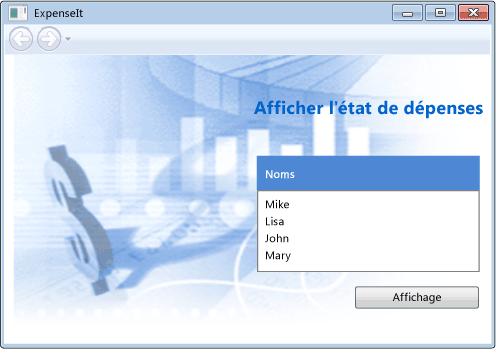

# Proc&#233;dure pas &#224; pas&#160;: mise en route de WPF
 Cette procédure pas à pas vous initie au développement d'une application [!INCLUDE[TLA#tla_wpf](../../../../includes/tlasharptla-wpf-md.md)] qui inclut des éléments communs à la plupart des applications [!INCLUDE[TLA2#tla_wpf](../../../../includes/tla2sharptla-wpf-md.md)] : balisage [!INCLUDE[TLA#tla_xaml](../../../../includes/tlasharptla-xaml-md.md)], code\-behind, définitions d'applications, contrôles, disposition, liaison de données et styles.  
  
 Cette procédure pas à pas vous explique le développement d'une application [!INCLUDE[TLA2#tla_wpf](../../../../includes/tla2sharptla-wpf-md.md)] simple, en vous guidant tout au long des étapes suivantes.  
  
-   Définition de [!INCLUDE[TLA2#tla_xaml](../../../../includes/tla2sharptla-xaml-md.md)] pour concevoir l'apparence de l'[!INCLUDE[TLA#tla_ui](../../../../includes/tlasharptla-ui-md.md)] de l'application.  
  
-   Écriture du code pour générer le comportement de l'application.  
  
-   Création d'une définition d'application pour gérer l'application.  
  
-   Ajout de contrôles et création de la disposition pour composer l'[!INCLUDE[TLA2#tla_ui](../../../../includes/tla2sharptla-ui-md.md)] de l'application.  
  
-   Création de styles pour garantir l'homogénéité de l'apparence de l'[!INCLUDE[TLA2#tla_ui](../../../../includes/tla2sharptla-ui-md.md)] de l'application.  
  
-   Liaison de l'[!INCLUDE[TLA2#tla_ui](../../../../includes/tla2sharptla-ui-md.md)] à des données pour remplir cette [!INCLUDE[TLA2#tla_ui](../../../../includes/tla2sharptla-ui-md.md)] à partir de données et assurer la synchronisation entre données et [!INCLUDE[TLA2#tla_ui](../../../../includes/tla2sharptla-ui-md.md)].  
  
 À la fin de la procédure pas à pas, vous aurez créé une application [!INCLUDE[TLA#tla_mswin](../../../../includes/tlasharptla-mswin-md.md)] autonome qui permet aux utilisateurs d'afficher des rapports de notes de frais pour certaines personnes.  L'application se composera de plusieurs pages [!INCLUDE[TLA2#tla_wpf](../../../../includes/tla2sharptla-wpf-md.md)] hébergées dans une fenêtre de style navigateur.  
  
 L'exemple de code utilisé pour générer cette procédure pas à pas est disponible pour [!INCLUDE[TLA#tla_visualb](../../../../includes/tlasharptla-visualb-md.md)] et [!INCLUDE[TLA#tla_cshrp](../../../../includes/tlasharptla-cshrp-md.md)] à l'adresse suivante : [Introduction à la génération d'applications Windows Presentation Foundation](http://go.microsoft.com/fwlink/?LinkID=160008).  
  
   
## Composants requis  
 Pour exécuter cette procédure pas à pas, vous devez disposer des composants suivants :  
  
-   [!INCLUDE[vs_dev11_long](../../../../includes/vs-dev11-long-md.md)]  
  
 Pour plus d'informations sur l'installation de [!INCLUDE[TLA2#tla_visualstu](../../../../includes/tla2sharptla-visualstu-md.md)], consultez [Installation de Visual Studio](../Topic/Install%20Visual%20Studio%202015.md).  
  
   
## Création du projet d'application  
 Dans cette section, vous créez l'infrastructure de l'application, qui inclut la définition d'application, deux pages et une image.  
  
1.  Créez un projet d'application WPF dans Visual Basic ou Visual C\# nommé `ExpenseIt`.  Pour plus d'informations, consultez [Comment : créer un projet d'application WPF](http://msdn.microsoft.com/fr-fr/1f6aea7a-33e1-4d3f-8555-1daa42e95d82).  
  
    > [!NOTE]
    >  Cette procédure pas à pas utilise le contrôle <xref:System.Windows.Controls.DataGrid> qui est disponible dans .NET Framework 4.  Assurez\-vous que votre projet cible .NET Framework 4.  Pour plus d'informations, consultez [Comment : cibler une version du .NET Framework](../Topic/How%20to:%20Target%20a%20Version%20of%20the%20.NET%20Framework.md).  
  
2.  Ouvrez Application.xaml \(Visual Basic\) ou App.xaml \(C\#\).  
  
     Ce fichier [!INCLUDE[TLA2#tla_xaml](../../../../includes/tla2sharptla-xaml-md.md)] définit une application [!INCLUDE[TLA2#tla_wpf](../../../../includes/tla2sharptla-wpf-md.md)] et toutes les ressources d'application. Vous utilisez également ce fichier pour spécifier l'[!INCLUDE[TLA2#tla_ui](../../../../includes/tla2sharptla-ui-md.md)] qui s'affiche automatiquement au démarrage de l'application ; dans ce cas, MainWindow.xaml.  
  
     Votre [!INCLUDE[TLA2#tla_xaml](../../../../includes/tla2sharptla-xaml-md.md)] doit ressembler à ceci en Visual Basic :  
  
     [!code-xml[ExpenseIt#1_A](../../../../samples/snippets/visualbasic/VS_Snippets_Wpf/ExpenseIt/VB/ExpenseIt1_A/Application.xaml#1_a)]  
  
     Ou à cela en C\# :  
  
     [!code-xml[ExpenseIt#1](../../../../samples/snippets/csharp/VS_Snippets_Wpf/ExpenseIt/CSharp/ExpenseIt/App.xaml#1)]  
  
3.  Ouvrez MainWindow.xaml.  
  
     Ce fichier [!INCLUDE[TLA2#tla_xaml](../../../../includes/tla2sharptla-xaml-md.md)] est la fenêtre principale de votre application et affiche le contenu créé en pages.  La classe <xref:System.Windows.Window> définit les propriétés d'une fenêtre, telle que son titre, sa taille ou son icône et gère les événements, tels que la fermeture ou le masquage.  
  
4.  Modifiez l'élément <xref:System.Windows.Window> en une <xref:System.Windows.Navigation.NavigationWindow>.  
  
     Cette application naviguera jusqu'au contenu différent selon l'interaction utilisateur.  Par conséquent, la <xref:System.Windows.Window> principale doit se transformer en une <xref:System.Windows.Navigation.NavigationWindow>.  <xref:System.Windows.Navigation.NavigationWindow> hérite de toutes les propriétés de <xref:System.Windows.Window>.  L'élément <xref:System.Windows.Navigation.NavigationWindow> dans le fichier XAML crée une instance de la classe <xref:System.Windows.Navigation.NavigationWindow>.  Pour plus d'informations, consultez [Vue d'ensemble de la navigation](../../../../docs/framework/wpf/app-development/navigation-overview.md).  
  
5.  Modifiez les propriétés suivantes sur l'élément <xref:System.Windows.Navigation.NavigationWindow> :  
  
    -   Affectez à la propriété <xref:System.Windows.Window.Title%2A> la valeur « ExpenseIt ».  
  
    -   Affectez à la propriété <xref:System.Windows.FrameworkElement.Width%2A> la valeur 500 pixels.  
  
    -   Affectez à la propriété <xref:System.Windows.FrameworkElement.Height%2A> la valeur 350 pixels.  
  
    -   Supprimez les éléments <xref:System.Windows.Controls.Grid> entre les balises <xref:System.Windows.Navigation.NavigationWindow>.  
  
     Votre [!INCLUDE[TLA2#tla_xaml](../../../../includes/tla2sharptla-xaml-md.md)] doit ressembler à ceci en Visual Basic :  
  
     [!code-xml[ExpenseIt#2_A](../../../../samples/snippets/visualbasic/VS_Snippets_Wpf/ExpenseIt/VB/ExpenseIt/MainWindow.xaml#2_a)]  
  
     Ou à cela en C\# :  
  
     [!code-xml[ExpenseIt#2](../../../../samples/snippets/csharp/VS_Snippets_Wpf/ExpenseIt/CSharp/ExpenseIt/MainWindow.xaml#2)]  
  
6.  Ouvrez MainWindow.xaml.vb ou MainWindow.xaml.cs.  
  
     Il s'agit d'un fichier code\-behind qui contiendra le code destiné à gérer les événements déclarés dans MainWindow.xaml.  Ce fichier contient une classe partielle pour la fenêtre définie en XAML.  
  
7.  Si vous utilisez C\#, modifiez la classe `MainWindow` à dériver de <xref:System.Windows.Navigation.NavigationWindow>.  
  
     En Visual Basic, cela se produit automatiquement lorsque vous modifiez la fenêtre en XAML.  
  
     Votre code doit se présenter comme suit.  
  
     [!code-csharp[ExpenseIt#3](../../../../samples/snippets/csharp/VS_Snippets_Wpf/ExpenseIt/CSharp/ExpenseIt/MainWindow.xaml.cs#3)]
     [!code-vb[ExpenseIt#3](../../../../samples/snippets/visualbasic/VS_Snippets_Wpf/ExpenseIt/VB/ExpenseIt1_A/MainWindow.xaml.vb#3)]  
  
   
## Ajout de fichiers à l'application  
 Dans cette section, vous ajoutez deux pages et une image à l'application.  
  
1.  Ajoutez une nouvelle page \(WPF\) au projet nommé `ExpenseItHome.xaml`.  Pour plus d'informations, consultez [Comment : ajouter de nouveaux éléments à un projet WPF](http://msdn.microsoft.com/fr-fr/17e6b238-fc32-4385-98ef-2f66ca09d9ad).  
  
     Cette page est la première page affichée lorsque l'application est lancée.  Elle affichera une liste de personnes que l'utilisateur pourra sélectionner pour afficher un rapport de note de frais correspondant.  
  
2.  Ouvrez ExpenseItHome.xaml.  
  
3.  Affectez au <xref:System.Windows.Controls.Page.Title%2A> la valeur « ExpenseIt \- Home ».  
  
     Votre [!INCLUDE[TLA2#tla_xaml](../../../../includes/tla2sharptla-xaml-md.md)] doit ressembler à ceci en Visual Basic :  
  
     [!code-xml[ExpenseIt#6_A](../../../../samples/snippets/visualbasic/VS_Snippets_Wpf/ExpenseIt/VB/ExpenseIt1_A/ExpenseItHome.xaml#6_a)]  
  
     Ou à cela en C\# :  
  
     [!code-xml[ExpenseIt#6](../../../../samples/snippets/csharp/VS_Snippets_Wpf/ExpenseIt/CSharp/ExpenseIt2/ExpenseItHome.xaml#6)]  
  
4.  Ouvrez MainWindow.xaml.  
  
5.  Affectez à la propriété <xref:System.Windows.Navigation.NavigationWindow.Source%2A> sur le <xref:System.Windows.Navigation.NavigationWindow> la valeur « ExpenseItHome.xaml ».  
  
     ExpenseItHome.xaml est ainsi définie comme la première page à s'ouvrir lorsque l'application démarre.  Votre [!INCLUDE[TLA2#tla_xaml](../../../../includes/tla2sharptla-xaml-md.md)] doit ressembler à ceci en Visual Basic :  
  
     [!code-xml[ExpenseIt#7_A](../../../../samples/snippets/visualbasic/VS_Snippets_Wpf/ExpenseIt/VB/ExpenseIt1_A/MainWindow.xaml#7_a)]  
  
     Ou à cela en C\# :  
  
     [!code-xml[ExpenseIt#7](../../../../samples/snippets/csharp/VS_Snippets_Wpf/ExpenseIt/CSharp/ExpenseIt2/MainWindow.xaml#7)]  
  
6.  Ajoutez une nouvelle page \(WPF\) au projet nommé `ExpenseReportPage.xaml`.  
  
     Cette page affichera la note de frais pour la personne sélectionnée dans ExpenseItHome.xaml.  
  
7.  Ouvrez ExpenseReportPage.xaml.  
  
8.  Affectez à <xref:System.Windows.Controls.Page.Title%2A> la valeur « ExpenseIt \- View Expense ».  
  
     Votre [!INCLUDE[TLA2#tla_xaml](../../../../includes/tla2sharptla-xaml-md.md)] doit ressembler à ceci en Visual Basic :  
  
     [!code-xml[ExpenseIt#4_A](../../../../samples/snippets/visualbasic/VS_Snippets_Wpf/ExpenseIt/VB/ExpenseIt1_A/ExpenseReportPage.xaml#4_a)]  
  
     Ou à cela en C\# :  
  
     [!code-xml[ExpenseIt#4](../../../../samples/snippets/csharp/VS_Snippets_Wpf/ExpenseIt/CSharp/ExpenseIt/ExpenseReportPage.xaml#4)]  
  
9. Ouvrez ExpenseItHome.xaml.vb et ExpenseReportPage.xaml.vb, ou ExpenseItHome.xaml.cs et ExpenseReportPage.xaml.cs.  
  
     Lorsque vous créez un nouveau fichier Page, Visual Studio crée automatiquement un fichier code\-behind.  Ces fichiers code\-behind gèrent la logique pour répondre à l'entrée d'utilisateur.  
  
     Votre code doit se présenter comme suit.  
  
     [!code-csharp[ExpenseIt#2_5](../../../../samples/snippets/csharp/VS_Snippets_Wpf/ExpenseIt/CSharp/ExpenseIt2/ExpenseItHome.xaml.cs#2_5)]
     [!code-vb[ExpenseIt#2_5](../../../../samples/snippets/visualbasic/VS_Snippets_Wpf/ExpenseIt/VB/ExpenseIt1_A/ExpenseItHome.xaml.vb#2_5)]  
  
     [!code-csharp[ExpenseIt#5](../../../../samples/snippets/csharp/VS_Snippets_Wpf/ExpenseIt/CSharp/ExpenseIt/ExpenseReportPage.xaml.cs#5)]
     [!code-vb[ExpenseIt#5](../../../../samples/snippets/visualbasic/VS_Snippets_Wpf/ExpenseIt/VB/ExpenseIt1_A/ExpenseReportPage.xaml.vb#5)]  
  
10. Ajoutez une image nommée watermark.png au projet.  Vous pouvez créer votre propre image ou copier le fichier du même nom depuis l'exemple de code.  Pour plus d'informations, consultez [NIB:How to: Add Existing Items to a Project](http://msdn.microsoft.com/fr-fr/15f4cfb7-78ab-457f-9f14-099a25a6a2d3).  
  
   
## Génération et exécution de l'application  
 Dans cette section, vous générez et exécutez l'application.  
  
1.  Générez et exécutez l'application en appuyant sur F5 ou sélectionnez **Démarrer le débogage** dans le menu **Déboguer**.  
  
     L'illustration suivante montre l'application avec les boutons <xref:System.Windows.Navigation.NavigationWindow>.  
  
       
  
2.  Fermez l'application à retourner à [!INCLUDE[vsprvs](../../../../includes/vsprvs-md.md)].  
  
   
## Création de la disposition  
 La disposition permet de placer les éléments de l'[!INCLUDE[TLA2#tla_ui](../../../../includes/tla2sharptla-ui-md.md)] de façon ordonnée et de gérer la taille et la position de ces éléments lors du redimensionnement d'une [!INCLUDE[TLA2#tla_ui](../../../../includes/tla2sharptla-ui-md.md)].  Généralement, vous créez une disposition au moyen de l'un des contrôles de disposition suivants :  
  
-   <xref:System.Windows.Controls.Canvas>  
  
-   <xref:System.Windows.Controls.DockPanel>  
  
-   <xref:System.Windows.Controls.Grid>  
  
-   <xref:System.Windows.Controls.StackPanel>  
  
-   <xref:System.Windows.Controls.VirtualizingStackPanel>  
  
-   <xref:System.Windows.Controls.WrapPanel>  
  
 Chacun de ces contrôles de disposition prend en charge un type spécial de disposition pour ses éléments enfants.  Les pages ExpenseIt peuvent être redimensionnées et chacune contient des éléments qui peuvent être disposés horizontalement et verticalement aux côtés d'autres éléments.  Par conséquent, la <xref:System.Windows.Controls.Grid> est l'élément de disposition idéal pour l'application.  
  
> [!NOTE]
>  Pour plus d'informations sur les éléments <xref:System.Windows.Controls.Panel>, consultez [Vue d'ensemble de Panel](../../../../docs/framework/wpf/controls/panels-overview.md).  Pour plus d'informations sur la disposition, consultez [Disposition](../../../../docs/framework/wpf/advanced/layout.md).  
  
 Dans la section, vous créez un tableau à une seule colonne et à trois lignes et avec une marge de 10 pixels en ajoutant des définitions de colonne et de ligne à la <xref:System.Windows.Controls.Grid> dans ExpenseItHome.xaml.  
  
1.  Ouvrez ExpenseItHome.xaml.  
  
2.  Affectez à la propriété <xref:System.Windows.FrameworkElement.Margin%2A> sur l'élément <xref:System.Windows.Controls.Grid> la valeur « 10,0,10,10 » qui correspond aux marges gauche, haute, droite et inférieure.  
  
3.  Ajoutez le [!INCLUDE[TLA2#tla_xaml](../../../../includes/tla2sharptla-xaml-md.md)] suivant entre les balises <xref:System.Windows.Controls.Grid> pour créer les définitions de colonne et ligne.  
  
     [!code-xml[ExpenseIt#8](../../../../samples/snippets/csharp/VS_Snippets_Wpf/ExpenseIt/CSharp/ExpenseIt3/ExpenseItHome.xaml#8)]  
  
     La <xref:System.Windows.Controls.RowDefinition.Height%2A> de deux lignes a la valeur <xref:System.Windows.GridLength.Auto%2A> qui signifie que les lignes seront classées selon la taille de base sur le contenu dans les lignes.  La <xref:System.Windows.Controls.RowDefinition.Height%2A> par défaut est dimensionnée via <xref:System.Windows.GridUnitType>, ce qui signifie que la ligne sera proportionnelle à l'espace disponible.  Par exemple, si chacune des deux lignes ont une hauteur de « \* », leur hauteur correspondra à la moitié de l'espace disponible.  
  
     Votre <xref:System.Windows.Controls.Grid> devrait maintenant ressembler au XAML suivant :  
  
     [!code-xml[ExpenseIt#9](../../../../samples/snippets/csharp/VS_Snippets_Wpf/ExpenseIt/CSharp/ExpenseIt3/ExpenseItHome.xaml#9)]  
  
   
## Ajout de contrôles  
 Dans cette section, vous mettez à jour l'[!INCLUDE[TLA2#tla_ui](../../../../includes/tla2sharptla-ui-md.md)] de la page d'accueil pour qu'elle affiche une liste de personnes parmi lesquelles les utilisateurs pourront sélectionner celle dont ils souhaitent afficher un rapport de note de frais.  Les contrôles sont des objets d'interface utilisateur qui permettent aux utilisateurs d'interagir avec votre application.  Pour plus d'informations, consultez [Contrôles](../../../../docs/framework/wpf/controls/index.md).  
  
 Pour créer cette [!INCLUDE[TLA2#tla_ui](../../../../includes/tla2sharptla-ui-md.md)], vous ajoutez les éléments suivants à ExpenseItHome.xaml :  
  
-   <xref:System.Windows.Controls.ListBox> \(pour une liste de personnes\).  
  
-   <xref:System.Windows.Controls.Label> \(pour l'en\-tête de liste\).  
  
-   <xref:System.Windows.Controls.Button> \(qui permettra de cliquer pour afficher la note de frais correspondant à la personne sélectionnée dans la liste\).  
  
 Chaque contrôle est placé dans une ligne de la <xref:System.Windows.Controls.Grid> en définissant la propriété jointe <xref:System.Windows.Controls.Grid.Row%2A?displayProperty=fullName>.  Pour plus d'informations sur les propriétés jointes, consultez [Vue d'ensemble des propriétés jointes](../../../../docs/framework/wpf/advanced/attached-properties-overview.md).  
  
1.  Ouvrez ExpenseItHome.xaml.  
  
2.  Ajoutez le code [!INCLUDE[TLA2#tla_xaml](../../../../includes/tla2sharptla-xaml-md.md)] suivant entre les balises <xref:System.Windows.Controls.Grid>.  
  
     [!code-xml[ExpenseIt#10](../../../../samples/snippets/csharp/VS_Snippets_Wpf/ExpenseIt/CSharp/ExpenseIt4/ExpenseItHome.xaml#10)]  
  
3.  Générez et exécutez l'application.  
  
 L'illustration suivante montre les contrôles créés par le XAML dans cette section.  
  
   
  
   
## Ajout d'une image et d'un titre  
 Dans cette section, vous mettez à jour l'[!INCLUDE[TLA2#tla_ui](../../../../includes/tla2sharptla-ui-md.md)] de la page d'accueil en ajoutant une image appropriée et un titre de page.  
  
1.  Ouvrez ExpenseItHome.xaml.  
  
2.  Ajoutez une autre colonne aux <xref:System.Windows.Controls.Grid.ColumnDefinitions%2A> avec une <xref:System.Windows.Controls.ColumnDefinition.Width%2A> fixe de 230 pixels.  
  
     [!code-xml[ExpenseIt#11](../../../../samples/snippets/csharp/VS_Snippets_Wpf/ExpenseIt/CSharp/ExpenseIt5/ExpenseItHome.xaml#11)]  
  
3.  Ajoutez une autre ligne aux <xref:System.Windows.Controls.Grid.RowDefinitions%2A>.  
  
     [!code-xml[ExpenseIt#11b](../../../../samples/snippets/csharp/VS_Snippets_Wpf/ExpenseIt/CSharp/ExpenseIt5/ExpenseItHome.xaml#11b)]  
  
4.  Déplacez les contrôles vers la deuxième colonne en affectant à <xref:System.Windows.Controls.Grid.Column%2A?displayProperty=fullName> la valeur 1.  Déplacez chaque contrôle d'une ligne vers le bas, en augmentant la <xref:System.Windows.Controls.Grid.Row%2A?displayProperty=fullName> d'1.  
  
     [!code-xml[ExpenseIt#12](../../../../samples/snippets/csharp/VS_Snippets_Wpf/ExpenseIt/CSharp/ExpenseIt5/ExpenseItHome.xaml#12)]  
  
5.  Définissez le <xref:System.Windows.Controls.Panel.Background%2A> de la <xref:System.Windows.Controls.Grid> afin qu'il soit le fichier image watermark.png.  
  
     [!code-xml[ExpenseIt#14](../../../../samples/snippets/csharp/VS_Snippets_Wpf/ExpenseIt/CSharp/ExpenseIt5/ExpenseItHome.xaml#14)]  
  
6.  Avant la <xref:System.Windows.Controls.Border>, ajoutez une <xref:System.Windows.Controls.Label> avec « View Expense Report » comme titre de page.  
  
     [!code-xml[ExpenseIt#13](../../../../samples/snippets/csharp/VS_Snippets_Wpf/ExpenseIt/CSharp/ExpenseIt5/ExpenseItHome.xaml#13)]  
  
7.  Générez et exécutez l'application.  
  
 L'illustration suivante présente les résultats de cette section.  
  
   
  
   
## Ajout de code pour gérer des événements  
  
1.  Ouvrez ExpenseItHome.xaml.  
  
2.  Ajoutez un gestionnaire d'événements <xref:System.Windows.Controls.Primitives.ButtonBase.Click> à l'élément <xref:System.Windows.Controls.Button>.  Pour plus d'informations, consultez [Comment : créer un gestionnaire d'événements simple](http://msdn.microsoft.com/fr-fr/b1456e07-9dec-4354-99cf-18666b64f480).  
  
     [!code-xml[ExpenseIt#15](../../../../samples/snippets/csharp/VS_Snippets_Wpf/ExpenseIt/CSharp/ExpenseIt6/ExpenseItHome.xaml#15)]  
  
3.  Ouvrez ExpenseItHome.xaml.vb ou ExpenseItHome.xaml.cs.  
  
4.  Ajoutez le code suivant au gestionnaire d'événements <xref:System.Windows.Controls.Primitives.ButtonBase.Click> qui permet à la fenêtre de naviguer jusqu'au fichier ExpenseReportPage.xaml.  
  
     [!code-csharp[ExpenseIt#16](../../../../samples/snippets/csharp/VS_Snippets_Wpf/ExpenseIt/CSharp/ExpenseIt6/ExpenseItHome.xaml.cs#16)]
     [!code-vb[ExpenseIt#16](../../../../samples/snippets/visualbasic/VS_Snippets_Wpf/ExpenseIt/VB/ExpenseIt6/ExpenseItHome.xaml.vb#16)]  
  
   
## Création de l'interface utilisateur pour ExpenseReportPage  
 ExpenseReportPage.xaml affiche la note de frais pour la personne sélectionnée dans ExpenseItHome.xaml.  Cette section ajoute des contrôles et crée l'[!INCLUDE[TLA2#tla_ui](../../../../includes/tla2sharptla-ui-md.md)] pour ExpenseReportPage.xaml.  Cette section ajoute aussi des couleurs d'arrière\-plan et de remplissage pour les divers éléments de l'[!INCLUDE[TLA2#tla_ui](../../../../includes/tla2sharptla-ui-md.md)].  
  
1.  Ouvrez ExpenseReportPage.xaml.  
  
2.  Ajoutez le XAML suivant entre les balises <xref:System.Windows.Controls.Grid>.  
  
     Cette interface utilisateur est semblable à celle créée sur ExpenseItHome.xaml, à l'exception du fait que les données de rapport s'affichent dans un <xref:System.Windows.Controls.DataGrid>.  
  
     [!code-xml[ExpenseIt#17](../../../../samples/snippets/csharp/VS_Snippets_Wpf/ExpenseIt/CSharp/ExpenseIt6/ExpenseReportPage.xaml#17)]  
  
3.  Générez et exécutez l'application.  
  
    > [!NOTE]
    >  Si une erreur indique que <xref:System.Windows.Controls.DataGrid> est introuvable ou n'existe pas, vérifiez que votre projet cible .NET Framework 4.  Pour plus d'informations, consultez [Comment : cibler une version du .NET Framework](../Topic/How%20to:%20Target%20a%20Version%20of%20the%20.NET%20Framework.md).  
  
4.  Cliquez sur le bouton **Afficher**.  
  
     La page de note de frais apparaît.  
  
 L'image suivante montre les éléments d'[!INCLUDE[TLA2#tla_ui](../../../../includes/tla2sharptla-ui-md.md)] ajoutés à ExpenseReportPage.xaml.  Remarquez que le bouton de navigation arrière est activé.  
  
   
  
   
## Application d'un style aux contrôles  
 L'apparence de différents éléments peut souvent être la même pour tous les éléments du même type dans une [!INCLUDE[TLA2#tla_ui](../../../../includes/tla2sharptla-ui-md.md)].  [!INCLUDE[TLA2#tla_ui](../../../../includes/tla2sharptla-ui-md.md)] utilise des styles pour permettre la réutilisation des apparences dans plusieurs éléments.  La possibilité de réutiliser des styles simplifie la création et la gestion du balisage [!INCLUDE[TLA2#tla_xaml](../../../../includes/tla2sharptla-xaml-md.md)].  Pour plus d'informations sur les styles, consultez [Application d'un style et création de modèles](../../../../docs/framework/wpf/controls/styling-and-templating.md).  Cette section remplace les attributs définis par des éléments définis au cours des étapes précédentes par des styles.  
  
1.  Ouvrez Application.xaml ou App.xaml.  
  
2.  Ajoutez le XAML suivant entre les balises <xref:System.Windows.Application.Resources%2A?displayProperty=fullName> :  
  
     [!code-xml[ExpenseIt#18](../../../../samples/snippets/csharp/VS_Snippets_Wpf/ExpenseIt/CSharp/ExpenseIt7/App.xaml#18)]  
  
     Cet [!INCLUDE[TLA2#tla_xaml](../../../../includes/tla2sharptla-xaml-md.md)] ajoute les styles suivants :  
  
    -   `headerTextStyle` : pour mettre en forme la <xref:System.Windows.Controls.Label> du titre de la page.  
  
    -   `labelStyle` : pour mettre en forme les contrôles <xref:System.Windows.Controls.Label>.  
  
    -   `columnHeaderStyle` : pour mettre en forme <xref:System.Windows.Controls.Primitives.DataGridColumnHeader>.  
  
    -   `listHeaderStyle` : pour mettre en forme les contrôles <xref:System.Windows.Controls.Border> de l'en\-tête de la liste.  
  
    -   `listHeaderTextStyle` : pour mettre en forme la <xref:System.Windows.Controls.Label> de l'en\-tête de la liste.  
  
    -   `buttonStyle` : pour mettre en forme le <xref:System.Windows.Controls.Button> sur ExpenseItHome.xaml.  
  
     Notez que les styles sont des ressources et des enfants de l'élément de propriété <xref:System.Windows.Application.Resources%2A?displayProperty=fullName>.  À cet endroit, les styles sont appliqués à tous les éléments d'une application.  Pour obtenir un exemple de l'utilisation des ressources dans une application [!INCLUDE[TLA2#tla_winfx](../../../../includes/tla2sharptla-winfx-md.md)], consultez [Utiliser des ressources d'application](../../../../docs/framework/wpf/advanced/how-to-use-application-resources.md).  
  
3.  Ouvrez ExpenseItHome.xaml.  
  
4.  Remplacez tout ce qu'il y a entre les éléments <xref:System.Windows.Controls.Grid> par le XAML suivant.  
  
     [!code-xml[ExpenseIt#19](../../../../samples/snippets/csharp/VS_Snippets_Wpf/ExpenseIt/CSharp/ExpenseIt7/ExpenseItHome.xaml#19)]  
  
     Les propriétés, telles que <xref:System.Windows.VerticalAlignment> et <xref:System.Windows.Media.FontFamily> qui définissent l'apparence de chaque contrôle, sont supprimées et remplacées en appliquant les styles.  Par exemple, le `headerTextStyle` est appliqué à la <xref:System.Windows.Controls.Label> « View Expense Report ».  
  
5.  Ouvrez ExpenseReportPage.xaml.  
  
6.  Remplacez tout ce qu'il y a entre les éléments <xref:System.Windows.Controls.Grid> par le XAML suivant.  
  
     [!code-xml[ExpenseIt#20](../../../../samples/snippets/csharp/VS_Snippets_Wpf/ExpenseIt/CSharp/ExpenseIt7/ExpenseReportPage.xaml#20)]  
  
     Cela ajoute des styles aux éléments <xref:System.Windows.Controls.Border> et <xref:System.Windows.Controls.Label>.  
  
7.  Générez et exécutez l'application.  
  
     Après l'ajout du balisage [!INCLUDE[TLA2#tla_xaml](../../../../includes/tla2sharptla-xaml-md.md)] dans cette section, l'application conserve l'apparence qu'elle avait avant la mise à jour à l'aide de styles.  
  
   
## Liaison de données à un contrôle  
 Dans cette section, vous créez les données [!INCLUDE[TLA#tla_xml](../../../../includes/tlasharptla-xml-md.md)] liées à différents contrôles.  
  
1.  Ouvrez ExpenseItHome.xaml.  
  
2.  Après l'ouverture de l'élément <xref:System.Windows.Controls.Grid>, ajoutez le XAML suivant pour créer un <xref:System.Windows.Data.XmlDataProvider> qui contient les données pour chaque personne.  
  
     Les données sont créées comme une ressource <xref:System.Windows.Controls.Grid>.  Normalement elles seraient chargées comme un fichier, mais par mesure de simplicité, les données sont ajoutées inline.  
  
     [!code-xml[ExpenseIt#21](../../../../samples/snippets/csharp/VS_Snippets_Wpf/ExpenseIt/CSharp/ExpenseIt8/ExpenseItHome.xaml#21)]  
    [!code-xml[ExpenseIt#23](../../../../samples/snippets/csharp/VS_Snippets_Wpf/ExpenseIt/CSharp/ExpenseIt8/ExpenseItHome.xaml#23)]  
    [!code-xml[ExpenseIt#22](../../../../samples/snippets/csharp/VS_Snippets_Wpf/ExpenseIt/CSharp/ExpenseIt8/ExpenseItHome.xaml#22)]  
  
3.  Dans la ressource <xref:System.Windows.Controls.Grid>, ajoutez le <xref:System.Windows.DataTemplate> suivant, qui définit la façon d'afficher les données dans le <xref:System.Windows.Controls.ListBox>.  Pour plus d'informations sur les modèles de données, consultez [Vue d'ensemble des modèles de données](../../../../docs/framework/wpf/data/data-templating-overview.md).  
  
     [!code-xml[ExpenseIt#21](../../../../samples/snippets/csharp/VS_Snippets_Wpf/ExpenseIt/CSharp/ExpenseIt8/ExpenseItHome.xaml#21)]  
    [!code-xml[ExpenseIt#24](../../../../samples/snippets/csharp/VS_Snippets_Wpf/ExpenseIt/CSharp/ExpenseIt8/ExpenseItHome.xaml#24)]  
    [!code-xml[ExpenseIt#22](../../../../samples/snippets/csharp/VS_Snippets_Wpf/ExpenseIt/CSharp/ExpenseIt8/ExpenseItHome.xaml#22)]  
  
4.  Remplacez la <xref:System.Windows.Controls.ListBox> existante par le XAML suivant.  
  
     [!code-xml[ExpenseIt#25](../../../../samples/snippets/csharp/VS_Snippets_Wpf/ExpenseIt/CSharp/ExpenseIt8/ExpenseItHome.xaml#25)]  
  
     Cet XAML lie la propriété <xref:System.Windows.Controls.ItemsControl.ItemsSource%2A> de la <xref:System.Windows.Controls.ListBox> à la source de données et applique le modèle de données en tant que <xref:System.Windows.Controls.ItemsControl.ItemTemplate%2A>.  
  
   
## Connexion des données à des contrôles  
 Dans cette section, vous écrivez le code qui récupère l'élément actuel sélectionné dans la liste de personnes sur la page ExpenseItHome.xaml et passez sa référence au constructeur de `ExpenseReportPage` pendant l'instanciation.  `ExpenseReportPage` définit son contexte de données avec l'élément passé, avec lequel les contrôles définis dans ExpenseReportPage.xaml vont établir la liaison.  
  
1.  Ouvrez ExpenseReportPage.xaml.vb ou ExpenseReportPage.xaml.cs.  
  
2.  Ajoutez un constructeur qui prend un objet de sorte que vous pouvez passer les données de note de frais de la personne sélectionnée.  
  
     [!code-csharp[ExpenseIt#26](../../../../samples/snippets/csharp/VS_Snippets_Wpf/ExpenseIt/CSharp/ExpenseIt8/ExpenseReportPage.xaml.cs#26)]
     [!code-vb[ExpenseIt#26](../../../../samples/snippets/visualbasic/VS_Snippets_Wpf/ExpenseIt/VB/ExpenseIt8/ExpenseReportPage.xaml.vb#26)]  
  
3.  Ouvrez ExpenseItHome.xaml.vb ou ExpenseItHome.xaml.cs.  
  
4.  Modifiez le gestionnaire d'événements <xref:System.Windows.Controls.Primitives.ButtonBase.Click> pour appeler le nouveau constructeur qui passe les données de note de frais de la personne sélectionnée.  
  
     [!code-csharp[ExpenseIt#27](../../../../samples/snippets/csharp/VS_Snippets_Wpf/ExpenseIt/CSharp/ExpenseIt8/ExpenseItHome.xaml.cs#27)]
     [!code-vb[ExpenseIt#27](../../../../samples/snippets/visualbasic/VS_Snippets_Wpf/ExpenseIt/VB/ExpenseIt8/ExpenseItHome.xaml.vb#27)]  
  
   
## Application d'un style aux données avec les modèles de données  
 Dans cette section, vous mettez à jour l'[!INCLUDE[TLA2#tla_ui](../../../../includes/tla2sharptla-ui-md.md)] pour chaque élément des listes de données liées au moyen de modèles de données.  
  
1.  Ouvrez ExpenseReportPage.xaml.  
  
2.  Liez le contenu des éléments <xref:System.Windows.Controls.Label> « Name » et « Department » à la propriété de la source de données appropriée.  Pour plus d'informations sur la liaison de données, consultez [Vue d'ensemble de la liaison de données](../../../../docs/framework/wpf/data/data-binding-overview.md).  
  
     [!code-xml[ExpenseIt#31](../../../../samples/snippets/csharp/VS_Snippets_Wpf/ExpenseIt/CSharp/ExpenseIt9/ExpenseReportPage.xaml#31)]  
  
3.  Une fois l'élément <xref:System.Windows.Controls.Grid> ouvert, ajoutez les modèles de données suivants, qui définissent la façon d'afficher les données de note de frais.  
  
     [!code-xml[ExpenseIt#30](../../../../samples/snippets/csharp/VS_Snippets_Wpf/ExpenseIt/CSharp/ExpenseIt9/ExpenseReportPage.xaml#30)]  
  
4.  Appliquez les modèles aux colonnes <xref:System.Windows.Controls.DataGrid> qui affichent les données de note de frais.  
  
     [!code-xml[ExpenseIt#32](../../../../samples/snippets/csharp/VS_Snippets_Wpf/ExpenseIt/CSharp/ExpenseIt9/ExpenseReportPage.xaml#32)]  
  
5.  Générez et exécutez l'application.  
  
6.  Sélectionnez une personne, puis cliquez sur le bouton **Afficher**.  
  
 L'illustration suivante montre les deux pages de l'application ExpenseIt une fois que les contrôles, la disposition, les styles, la liaison des données et les modèles de données ont été appliqués.  
  
   
  
   
## Meilleures pratiques  
 Cet exemple présente une fonctionnalité spécifique de WPF et, par conséquent, ne suit pas les meilleures pratiques de développement d'applications.  Pour obtenir un traitement complet des meilleures pratiques de développement d'applications [!INCLUDE[TLA2#tla_winclient](../../../../includes/tla2sharptla-winclient-md.md)] et [!INCLUDE[TLA2#tla_winfx](../../../../includes/tla2sharptla-winfx-md.md)], reportez\-vous, selon les cas, aux rubriques suivantes :  
  
-   Accessibilité \- [Meilleures pratiques d'accessibilité](../../../../docs/framework/ui-automation/accessibility-best-practices.md)  
  
-   Sécurité \- [Sécurité](../../../../docs/framework/wpf/security-wpf.md)  
  
-   Localisation \- [Vue d'ensemble de la globalisation et de la localisation WPF](../../../../docs/framework/wpf/advanced/wpf-globalization-and-localization-overview.md)  
  
-   Performances \- [Optimisation des performances des applications WPF](../../../../docs/framework/wpf/advanced/optimizing-wpf-application-performance.md)  
  
   
## Quoi d'autre ?  
 Vous disposez maintenant de plusieurs techniques vous permettant de créer une [!INCLUDE[TLA2#tla_ui](../../../../includes/tla2sharptla-ui-md.md)] avec [!INCLUDE[TLA#tla_winclient](../../../../includes/tlasharptla-winclient-md.md)] et vous avez une bonne connaissance des blocs de construction de base d'une application [!INCLUDE[TLA2#tla_winfx](../../../../includes/tla2sharptla-winfx-md.md)]liée à des données.  Cette rubrique n'est pas exhaustive mais nous espérons que vous avez maintenant une idée des possibilités que vous pouvez découvrir par vous\-même au\-delà des techniques qu'elle aborde.  
  
 Pour plus d'informations sur l'architecture et les modèles de programmation WPF, consultez les rubriques suivantes :  
  
-   [Architecture de WPF](../../../../docs/framework/wpf/advanced/wpf-architecture.md)  
  
-   [Vue d'ensemble du langage XAML \(WPF\)](../../../../docs/framework/wpf/advanced/xaml-overview-wpf.md)  
  
-   [Vue d'ensemble des propriétés de dépendance](../../../../docs/framework/wpf/advanced/dependency-properties-overview.md)  
  
-   [Disposition](../../../../docs/framework/wpf/advanced/layout.md)  
  
 Pour plus d'informations sur la création des applications, consultez les rubriques suivantes :  
  
-   [Développement de l'application](../../../../docs/framework/wpf/app-development/index.md)  
  
-   [Contrôles](../../../../docs/framework/wpf/controls/index.md)  
  
-   [Vue d'ensemble de la liaison de données](../../../../docs/framework/wpf/data/data-binding-overview.md)  
  
-   [Graphiques et multimédia](../../../../docs/framework/wpf/graphics-multimedia/index.md)  
  
-   [Documents dans WPF](../../../../docs/framework/wpf/advanced/documents-in-wpf.md)  
  
## Voir aussi  
 [Vue d'ensemble de Panel](../../../../docs/framework/wpf/controls/panels-overview.md)   
 [Vue d'ensemble des modèles de données](../../../../docs/framework/wpf/data/data-templating-overview.md)   
 [Génération d'une application WPF](../../../../docs/framework/wpf/app-development/building-a-wpf-application-wpf.md)   
 [Styles et modèles](../../../../docs/framework/wpf/controls/styles-and-templates.md)