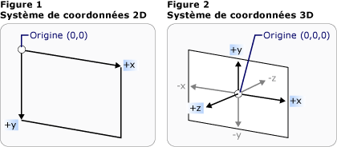
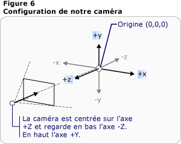
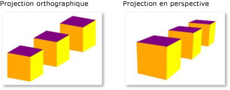

# Vue d'ensemble des graphiques 3D3-D Graphics Overview
La fonctionnalité [!INCLUDE[TLA2#tla_3d](../../../../includes/tla2sharptla-3d-md.md)] dans [!INCLUDE[TLA#tla_winclient](../../../../includes/tlasharptla-winclient-md.md)] permet aux développeurs de dessiner, transformer et animer des graphiques 3D avec du balisage et du code procédural. The [!INCLUDE[TLA2#tla_3d](../../../../includes/tla2sharptla-3d-md.md)] functionality in [!INCLUDE[TLA#tla_winclient](../../../../includes/tlasharptla-winclient-md.md)] enables developers to draw, transform, and animate 3-D graphics in both markup and procedural code. Les développeurs peuvent combiner les graphiques [!INCLUDE[TLA#tla_2d](../../../../includes/tlasharptla-2d-md.md)] et [!INCLUDE[TLA2#tla_3d](../../../../includes/tla2sharptla-3d-md.md)] pour créer des contrôles riches, fournir des illustrations complexes de données ou améliorer l’expérience utilisateur pour l’interface de l’application.Developers can combine [!INCLUDE[TLA#tla_2d](../../../../includes/tlasharptla-2d-md.md)] and [!INCLUDE[TLA2#tla_3d](../../../../includes/tla2sharptla-3d-md.md)] graphics to create rich controls, provide complex illustrations of data, or enhance the user experience of an application's interface. La prise en charge de [!INCLUDE[TLA2#tla_3d](../../../../includes/tla2sharptla-3d-md.md)] dans [!INCLUDE[TLA2#tla_winclient](../../../../includes/tla2sharptla-winclient-md.md)] n’est pas conçue pour fournir une plateforme de développement de jeu complète.[!INCLUDE[TLA2#tla_3d](../../../../includes/tla2sharptla-3d-md.md)] support in [!INCLUDE[TLA2#tla_winclient](../../../../includes/tla2sharptla-winclient-md.md)] is not designed to provide a full-featured game-development platform. Cette rubrique fournit une vue d’ensemble de la fonctionnalité [!INCLUDE[TLA#tla_3d](../../../../includes/tlasharptla-3d-md.md)] dans le système graphique [!INCLUDE[TLA2#tla_winclient](../../../../includes/tla2sharptla-winclient-md.md)].This topic provides an overview of [!INCLUDE[TLA#tla_3d](../../../../includes/tlasharptla-3d-md.md)] functionality in the [!INCLUDE[TLA2#tla_winclient](../../../../includes/tla2sharptla-winclient-md.md)] graphics system.  
 
  
   
## 3D dans un conteneur 2D3-D in a 2-D Container  
 [!INCLUDE[TLA2#tla_3d](../../../../includes/tla2sharptla-3d-md.md)]contenu graphique [!INCLUDE[TLA2#tla_winclient](../../../../includes/tla2sharptla-winclient-md.md)] est encapsulé dans un élément, <xref:System.Windows.Controls.Viewport3D>, qui peut participer à la structure de l’élément à deux dimensions. graphics content in [!INCLUDE[TLA2#tla_winclient](../../../../includes/tla2sharptla-winclient-md.md)] is encapsulated in an element, <xref:System.Windows.Controls.Viewport3D>, that can participate in the two-dimensional element structure. Le système graphique traite <xref:System.Windows.Controls.Viewport3D> comme un élément visuel à deux dimensions comme de nombreux autres dans [!INCLUDE[TLA2#tla_winclient](../../../../includes/tla2sharptla-winclient-md.md)].The graphics system treats <xref:System.Windows.Controls.Viewport3D> as a two-dimensional visual element like many others in [!INCLUDE[TLA2#tla_winclient](../../../../includes/tla2sharptla-winclient-md.md)]. <xref:System.Windows.Controls.Viewport3D>fonctionne comme une fenêtre, une fenêtre d’affichage, dans une scène 3D.<xref:System.Windows.Controls.Viewport3D> functions as a window—a viewport—into a three-dimensional scene. Plus précisément, c’est une surface sur laquelle une scène [!INCLUDE[TLA2#tla_3d](../../../../includes/tla2sharptla-3d-md.md)] est projetée.More accurately, it is a surface on which a [!INCLUDE[TLA2#tla_3d](../../../../includes/tla2sharptla-3d-md.md)] scene is projected.  
  
 Dans un conventionnelle [!INCLUDE[TLA2#tla_2d](../../../../includes/tla2sharptla-2d-md.md)] application, utilisez <xref:System.Windows.Controls.Viewport3D> comme vous le feriez pour un autre élément conteneur comme grille ou zone de dessin.In a conventional [!INCLUDE[TLA2#tla_2d](../../../../includes/tla2sharptla-2d-md.md)] application, use <xref:System.Windows.Controls.Viewport3D> as you would another container element like Grid or Canvas.  Bien que vous puissiez utiliser <xref:System.Windows.Controls.Viewport3D> avec d’autres [!INCLUDE[TLA2#tla_2d](../../../../includes/tla2sharptla-2d-md.md)] dessiner des objets dans le même graphique de scène, vous ne pouvez pas interpénétrer [!INCLUDE[TLA2#tla_2d](../../../../includes/tla2sharptla-2d-md.md)] et [!INCLUDE[TLA2#tla_3d](../../../../includes/tla2sharptla-3d-md.md)] objets au sein d’un <xref:System.Windows.Controls.Viewport3D>.Although you can use <xref:System.Windows.Controls.Viewport3D> with other [!INCLUDE[TLA2#tla_2d](../../../../includes/tla2sharptla-2d-md.md)] drawing objects in the same scene graph, you cannot interpenetrate [!INCLUDE[TLA2#tla_2d](../../../../includes/tla2sharptla-2d-md.md)] and [!INCLUDE[TLA2#tla_3d](../../../../includes/tla2sharptla-3d-md.md)] objects within a <xref:System.Windows.Controls.Viewport3D>.  Cette rubrique se concentrera sur comment dessiner [!INCLUDE[TLA2#tla_3d](../../../../includes/tla2sharptla-3d-md.md)] graphics à l’intérieur de la <xref:System.Windows.Controls.Viewport3D>.This topic will focus on how to draw [!INCLUDE[TLA2#tla_3d](../../../../includes/tla2sharptla-3d-md.md)] graphics inside the <xref:System.Windows.Controls.Viewport3D>.  
  
   
## Espace de coordonnées 3D3-D Coordinate Space  
 Le système de coordonnées [!INCLUDE[TLA2#tla_winclient](../../../../includes/tla2sharptla-winclient-md.md)] pour les graphiques [!INCLUDE[TLA2#tla_2d](../../../../includes/tla2sharptla-2d-md.md)] localise l’origine dans le coin supérieur gauche de la zone de rendu (en général l’écran).The [!INCLUDE[TLA2#tla_winclient](../../../../includes/tla2sharptla-winclient-md.md)] coordinate system for [!INCLUDE[TLA2#tla_2d](../../../../includes/tla2sharptla-2d-md.md)] graphics locates the origin in the upper left of the rendering area (typically the screen). Dans le système [!INCLUDE[TLA2#tla_2d](../../../../includes/tla2sharptla-2d-md.md)], les valeurs positives de l’axe des X continuent à droite et les valeurs positives de l’axe des Y positives continuent vers le bas.In the [!INCLUDE[TLA2#tla_2d](../../../../includes/tla2sharptla-2d-md.md)] system, positive x-axis values proceed to the right and positive y-axis values proceed downward.  Dans le système de coordonnées [!INCLUDE[TLA2#tla_3d](../../../../includes/tla2sharptla-3d-md.md)], toutefois, l’origine se trouve dans le centre de la zone de rendu, avec les valeurs positives de l’axe des X continuant à droite mais celles de l’axe des Y continuant vers le haut à la place, alors que les valeurs positives de l’axe des Z continuent vers l’extérieur à partir de l’origine, vers le visionneur.In the [!INCLUDE[TLA2#tla_3d](../../../../includes/tla2sharptla-3d-md.md)] coordinate system, however, the origin is located in the center of the rendering area, with positive x-axis values proceeding to the right but positive y-axis values proceeding upward instead, and positive z-axis values proceeding outward from the origin, toward the viewer.  
  
   
Représentations de système de coordonnées 2D et 3D classiquesConventional 2-D and 3-D coordinate system representations  
  
 L’espace défini par ces axes est le système de référence stationnaire pour les objets [!INCLUDE[TLA2#tla_3d](../../../../includes/tla2sharptla-3d-md.md)] dans [!INCLUDE[TLA2#tla_winclient](../../../../includes/tla2sharptla-winclient-md.md)].The space defined by these axes is the stationary frame of reference for [!INCLUDE[TLA2#tla_3d](../../../../includes/tla2sharptla-3d-md.md)] objects in [!INCLUDE[TLA2#tla_winclient](../../../../includes/tla2sharptla-winclient-md.md)]. Lorsque vous générez des modèles dans cet espace et créez des lumières et des caméras pour les consulter, il est utile de distinguer ce frame stationnaire de référence, ou « espace universel » du frame local de référence que vous créez pour chaque modèle lorsque vous lui appliquez des transformations.As you build models in this space and create lights and cameras to view them, it's helpful to distinguish this stationary frame of reference, or "world space," from the local frame of reference you create for each model when you apply transformations to it. N’oubliez également pas que les objets dans l’espace universel peuvent sembler entièrement différents, ou ne pas du tout être visibles, en fonction des paramètres de lumière et de caméra, mais que la position de la caméra ne modifie pas l’emplacement des objets dans l’espace universel.Remember also that objects in world space might look entirely different, or not be visible at all, depending on light and camera settings, but the position of the camera does not change the location of objects in world space.  
  
   
## Caméras et projectionsCameras and Projections  
 Les développeurs qui travaillent dans [!INCLUDE[TLA2#tla_2d](../../../../includes/tla2sharptla-2d-md.md)] sont habitués à positionner des primitives de dessin sur un écran à deux dimensions.Developers who work in [!INCLUDE[TLA2#tla_2d](../../../../includes/tla2sharptla-2d-md.md)] are accustomed to positioning drawing primitives on a two-dimensional screen. Lorsque vous créez une scène [!INCLUDE[TLA2#tla_3d](../../../../includes/tla2sharptla-3d-md.md)], il est important de vous rappeler que vous créez en fait une représentation [!INCLUDE[TLA2#tla_2d](../../../../includes/tla2sharptla-2d-md.md)] des objets [!INCLUDE[TLA2#tla_3d](../../../../includes/tla2sharptla-3d-md.md)].When you create a [!INCLUDE[TLA2#tla_3d](../../../../includes/tla2sharptla-3d-md.md)] scene, it's important to remember that you are really creating a [!INCLUDE[TLA2#tla_2d](../../../../includes/tla2sharptla-2d-md.md)] representation of [!INCLUDE[TLA2#tla_3d](../../../../includes/tla2sharptla-3d-md.md)] objects. Comme une scène [!INCLUDE[TLA2#tla_3d](../../../../includes/tla2sharptla-3d-md.md)] a un aspect différent en fonction de la perspective du spectateur, vous devez spécifier ce point de vue.Because a [!INCLUDE[TLA2#tla_3d](../../../../includes/tla2sharptla-3d-md.md)] scene looks different depending on the onlooker's point of view, you must specify that point of view. Le <xref:System.Windows.Media.Media3D.Camera> classe vous permet de spécifier ce point de vue pour une [!INCLUDE[TLA2#tla_3d](../../../../includes/tla2sharptla-3d-md.md)] scène.The <xref:System.Windows.Media.Media3D.Camera> class allows you to specify this point of view for a [!INCLUDE[TLA2#tla_3d](../../../../includes/tla2sharptla-3d-md.md)] scene.  
  
 Une autre façon de comprendre comment une scène [!INCLUDE[TLA2#tla_3d](../../../../includes/tla2sharptla-3d-md.md)] est représentée sur une surface [!INCLUDE[TLA2#tla_2d](../../../../includes/tla2sharptla-2d-md.md)] est de décrire la scène comme une projection sur la surface d’affichage.Another way to understand how a [!INCLUDE[TLA2#tla_3d](../../../../includes/tla2sharptla-3d-md.md)] scene is represented on a [!INCLUDE[TLA2#tla_2d](../../../../includes/tla2sharptla-2d-md.md)] surface is by describing the scene as a projection onto the viewing surface. Le <xref:System.Windows.Media.Media3D.ProjectionCamera> vous permet de spécifier des projections différentes et leurs propriétés pour modifier la manière dont le spectateur consulte [!INCLUDE[TLA2#tla_3d](../../../../includes/tla2sharptla-3d-md.md)] modèles.The <xref:System.Windows.Media.Media3D.ProjectionCamera> allows you to specify different projections and their properties to change how the onlooker sees [!INCLUDE[TLA2#tla_3d](../../../../includes/tla2sharptla-3d-md.md)] models. A <xref:System.Windows.Media.Media3D.PerspectiveCamera> spécifie une projection qui dessine en raccourci la scène.A <xref:System.Windows.Media.Media3D.PerspectiveCamera> specifies a projection that foreshortens the scene.  En d’autres termes, le <xref:System.Windows.Media.Media3D.PerspectiveCamera> propose la perspective de point de fuite.In other words, the <xref:System.Windows.Media.Media3D.PerspectiveCamera> provides vanishing-point perspective.  Vous pouvez spécifier la position de la caméra dans l’espace de coordonnées de la scène, la direction et le champ de vue pour la caméra, et un vecteur qui définit le sens de « haut » dans la scène.You can specify the position of the camera in the coordinate space of the scene, the direction and field of view for the camera, and a vector that defines the direction of "up" in the scene. Le diagramme suivant illustre le <xref:System.Windows.Media.Media3D.PerspectiveCamera>de projection.The following diagram illustrates the <xref:System.Windows.Media.Media3D.PerspectiveCamera>'s projection.  
  
 Le <xref:System.Windows.Media.Media3D.ProjectionCamera.NearPlaneDistance%2A> et <xref:System.Windows.Media.Media3D.ProjectionCamera.FarPlaneDistance%2A> propriétés de <xref:System.Windows.Media.Media3D.ProjectionCamera> limiter la plage de projection de la caméra.The <xref:System.Windows.Media.Media3D.ProjectionCamera.NearPlaneDistance%2A> and <xref:System.Windows.Media.Media3D.ProjectionCamera.FarPlaneDistance%2A> properties of <xref:System.Windows.Media.Media3D.ProjectionCamera> limit the range of the camera's projection. Étant donné que les caméras peuvent se trouver n’importe où dans la scène, il est possible de placer la caméra à l’intérieur d’un modèle ou très près d’un modèle, ce qui fait qu’il est difficile de bien distinguer les objets.Because cameras can be located anywhere in the scene, it's possible for the camera to be actually positioned inside a model or very near a model, making it hard to distinguish objects properly.  <xref:System.Windows.Media.Media3D.ProjectionCamera.NearPlaneDistance%2A>vous permet de spécifier une distance minimale à partir de la caméra au-delà de laquelle les objets ne seront pas dessinés.<xref:System.Windows.Media.Media3D.ProjectionCamera.NearPlaneDistance%2A> allows you to specify a minimum distance from the camera beyond which objects will not be drawn.  À l’inverse, <xref:System.Windows.Media.Media3D.ProjectionCamera.FarPlaneDistance%2A> vous permet de spécifier une distance de la caméra au-delà de laquelle les objets ne seront pas dessinés, ce qui garantit que les objets trop loin pour être reconnus ne sont pas inclus dans la scène.Conversely, <xref:System.Windows.Media.Media3D.ProjectionCamera.FarPlaneDistance%2A> lets you specify a distance from the camera beyond which objects will not be drawn, which ensures that objects too far away to be recognizable won't be included in the scene.  
  
   
Position d'une caméraCamera position  
  
 <xref:System.Windows.Media.Media3D.OrthographicCamera>Spécifie une projection orthographique d’un [!INCLUDE[TLA2#tla_3d](../../../../includes/tla2sharptla-3d-md.md)] modèle pour un [!INCLUDE[TLA2#tla_2d](../../../../includes/tla2sharptla-2d-md.md)] surface visuelle.<xref:System.Windows.Media.Media3D.OrthographicCamera> specifies an orthogonal projection of a [!INCLUDE[TLA2#tla_3d](../../../../includes/tla2sharptla-3d-md.md)] model to a [!INCLUDE[TLA2#tla_2d](../../../../includes/tla2sharptla-2d-md.md)] visual surface. Comme les autres caméras, elle spécifie une position, la direction d’affichage et la direction « vers le haut ».Like other cameras, it specifies a position, viewing direction, and "upward" direction. Contrairement aux <xref:System.Windows.Media.Media3D.PerspectiveCamera>, toutefois, <xref:System.Windows.Media.Media3D.OrthographicCamera> décrit une projection qui n’inclut pas de perspective.Unlike <xref:System.Windows.Media.Media3D.PerspectiveCamera>, however, <xref:System.Windows.Media.Media3D.OrthographicCamera> describes a projection that does not include perspective foreshortening. En d’autres termes, <xref:System.Windows.Media.Media3D.OrthographicCamera> décrit une zone d’affichage dont les côtés sont parallèles, au lieu d’un dont les côtés se rejoignent à un point de l’appareil photo.In other words, <xref:System.Windows.Media.Media3D.OrthographicCamera> describes a viewing box whose sides are parallel, instead of one whose sides meet in a point at the camera. L’illustration suivante montre le même modèle tel qu’affiché à l’aide de <xref:System.Windows.Media.Media3D.PerspectiveCamera> et <xref:System.Windows.Media.Media3D.OrthographicCamera>.The following image shows the same model as viewed using <xref:System.Windows.Media.Media3D.PerspectiveCamera> and <xref:System.Windows.Media.Media3D.OrthographicCamera>.  
  
   
Projections en perspective et orthographiquesPerspective and Orthographic Projections  
  
 Le code suivant montre des paramètres de caméra typiques.The following code shows some typical camera settings.  
  
 [!code-csharp[3dgallery_procedural_snip#Basic3DShapeCodeExampleInline1](../../../../samples/snippets/csharp/VS_Snippets_Wpf/3DGallery_procedural_snip/CSharp/Basic3DShapeExample.cs#basic3dshapecodeexampleinline1)]
 [!code-vb[3dgallery_procedural_snip#Basic3DShapeCodeExampleInline1](../../../../samples/snippets/visualbasic/VS_Snippets_Wpf/3DGallery_procedural_snip/visualbasic/basic3dshapeexample.vb#basic3dshapecodeexampleinline1)]  
  
   
## Modèle et primitives de maillageModel and Mesh Primitives  
  
 <xref:System.Windows.Media.Media3D.Model3D>est la classe de base abstraite qui représente un type générique [!INCLUDE[TLA2#tla_3d](../../../../includes/tla2sharptla-3d-md.md)] objet.<xref:System.Windows.Media.Media3D.Model3D> is the abstract base class that represents a generic [!INCLUDE[TLA2#tla_3d](../../../../includes/tla2sharptla-3d-md.md)] object. Pour générer un [!INCLUDE[TLA2#tla_3d](../../../../includes/tla2sharptla-3d-md.md)] scène, vous avez besoin de quelques objets à afficher, et les objets qui composent le graphique de scène dérivent <xref:System.Windows.Media.Media3D.Model3D>.To build a [!INCLUDE[TLA2#tla_3d](../../../../includes/tla2sharptla-3d-md.md)] scene, you need some objects to view, and the objects that make up the scene graph derive from <xref:System.Windows.Media.Media3D.Model3D>. Actuellement, le [!INCLUDE[TLA2#tla_winclient](../../../../includes/tla2sharptla-winclient-md.md)] prend en charge la modélisation des géométries avec <xref:System.Windows.Media.Media3D.GeometryModel3D>.Currently, the [!INCLUDE[TLA2#tla_winclient](../../../../includes/tla2sharptla-winclient-md.md)] supports modeling geometries with <xref:System.Windows.Media.Media3D.GeometryModel3D>. Le <xref:System.Windows.Media.Media3D.GeometryModel3D.Geometry%2A> propriété de ce modèle prend un maillage de base.The <xref:System.Windows.Media.Media3D.GeometryModel3D.Geometry%2A> property of this model takes a mesh primitive.  
  
 Pour générer un modèle, commencez par créer une primitive, ou maillage.To build a model, begin by building a primitive, or mesh. Une primitive [!INCLUDE[TLA2#tla_3d](../../../../includes/tla2sharptla-3d-md.md)] est une collection de sommets qui forment une seule entité [!INCLUDE[TLA2#tla_3d](../../../../includes/tla2sharptla-3d-md.md)].A [!INCLUDE[TLA2#tla_3d](../../../../includes/tla2sharptla-3d-md.md)] primitive is a collection of vertices that form a single [!INCLUDE[TLA2#tla_3d](../../../../includes/tla2sharptla-3d-md.md)] entity. La plupart des systèmes [!INCLUDE[TLA2#tla_3d](../../../../includes/tla2sharptla-3d-md.md)] fournissent des primitives modelées sur la figure fermée la plus simple : un triangle défini par trois sommets.Most [!INCLUDE[TLA2#tla_3d](../../../../includes/tla2sharptla-3d-md.md)] systems provide primitives modeled on the simplest closed figure: a triangle defined by three vertices.  Les trois points d’un triangle étant coplanaires, vous pouvez continuer à ajouter des triangles pour modeler des formes complexes, appelées mailles.Because the three points of a triangle are coplanar, you can continue adding triangles in order to model more complex shapes, called meshes.  
  
 Le [!INCLUDE[TLA2#tla_winclient](../../../../includes/tla2sharptla-winclient-md.md)] [!INCLUDE[TLA2#tla_3d](../../../../includes/tla2sharptla-3d-md.md)] système fournit actuellement les <xref:System.Windows.Media.Media3D.MeshGeometry3D> (classe), qui vous permet de spécifier n’importe quelle géométrie ; il ne prend pas en charge prédéfinis [!INCLUDE[TLA2#tla_3d](../../../../includes/tla2sharptla-3d-md.md)] primitives, tels que les domaines et les formulaires cubiques.The [!INCLUDE[TLA2#tla_winclient](../../../../includes/tla2sharptla-winclient-md.md)] [!INCLUDE[TLA2#tla_3d](../../../../includes/tla2sharptla-3d-md.md)] system currently provides the <xref:System.Windows.Media.Media3D.MeshGeometry3D> class, which allows you to specify any geometry; it does not currently support predefined [!INCLUDE[TLA2#tla_3d](../../../../includes/tla2sharptla-3d-md.md)] primitives like spheres and cubic forms. Commencer à créer un <xref:System.Windows.Media.Media3D.MeshGeometry3D> en spécifiant une liste des sommets de triangle comme sa <xref:System.Windows.Media.Media3D.MeshGeometry3D.Positions%2A> propriété.Begin creating a <xref:System.Windows.Media.Media3D.MeshGeometry3D> by specifying a list of triangle vertices as its <xref:System.Windows.Media.Media3D.MeshGeometry3D.Positions%2A> property. Chaque vertex est spécifié comme un <xref:System.Windows.Media.Media3D.Point3D>.Each vertex is specified as a <xref:System.Windows.Media.Media3D.Point3D>.  (Dans [!INCLUDE[TLA#tla_xaml](../../../../includes/tlasharptla-xaml-md.md)], spécifiez cette propriété comme une liste de nombres groupés par trois qui représentent les coordonnées de chaque sommet.) Selon sa géométrie, votre maillage peut être composé de nombreux triangles, certains d'entre eux partageant les mêmes angles (sommets).(In [!INCLUDE[TLA#tla_xaml](../../../../includes/tlasharptla-xaml-md.md)], specify this property as a list of numbers grouped in threes that represent the coordinates of each vertex.) Depending on its geometry, your mesh might be composed of many triangles, some of which share the same corners (vertices). Pour dessiner le maillage correctement, [!INCLUDE[TLA2#tla_winclient](../../../../includes/tla2sharptla-winclient-md.md)] a besoin d’informations sur les sommets qui sont partagés par les triangles respectifs.To draw the mesh correctly, the [!INCLUDE[TLA2#tla_winclient](../../../../includes/tla2sharptla-winclient-md.md)] needs information about which vertices are shared by which triangles. Vous fournissez ces informations en spécifiant une liste d’indices de triangle avec la <xref:System.Windows.Media.Media3D.MeshGeometry3D.TriangleIndices%2A> propriété.You provide this information by specifying a list of triangle indices with the <xref:System.Windows.Media.Media3D.MeshGeometry3D.TriangleIndices%2A> property. Cette liste spécifie l’ordre dans lequel les points spécifiés dans la <xref:System.Windows.Media.Media3D.MeshGeometry3D.Positions%2A> liste détermine un triangle.This list specifies the order in which the points specified in the <xref:System.Windows.Media.Media3D.MeshGeometry3D.Positions%2A> list will determine a triangle.  
  
 [!code-xaml[basic3d#Basic3DXAML3DN3](../../../../samples/snippets/xaml/VS_Snippets_Wpf/Basic3D/XAML/Window1.xaml#basic3dxaml3dn3)]  
  
 Dans l’exemple précédent, le <xref:System.Windows.Media.Media3D.MeshGeometry3D.Positions%2A> liste spécifie huit sommets pour définir un maillage en forme de cube.In the preceding example, the <xref:System.Windows.Media.Media3D.MeshGeometry3D.Positions%2A> list specifies eight vertices to define a cube-shaped mesh. Le <xref:System.Windows.Media.Media3D.MeshGeometry3D.TriangleIndices%2A> propriété spécifie une liste de douze groupes de trois index.The <xref:System.Windows.Media.Media3D.MeshGeometry3D.TriangleIndices%2A> property specifies a list of twelve groups of three indices.  Chaque nombre dans la liste fait référence à un offset dans le <xref:System.Windows.Media.Media3D.MeshGeometry3D.Positions%2A> liste.Each number in the list refers to an offset into the <xref:System.Windows.Media.Media3D.MeshGeometry3D.Positions%2A> list.  Par exemple, les trois premiers sommets spécifiés par la <xref:System.Windows.Media.Media3D.MeshGeometry3D.Positions%2A> liste sont (1,1,0), (0,1,0) et (0,0,0).For example, the first three vertices specified by the <xref:System.Windows.Media.Media3D.MeshGeometry3D.Positions%2A> list are (1,1,0), (0,1,0), and (0,0,0). Les trois premiers index spécifiés par le <xref:System.Windows.Media.Media3D.MeshGeometry3D.TriangleIndices%2A> liste sont 0, 2 et 1, qui correspond à la première, troisième et deuxième points dans le <xref:System.Windows.Media.Media3D.MeshGeometry3D.Positions%2A> liste.The first three indices specified by the <xref:System.Windows.Media.Media3D.MeshGeometry3D.TriangleIndices%2A> list are 0, 2, and 1, which correspond to the first, third, and second points in the <xref:System.Windows.Media.Media3D.MeshGeometry3D.Positions%2A> list. Par conséquent, le premier triangle qui compose le modèle de cube sera composé de (1,1,0) à (0,1,0) à (0,0,0), et les onze triangles restants seront déterminés de la même façon.As a result, the first triangle that makes up the cube model will be composed from (1,1,0) to (0,1,0) to  (0,0,0), and the remaining eleven triangles will be determined similarly.  
  
 Vous pouvez continuer la définition du modèle en spécifiant des valeurs pour le <xref:System.Windows.Media.Media3D.MeshGeometry3D.Normals%2A> et <xref:System.Windows.Media.Media3D.MeshGeometry3D.TextureCoordinates%2A> propriétés.You can continue defining the model by specifying values for the <xref:System.Windows.Media.Media3D.MeshGeometry3D.Normals%2A> and <xref:System.Windows.Media.Media3D.MeshGeometry3D.TextureCoordinates%2A> properties.  Pour restituer la surface du modèle, le système graphique a besoin d’informations sur la direction à laquelle la surface fait face sur tout triangle donné.To render the surface of the model, the graphics system needs information about which direction the surface is facing at any given triangle. Il utilise ces informations pour effectuer des calculs d’éclairage pour le modèle : les surfaces qui font face directement à une source de lumière apparaissent plus claires que celles inclinées par rapport à la lumière.It uses this information to make lighting calculations for the model: surfaces that face directly towards a light source appear brighter than those angled away from the light. Même si [!INCLUDE[TLA2#tla_winclient](../../../../includes/tla2sharptla-winclient-md.md)] peut déterminer les vecteurs normaux par défaut en utilisant les coordonnées de position, vous pouvez également spécifier différents vecteurs normaux pour reproduire approximativement l’apparence des surfaces courbes.Though the [!INCLUDE[TLA2#tla_winclient](../../../../includes/tla2sharptla-winclient-md.md)] can determine default normal vectors by using the position coordinates, you can also specify different normal vectors to approximate the appearance of curved surfaces.  
  
 Le <xref:System.Windows.Media.Media3D.MeshGeometry3D.TextureCoordinates%2A> propriété spécifie une collection de <xref:System.Windows.Point>qui indique au système graphique comment mapper les coordonnées qui déterminent la façon dont une texture est dessinée sur les sommets du maillage.The <xref:System.Windows.Media.Media3D.MeshGeometry3D.TextureCoordinates%2A> property specifies a collection of <xref:System.Windows.Point>s that tell the graphics system how to map the coordinates that determine how a texture is drawn to the vertices of the mesh. <xref:System.Windows.Media.Media3D.MeshGeometry3D.TextureCoordinates%2A>sont spécifiés comme une valeur comprise entre 0 et 1 (inclus).<xref:System.Windows.Media.Media3D.MeshGeometry3D.TextureCoordinates%2A> are specified as a value between zero and 1, inclusive.  Comme avec la <xref:System.Windows.Media.Media3D.MeshGeometry3D.Normals%2A> propriété, le système graphique peut calculer des coordonnées de texture par défaut, mais vous pouvez choisir de définir les coordonnées de texture différentes pour contrôler le mappage d’une texture qui inclut la partie d’un modèle extensible, par exemple.As with the <xref:System.Windows.Media.Media3D.MeshGeometry3D.Normals%2A> property, the graphics system can calculate default texture coordinates, but you might choose to set different texture coordinates to control the mapping of a texture that includes part of a repeating pattern, for example. Vous trouverez plus d’informations sur les coordonnées de texture dans les rubriques suivantes, ou dans le kit de développement managé Direct3D.More information about texture coordinates can be found in subsequent topics or in the Managed Direct3D SDK.  
  
 L’exemple suivant montre comment créer une face du modèle de cube en code procédural.The following example shows how to create one face of the cube model in procedural code. Notez que vous pouvez dessiner le cube entier comme un GeometryModel3D simple. Cet exemple dessine la face du cube en tant que modèle distinct pour appliquer ultérieurement des textures séparées à chaque face.Note that you can draw the entire cube as a single GeometryModel3D; this example draws the cube's face as a distinct model in order to apply separate textures to each face later.  
  
 [!code-csharp[3doverview#3DOverview3DN6](../../../../samples/snippets/csharp/VS_Snippets_Wpf/3DOverview/CSharp/Window1.xaml.cs#3doverview3dn6)]
 [!code-vb[3doverview#3DOverview3DN6](../../../../samples/snippets/visualbasic/VS_Snippets_Wpf/3DOverview/visualbasic/window1.xaml.vb#3doverview3dn6)]  
  
 [!code-csharp[3doverview#3DOverview3DN7](../../../../samples/snippets/csharp/VS_Snippets_Wpf/3DOverview/CSharp/Window1.xaml.cs#3doverview3dn7)]
 [!code-vb[3doverview#3DOverview3DN7](../../../../samples/snippets/visualbasic/VS_Snippets_Wpf/3DOverview/visualbasic/window1.xaml.vb#3doverview3dn7)]  
  
   
## Application de matériaux au modèleApplying Materials to the Model  
  
 Pour qu’une maille ressemble à un objet en trois dimensions, elle doit avoir une texture appliquée pour couvrir la surface définie par ses sommets et triangles afin de pouvoir être éclairée et projetée par la caméra.For a mesh to look like a three-dimensional object, it must have an applied texture to cover the surface defined by its vertices and triangles so it can be lit and projected by the camera. Dans [!INCLUDE[TLA2#tla_2d](../../../../includes/tla2sharptla-2d-md.md)], vous utilisez la <xref:System.Windows.Media.Brush> classe pour appliquer des couleurs, les modèles, les dégradés ou autre contenu visuel aux zones de l’écran.In [!INCLUDE[TLA2#tla_2d](../../../../includes/tla2sharptla-2d-md.md)], you use the <xref:System.Windows.Media.Brush> class to apply colors, patterns, gradients, or other visual content to areas of the screen.  L’apparence des objets [!INCLUDE[TLA2#tla_3d](../../../../includes/tla2sharptla-3d-md.md)], cependant, est une fonction du modèle d’éclairage, pas seulement de la couleur ou du modèle qui leur est appliqué.The appearance of [!INCLUDE[TLA2#tla_3d](../../../../includes/tla2sharptla-3d-md.md)] objects, however, is a function of the lighting model, not just of the color or pattern applied to them. Les objets réels reflètent différemment la lumière selon la qualité de leurs surfaces : les surfaces brillantes ne semblent pas si rugueuses que les surfaces mates, et certains objets semblent absorber la lumière alors que d’autres brillent.Real-world objects reflect light differently depending on the quality of their surfaces: glossy and shiny surfaces don't look the same as rough or matte surfaces, and some objects seem to absorb light while others glow. Vous pouvez appliquer les mêmes pinceaux aux objets [!INCLUDE[TLA2#tla_3d](../../../../includes/tla2sharptla-3d-md.md)] que ceux que vous pouvez appliquer aux objets [!INCLUDE[TLA2#tla_2d](../../../../includes/tla2sharptla-2d-md.md)], mais vous ne pouvez pas les appliquer directement.You can apply all the same brushes to [!INCLUDE[TLA2#tla_3d](../../../../includes/tla2sharptla-3d-md.md)] objects that you can apply to [!INCLUDE[TLA2#tla_2d](../../../../includes/tla2sharptla-2d-md.md)] objects, but you can't apply them directly.  
  
 Pour définir les caractéristiques de la surface d’un modèle, [!INCLUDE[TLA2#tla_winclient](../../../../includes/tla2sharptla-winclient-md.md)] utilise la <xref:System.Windows.Media.Media3D.Material> classe abstraite.To define the characteristics of a model's surface, [!INCLUDE[TLA2#tla_winclient](../../../../includes/tla2sharptla-winclient-md.md)] uses the <xref:System.Windows.Media.Media3D.Material> abstract class. Les sous-classes concrètes de Material déterminent certaines des caractéristiques d’apparence de la surface du modèle, et chacune fournit également une propriété Brush à laquelle vous pouvez passer un SolidColorBrush, TileBrush ou VisualBrush.The concrete subclasses of Material determine some of the appearance characteristics of the model's surface, and each also provides a Brush property to which you can pass a SolidColorBrush, TileBrush, or VisualBrush.  
  
-   <xref:System.Windows.Media.Media3D.DiffuseMaterial>Spécifie que le pinceau sera appliqué au modèle comme si ce modèle était allumé indirectement.<xref:System.Windows.Media.Media3D.DiffuseMaterial> specifies that the brush will be applied to the model as though that model were lit diffusely. L’utilisation de DiffuseMaterial est très semblable à celle de pinceaux directement sur les modèles [!INCLUDE[TLA2#tla_2d](../../../../includes/tla2sharptla-2d-md.md)] ; les surfaces de modèle ne reflètent pas la lumière même si elles sont brillantes.Using DiffuseMaterial most resembles using brushes directly on [!INCLUDE[TLA2#tla_2d](../../../../includes/tla2sharptla-2d-md.md)] models; model surfaces do not reflect light as though shiny.  
  
-   <xref:System.Windows.Media.Media3D.SpecularMaterial>Spécifie que le pinceau sera appliqué au modèle comme si la surface du modèle était dure ou brillante, capable de refléter des surbrillances.<xref:System.Windows.Media.Media3D.SpecularMaterial> specifies that the brush will be applied to the model as though the model's surface were hard or shiny, capable of reflecting highlights. Vous pouvez définir le degré auquel la texture suggérera cette qualité réfléchissante, ou « brillant », en spécifiant une valeur pour le <xref:System.Windows.Media.Media3D.SpecularMaterial.SpecularPower%2A> propriété.You can set the degree to which the texture will suggest this reflective quality, or "shine," by specifying a value for the <xref:System.Windows.Media.Media3D.SpecularMaterial.SpecularPower%2A> property.  
  
-   <xref:System.Windows.Media.Media3D.EmissiveMaterial>vous permet de spécifier que la texture sera appliquée comme si le modèle émettait une lumière égale à la couleur du pinceau.<xref:System.Windows.Media.Media3D.EmissiveMaterial> allows you to specify that the texture will be applied as though the model were emitting light equal to the color of the brush. Cela ne fait pas du modèle un éclairage. Toutefois, il participera différemment à l’ombrage que s’il était texturé avec DiffuseMaterial ou SpecularMaterial.This does not make the model a light; however, it will participate differently in shadowing than it would if textured with DiffuseMaterial or SpecularMaterial.  
  
 Pour de meilleures performances, les faces arrière d’un <xref:System.Windows.Media.Media3D.GeometryModel3D> (ces faces qui sont hors de l’affichage, car elles sont sur le côté opposé du modèle à partir de la caméra) sont éliminées de la scène.For better performance, the backfaces of a <xref:System.Windows.Media.Media3D.GeometryModel3D> (those faces that are out of view because they are on the opposite side of the model from the camera) are culled from the scene.  Pour spécifier un <xref:System.Windows.Media.Media3D.Material> pour appliquer à la face arrière d’un modèle comme un plan, définissez du modèle <xref:System.Windows.Media.Media3D.GeometryModel3D.BackMaterial%2A> propriété.To specify a <xref:System.Windows.Media.Media3D.Material> to apply to the backface of a model like a plane, set the model's <xref:System.Windows.Media.Media3D.GeometryModel3D.BackMaterial%2A> property.  
  
 Pour obtenir certaines qualités de surface, comme les effets lumineux ou de miroir, vous souhaiterez appliquer plusieurs pinceaux différents à un modèle à la suite.To achieve some surface qualities, like glowing or reflective effects, you might want to apply several different brushes to a model in succession. Vous pouvez appliquer et réutiliser plusieurs matières à l’aide de la <xref:System.Windows.Media.Media3D.MaterialGroup> classe.You can apply and reuse multiple Materials by using the <xref:System.Windows.Media.Media3D.MaterialGroup> class. Les enfants du MaterialGroup sont appliqués du premier au dernier en plusieurs passes de rendu.The children of the MaterialGroup are applied first to last in multiple rendering passes.  
  
 Les exemples de code suivants montrent comment appliquer une couleur unie et un dessin en tant que pinceaux sur les modèles [!INCLUDE[TLA2#tla_3d](../../../../includes/tla2sharptla-3d-md.md)].The following code examples show how to apply a solid color and a drawing as brushes to [!INCLUDE[TLA2#tla_3d](../../../../includes/tla2sharptla-3d-md.md)] models.  
  
 [!code-xaml[basic3d#Basic3DXAML3DN5](../../../../samples/snippets/xaml/VS_Snippets_Wpf/Basic3D/XAML/Window1.xaml#basic3dxaml3dn5)]  
  
 [!code-xaml[3doverview#3DOverview3DN9](../../../../samples/snippets/csharp/VS_Snippets_Wpf/3DOverview/CSharp/app.xaml#3doverview3dn9)]  
  
 [!code-csharp[3doverview#3DOverview3DN8](../../../../samples/snippets/csharp/VS_Snippets_Wpf/3DOverview/CSharp/Window1.xaml.cs#3doverview3dn8)]
 [!code-vb[3doverview#3DOverview3DN8](../../../../samples/snippets/visualbasic/VS_Snippets_Wpf/3DOverview/visualbasic/window1.xaml.vb#3doverview3dn8)]  
  
   
## Éclairage de la scèneIlluminating the Scene  
 Les lumières dans les graphiques [!INCLUDE[TLA2#tla_3d](../../../../includes/tla2sharptla-3d-md.md)] font ce que les lumières font dans le monde réel : elles rendent des surfaces visibles.Lights in [!INCLUDE[TLA2#tla_3d](../../../../includes/tla2sharptla-3d-md.md)] graphics do what lights do in the real world: they make surfaces visible. Plus précisément, les lumières déterminent la partie d’une scène qui figurera dans la projection.More to the point, lights determine what part of a scene will be included in the projection. Les objets de lumière dans [!INCLUDE[TLA2#tla_winclient](../../../../includes/tla2sharptla-winclient-md.md)] créent divers effets de lumière et d’ombre et sont modelés d’après le comportement de diverses lumières réelles.Light objects in [!INCLUDE[TLA2#tla_winclient](../../../../includes/tla2sharptla-winclient-md.md)] create a variety of light and shadow effects and are modeled after the behavior of various real-world lights. Vous devez inclure au moins une lumière dans votre scène, sans quoi aucun modèle ne sera visible.You must include at least one light in your scene, or no models will be visible.  
  
 Lumières suivantes dérivent de la classe de base <xref:System.Windows.Media.Media3D.Light>:The following lights derive from the base class <xref:System.Windows.Media.Media3D.Light>:  
  
-   <xref:System.Windows.Media.Media3D.AmbientLight>: Fournit une lumière ambiante qui éclaire tous les objets de manière uniforme, quelle que soit leur emplacement ou orientation.<xref:System.Windows.Media.Media3D.AmbientLight>: Provides ambient lighting that illuminates all objects uniformly regardless of their location or orientation.  
  
-   <xref:System.Windows.Media.Media3D.DirectionalLight>: Éclaire comme une source de lumière distante.<xref:System.Windows.Media.Media3D.DirectionalLight>: Illuminates like a distant light source.  Les lumières directionnelles ont un <xref:System.Windows.Media.Media3D.DirectionalLight.Direction%2A> spécifié comme un Vector3D, mais aucun emplacement spécifié.Directional lights have a <xref:System.Windows.Media.Media3D.DirectionalLight.Direction%2A> specified as a Vector3D, but no specified location.  
  
-   <xref:System.Windows.Media.Media3D.PointLight>: Éclaire comme une source de lumière proche.<xref:System.Windows.Media.Media3D.PointLight>: Illuminates like a nearby light source. Les PointLights ont une position et convertissent la lumière à partir de cette position.PointLights have a position and cast light from that position. Les objets dans la scène sont éclairés en fonction de leur position et de la distance par rapport à la lumière.Objects in the scene are illuminated depending on their position and distance with respect to the light. <xref:System.Windows.Media.Media3D.PointLightBase>expose un <xref:System.Windows.Media.Media3D.PointLightBase.Range%2A> propriété qui détermine une distance au-delà de laquelle les modèles ne seront pas éclairés par la lumière.<xref:System.Windows.Media.Media3D.PointLightBase> exposes a <xref:System.Windows.Media.Media3D.PointLightBase.Range%2A> property, which determines a distance beyond which models will not be illuminated by the light. PointLight expose également des propriétés d’atténuation qui déterminent comment l’intensité lumineuse diminue sur la distance.PointLight also exposes attenuation properties which determine how the light's intensity diminishes over distance. Vous pouvez spécifier des interpolations constantes, linéaires ou quadratiques pour l’atténuation de la lumière.You can specify constant, linear, or quadratic interpolations for the light's attenuation.  
  
-   <xref:System.Windows.Media.Media3D.SpotLight>: Hérite <xref:System.Windows.Media.Media3D.PointLight>.<xref:System.Windows.Media.Media3D.SpotLight>: Inherits from <xref:System.Windows.Media.Media3D.PointLight>. Les Spotlights éclairent comme PointLight et ont une position et une direction.Spotlights illuminate like PointLight and have both position and direction. Ils projettent la lumière dans une zone de forme conique définie par <xref:System.Windows.Media.Media3D.SpotLight.InnerConeAngle%2A> et <xref:System.Windows.Media.Media3D.SpotLight.OuterConeAngle%2A> propriétés, spécifiées en degrés.They project light in a cone-shaped area set by <xref:System.Windows.Media.Media3D.SpotLight.InnerConeAngle%2A> and <xref:System.Windows.Media.Media3D.SpotLight.OuterConeAngle%2A> properties, specified in degrees.  
  
 Témoins lumineux sont <xref:System.Windows.Media.Media3D.Model3D> des objets, vous pouvez donc transformer et animer des propriétés de lumière, y compris la position, de couleur, de direction et de plage.Lights are <xref:System.Windows.Media.Media3D.Model3D> objects, so you can transform and animate light properties, including position, color, direction, and range.  
  
 [!code-xaml[hittest3d#HitTest3D3DN6](../../../../samples/snippets/csharp/VS_Snippets_Wpf/HitTest3D/CSharp/Window1.xaml#hittest3d3dn6)]  
  
 [!code-csharp[basic3d#Basic3D3DN11](../../../../samples/snippets/csharp/VS_Snippets_Wpf/Basic3D/CSharp/Window1.xaml.cs#basic3d3dn11)]
 [!code-vb[basic3d#Basic3D3DN11](../../../../samples/snippets/visualbasic/VS_Snippets_Wpf/Basic3D/visualbasic/window1.xaml.vb#basic3d3dn11)]  
  
 [!code-csharp[basic3d#Basic3D3DN12](../../../../samples/snippets/csharp/VS_Snippets_Wpf/Basic3D/CSharp/Window1.xaml.cs#basic3d3dn12)]
 [!code-vb[basic3d#Basic3D3DN12](../../../../samples/snippets/visualbasic/VS_Snippets_Wpf/Basic3D/visualbasic/window1.xaml.vb#basic3d3dn12)]  
  
 [!code-csharp[basic3d#Basic3D3DN13](../../../../samples/snippets/csharp/VS_Snippets_Wpf/Basic3D/CSharp/Window1.xaml.cs#basic3d3dn13)]
 [!code-vb[basic3d#Basic3D3DN13](../../../../samples/snippets/visualbasic/VS_Snippets_Wpf/Basic3D/visualbasic/window1.xaml.vb#basic3d3dn13)]  
  
   
## Transformation de modèlesTransforming Models  
 Lorsque vous créez des modèles, ils ont un emplacement particulier dans la scène.When you create models, they have a particular location in the scene. Pour déplacer ces modèles dans la scène, pour les faire pivoter ou pour modifier leur taille, il n’est pas pratique de modifier les vertex qui définissent les modèles eux-mêmes.To move those models around in the scene, to rotate them, or to change their size, it's not practical to change the vertices that define the models themselves.  Au lieu de cela, tout comme dans [!INCLUDE[TLA2#tla_2d](../../../../includes/tla2sharptla-2d-md.md)], vous appliquez des transformations aux modèles.Instead, just as in [!INCLUDE[TLA2#tla_2d](../../../../includes/tla2sharptla-2d-md.md)], you apply transformations to models.  
  
 Chaque objet modèle a une <xref:System.Windows.Media.Media3D.Model3D.Transform%2A> propriété avec laquelle vous pouvez déplacer, réorienter ou redimensionner le modèle.Each model object has a <xref:System.Windows.Media.Media3D.Model3D.Transform%2A> property with which you can move, re-orient, or resize the model.  Lorsque vous appliquez une transformation, vous décalez tous les points du modèle par le vecteur ou la valeur que la transformation spécifie.When you apply a transform, you effectively offset all the points of the model by whatever vector or value specified by the transform. En d’autres termes, vous avez transformé l’espace de coordonnées dans lequel le modèle est défini (« espace de modèle »), mais vous n’avez pas modifié les valeurs qui composent la géométrie du modèle dans le système de coordonnées de la scène entière (« espace universel »).In other words, you've transformed the coordinate space in which the model is defined ("model space"), but you haven't changed the values that make up the model's geometry in the coordinate system of the entire scene ("world space").  
  
 Pour plus d’informations sur la transformation de modèles, consultez [Vue d'ensemble des transformations 3D](../../../../docs/framework/wpf/graphics-multimedia/3-d-transformations-overview.md).For more information about transforming models, see [3-D Transformations Overview](../../../../docs/framework/wpf/graphics-multimedia/3-d-transformations-overview.md).  
  
   
## Animation de modèlesAnimating Models  
 Le [!INCLUDE[TLA2#tla_winclient](../../../../includes/tla2sharptla-winclient-md.md)] [!INCLUDE[TLA2#tla_3d](../../../../includes/tla2sharptla-3d-md.md)] implémentation est inclus dans le même système de minutage et d’animation que [!INCLUDE[TLA2#tla_2d](../../../../includes/tla2sharptla-2d-md.md)] graphics.The [!INCLUDE[TLA2#tla_winclient](../../../../includes/tla2sharptla-winclient-md.md)] [!INCLUDE[TLA2#tla_3d](../../../../includes/tla2sharptla-3d-md.md)] implementation participates in the same timing and animation system as [!INCLUDE[TLA2#tla_2d](../../../../includes/tla2sharptla-2d-md.md)] graphics. En d’autres termes, pour animer une scène 3D, animez les propriétés de ses modèles.In other words, to animate a 3-D scene, animate the properties of its models. Il est possible d’animer directement des propriétés de primitives, mais il est généralement plus facile d’animer des transformations qui modifient la position ou l’apparence de modèles.It's possible to animate properties of primitives directly, but it's typically easier to animate transformations that change the position or appearance of models. Étant donné que les transformations peuvent être appliquées aux <xref:System.Windows.Media.Media3D.Model3DGroup> des objets, ainsi que des modèles individuels, il est possible d’appliquer un ensemble d’animations à un enfant d’un Model3DGroup et un autre ensemble d’animations à un groupe d’objets enfants.Because transformations can be applied to <xref:System.Windows.Media.Media3D.Model3DGroup> objects as well as individual models, it's possible to apply one set of animations to a child of a Model3DGroup and another set of animations to a group of child objects. Vous pouvez également obtenir divers effets visuels en animant les propriétés d’éclairage de votre scène.You can also achieve a variety of visual effects by animating the properties of your scene's lighting. Enfin, vous pouvez choisir d’animer la projection elle-même en animant la position d’une caméra ou un champ de vue.Finally, you might choose to animate the projection itself by animating the camera position or field of view. Pour plus d’informations sur le minutage [!INCLUDE[TLA2#tla_winclient](../../../../includes/tla2sharptla-winclient-md.md)] et le système d’animation, consultez les rubriques [Vue d'ensemble de l'animation](../../../../docs/framework/wpf/graphics-multimedia/animation-overview.md), [Vue d'ensemble des storyboards](../../../../docs/framework/wpf/graphics-multimedia/storyboards-overview.md) et [Vue d'ensemble des objets Freezable](../../../../docs/framework/wpf/advanced/freezable-objects-overview.md).For background information on the [!INCLUDE[TLA2#tla_winclient](../../../../includes/tla2sharptla-winclient-md.md)] timing and animation system, see the [Animation Overview](../../../../docs/framework/wpf/graphics-multimedia/animation-overview.md), [Storyboards Overview](../../../../docs/framework/wpf/graphics-multimedia/storyboards-overview.md), and [Freezable Objects Overview](../../../../docs/framework/wpf/advanced/freezable-objects-overview.md) topics.  
  
 Pour animer un objet dans [!INCLUDE[TLA2#tla_winclient](../../../../includes/tla2sharptla-winclient-md.md)], vous créez une chronologie, définissez une animation (qui est en fait une modification de valeur de propriété dans le temps) et spécifiez la propriété à laquelle appliquer l’animation.To animate an object in [!INCLUDE[TLA2#tla_winclient](../../../../includes/tla2sharptla-winclient-md.md)], you create a timeline, define an animation (which is really a change in some property value over time), and specify the property to which to apply the animation. Étant donné que tous les objets dans une [!INCLUDE[TLA2#tla_3d](../../../../includes/tla2sharptla-3d-md.md)] scène sont des enfants de <xref:System.Windows.Controls.Viewport3D>, les propriétés ciblées par toute animation que vous souhaitez appliquer à la scène sont des propriétés de Viewport3D.Because all the objects in a [!INCLUDE[TLA2#tla_3d](../../../../includes/tla2sharptla-3d-md.md)] scene are children of <xref:System.Windows.Controls.Viewport3D>, the properties targeted by any animation you want to apply to the scene are properties of properties of Viewport3D.  
  
 Supposons que vous souhaitez faire osciller un modèle.Suppose you want to make a model appear to wobble in place. Vous pouvez choisir d’appliquer un <xref:System.Windows.Media.Media3D.RotateTransform3D> au modèle et d’animer l’axe de sa rotation d’un vecteur à un autre.You might choose to apply a <xref:System.Windows.Media.Media3D.RotateTransform3D> to the model, and animate the axis of its rotation from one vector to another. L’exemple de code suivant montre comment appliquer une Vector3DAnimation à la propriété Axis de la Rotation3D de la transformation, en supposant que RotateTransform3D est une des multiples transformations appliquées au modèle avec un TransformGroup.The following code example demonstrates applying a Vector3DAnimation to the Axis property of the transformation's Rotation3D, assuming the RotateTransform3D to be one of several transforms applied to the model with a TransformGroup.  
  
 [!code-csharp[3doverview#3DOverview3DN1](../../../../samples/snippets/csharp/VS_Snippets_Wpf/3DOverview/CSharp/Window1.xaml.cs#3doverview3dn1)]
 [!code-vb[3doverview#3DOverview3DN1](../../../../samples/snippets/visualbasic/VS_Snippets_Wpf/3DOverview/visualbasic/window1.xaml.vb#3doverview3dn1)]  
  
 [!code-csharp[3doverview#3DOverview3DN3](../../../../samples/snippets/csharp/VS_Snippets_Wpf/3DOverview/CSharp/Window1.xaml.cs#3doverview3dn3)]
 [!code-vb[3doverview#3DOverview3DN3](../../../../samples/snippets/visualbasic/VS_Snippets_Wpf/3DOverview/visualbasic/window1.xaml.vb#3doverview3dn3)]  
  
 [!code-csharp[3doverview#3DOverview3DN4](../../../../samples/snippets/csharp/VS_Snippets_Wpf/3DOverview/CSharp/Window1.xaml.cs#3doverview3dn4)]
 [!code-vb[3doverview#3DOverview3DN4](../../../../samples/snippets/visualbasic/VS_Snippets_Wpf/3DOverview/visualbasic/window1.xaml.vb#3doverview3dn4)]  
  
 [!code-csharp[3doverview#3DOverview3DN5](../../../../samples/snippets/csharp/VS_Snippets_Wpf/3DOverview/CSharp/Window1.xaml.cs#3doverview3dn5)]
 [!code-vb[3doverview#3DOverview3DN5](../../../../samples/snippets/visualbasic/VS_Snippets_Wpf/3DOverview/visualbasic/window1.xaml.vb#3doverview3dn5)]  
  
   
## Ajouter du contenu 3D à la fenêtreAdd 3-D Content to the Window  
 Pour restituer la scène, ajoutez des modèles et les témoins lumineux à un <xref:System.Windows.Media.Media3D.Model3DGroup>, puis définissez le <xref:System.Windows.Media.Media3D.Model3DGroup> comme le <xref:System.Windows.Media.Media3D.ModelVisual3D.Content%2A> d’un <xref:System.Windows.Media.Media3D.ModelVisual3D>.To render the scene, add models and lights to a <xref:System.Windows.Media.Media3D.Model3DGroup>, then set the <xref:System.Windows.Media.Media3D.Model3DGroup> as the <xref:System.Windows.Media.Media3D.ModelVisual3D.Content%2A> of a <xref:System.Windows.Media.Media3D.ModelVisual3D>. Ajouter le <xref:System.Windows.Media.Media3D.ModelVisual3D> à la <xref:System.Windows.Controls.Viewport3D.Children%2A> collection de la <xref:System.Windows.Controls.Viewport3D>.Add the <xref:System.Windows.Media.Media3D.ModelVisual3D> to the <xref:System.Windows.Controls.Viewport3D.Children%2A> collection of the <xref:System.Windows.Controls.Viewport3D>. Ajoutez des caméras pour le <xref:System.Windows.Controls.Viewport3D> en définissant son <xref:System.Windows.Controls.Viewport3D.Camera%2A> propriété.Add cameras to the <xref:System.Windows.Controls.Viewport3D> by setting its <xref:System.Windows.Controls.Viewport3D.Camera%2A> property.  
  
 Enfin, ajoutez le <xref:System.Windows.Controls.Viewport3D> à la fenêtre.Finally, add the <xref:System.Windows.Controls.Viewport3D> to the window. Lorsque le <xref:System.Windows.Controls.Viewport3D> est inclus en tant que le contenu d’un élément de disposition comme zone de dessin, spécifiez la taille de la Viewport3D en définissant ses <xref:System.Windows.FrameworkElement.Height%2A> et <xref:System.Windows.FrameworkElement.Width%2A> propriétés (héritée de <xref:System.Windows.FrameworkElement>).When the <xref:System.Windows.Controls.Viewport3D> is included as the content of a layout element like Canvas, specify the size of the Viewport3D by setting its <xref:System.Windows.FrameworkElement.Height%2A> and <xref:System.Windows.FrameworkElement.Width%2A> properties (inherited from <xref:System.Windows.FrameworkElement>).  
  
 [!code-xaml[hostingwpfusercontrolinwf#1](../../../../samples/snippets/csharp/VS_Snippets_Wpf/HostingWpfUserControlInWf/CSharp/HostingWpfUserControlInWf/ConeControl.xaml#1)]  
  
## Voir aussiSee Also  
 <xref:System.Windows.Controls.Viewport3D>  
 <xref:System.Windows.Media.Media3D.PerspectiveCamera>  
 <xref:System.Windows.Media.Media3D.DirectionalLight>  
 <xref:System.Windows.Media.Media3D.Material>  
 [Vue d’ensemble des transformations 3D3-D Transformations Overview](../../../../docs/framework/wpf/graphics-multimedia/3-d-transformations-overview.md)  
 [Optimiser les performances 3D WPFMaximize WPF 3D Performance](../../../../docs/framework/wpf/graphics-multimedia/maximize-wpf-3d-performance.md)  
 [Rubriques de guide pratiqueHow-to Topics](../../../../docs/framework/wpf/graphics-multimedia/3-d-graphics-how-to-topics.md)  
 [Vue d’ensemble des formes et dessins de base dans WPFShapes and Basic Drawing in WPF Overview](../../../../docs/framework/wpf/graphics-multimedia/shapes-and-basic-drawing-in-wpf-overview.md)  
 [Peinture avec des images, des dessins et des objets visuelsPainting with Images, Drawings, and Visuals](../../../../docs/framework/wpf/graphics-multimedia/painting-with-images-drawings-and-visuals.md)
