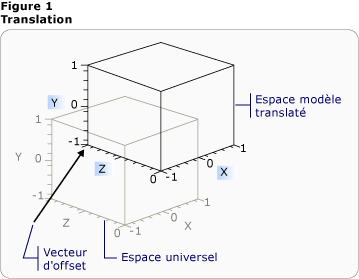
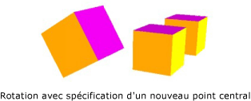
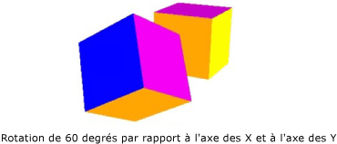

# Vue d'ensemble des transformations 3D3-D Transformations Overview
Cette rubrique décrit comment appliquer des transformations à des modèles 3D dans le système graphique [!INCLUDE[TLA#tla_winclient](../../../../includes/tlasharptla-winclient-md.md)].This topic describes how to apply transformations to 3-D models in the [!INCLUDE[TLA#tla_winclient](../../../../includes/tlasharptla-winclient-md.md)] graphics system. Les transformations permettent au développeur de repositionner, redimensionner et réorienter des modèles sans modifier les valeurs de base qui les définissent.Transformations allow the developer to reposition, resize, and reorient models without changing the base values that define them.  
  

  
## Espace de coordonnées 3D3-D Coordinate Space  
 Contenu dans des graphiques 3D [!INCLUDE[TLA#tla_winclient](../../../../includes/tlasharptla-winclient-md.md)] est encapsulé dans un élément, <xref:System.Windows.Controls.Viewport3D>, qui peut participer à la structure de l’élément à deux dimensions.3-D graphics content in [!INCLUDE[TLA#tla_winclient](../../../../includes/tlasharptla-winclient-md.md)] is encapsulated in an element, <xref:System.Windows.Controls.Viewport3D>, that can participate in the two-dimensional element structure. Le système graphique traite Viewport3D comme un élément visuel à deux dimensions comme de nombreux autres éléments dans [!INCLUDE[TLA#tla_winclient](../../../../includes/tlasharptla-winclient-md.md)].The graphics system treats Viewport3D as a two-dimensional visual element like many others in [!INCLUDE[TLA#tla_winclient](../../../../includes/tlasharptla-winclient-md.md)]. Viewport3D fonctionne comme une fenêtre, ou plus précisément une fenêtre d’affichage, dans une scène 3D.Viewport3D functions as a window—a viewport—into a three-dimensional scene. Plus précisément, c’est une surface sur laquelle une scène 3D est projetée.More accurately, it is a surface on which a 3-D scene is projected.  Bien que vous puissiez utiliser Viewport3D avec d’autres objets de dessin 2D dans le même graphique de scène, vous ne pouvez pas interpénétrer les objets 2D et 3D au sein d’un Viewport3D.Although you can use Viewport3D with other 2-D drawing objects in the same scene graph, you cannot interpenetrate 2-D and 3-D objects within a Viewport3D. Dans la discussion suivante, l’espace de coordonnées décrit est contenu par l’élément Viewport3D.In the following discussion, the coordinate space described is contained by the Viewport3D element.  
  
 Le système de coordonnées [!INCLUDE[TLA#tla_winclient](../../../../includes/tlasharptla-winclient-md.md)] pour les graphiques 2D localise l’origine dans le coin supérieur gauche de la surface de rendu (en général l’écran).The [!INCLUDE[TLA#tla_winclient](../../../../includes/tlasharptla-winclient-md.md)] coordinate system for 2-D graphics locates the origin in the upper left of the rendering surface (typically the screen). Dans le système 2D, les valeurs positives de l’axe des X continuent à droite et les valeurs positives de l’axe des Y positives continuent vers le bas.In the 2-D system, positive x-axis values proceed to the right and positive y-axis values proceed downward. Dans le système de coordonnées 3D, toutefois, l’origine se trouve dans le centre de l’écran, avec les valeurs positives de l’axe des X continuant à droite mais celles de l’axe des Y continuant vers le haut à la place, alors que les valeurs positives de l’axe des Z continuent vers l’extérieur à partir de l’origine, vers le visionneur.In the 3-D coordinate system, however, the origin is located in the center of the screen, with positive x-axis values proceeding to the right but positive y-axis values proceeding upward instead, and positive z-axis values proceeding outward from the origin, toward the viewer.  
  
   
Comparaison du système de coordonnéesCoordinate System Comparison  
  
 L’espace défini par ces axes est le système de référence stationnaire pour les objets 3D dans [!INCLUDE[TLA#tla_winclient](../../../../includes/tlasharptla-winclient-md.md)].The space defined by these axes is the stationary frame of reference for 3-D objects in [!INCLUDE[TLA#tla_winclient](../../../../includes/tlasharptla-winclient-md.md)]. Lorsque vous générez des modèles dans cet espace et créez des lumières et des caméras pour les consulter, il est utile de distinguer ce frame stationnaire de référence, ou « espace universel » du frame local de référence que vous créez pour chaque modèle lorsque vous lui appliquez des transformations.As you build models in this space and create lights and cameras to view them, it's helpful to distinguish this stationary frame of reference, or "world space," from the local frame of reference you create for each model when you apply transformations to it. N’oubliez également pas que les objets dans l’espace universel peuvent sembler entièrement différents, ou ne pas du tout être visibles, en fonction des paramètres de lumière et de caméra, mais que la position de la caméra ne modifie pas l’emplacement des objets dans l’espace universel.Remember also that objects in world space might look entirely different, or not be visible at all, depending on light and camera settings, but the position of the camera does not change the location of objects in world space.  
  
## Transformation de modèlesTransforming Models  
 Lorsque vous créez des modèles, ils ont un emplacement particulier dans la scène.When you create models, they have a particular location in the scene. Pour déplacer ces modèles dans la scène, pour les faire pivoter ou pour modifier leur taille, il n’est pas pratique de modifier les vertex qui définissent les modèles eux-mêmes.To move those models around in the scene, to rotate them, or to change their size, it's not practical to change the vertices that define the models themselves. Au lieu de cela, tout comme dans 2D, vous appliquez des transformations aux modèles.Instead, just as in 2-D, you apply transformations to models.  
  
 Chaque objet modèle a une <xref:System.Windows.Media.Media3D.Model3D.Transform%2A> propriété avec laquelle vous pouvez déplacer, réorienter ou redimensionner le modèle.Each model object has a <xref:System.Windows.Media.Media3D.Model3D.Transform%2A> property with which you can move, re-orient, or resize the model. Lorsque vous appliquez une transformation, vous décalez tous les points du modèle par le vecteur ou la valeur que la transformation spécifie.When you apply a transform, you effectively offset all the points of the model by whatever vector or value is specified by the transform. En d’autres termes, vous avez transformé l’espace de coordonnées dans lequel le modèle est défini (« espace de modèle »), mais vous n’avez pas modifié les valeurs qui composent la géométrie du modèle dans le système de coordonnées de la scène entière (« espace universel »).In other words, you've transformed the coordinate space in which the model is defined ("model space"), but you haven't changed the values that make up the model's geometry in the coordinate system of the entire scene ("world space").  
  
## Transformations de translationTranslation Transformations  
 Transformations 3D héritent de la classe de base abstraite <xref:System.Windows.Media.Media3D.Transform3D>; elles incluent les classes de transformation affine <xref:System.Windows.Media.Media3D.TranslateTransform3D>, <xref:System.Windows.Media.Media3D.ScaleTransform3D>, et <xref:System.Windows.Media.Media3D.RotateTransform3D>.3-D transformations inherit from the abstract base class <xref:System.Windows.Media.Media3D.Transform3D>; these include the affine transform classes <xref:System.Windows.Media.Media3D.TranslateTransform3D>, <xref:System.Windows.Media.Media3D.ScaleTransform3D>, and <xref:System.Windows.Media.Media3D.RotateTransform3D>. Le [!INCLUDE[TLA#tla_winclient](../../../../includes/tlasharptla-winclient-md.md)] système 3D fournit également un <xref:System.Windows.Media.Media3D.MatrixTransform3D> classe qui vous permet de spécifier les mêmes transformations en opérations de matrice plus concises.The [!INCLUDE[TLA#tla_winclient](../../../../includes/tlasharptla-winclient-md.md)] 3-D system also provides a <xref:System.Windows.Media.Media3D.MatrixTransform3D> class that lets you specify the same transformations in more concise matrix operations.  
  
 <xref:System.Windows.Media.Media3D.TranslateTransform3D>Déplace tous les points dans le Model3D dans la direction du vecteur décalage que vous spécifiez avec la <xref:System.Windows.Media.Media3D.TranslateTransform3D.OffsetX%2A>, <xref:System.Windows.Media.Media3D.TranslateTransform3D.OffsetY%2A>, et <xref:System.Windows.Media.Media3D.TranslateTransform3D.OffsetZ%2A> propriétés.<xref:System.Windows.Media.Media3D.TranslateTransform3D> moves all the points in the Model3D in the direction of the offset vector you specify with the <xref:System.Windows.Media.Media3D.TranslateTransform3D.OffsetX%2A>, <xref:System.Windows.Media.Media3D.TranslateTransform3D.OffsetY%2A>, and <xref:System.Windows.Media.Media3D.TranslateTransform3D.OffsetZ%2A> properties. Par exemple, en prenant un vertex d’un cube à (2,2,2), un vecteur de décalage de (0, 1,6, 1) déplacerait ce vertex de (2,2,2) à (2, 3,6, 3).For example, given one vertex of a cube at (2,2,2), an offset vector of (0,1.6,1) would move that vertex (2,2,2) to (2,3.6,3). Le vertex du cube est toujours (2,2,2) dans l’espace du modèle, mais désormais l’espace du modèle a modifié sa relation à l’espace universel afin que (2,2,2) dans l’espace du modèle soit (2, 3,6, 3) dans l’espace universel.The cube's vertex is still (2,2,2) in model space, but now that model space has changed its relationship to world space so that (2,2,2) in model space is (2,3.6,3) in world space.  
  
   
Translation avec décalageTranslation with Offset  
  
 Les exemples de code suivants montrent comment appliquer une translation.The following code examples show how to apply a translation.  
  
 [!code-xaml[animation3dgallery_snip#Translation3DAnimationExampleWholePage](../../../../samples/snippets/csharp/VS_Snippets_Wpf/Animation3DGallery_snip/CS/Translation3DAnimationExample.xaml#translation3danimationexamplewholepage)]  
  
## Transformations d’échelleScale Transformations  
 <xref:System.Windows.Media.Media3D.ScaleTransform3D>Modifie l’échelle du modèle par un vecteur d’échelle spécifié avec une référence à un point central.<xref:System.Windows.Media.Media3D.ScaleTransform3D> changes the model's scale by a specified scale vector with reference to a center point. Spécifiez une échelle uniforme, qui met à l’échelle du modèle par la même valeur dans les axes X, Y et Z, pour modifier la taille du modèle proportionnellement.Specify a uniform scale, which scales the model by the same value in the X, Y, and Z axes, to change the model's size proportionally. Par exemple, la définition de la transformation <xref:System.Windows.Media.ScaleTransform.ScaleX%2A>, <xref:System.Windows.Media.ScaleTransform.ScaleY%2A>, et <xref:System.Windows.Media.Media3D.ScaleTransform3D.ScaleZ%2A> propriétés 0,5 divise par deux la taille du modèle ; définir les mêmes propriétés 2 double son échelle dans les trois axes.For example, setting the transform's <xref:System.Windows.Media.ScaleTransform.ScaleX%2A>, <xref:System.Windows.Media.ScaleTransform.ScaleY%2A>, and <xref:System.Windows.Media.Media3D.ScaleTransform3D.ScaleZ%2A> properties to 0.5 halves the size of the model; setting the same properties to 2 doubles its scale in all three axes.  
  
   
Exemple de ScaleVectorScaleVector Example  
  
 En spécifiant une transformation d’échelle non uniforme, une transformation d’échelle dont les valeurs X, Y et Z ne sont pas toutes les mêmes, vous pouvez provoquer l’étirement ou la contraction d’un modèle dans une ou deux dimensions sans affecter les autres.By specifying a non-uniform scale transformation—a scale transformation whose X, Y, and Z values are not all the same—you can cause a model to stretch or contract in one or two dimensions without affecting the others. Par exemple, <xref:System.Windows.Media.ScaleTransform.ScaleX%2A> à 1, <xref:System.Windows.Media.ScaleTransform.ScaleY%2A> à 2, et <xref:System.Windows.Media.Media3D.ScaleTransform3D.ScaleZ%2A> à 1 créerait du modèle double en hauteur mais restent inchangés le long des axes X et Z.For example, setting <xref:System.Windows.Media.ScaleTransform.ScaleX%2A> to 1, <xref:System.Windows.Media.ScaleTransform.ScaleY%2A> to 2, and <xref:System.Windows.Media.Media3D.ScaleTransform3D.ScaleZ%2A> to 1 would cause the transformed model to double in height but remain unchanged along the X and Z axes.  
  
 Par défaut, ScaleTransform3D étire ou contracte les sommets par rapport à l’origine (0,0,0).By default, ScaleTransform3D causes vertices to expand or contract about the origin (0,0,0). Si le modèle que vous souhaitez transformer n’est pas dessiné depuis l’origine, cependant, la mise à l’échelle du modèle à partir de l’origine ne fait pas évoluer le modèle « sur place. »If the model you want to transform is not drawn from the origin, however, scaling the model from the origin will not scale the model "in place." Au lieu de cela, lorsque les sommets du modèle sont multipliés par le vecteur d’échelle, l’opération de mise à l’échelle a pour effet de déplacer le modèle en plus de le mettre à l’échelle.Instead, when the model's vertices are multiplied by the scale vector, the scale operation will have the effect of translating the model as well as scaling it.  
  
   
Exemple de centre de mise à l’échelleScale Center Example  
  
 Pour faire évoluer un modèle « sur place », spécifiez le centre du modèle en définissant la ScaleTransform3D <xref:System.Windows.Media.ScaleTransform.CenterX%2A>, <xref:System.Windows.Media.ScaleTransform.CenterY%2A>, et <xref:System.Windows.Media.Media3D.ScaleTransform3D.CenterZ%2A> propriétés.To scale a model "in place," specify the center of the model by setting the ScaleTransform3D's <xref:System.Windows.Media.ScaleTransform.CenterX%2A>, <xref:System.Windows.Media.ScaleTransform.CenterY%2A>, and <xref:System.Windows.Media.Media3D.ScaleTransform3D.CenterZ%2A> properties. Cela garantit que le système graphique met à l’échelle l’espace du modèle et puis traduit vers le centre spécifiées <xref:System.Windows.Media.Media3D.Point3D>.This ensures that the graphics system scales the model space and then translates it to center on the specified <xref:System.Windows.Media.Media3D.Point3D>. À l’inverse, si vous avez généré le modèle par rapport à l’origine et que vous spécifiez un autre point, attendez-vous à ce que le modèle transformé soit déplacé par rapport à l’origine.Conversely, if you've built the model about the origin and specify a different center point, expect to see the model translated away from the origin.  
  
## Transformations de rotationRotation Transformations  
 Vous pouvez faire pivoter un modèle en 3D de différentes manières.You can rotate a model in 3-D in several different ways. Une rotation classique spécifie un axe et un angle de rotation autour de cet axe.A typical rotation transformation specifies an axis and an angle of rotation around that axis. Le <xref:System.Windows.Media.Media3D.RotateTransform3D> classe vous permet de définir un <xref:System.Windows.Media.Media3D.Rotation3D> avec son <xref:System.Windows.Media.Media3D.RotateTransform3D.Rotation%2A> propriété.The <xref:System.Windows.Media.Media3D.RotateTransform3D> class allows you to define a <xref:System.Windows.Media.Media3D.Rotation3D> with its <xref:System.Windows.Media.Media3D.RotateTransform3D.Rotation%2A> property. Vous spécifiez ensuite <xref:System.Windows.Media.Media3D.AxisAngleRotation3D.Axis%2A> et <xref:System.Windows.Media.Media3D.AxisAngleRotation3D.Angle%2A> propriétés sur la Rotation3D, dans ce cas un <xref:System.Windows.Media.Media3D.AxisAngleRotation3D>, pour définir la transformation.You then specify <xref:System.Windows.Media.Media3D.AxisAngleRotation3D.Axis%2A> and <xref:System.Windows.Media.Media3D.AxisAngleRotation3D.Angle%2A> properties on the Rotation3D, in this case an <xref:System.Windows.Media.Media3D.AxisAngleRotation3D>, to define the transformation. Les exemples suivants font pivoter un modèle de 60 degrés autour de l’axe Y.The following examples rotate a model by 60 degrees around the Y axis.  
  
 [!code-xaml[animation3dgallery_snip#Rotate3DUsingAxisAngleRotation3DExampleWholePage](../../../../samples/snippets/csharp/VS_Snippets_Wpf/Animation3DGallery_snip/CS/Rotat3DUsingAxisAngleRotation3DExample.xaml#rotate3dusingaxisanglerotation3dexamplewholepage)]  
  
 Remarque :[!INCLUDE[TLA#tla_winclient](../../../../includes/tlasharptla-winclient-md.md)] 3D est un système droitier, ce qui signifie qu’une valeur d’angle positive pour une rotation entraîne une rotation horaire autour de l’axe.Note:[!INCLUDE[TLA#tla_winclient](../../../../includes/tlasharptla-winclient-md.md)] 3-D is a right-handed system, which means that a positive angle value for a rotation results in a counter-clockwise rotation about the axis.  
  
 Rotations de l’angle de l’axe supposent la rotation à l’origine si une valeur n’est pas spécifiée pour le <xref:System.Windows.Media.Media3D.RotateTransform3D.CenterX%2A>, <xref:System.Windows.Media.Media3D.RotateTransform3D.CenterY%2A>, et <xref:System.Windows.Media.Media3D.RotateTransform3D.CenterZ%2A> propriétés sur RotateTransform3D.Axis-angle rotations assume rotation about the origin if a value is not specified for the <xref:System.Windows.Media.Media3D.RotateTransform3D.CenterX%2A>, <xref:System.Windows.Media.Media3D.RotateTransform3D.CenterY%2A>, and <xref:System.Windows.Media.Media3D.RotateTransform3D.CenterZ%2A> properties on RotateTransform3D. Comme avec la mise à l’échelle, il est utile de garder l’esprit que la rotation transforme l’espace de coordonnées entier du modèle.As with scaling, it's helpful to remember that the rotation transforms the model's entire coordinate space. Si le modèle n’a pas été créé par rapport à l’origine ou a été déplacé précédemment, la rotation peut « pivoter » autour de l’origine au lieu de tourner sur place.If the model was not created about the origin, or has been translated previously, the rotation might "pivot" about the origin instead of rotating in place.  
  
   
Rotation avec nouveau centre spécifiéRotation with new center specified  
  
 Pour faire pivoter le modèle « sur place », spécifiez le centre réel du modèle en tant que centre de la rotation.To rotate the model "in place," specify the model's actual center as the center of rotation. Étant donné que la géométrie est généralement modelée par rapport à l’origine, vous pouvez généralement obtenir le résultat attendu d’un ensemble de transformations en redimensionnant d’abord le modèle (par mise à l’échelle), puis en définissant son orientation (par rotation) et enfin en le déplaçant vers l’emplacement souhaité (par translation).Because geometry is typically modeled about the origin, you can most often get the expected result of a set of transformations by first sizing the model (scaling it), then setting its orientation (rotating it), and finally moving it to the desired location (translating it).  
  
   
Exemple de rotationRotation Example  
  
 Les rotations axe/angle fonctionnent bien pour les transformations statiques et certaines animations.Axis-angle rotations work well for static transformations and some animations. Toutefois, envisagez la rotation d’un modèle de cube à 60 degrés autour de l’axe X, puis de 45 degrés autour de l’axe Z.However, consider rotating a cube model 60 degrees around the X axis, then 45 degrees around the Z axis. Vous pouvez décrire cette transformation sous forme de deux transformations affines discrètes ou de matrice.You can describe this transformation as two discrete affine transformations, or as a matrix. Toutefois, il peut être difficile d’animer une rotation définie de cette façon.However, it might be difficult to smoothly animate a rotation defined this way. Même si les positions de début et de fin du modèle calculées par les deux approches sont les mêmes, les positions intermédiaires prises par le modèle sont incertaines en matière de calcul.Although the beginning and ending positions of the model computed by either approach are the same, the intermediate positions taken by the model are computationally uncertain. Les quaternions représentent une autre façon de calculer l’interpolation entre le début et la fin d’une rotation.Quaternions represent an alternative way to compute the interpolation between the start and end of a rotation.  
  
 Un quaternion représente un axe dans un espace 3D et une rotation autour de cet axe.A quaternion represents an axis in 3-D space and a rotation around that axis. Par exemple, un quaternion peut représenter un axe (1,1,2) et une rotation de 50 degrés.For example, a quaternion might represent a (1,1,2) axis and a rotation of 50 degrees. La capacité des quaternions à définir des rotations vient des opérations que vous pouvez effectuer dessus : composition et interpolation.Quaternions’ power in defining rotations comes from the two operations that you can perform on them: composition and interpolation. La composition de deux quaternions appliqués à une géométrie signifie « faire pivoter la géométrie autour de l’axe2 par la rotation2, puis la faire pivoter autour de l’axe1 par la rotation1 ».The composition of two quaternions applied to a geometry means "rotate the geometry around axis2 by rotation2, then rotate it around axis1 by rotation1." En utilisant la composition, vous pouvez combiner les deux rotations sur la géométrie pour obtenir un seul quaternion qui représente le résultat.By using composition, you can combine the two rotations on the geometry to get a single quaternion that represents the result. Étant donné que l’interpolation de quaternion peut calculer un chemin fluide et raisonnable d’un axe et d’une orientation à l’autre, vous pouvez interpoler de du quaternion d’origine vers le quaternion composé pour effectuer une transition en douceur d’un autre à l’autre, ce qui vous permet d’animer la transformation.Because quaternion interpolation can calculate a smooth and reasonable path from one axis and orientation to another, you can interpolate from the original to the composed quaternion to achieve a smooth transition from one to the other, enabling you to animate the transformation. Pour les modèles que vous souhaitez animer, vous pouvez spécifier une destination <xref:System.Windows.Media.Media3D.Quaternion> pour la rotation à l’aide un <xref:System.Windows.Media.Media3D.QuaternionRotation3D> pour le <xref:System.Windows.Media.Media3D.RotateTransform3D.Rotation%2A> propriété.For models that you want to animate, you can specify a destination <xref:System.Windows.Media.Media3D.Quaternion> for the rotation by using a <xref:System.Windows.Media.Media3D.QuaternionRotation3D> for the <xref:System.Windows.Media.Media3D.RotateTransform3D.Rotation%2A> property.  
  
## Utilisation des collections de transformationsUsing Transformation Collections  
 Lorsque vous générez une scène, il est courant d’appliquer plusieurs transformations à un modèle.When building a scene, it's common to apply more than one transformation to a model. Ajouter des transformations à la <xref:System.Windows.Media.Media3D.Transform3DGroup.Children%2A> collection de la <xref:System.Windows.Media.Media3D.Transform3DGroup> classe pour regrouper les transformations aisément à s’appliquent à plusieurs modèles dans la scène.Add transforms to the <xref:System.Windows.Media.Media3D.Transform3DGroup.Children%2A> collection of the <xref:System.Windows.Media.Media3D.Transform3DGroup> class to group transforms conveniently to apply to various models in the scene. Il est souvent utile de réutiliser une transformation dans plusieurs groupes, de la même façon que vous pouvez réutiliser un modèle en appliquant un ensemble de transformations différent à chaque instance.It's often convenient to reuse a transformation in several different groups, in much the way that you can reuse a model by applying a different set of transforms to each instance. Notez que l’ordre dans lequel les transformations sont ajoutées à la collection est important : les transformations de la collection sont appliquées de la première à la dernière.Note that order in which the transformations are added to the collection is significant: transforms in the collection are applied from first to last.  
  
## Animation de transformationsAnimating Transformations  
 L’implémentation 3D [!INCLUDE[TLA#tla_winclient](../../../../includes/tlasharptla-winclient-md.md)] participe au même système de minutage et d’animation que les graphiques 2D.The [!INCLUDE[TLA#tla_winclient](../../../../includes/tlasharptla-winclient-md.md)] 3-D implementation participates in the same timing and animation system as 2-D graphics. En d’autres termes, pour animer une scène 3D, animez les propriétés de ses modèles.In other words, to animate a 3-D scene, animate the properties of its models. Il est possible d’animer directement des propriétés de primitives, mais il est généralement plus facile d’animer des transformations qui modifient la position ou l’apparence de modèles.It's possible to animate properties of primitives directly, but it's typically easier to animate transformations that change the position or appearance of models. Étant donné que les transformations peuvent être appliquées aux <xref:System.Windows.Media.Media3D.Model3DGroup> des objets, ainsi que des modèles individuels, il est possible d’appliquer un ensemble d’animations pour les enfants d’un Model3Dgroup et un autre ensemble d’animations à un groupe d’objets.Because transformations can be applied to <xref:System.Windows.Media.Media3D.Model3DGroup> objects as well as individual models, it's possible to apply one set of animations to the children of a Model3Dgroup and another set of animations to a group of objects.  Pour plus d’informations sur le minutage [!INCLUDE[TLA#tla_winclient](../../../../includes/tlasharptla-winclient-md.md)] et le système d’animation, consultez [Vue d'ensemble de l'animation](../../../../docs/framework/wpf/graphics-multimedia/animation-overview.md) et [Vue d'ensemble des storyboards](../../../../docs/framework/wpf/graphics-multimedia/storyboards-overview.md).For background information on the [!INCLUDE[TLA#tla_winclient](../../../../includes/tlasharptla-winclient-md.md)] timing and animation system, see [Animation Overview](../../../../docs/framework/wpf/graphics-multimedia/animation-overview.md) and [Storyboards Overview](../../../../docs/framework/wpf/graphics-multimedia/storyboards-overview.md).  
  
 Pour animer un objet dans [!INCLUDE[TLA#tla_winclient](../../../../includes/tlasharptla-winclient-md.md)], créez une chronologie, définissez une animation (qui est en fait une modification de valeur de propriété dans le temps) et spécifiez la propriété à laquelle appliquer l’animation.To animate an object in [!INCLUDE[TLA#tla_winclient](../../../../includes/tlasharptla-winclient-md.md)], create a timeline, define an animation (which is really a change in some property value over time), and specify the property to which to apply the animation. Cette propriété doit être une propriété d’un FrameworkElement.This property must be a property of a FrameworkElement. Étant donné que tous les objets dans une scène 3D sont des enfants de Viewport3D, les propriétés ciblées par une animation que vous souhaitez appliquer à la scène sont des propriétés de Viewport3D.Because all the objects in a 3-D scene are children of Viewport3D, the properties targeted by any animation you want to apply to the scene are properties of properties of Viewport3D. Il est important de déterminer le chemin d’accès de la propriété vers l’animation avec précaution, car la syntaxe peut être complexe.It's important to work out the property path for the animation carefully, because the syntax can be verbose.  
  
 Supposons que vous souhaitez faire pivoter un objet sur place, mais aussi appliquer un mouvement oscillant pour exposer une plus grande partie de l’objet à afficher.Suppose you want to rotate an object in place, but also to apply a swinging motion to expose more of the object to view. Vous pouvez choisir d’appliquer une RotateTransform3D.RotateTransform3D au modèle et animer son axe de rotation d’un vecteur à un autre.You might choose to apply a RotateTransform3D to the model, and animate the axis of its rotation from one vector to another. L’exemple de code suivant montre l’application un <xref:System.Windows.Media.Animation.Vector3DAnimation> à la propriété d’axe de Rotation3D de la transformation, en supposant la RotateTransform3D soit une des multiples transformations appliquées au modèle avec un <xref:System.Windows.Media.TransformGroup>.The following code example demonstrates applying a <xref:System.Windows.Media.Animation.Vector3DAnimation> to the Axis property of the transformation's Rotation3D, assuming the RotateTransform3D to be one of several transforms applied to the model with a <xref:System.Windows.Media.TransformGroup>.  
  
 [!code-csharp[3doverview#3DOverview3DN1](../../../../samples/snippets/csharp/VS_Snippets_Wpf/3DOverview/CSharp/Window1.xaml.cs#3doverview3dn1)]
 [!code-vb[3doverview#3DOverview3DN1](../../../../samples/snippets/visualbasic/VS_Snippets_Wpf/3DOverview/visualbasic/window1.xaml.vb#3doverview3dn1)]  
  
 [!code-csharp[3doverview#3DOverview3DN3](../../../../samples/snippets/csharp/VS_Snippets_Wpf/3DOverview/CSharp/Window1.xaml.cs#3doverview3dn3)]
 [!code-vb[3doverview#3DOverview3DN3](../../../../samples/snippets/visualbasic/VS_Snippets_Wpf/3DOverview/visualbasic/window1.xaml.vb#3doverview3dn3)]  
  
 Utilisez une syntaxe similaire pour cibler d’autres propriétés de transformation pour déplacer ou redimensionner l’objet.Use a similar syntax to target other transformation properties to move or scale the object.  Par exemple, vous pouvez appliquer un <xref:System.Windows.Media.Animation.Point3DAnimation> à la propriété ScaleCenter sur une mise à l’échelle pour entraîner un modèle à la forme.For example, you might apply a <xref:System.Windows.Media.Animation.Point3DAnimation> to the ScaleCenter property on a scale transform to cause a model to smoothly distort its shape.  
  
 Bien que les exemples précédents transforment les propriétés de <xref:System.Windows.Media.Media3D.GeometryModel3D>, il est également possible de transformer les propriétés d’autres modèles dans la scène.Although the preceding examples transform the properties of <xref:System.Windows.Media.Media3D.GeometryModel3D>, it’s also possible to transform the properties of other models in the scene.  En animant des translations appliquées aux objets Light, par exemple, vous pouvez créer des effets de lumière et d’ombre qui peuvent modifier considérablement l’apparence de vos modèles.By animating translations applied to Light objects, for example, you can create moving light and shadow effects that can dramatically change the appearance of your models.  
  
 Étant donné que les caméras sont également des modèles, il est aussi possible de transformer les propriétés de la caméra.Because cameras are also models, it’s possible to transform camera properties as well.  Même si vous pouvez tout à fait modifier l’apparence de la scène en transformant les distances sur le plan de la position de la caméra (en transformant ainsi la projection de scène entière), notez que beaucoup d’effets que vous obtenez de cette façon peuvent ne pas paraître aussi « visuellement cohérents » que les transformations appliquées à l’emplacement ou la position des modèles dans la scène.While you can certainly change the appearance of the scene by transforming the camera location or plane distances—in effect, transforming the entire scene projection—note that many of the effects you achieve this way may not make as much "visual sense" to the viewer as transformations applied to the location or position of the models in the scene.  
  
## Voir aussiSee Also  
 [Vue d’ensemble des graphiques 3D3-D Graphics Overview](../../../../docs/framework/wpf/graphics-multimedia/3-d-graphics-overview.md)  
 [Vue d’ensemble des transformationsTransforms Overview](../../../../docs/framework/wpf/graphics-multimedia/transforms-overview.md)  
 [Exemple de transformations 2D2-D Transforms Sample](http://go.microsoft.com/fwlink/?LinkID=158252)
