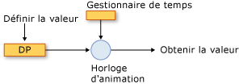
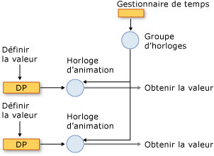
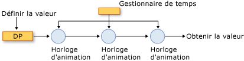

# Vue d'ensemble de l'animation et du système de minutageAnimation and Timing System Overview
Cette rubrique décrit comment le système de minuterie utilise l’animation, <xref:System.Windows.Media.Animation.Timeline>, et <xref:System.Windows.Media.Animation.Clock> classes pour animer des propriétés.This topic describes how the timing system uses the animation, <xref:System.Windows.Media.Animation.Timeline>, and <xref:System.Windows.Media.Animation.Clock> classes to animate properties.  
  
   
## PrérequisPrerequisites  
 Pour comprendre cette rubrique, vous devez être en mesure d’utiliser des animations [!INCLUDE[TLA2#tla_winclient](../../../../includes/tla2sharptla-winclient-md.md)] pour animer des propriétés, comme décrit dans la [Vue d’ensemble de l’animation](../../../../docs/framework/wpf/graphics-multimedia/animation-overview.md).To understand this topic, you should be able to use [!INCLUDE[TLA2#tla_winclient](../../../../includes/tla2sharptla-winclient-md.md)] animations to animate properties, as described in the [Animation Overview](../../../../docs/framework/wpf/graphics-multimedia/animation-overview.md). Il est également conseillé de vous familiariser avec les propriétés de dépendance. Pour plus d’informations, consultez [Vue d’ensemble des propriétés de dépendance](../../../../docs/framework/wpf/advanced/dependency-properties-overview.md).It also helps to be familiar with dependency properties; for more information, see the [Dependency Properties Overview](../../../../docs/framework/wpf/advanced/dependency-properties-overview.md).  
  
   
## Chronologies et horlogesTimelines and Clocks  
 Le [vue d’ensemble de l’Animation](../../../../docs/framework/wpf/graphics-multimedia/animation-overview.md) décrit comment un <xref:System.Windows.Media.Animation.Timeline> représente un segment de temps et une animation est un type de <xref:System.Windows.Media.Animation.Timeline> qui produit des valeurs de sortie.The [Animation Overview](../../../../docs/framework/wpf/graphics-multimedia/animation-overview.md) described how a <xref:System.Windows.Media.Animation.Timeline> represents a segment of time, and an animation is a type of <xref:System.Windows.Media.Animation.Timeline> that produces output values. En soi, un <xref:System.Windows.Media.Animation.Timeline>, ne fait rien d’autre que décrire un segment de temps.By itself, a <xref:System.Windows.Media.Animation.Timeline>, doesn't do anything other than just describe a segment of time. Il s’agit de la chronologie <xref:System.Windows.Media.Animation.Clock> objet qui effectue le travail.It's the timeline's <xref:System.Windows.Media.Animation.Clock> object that does the real work. De même, l’animation n’anime pas réellement propriétés : une classe d’animation décrit comment les valeurs de sortie doivent être calculées, mais c’est le <xref:System.Windows.Media.Animation.Clock> qui a été créé pour l’animation qui achemine la sortie d’animation et s’applique aux propriétés.Likewise, animation doesn't actually animate properties: an animation class describes how output values should be calculated, but it’s the <xref:System.Windows.Media.Animation.Clock> that was created for the animation that drives the animation output and applies it to properties.  
  
 A <xref:System.Windows.Media.Animation.Clock> est un type spécial d’objet qui gère l’état d’exécution temporisation de la <xref:System.Windows.Media.Animation.Timeline>.A <xref:System.Windows.Media.Animation.Clock> is a special type of object that maintains timing-related run-time state for the <xref:System.Windows.Media.Animation.Timeline>. Il fournit trois bits des informations qui sont essentielles à l’animation et le système de minuterie : <xref:System.Windows.Media.Animation.Clock.CurrentTime%2A>, <xref:System.Windows.Media.Animation.Clock.CurrentProgress%2A>, et <xref:System.Windows.Media.Animation.Clock.CurrentState%2A>.It provides three bits of information that are essential to the animation and timing system: <xref:System.Windows.Media.Animation.Clock.CurrentTime%2A>, <xref:System.Windows.Media.Animation.Clock.CurrentProgress%2A>, and <xref:System.Windows.Media.Animation.Clock.CurrentState%2A>. A <xref:System.Windows.Media.Animation.Clock> détermine l’heure actuelle, sa progression et l’état en utilisant les comportements d’horloge décrits par sa <xref:System.Windows.Media.Animation.Timeline>: <xref:System.Windows.Media.Animation.Timeline.Duration%2A>, <xref:System.Windows.Media.Animation.Timeline.RepeatBehavior%2A>, <xref:System.Windows.Media.Animation.Timeline.AutoReverse%2A>, et ainsi de suite.A <xref:System.Windows.Media.Animation.Clock> determines its current time, progress, and state by using the timing behaviors described by its <xref:System.Windows.Media.Animation.Timeline>: <xref:System.Windows.Media.Animation.Timeline.Duration%2A>, <xref:System.Windows.Media.Animation.Timeline.RepeatBehavior%2A>, <xref:System.Windows.Media.Animation.Timeline.AutoReverse%2A>, and so on.  
  
 Dans la plupart des cas, un <xref:System.Windows.Media.Animation.Clock> est créé automatiquement pour votre scénario.In most cases, a <xref:System.Windows.Media.Animation.Clock> is created automatically for your timeline. Lorsque vous animez en utilisant un <xref:System.Windows.Media.Animation.Storyboard> ou <xref:System.Windows.Media.Animation.Animatable.BeginAnimation%2A> (méthode), horloges sont automatiquement créés pour vos chronologies et animations et appliquées à leurs propriétés ciblées.When you animate by using a <xref:System.Windows.Media.Animation.Storyboard> or the <xref:System.Windows.Media.Animation.Animatable.BeginAnimation%2A> method, clocks are automatically created for your timelines and animations and applied to their targeted properties. Vous pouvez également créer un <xref:System.Windows.Media.Animation.Clock> explicitement en utilisant la <xref:System.Windows.Media.Animation.Timeline.CreateClock%2A> méthode de votre <xref:System.Windows.Media.Animation.Timeline>.You can also create a <xref:System.Windows.Media.Animation.Clock> explicitly by using the <xref:System.Windows.Media.Animation.Timeline.CreateClock%2A> method of your <xref:System.Windows.Media.Animation.Timeline>. Le <xref:System.Windows.Media.MediaTimeline.CreateClock%2A?displayProperty=nameWithType> méthode crée une horloge du type approprié pour la <xref:System.Windows.Media.Animation.Timeline> sur lequel elle est appelée.The <xref:System.Windows.Media.MediaTimeline.CreateClock%2A?displayProperty=nameWithType> method creates a clock of the appropriate type for the <xref:System.Windows.Media.Animation.Timeline> on which it is called. Si le <xref:System.Windows.Media.Animation.Timeline> contient des chronologies enfants, elle crée <xref:System.Windows.Media.Animation.Clock> pour les objets ainsi.If the <xref:System.Windows.Media.Animation.Timeline> contains child timelines, it creates <xref:System.Windows.Media.Animation.Clock> objects for them as well. Résultant <xref:System.Windows.Media.Animation.Clock> objets sont organisés en arborescences qui correspondent à la structure de la <xref:System.Windows.Media.Animation.Timeline> arborescence des objets à partir de laquelle ils sont créés.The resulting <xref:System.Windows.Media.Animation.Clock> objects are arranged in trees that match the structure of the <xref:System.Windows.Media.Animation.Timeline> objects tree from which they are created.  
  
 Il existe différents types d’horloges pour différents types de chronologies.There are different types of clocks for different types of timelines. Le tableau suivant présente la <xref:System.Windows.Media.Animation.Clock> types qui correspondent à certains des différents <xref:System.Windows.Media.Animation.Timeline> types.The following table shows the <xref:System.Windows.Media.Animation.Clock> types that correspond to some of the different <xref:System.Windows.Media.Animation.Timeline> types.  
  
|Type de chronologieTimeline type|Type d’horlogeClock type|Objectif de l’horlogeClock purpose|  
|-------------------|----------------|-------------------|  
|Animation (hérite de <xref:System.Windows.Media.Animation.AnimationTimeline>)Animation (inherits from <xref:System.Windows.Media.Animation.AnimationTimeline>)|<xref:System.Windows.Media.Animation.AnimationClock>|Génère les valeurs de sortie d’une propriété de dépendance.Generates output values for a dependency property.|  
|<xref:System.Windows.Media.MediaTimeline>|<xref:System.Windows.Media.MediaClock>|Traite un fichier multimédia.Processes a media file.|  
|<xref:System.Windows.Media.Animation.ParallelTimeline>|<xref:System.Windows.Media.Animation.ClockGroup>|Groupe et contrôle son enfant <xref:System.Windows.Media.Animation.Clock> objetsGroups and controls its child <xref:System.Windows.Media.Animation.Clock> objects|  
|<xref:System.Windows.Media.Animation.Storyboard>|<xref:System.Windows.Media.Animation.ClockGroup>|Groupe et contrôle son enfant <xref:System.Windows.Media.Animation.Clock> objetsGroups and controls its child <xref:System.Windows.Media.Animation.Clock> objects|  
  
 Vous pouvez appliquer les <xref:System.Windows.Media.Animation.AnimationClock> objets vous créez pour les propriétés de dépendance compatibles en utilisant la <xref:System.Windows.Media.Animation.IAnimatable.ApplyAnimationClock%2A> (méthode).You can apply any <xref:System.Windows.Media.Animation.AnimationClock> objects you create to compatible dependency properties by using the <xref:System.Windows.Media.Animation.IAnimatable.ApplyAnimationClock%2A> method.  
  
 Dans les scénarios qui exigent des performances, telles que l’animation grand nombre d’objets semblables, la gestion de vos propres <xref:System.Windows.Media.Animation.Clock> utilisation peut améliorer les performances.In performance-intensive scenarios, such as animating large numbers of similar objects, managing your own <xref:System.Windows.Media.Animation.Clock> use can provide performance benefits.  
  
   
## Horloges et gestionnaire de tempsClocks and the Time Manager  
 Lorsque vous animez des objets dans [!INCLUDE[TLA2#tla_winclient](../../../../includes/tla2sharptla-winclient-md.md)], c’est le Gestionnaire de temps qui gère les <xref:System.Windows.Media.MediaPlayer.Clock%2A> les objets créés pour vos chronologies.When you animate objects in [!INCLUDE[TLA2#tla_winclient](../../../../includes/tla2sharptla-winclient-md.md)], it’s the time manager that manages the <xref:System.Windows.Media.MediaPlayer.Clock%2A> objects created for your timelines. Le gestionnaire de temps est la racine d'une arborescence d'objets <xref:System.Windows.Media.MediaPlayer.Clock%2A> et contrôle le flux de temps dans cette arborescence.The time manager is the root of a tree of <xref:System.Windows.Media.MediaPlayer.Clock%2A> objects and controls the flow of time in that tree.  Un gestionnaire de temps est créé automatiquement pour chaque application [!INCLUDE[TLA2#tla_winclient](../../../../includes/tla2sharptla-winclient-md.md)] et reste invisible au développeur d'applications.A time manager is automatically created for each [!INCLUDE[TLA2#tla_winclient](../../../../includes/tla2sharptla-winclient-md.md)] application and is invisible to the application developer. Le gestionnaire de temps a de nombreuses graduations par seconde. Le nombre réel de cycles qui se produisent à chaque seconde varie selon les ressources système disponibles.The time manager "ticks" many times per second; the actual number of ticks that occur each second varies depending on available system resources. Au cours de chacune de ces battements, le Gestionnaire de temps calcule l’état de tous les <xref:System.Windows.Media.Animation.ClockState.Active> <xref:System.Windows.Media.Animation.Clock> objets dans l’arborescence de minutage.During each one of these ticks, the time manager computes the state of all <xref:System.Windows.Media.Animation.ClockState.Active> <xref:System.Windows.Media.Animation.Clock> objects in the timing tree.  
  
 L’illustration suivante montre la relation entre le Gestionnaire de temps, et <xref:System.Windows.Media.Animation.AnimationClock>et une propriété de dépendance animée.The following illustration shows the relationship between the time manager, and <xref:System.Windows.Media.Animation.AnimationClock>, and an animated dependency property.  
  
   
Animation d’une propriétéAnimating a property  
  
 Lorsque le Gestionnaire de temps de graduations, il met à jour l’heure de chaque <xref:System.Windows.Media.Animation.ClockState.Active> <xref:System.Windows.Media.Animation.Clock> dans l’application.When the time manager ticks, it updates the time of every <xref:System.Windows.Media.Animation.ClockState.Active> <xref:System.Windows.Media.Animation.Clock> in the application. Si le <xref:System.Windows.Media.Animation.Clock> est un <xref:System.Windows.Media.Animation.AnimationClock>, il utilise le <xref:System.Windows.Media.Animation.AnimationTimeline.GetCurrentValue%2A> méthode de le <xref:System.Windows.Media.Animation.AnimationTimeline> à partir duquel il a été créé pour calculer actuelle à la valeur de sortie.If the <xref:System.Windows.Media.Animation.Clock> is an <xref:System.Windows.Media.Animation.AnimationClock>, it uses the <xref:System.Windows.Media.Animation.AnimationTimeline.GetCurrentValue%2A> method of the <xref:System.Windows.Media.Animation.AnimationTimeline> from which it was created to calculate its current output value. Le <xref:System.Windows.Media.Animation.AnimationClock> fournit le <xref:System.Windows.Media.Animation.AnimationTimeline> avec l’heure locale actuelle, une valeur d’entrée, qui est généralement la valeur de la propriété de base et une valeur de destination par défaut.The <xref:System.Windows.Media.Animation.AnimationClock> supplies the <xref:System.Windows.Media.Animation.AnimationTimeline> with the current local time, an input value, which is typically the base value of the property, and a default destination value. Lorsque vous récupérez la valeur d’un animé par propriété à l’aide du <xref:System.Windows.DependencyObject.GetValue%2A> méthode ou son accesseur CLR, vous obtenez la sortie de son <xref:System.Windows.Media.Animation.AnimationClock>.When you retrieve the value of an animated by property using the <xref:System.Windows.DependencyObject.GetValue%2A> method or its CLR accessor, you get the output of its <xref:System.Windows.Media.Animation.AnimationClock>.  
  
#### Groupes d’horlogesClock Groups  
 La section précédente a décrit les différents types de <xref:System.Windows.Media.Animation.Clock> objets pour différents types de chronologies.The preceding section described how there are different types of <xref:System.Windows.Media.Animation.Clock> objects for different types of timelines. L’illustration suivante montre la relation entre le Gestionnaire de temps, un <xref:System.Windows.Media.Animation.ClockGroup>, un <xref:System.Windows.Media.Animation.AnimationClock>et une propriété de dépendance animée.The following illustration shows the relationship between the time manager, a <xref:System.Windows.Media.Animation.ClockGroup>, an <xref:System.Windows.Media.Animation.AnimationClock>, and an animated dependency property. A <xref:System.Windows.Media.Animation.ClockGroup> est créé pour les chronologies qui groupent d’autres chronologies, telles que le <xref:System.Windows.Media.Animation.Storyboard> (classe), qui regroupe des animations et autres chronologies.A <xref:System.Windows.Media.Animation.ClockGroup> is created for timelines that group other timelines, such as the <xref:System.Windows.Media.Animation.Storyboard> class, which groups animations and other timelines.  
  
   
Un groupe d’horlogesA ClockGroup  
  
#### CompositionComposition  
 Il est possible d’associer plusieurs horloges à une seule propriété, auquel cas chaque l’horloge utilise la valeur de sortie de l’exemple d’horloge précédent comme valeur de base.It's possible to associate multiple clocks with a single property, in which case each clock uses the output value of the preceding clock as its base value. L’illustration suivante montre trois <xref:System.Windows.Media.Animation.AnimationClock> objets appliqués à la même propriété.The following illustration shows three <xref:System.Windows.Media.Animation.AnimationClock> objects applied to the same property. Clock1 utilise la valeur de base de la propriété animée comme entrée et l’utilise pour générer la sortie.Clock1 uses the base value of the animated property as its input and uses it to generate output. Clock2 prend la sortie de Clock1 comme entrée et l’utilise pour générer la sortie.Clock2 takes the output from Clock1 as its input and uses it to generate output. Clock3 prend la sortie de Clock2 comme entrée et l’utilise pour générer la sortie.Clock3 takes the output from Clock2 as its input and uses it to generate output. Lorsque plusieurs horloges affectent la même propriété simultanément, on dit qu’elles font partie d’une chaîne de composition.When multiple clocks affect the same property simultaneously, they are said to be in a composition chain.  
  
   
Une chaîne de compositionA composition chain  
  
 Notez que même si une relation est créée entre l’entrée et la sortie de la <xref:System.Windows.Media.Animation.AnimationClock> des objets dans la chaîne de composition, leurs comportements d’horloge ne sont pas affectés ; <xref:System.Windows.Media.Animation.Clock> objets (y compris <xref:System.Windows.Media.Animation.AnimationClock> objets) ont une dépendance hiérarchique sur leur parent <xref:System.Windows.Media.Animation.Clock> objets.Note that although a relationship is created among the input and output of the <xref:System.Windows.Media.Animation.AnimationClock> objects in the composition chain, their timing behaviors are not affected; <xref:System.Windows.Media.Animation.Clock> objects (including <xref:System.Windows.Media.Animation.AnimationClock> objects) have a hierarchical dependency on their parent <xref:System.Windows.Media.Animation.Clock> objects.  
  
 Pour appliquer plusieurs horloges à la même propriété, utilisez la <xref:System.Windows.Media.Animation.HandoffBehavior.Compose> <xref:System.Windows.Media.Animation.HandoffBehavior> lors de l’application un <xref:System.Windows.Media.Animation.Storyboard>, animation, ou <xref:System.Windows.Media.Animation.AnimationClock>.To apply multiple clocks to the same property, use the <xref:System.Windows.Media.Animation.HandoffBehavior.Compose> <xref:System.Windows.Media.Animation.HandoffBehavior> when applying a <xref:System.Windows.Media.Animation.Storyboard>, animation, or <xref:System.Windows.Media.Animation.AnimationClock>.  
  
#### Graduations et consolidation des événementsTicks and Event Consolidation  
 En plus du calcul des valeurs de sortie, le gestionnaire de temps effectue un autre travail à chaque graduation : il détermine l’état de chaque horloge et déclenche des événements comme il convient.In addition to calculating output values, the time manager does other work every time it ticks: it determines the state of each clock and raises events as appropriate.  
  
 Étant donné que ces cycles sont fréquents, beaucoup de choses peuvent se passer entre chaque cycle.While ticks occur frequently, it's possible for a lot of things to happen between ticks. Par exemple, un <xref:System.Windows.Media.Animation.Clock> peut être arrêté, démarrée et arrêtée à nouveau, auquel cas sa <xref:System.Windows.Media.Animation.Clock.CurrentState%2A> valeur sera modifié trois fois.For example, a <xref:System.Windows.Media.Animation.Clock> might be stopped, started, and stopped again, in which case its <xref:System.Windows.Media.Animation.Clock.CurrentState%2A> value will have changed three times. En théorie, le <xref:System.Windows.Media.Animation.Clock.CurrentStateInvalidated> pourrait être déclenché plusieurs fois dans un seul battement ; Toutefois, le moteur de minutage consolide les événements, afin que la <xref:System.Windows.Media.Animation.Clock.CurrentStateInvalidated> peut être déclenché au maximum une fois par cycle.In theory, the <xref:System.Windows.Media.Animation.Clock.CurrentStateInvalidated> event could be raised multiple times in a single tick; however, the timing engine consolidates events, so that the <xref:System.Windows.Media.Animation.Clock.CurrentStateInvalidated> event can be raised at most once per tick. Cela est vrai pour tous les événements d’horloge : un événement de chaque type au plus est déclenché pour une donnée <xref:System.Windows.Media.Animation.Clock> objet.This is true for all timing events: at most one event of each type is raised for a given <xref:System.Windows.Media.Animation.Clock> object.  
  
 Quand un <xref:System.Windows.Media.Animation.Clock> change d’état et retourne à son état d’origine entre les battements (telles que la modification de <xref:System.Windows.Media.Animation.ClockState.Active> à <xref:System.Windows.Media.Animation.ClockState.Stopped> et revenir à <xref:System.Windows.Media.Animation.ClockState.Active>), l’événement associé se produit toujours.When a <xref:System.Windows.Media.Animation.Clock> switches states and returns back to its original state between ticks (such as changing from <xref:System.Windows.Media.Animation.ClockState.Active> to <xref:System.Windows.Media.Animation.ClockState.Stopped> and back to <xref:System.Windows.Media.Animation.ClockState.Active>), the associated event still occurs.  
  
 Pour plus d'informations sur les événements de minuterie, consultez [Vue d'ensemble des événements de minuterie](../../../../docs/framework/wpf/graphics-multimedia/timing-events-overview.md).For more information about timing events, see the [Timing Events Overview](../../../../docs/framework/wpf/graphics-multimedia/timing-events-overview.md).  
  
   
## Valeurs actuelles et les valeurs de base des propriétésCurrent Values and Base Values of Properties  
 Une propriété pouvant être animée peut avoir deux valeurs : une valeur de base et une valeur actuelle.An animatable property can have two values: a base value and a current value. Lorsque vous définissez la propriété à l’aide de son accesseur CLR ou <xref:System.Windows.DependencyObject.SetValue%2A> (méthode), vous définissez sa valeur de base.When you set property using its CLR accessor or the <xref:System.Windows.DependencyObject.SetValue%2A> method, you set its base value. Lorsqu’une propriété n’est pas animée, ses valeurs de base et actuelles sont identiques.When a property is not animated, its base and current values are the same.  
  
 Lorsque vous animez une propriété, le <xref:System.Windows.Media.Animation.AnimationClock> définit la propriété *actuel* valeur.When you animate a property, the <xref:System.Windows.Media.Animation.AnimationClock> sets the property's *current* value. La récupération de la valeur de propriété via son accesseur CLR ou <xref:System.Windows.DependencyObject.GetValue%2A> méthode retourne la sortie de la <xref:System.Windows.Media.Animation.AnimationClock> lors de la <xref:System.Windows.Media.Animation.AnimationClock> est <xref:System.Windows.Media.Animation.ClockState.Active> ou <xref:System.Windows.Media.Animation.ClockState.Filling>.Retrieving the property's value through its CLR accessor or the <xref:System.Windows.DependencyObject.GetValue%2A> method returns the output of the <xref:System.Windows.Media.Animation.AnimationClock> when the <xref:System.Windows.Media.Animation.AnimationClock> is <xref:System.Windows.Media.Animation.ClockState.Active> or <xref:System.Windows.Media.Animation.ClockState.Filling>. Vous pouvez récupérer la valeur de base de la propriété à l’aide de la <xref:System.Windows.Media.Animation.IAnimatable.GetAnimationBaseValue%2A> (méthode).You can retrieve the property's base value by using the <xref:System.Windows.Media.Animation.IAnimatable.GetAnimationBaseValue%2A> method.  
  
## Voir aussiSee Also  
 [Vue d’ensemble de l’animationAnimation Overview](../../../../docs/framework/wpf/graphics-multimedia/animation-overview.md)  
 [Vue d'ensemble des événements de minuterieTiming Events Overview](../../../../docs/framework/wpf/graphics-multimedia/timing-events-overview.md)  
 [Vue d’ensemble des comportements de minutageTiming Behaviors Overview](../../../../docs/framework/wpf/graphics-multimedia/timing-behaviors-overview.md)
