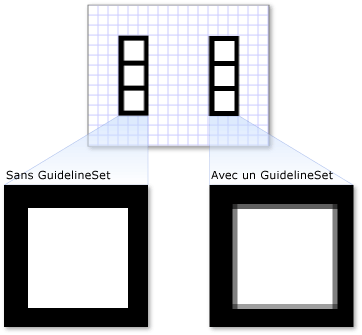

# Vue d'ensemble des objets Drawing
Cette rubrique présente les <xref:System.Windows.Media.Drawing> des objets et décrit comment les utiliser pour dessiner efficacement des formes, les images bitmap, le texte et support. Utilisez <xref:System.Windows.Media.Drawing> peindre des objets lorsque vous créez une image clipart, avec un <xref:System.Windows.Media.DrawingBrush>, ou utilisez <xref:System.Windows.Media.Visual> objets.  
  
 
  
   
## Qu’est-ce qu’un objet Drawing ?  
 A <xref:System.Windows.Media.Drawing> objet décrit le contenu visible, comme une forme, bitmap, vidéo ou une ligne de texte. Différents types de dessins décrivent différents types de contenus. La liste suivante répertorie les différents types d’objets Drawing.  
  
-   <xref:System.Windows.Media.GeometryDrawing>– Dessine une forme.  
  
-   <xref:System.Windows.Media.ImageDrawing>– Dessine une image.  
  
-   <xref:System.Windows.Media.GlyphRunDrawing>– Dessine du texte.  
  
-   <xref:System.Windows.Media.VideoDrawing>– Lit un fichier audio ou vidéo.  
  
-   <xref:System.Windows.Media.DrawingGroup>– Dessine d’autres dessins. Utilisez un groupe de dessins pour faire de plusieurs dessins un seul et même dessin composite.  
  
 <xref:System.Windows.Media.Drawing>les objets sont polyvalents. Il existe plusieurs façons, vous pouvez utiliser un <xref:System.Windows.Media.Drawing> objet.  
  
-   Vous pouvez l’afficher en tant qu’image en utilisant un <xref:System.Windows.Media.DrawingImage> et un <xref:System.Windows.Controls.Image> contrôle.  
  
-   Vous pouvez l’utiliser avec un <xref:System.Windows.Media.DrawingBrush> pour peindre un objet, tel que le <xref:System.Windows.Controls.Page.Background%2A> d’un <xref:System.Windows.Controls.Page>.  
  
-   Vous pouvez l’utiliser pour décrire l’apparence d’un <xref:System.Windows.Media.DrawingVisual>.  
  
-   Vous pouvez l’utiliser pour énumérer le contenu d’un <xref:System.Windows.Media.Visual>.  
  
 WPF fournit d’autres types d’objets qui sont capables de dessiner des formes, des images bitmaps, du texte et des médias. Par exemple, vous pouvez également utiliser <xref:System.Windows.Shapes.Shape> pour dessiner des formes, les objets et les <xref:System.Windows.Controls.MediaElement> contrôle fournit une autre méthode pour ajouter une vidéo à votre application. Par conséquent, quand faut-il utiliser <xref:System.Windows.Media.Drawing> objets ? Lorsque vous pouvez sacrifier des fonctionnalités au niveau du framework pour optimiser les performances ou lorsque vous devez <xref:System.Windows.Freezable> fonctionnalités. Étant donné que <xref:System.Windows.Media.Drawing> objets ne disposent pas de prise en charge de [disposition](../../../../docs/framework/wpf/advanced/layout.md), entrée et le focus, ils fournissent de meilleures performances qui les rendent idéaux pour décrire des arrière-plans, image clipart et pour le dessin de bas niveau avec <xref:System.Windows.Media.Visual> objets.  
  
 Étant un type <xref:System.Windows.Freezable> objet, <xref:System.Windows.Media.Drawing> objets disposent de plusieurs fonctionnalités spéciales, comme suit : elles peuvent être déclarées comme [ressources](../../../../docs/framework/wpf/advanced/xaml-resources.md), partagés entre plusieurs objets, définis en lecture seule pour améliorer performances, clonés et rendus thread-safe. Pour plus d’informations sur les différentes fonctionnalités fournies par <xref:System.Windows.Freezable> , consultez la [vue d’ensemble des objets Freezable](../../../../docs/framework/wpf/advanced/freezable-objects-overview.md).  
  
   
## Dessiner une forme  
 Pour dessiner une forme, vous utilisez un <xref:System.Windows.Media.GeometryDrawing>. Un dessin de géométrie <xref:System.Windows.Media.GeometryDrawing.Geometry%2A> propriété décrit la forme à dessiner, son <xref:System.Windows.Media.GeometryDrawing.Brush%2A> propriété décrit comment peindre l’intérieur de la forme et son <xref:System.Windows.Media.GeometryDrawing.Pen%2A> propriété décrit comment dessiner son contour.  
  
 L’exemple suivant utilise un <xref:System.Windows.Media.GeometryDrawing> pour dessiner une forme. La forme est décrite par un <xref:System.Windows.Media.GeometryGroup> et deux <xref:System.Windows.Media.EllipseGeometry> objets. Est peint l’intérieur de la forme avec un <xref:System.Windows.Media.LinearGradientBrush> et son contour est dessiné avec un <xref:System.Windows.Media.Brushes.Black%2A> <xref:System.Windows.Media.Pen>.  
  
 Cet exemple crée les éléments suivants <xref:System.Windows.Media.GeometryDrawing>.  
  
   
GeometryDrawing  
  
 [!code-csharp[DrawingMiscSnippets_snip#GeometryDrawingExampleInline](../../../../samples/snippets/csharp/VS_Snippets_Wpf/DrawingMiscSnippets_snip/CSharp/GeometryDrawingExample.cs#geometrydrawingexampleinline)]
 [!code-xaml[DrawingMiscSnippets_snip#GeometryDrawingExampleInline](../../../../samples/snippets/xaml/VS_Snippets_Wpf/DrawingMiscSnippets_snip/XAML/GeometryDrawingExample.xaml#geometrydrawingexampleinline)]  
  
 Vous trouverez l’exemple complet sur la page [Créer un GeometryDrawing](../../../../docs/framework/wpf/graphics-multimedia/how-to-create-a-geometrydrawing.md).  
  
 Autres <xref:System.Windows.Media.Geometry> classes, telles que <xref:System.Windows.Media.PathGeometry> vous permettent de créer des formes plus complexes en créant des courbes et des arcs. Pour plus d’informations sur <xref:System.Windows.Media.Geometry> , consultez la [vue d’ensemble de Geometry](../../../../docs/framework/wpf/graphics-multimedia/geometry-overview.md).  
  
 Pour plus d’informations sur les autres méthodes pour dessiner des formes qui n’utilisent pas <xref:System.Windows.Media.Drawing> , consultez [formes et dessins de base dans WPF Overview](../../../../docs/framework/wpf/graphics-multimedia/shapes-and-basic-drawing-in-wpf-overview.md).  
  
   
## Dessiner une image  
 Pour dessiner une image, vous utilisez un <xref:System.Windows.Media.ImageDrawing>. Un <xref:System.Windows.Media.ImageDrawing> l’objet <xref:System.Windows.Media.ImageDrawing.ImageSource%2A> propriété décrit l’image à dessiner et son <xref:System.Windows.Media.ImageDrawing.Rect%2A> propriété définit la région où l’image est dessinée.  
  
 L’exemple suivant dessine une image dans un rectangle situé à (75,75), de 100 par 100 pixels. L’illustration suivante montre le <xref:System.Windows.Media.ImageDrawing> créé par l’exemple. Une bordure grise a été ajoutée pour montrer les limites de la <xref:System.Windows.Media.ImageDrawing>.  
  
 ![Un ImageDrawing 100 par 100 dessiné à &#40; 75,75 &#41; ] (../../../../docs/framework/wpf/graphics-multimedia/media/graphicsmm-simple-imagedrawing-offset.png "graphicsmm_simple_imagedrawing_offset")  
ImageDrawing 100 par 100  
  
 [!code-csharp[DrawingMiscSnippets_snip#ImageDrawing100by100Inline](../../../../samples/snippets/csharp/VS_Snippets_Wpf/DrawingMiscSnippets_snip/CSharp/ImageDrawingExample.cs#imagedrawing100by100inline)]
 [!code-xaml[DrawingMiscSnippets_snip#ImageDrawing100by100Inline](../../../../samples/snippets/xaml/VS_Snippets_Wpf/DrawingMiscSnippets_snip/XAML/ImageDrawingExample.xaml#imagedrawing100by100inline)]  
  
 Pour plus d’informations sur les images, consultez la [Vue d’ensemble de la création d’images](../../../../docs/framework/wpf/graphics-multimedia/imaging-overview.md).  
  
   
## Lire un média (code uniquement)  
  
> [!NOTE]
>  Vous pouvez déclarer un <xref:System.Windows.Media.VideoDrawing> dans [!INCLUDE[TLA#tla_xaml](../../../../includes/tlasharptla-xaml-md.md)], vous ne pouvez charger et lire son média à l’aide de code. Pour lire une vidéo dans [!INCLUDE[TLA#tla_xaml](../../../../includes/tlasharptla-xaml-md.md)], utilisez un <xref:System.Windows.Controls.MediaElement> à la place.  
  
 Pour lire un fichier audio ou vidéo, vous utilisez un <xref:System.Windows.Media.VideoDrawing> et un <xref:System.Windows.Media.MediaPlayer>. Il y a deux façons de charger et de lire des médias. La première consiste à utiliser un <xref:System.Windows.Media.MediaPlayer> et un <xref:System.Windows.Media.VideoDrawing> par eux-mêmes et la seconde façon consiste à créer vos propres <xref:System.Windows.Media.MediaTimeline> à utiliser avec le <xref:System.Windows.Media.MediaPlayer> et <xref:System.Windows.Media.VideoDrawing>.  
  
> [!NOTE]
>  Lorsque vous distribuez un contenu multimédia avec votre application, vous ne pouvez pas utiliser de fichier multimédia comme ressource de projet, comme pour une image. Dans votre fichier projet, vous devez plutôt définir le type de média sur `Content` et définir `CopyToOutputDirectory` sur `PreserveNewest` ou `Always`.  
  
 Pour lire des médias sans créer votre propre <xref:System.Windows.Media.MediaTimeline>, vous procédez comme suit.  
  
1.  Créez un objet <xref:System.Windows.Media.MediaPlayer>.  
  
     [!code-csharp[DrawingMiscSnippets_snip#VideoDrawingExampleInline1](../../../../samples/snippets/csharp/VS_Snippets_Wpf/DrawingMiscSnippets_snip/CSharp/VideoDrawingExample.cs#videodrawingexampleinline1)]  
  
2.  Utilisez la <xref:System.Windows.Media.MediaPlayer.Open%2A> méthode pour charger le fichier multimédia.  
  
     [!code-csharp[DrawingMiscSnippets_snip#VideoDrawingExampleInline2](../../../../samples/snippets/csharp/VS_Snippets_Wpf/DrawingMiscSnippets_snip/CSharp/VideoDrawingExample.cs#videodrawingexampleinline2)]  
  
3.  Créer un <xref:System.Windows.Media.VideoDrawing>.  
  
     [!code-csharp[DrawingMiscSnippets_snip#VideoDrawingExampleInline3](../../../../samples/snippets/csharp/VS_Snippets_Wpf/DrawingMiscSnippets_snip/CSharp/VideoDrawingExample.cs#videodrawingexampleinline3)]  
  
4.  Spécifiez la taille et l’emplacement où dessiner le média en définissant le <xref:System.Windows.Media.VideoDrawing.Rect%2A> propriété de la <xref:System.Windows.Media.VideoDrawing>.  
  
     [!code-csharp[DrawingMiscSnippets_snip#VideoDrawingExampleInline4](../../../../samples/snippets/csharp/VS_Snippets_Wpf/DrawingMiscSnippets_snip/CSharp/VideoDrawingExample.cs#videodrawingexampleinline4)]  
  
5.  Définir le <xref:System.Windows.Media.VideoDrawing.Player%2A> propriété de la <xref:System.Windows.Media.VideoDrawing> avec la <xref:System.Windows.Media.MediaPlayer> que vous avez créé.  
  
     [!code-csharp[DrawingMiscSnippets_snip#VideoDrawingExampleInline5](../../../../samples/snippets/csharp/VS_Snippets_Wpf/DrawingMiscSnippets_snip/CSharp/VideoDrawingExample.cs#videodrawingexampleinline5)]  
  
6.  Utilisez le <xref:System.Windows.Media.MediaPlayer.Play%2A> méthode de le <xref:System.Windows.Media.MediaPlayer> pour démarrer la lecture du média.  
  
     [!code-csharp[DrawingMiscSnippets_snip#VideoDrawingExampleInline6](../../../../samples/snippets/csharp/VS_Snippets_Wpf/DrawingMiscSnippets_snip/CSharp/VideoDrawingExample.cs#videodrawingexampleinline6)]  
  
 L’exemple suivant utilise un <xref:System.Windows.Media.VideoDrawing> et un <xref:System.Windows.Media.MediaPlayer> pour lire un fichier vidéo une seule fois.  
  
 [!code-csharp[DrawingMiscSnippets_snip#VideoDrawingExampleInline](../../../../samples/snippets/csharp/VS_Snippets_Wpf/DrawingMiscSnippets_snip/CSharp/VideoDrawingExample.cs#videodrawingexampleinline)]  
  
 Pour obtenir le contrôle du minutage du média, utilisez un <xref:System.Windows.Media.MediaTimeline> avec la <xref:System.Windows.Media.MediaPlayer> et <xref:System.Windows.Media.VideoDrawing> objets. Le <xref:System.Windows.Media.MediaTimeline> vous permet de spécifier si la vidéo doit se répéter. Pour utiliser un <xref:System.Windows.Media.MediaTimeline> avec un <xref:System.Windows.Media.VideoDrawing>, vous effectuez les opérations suivantes :  
  
1.  Déclarez le <xref:System.Windows.Media.MediaTimeline> et définissez ses comportements de minutage.  
  
     [!code-csharp[DrawingMiscSnippets_snip#RepeatingVideoDrawingExampleInline1](../../../../samples/snippets/csharp/VS_Snippets_Wpf/DrawingMiscSnippets_snip/CSharp/VideoDrawingExample.cs#repeatingvideodrawingexampleinline1)]  
  
2.  Créer un <xref:System.Windows.Media.MediaClock> à partir de la <xref:System.Windows.Media.MediaTimeline>.  
  
     [!code-csharp[DrawingMiscSnippets_snip#RepeatingVideoDrawingExampleInline2](../../../../samples/snippets/csharp/VS_Snippets_Wpf/DrawingMiscSnippets_snip/CSharp/VideoDrawingExample.cs#repeatingvideodrawingexampleinline2)]  
  
3.  Créer un <xref:System.Windows.Media.MediaPlayer> et utiliser le <xref:System.Windows.Media.MediaClock> pour définir son <xref:System.Windows.Media.MediaPlayer.Clock%2A> propriété.  
  
     [!code-csharp[DrawingMiscSnippets_snip#RepeatingVideoDrawingExampleInline3](../../../../samples/snippets/csharp/VS_Snippets_Wpf/DrawingMiscSnippets_snip/CSharp/VideoDrawingExample.cs#repeatingvideodrawingexampleinline3)]  
  
4.  Créer un <xref:System.Windows.Media.VideoDrawing> et affecter les <xref:System.Windows.Media.MediaPlayer> à la <xref:System.Windows.Media.VideoDrawing.Player%2A> propriété de la <xref:System.Windows.Media.VideoDrawing>.  
  
     [!code-csharp[DrawingMiscSnippets_snip#RepeatingVideoDrawingExampleInline4](../../../../samples/snippets/csharp/VS_Snippets_Wpf/DrawingMiscSnippets_snip/CSharp/VideoDrawingExample.cs#repeatingvideodrawingexampleinline4)]  
  
 L’exemple suivant utilise un <xref:System.Windows.Media.MediaTimeline> avec un <xref:System.Windows.Media.MediaPlayer> et un <xref:System.Windows.Media.VideoDrawing> pour lire une vidéo à plusieurs reprises.  
  
 [!code-csharp[DrawingMiscSnippets_snip#RepeatingVideoDrawingExampleInline](../../../../samples/snippets/csharp/VS_Snippets_Wpf/DrawingMiscSnippets_snip/CSharp/VideoDrawingExample.cs#repeatingvideodrawingexampleinline)]  
  
 Notez que, lorsque vous utilisez un <xref:System.Windows.Media.MediaTimeline>, vous utilisez la page d’accueil <xref:System.Windows.Media.Animation.ClockController> retourné à partir de la <xref:System.Windows.Media.Animation.Clock.Controller%2A> propriété de la <xref:System.Windows.Media.MediaClock> pour contrôler la lecture à la place des méthodes interactives de <xref:System.Windows.Media.MediaPlayer>.  
  
   
## Dessiner du texte  
 Pour dessiner du texte, vous utilisez un <xref:System.Windows.Media.GlyphRunDrawing> et un <xref:System.Windows.Media.GlyphRun>. L’exemple suivant utilise un <xref:System.Windows.Media.GlyphRunDrawing> pour dessiner le texte « Hello World ».  
  
 [!code-csharp[DrawingMiscSnippets_snip#GlyphRunDrawingExampleInline](../../../../samples/snippets/csharp/VS_Snippets_Wpf/DrawingMiscSnippets_snip/CSharp/GlyphRunDrawingExample.cs#glyphrundrawingexampleinline)]
 [!code-xaml[DrawingMiscSnippets_snip#GlyphRunDrawingExampleInline](../../../../samples/snippets/xaml/VS_Snippets_Wpf/DrawingMiscSnippets_snip/XAML/GlyphRunExample.xaml#glyphrundrawingexampleinline)]  
  
 A <xref:System.Windows.Media.GlyphRun> est un objet de bas niveau prévu pour une utilisation avec les scénarios d’impression et de présentation du document de format fixe. Dessiner du texte à l’écran le plus simple consiste à utiliser un <xref:System.Windows.Controls.Label> ou <xref:System.Windows.Controls.TextBlock>. Pour plus d’informations sur <xref:System.Windows.Media.GlyphRun>, consultez la [Introduction à l’objet GlyphRun et l’élément de glyphes](../../../../docs/framework/wpf/advanced/introduction-to-the-glyphrun-object-and-glyphs-element.md) vue d’ensemble.  
  
   
## Dessins composites  
 A <xref:System.Windows.Media.DrawingGroup> vous permet de combiner plusieurs dessins en un seul dessin composite. En utilisant un <xref:System.Windows.Media.DrawingGroup>, vous pouvez combiner des formes, images et du texte dans un seul <xref:System.Windows.Media.Drawing> objet.  
  
 L’exemple suivant utilise un <xref:System.Windows.Media.DrawingGroup> pour combiner deux <xref:System.Windows.Media.GeometryDrawing> objets et un <xref:System.Windows.Media.ImageDrawing> objet. Cet exemple produit la sortie suivante.  
  
   
Un dessin composite  
  
 [!code-csharp[DrawingMiscSnippets_snip#GraphicsMMSimpleDrawingGroupExample](../../../../samples/snippets/csharp/VS_Snippets_Wpf/DrawingMiscSnippets_snip/CSharp/DrawingGroupExample.cs#graphicsmmsimpledrawinggroupexample)]
 [!code-xaml[DrawingMiscSnippets_snip#GraphicsMMSimpleDrawingGroupExample](../../../../samples/snippets/xaml/VS_Snippets_Wpf/DrawingMiscSnippets_snip/XAML/DrawingGroupExample.xaml#graphicsmmsimpledrawinggroupexample)]  
  
 A <xref:System.Windows.Media.DrawingGroup> vous permet également d’appliquer des masques d’opacité, des transformations, des effets bitmap et d’autres opérations à son contenu. <xref:System.Windows.Media.DrawingGroup>les opérations sont appliquées dans l’ordre suivant : <xref:System.Windows.Media.DrawingGroup.OpacityMask%2A>, <xref:System.Windows.Media.DrawingGroup.Opacity%2A>, <xref:System.Windows.Media.DrawingGroup.BitmapEffect%2A>, <xref:System.Windows.Media.DrawingGroup.ClipGeometry%2A>, <xref:System.Windows.Media.DrawingGroup.GuidelineSet%2A>, puis <xref:System.Windows.Media.DrawingGroup.Transform%2A>.  
  
 L’illustration suivante montre l’ordre dans lequel <xref:System.Windows.Media.DrawingGroup> les opérations sont appliquées.  
  
   
Ordre des opérations DrawingGroup  
  
 Le tableau suivant décrit les propriétés que vous pouvez utiliser pour manipuler un <xref:System.Windows.Media.DrawingGroup> contenu de l’objet.  
  
|Propriété|Description|Illustration|  
|--------------|-----------------|------------------|  
|<xref:System.Windows.Media.DrawingGroup.OpacityMask%2A>|Modifie l’opacité de certaines parties de la <xref:System.Windows.Media.DrawingGroup> contenu. Vous trouverez un exemple sur la page [Guide pratique : contrôler l’opacité d’un dessin](http://msdn.microsoft.com/library/68580652-7d32-4d27-93cc-a5148cf4d5ee).||  
|<xref:System.Windows.Media.DrawingGroup.Opacity%2A>|Modifie uniformément l’opacité de la <xref:System.Windows.Media.DrawingGroup> contenu. Cette propriété permet d’effectuer une <xref:System.Windows.Media.Drawing> totalement ou partiellement transparent. Vous trouverez un exemple sur la page [Guide pratique : appliquer un masque d’opacité à un dessin](http://msdn.microsoft.com/library/d77b420b-9be2-479c-a45e-82f4da30eb9f).||  
|<xref:System.Windows.Media.DrawingGroup.BitmapEffect%2A>|Applique un <xref:System.Windows.Media.Effects.BitmapEffect> à la <xref:System.Windows.Media.DrawingGroup> contenu. Vous trouverez un exemple sur la page [Guide pratique : appliquer un BitmapEffect à un dessin](http://msdn.microsoft.com/library/c5b1de83-8d09-47fb-96db-5f174471f4b5).||  
|<xref:System.Windows.Media.DrawingGroup.ClipGeometry%2A>|Fait coïncider les <xref:System.Windows.Media.DrawingGroup> contenu dans une région décrivent l’utilisation d’un <xref:System.Windows.Media.Geometry>. Vous trouverez un exemple sur la page [Guide pratique : détourer un dessin](http://msdn.microsoft.com/library/1f7d8a2c-c3c2-42cb-a542-e6796f9fb058) .||  
|<xref:System.Windows.Media.DrawingGroup.GuidelineSet%2A>|Aligne des pixels indépendants des appareils sur les pixels de l’appareil selon les instructions spécifiées. Cette propriété est utile pour s’assurer que les graphismes très détaillés s’affichent nettement sur les écrans basse résolution. Vous trouverez un exemple sur la page [Guide pratique : appliquer un GuidelineSet à un dessin](../../../../docs/framework/wpf/graphics-multimedia/how-to-apply-a-guidelineset-to-a-drawing.md).||  
|<xref:System.Windows.Media.DrawingGroup.Transform%2A>|Transforme le <xref:System.Windows.Media.DrawingGroup> contenu. Vous trouverez un exemple sur la page [Guide pratique : appliquer un Transform à un dessin](http://msdn.microsoft.com/library/0d525f2b-682d-4d67-9660-cf46929fbabd).||  
  
   
## Afficher un dessin comme image  
 Pour afficher un <xref:System.Windows.Media.Drawing> avec un <xref:System.Windows.Controls.Image> contrôler, utilisez un <xref:System.Windows.Media.DrawingImage> comme le <xref:System.Windows.Controls.Image> du contrôle <xref:System.Windows.Controls.Image.Source%2A> et définir le <xref:System.Windows.Media.DrawingImage> l’objet <xref:System.Windows.Media.DrawingImage.Drawing%2A?displayProperty=nameWithType> propriété au dessin que vous souhaitez afficher.  
  
 L’exemple suivant utilise un <xref:System.Windows.Media.DrawingImage> et un <xref:System.Windows.Controls.Image> contrôle pour afficher un <xref:System.Windows.Media.GeometryDrawing>. Cet exemple produit la sortie suivante.  
  
   
DrawingImage  
  
 [!code-csharp[DrawingMiscSnippets_snip#DrawingImageExampleWholePage](../../../../samples/snippets/csharp/VS_Snippets_Wpf/DrawingMiscSnippets_snip/CSharp/DrawingImageExample.cs#drawingimageexamplewholepage)]
 [!code-xaml[DrawingMiscSnippets_snip#DrawingImageExampleWholePage](../../../../samples/snippets/xaml/VS_Snippets_Wpf/DrawingMiscSnippets_snip/XAML/DrawingImageExample.xaml#drawingimageexamplewholepage)]  
  
   
## Peindre un objet avec un dessin  
 A <xref:System.Windows.Media.DrawingBrush> est un type de pinceau qui peint une zone avec un objet de dessin. Vous pouvez l’utiliser pour peindre n’importe quel objet graphique avec un dessin. Le <xref:System.Windows.Media.Drawing> propriété d’un <xref:System.Windows.Media.DrawingBrush> décrit son <xref:System.Windows.Media.DrawingBrush.Drawing%2A>. Pour rendre un <xref:System.Windows.Media.Drawing> avec un <xref:System.Windows.Media.DrawingBrush>, ajoutez-le au pinceau à l’aide du pinceau <xref:System.Windows.Media.Drawing> propriété et utiliser le pinceau pour peindre une représentation graphique de l’objet, par exemple un contrôle ou du panneau.  
  
 Les exemples suivants utilisent une <xref:System.Windows.Media.DrawingBrush> pour peindre le <xref:System.Windows.Shapes.Shape.Fill%2A> d’un <xref:System.Windows.Shapes.Rectangle> avec un modèle créé à partir d’un <xref:System.Windows.Media.GeometryDrawing>. Cet exemple produit la sortie suivante.  
  
   
GeometryDrawing utilisé avec un DrawingBrush  
  
 [!code-csharp[DrawingMiscSnippets_snip#DrawingBrushExampleWholePage](../../../../samples/snippets/csharp/VS_Snippets_Wpf/DrawingMiscSnippets_snip/CSharp/DrawingBrushExample.cs#drawingbrushexamplewholepage)]
 [!code-xaml[DrawingMiscSnippets_snip#DrawingBrushExampleWholePage](../../../../samples/snippets/xaml/VS_Snippets_Wpf/DrawingMiscSnippets_snip/XAML/DrawingBrushExample.xaml#drawingbrushexamplewholepage)]  
  
 La <xref:System.Windows.Media.DrawingBrush> classe fournit un éventail d’options d’étirement et son contenu de mosaïque. Pour plus d’informations sur <xref:System.Windows.Media.DrawingBrush>, consultez la [peinture avec des Images, des dessins et des éléments visuels](../../../../docs/framework/wpf/graphics-multimedia/painting-with-images-drawings-and-visuals.md) vue d’ensemble.  
  
   
## Afficher un dessin avec un objet visuel  
 A <xref:System.Windows.Media.DrawingVisual> est un type d’objet visuel conçu pour restituer un dessin. Les développeurs qui souhaitent créer un environnement graphique hautement personnalisé peuvent travailler directement sur la couche visuelle, qui n’est pas décrite dans cette vue d’ensemble. Pour plus d’informations, consultez la vue d’ensemble [Utiliser des objets DrawingVisual](../../../../docs/framework/wpf/graphics-multimedia/using-drawingvisual-objects.md).  
  
   
## Objets DrawingContext  
 Le <xref:System.Windows.Media.DrawingContext> classe vous permet de remplir un <xref:System.Windows.Media.Visual> ou un <xref:System.Windows.Media.Drawing> avec un contenu visuel. Nombre d’objets graphiques de niveau inférieur utilisent un <xref:System.Windows.Media.DrawingContext> , car il décrit le contenu graphique très efficacement.  
  
 Bien que le <xref:System.Windows.Media.DrawingContext> les méthodes de dessin ressembler aux méthodes de dessin de le <xref:System.Drawing.Graphics?displayProperty=nameWithType> type, elles sont en réalité très différentes. <xref:System.Windows.Media.DrawingContext>est utilisé avec un système graphique à mode conservé, tandis que le <xref:System.Drawing.Graphics?displayProperty=nameWithType> type est utilisé avec un système de graphique en mode exécution. Lorsque vous utilisez un <xref:System.Windows.Media.DrawingContext> commandes de dessin de l’objet, vous stockez réellement un jeu d’instructions de rendu (bien que le mécanisme de stockage exact varie selon le type d’objet qui fournit le <xref:System.Windows.Media.DrawingContext>) qui sera utilisée ultérieurement par les graphiques système ; ne dessinez pas à l’écran en temps réel. Pour plus d’informations sur la façon dont le système de graphismes [!INCLUDE[TLA#tla_wpf](../../../../includes/tlasharptla-wpf-md.md)] fonctionne, consultez la [Vue d’ensemble du rendu des graphismes WPF](../../../../docs/framework/wpf/graphics-multimedia/wpf-graphics-rendering-overview.md).  
  
 Vous instanciez jamais directement un <xref:System.Windows.Media.DrawingContext>; vous pouvez toutefois acquérir un contexte de dessin de certaines méthodes, telles que <xref:System.Windows.Media.DrawingGroup.Open%2A?displayProperty=nameWithType> et <xref:System.Windows.Media.DrawingVisual.RenderOpen%2A?displayProperty=nameWithType>.  
  
   
## Énumérer le contenu d’un objet visuel  
 Outre leurs autres utilisations, <xref:System.Windows.Media.Drawing> objets fournissent également un modèle d’objet pour énumérer le contenu d’un <xref:System.Windows.Media.Visual>.  
  
 L’exemple suivant utilise le <xref:System.Windows.Media.VisualTreeHelper.GetDrawing%2A> pour récupérer le <xref:System.Windows.Media.DrawingGroup> valeur d’un <xref:System.Windows.Media.Visual> et énumérer.  
  
 [!code-csharp[DrawingMiscSnippets_snip#GraphicsMMRetrieveDrawings](../../../../samples/snippets/csharp/VS_Snippets_Wpf/DrawingMiscSnippets_snip/CSharp/EnumerateDrawingsExample.xaml.cs#graphicsmmretrievedrawings)]  
  
## Voir aussi  
 <xref:System.Windows.Media.Drawing>  
 <xref:System.Windows.Media.DrawingGroup>  
 [Graphiques 2D et acquisition d'images](../../../../docs/framework/wpf/advanced/optimizing-performance-2d-graphics-and-imaging.md)  
 [Peinture avec des images, des dessins et des objets visuels](../../../../docs/framework/wpf/graphics-multimedia/painting-with-images-drawings-and-visuals.md)  
 [Vue d’ensemble de Geometry](../../../../docs/framework/wpf/graphics-multimedia/geometry-overview.md)  
 [Vue d’ensemble des formes et dessins de base dans WPF](../../../../docs/framework/wpf/graphics-multimedia/shapes-and-basic-drawing-in-wpf-overview.md)  
 [Vue d’ensemble du rendu graphique de WPF](../../../../docs/framework/wpf/graphics-multimedia/wpf-graphics-rendering-overview.md)  
 [Vue d’ensemble des objets Freezable](../../../../docs/framework/wpf/advanced/freezable-objects-overview.md)  
 [Rubriques de guide pratique](../../../../docs/framework/wpf/graphics-multimedia/drawings-how-to-topics.md)
