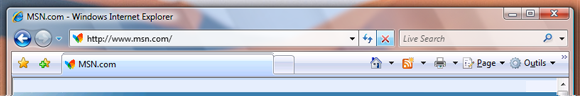

# &#201;tendre le cadre de transparence dans une application WPF
Cette rubrique montre comment étendre le cadre de transparence [!INCLUDE[TLA#tla_winvista](../../../../includes/tlasharptla-winvista-md.md)] dans la zone cliente d'une application [!INCLUDE[TLA#tla_wpf](../../../../includes/tlasharptla-wpf-md.md)].  
  
> [!NOTE]
>  Cet exemple fonctionne uniquement sur un ordinateur [!INCLUDE[TLA2#tla_winvista](../../../../includes/tla2sharptla-winvista-md.md)] exécutant le Gestionnaire de fenêtrage avec la fonction de cadre de transparence activée.  L'édition Familiale Basique [!INCLUDE[TLA2#tla_winvista](../../../../includes/tla2sharptla-winvista-md.md)] ne prend pas en charge l'effet d'affichage transparent.  Dans les autres éditions de [!INCLUDE[TLA2#tla_winvista](../../../../includes/tla2sharptla-winvista-md.md)], les zones pouvant avoir un rendu avec l'effet d'affichage transparent ont un rendu opaque.  
  
## Exemple  
 L'image illustre le cadre de transparence étendu dans la barre d'adresse d'Internet Explorer 7.  
  
 **Internet Explorer avec le cadre de transparence derrière la barre d'adresse.**  
  
   
  
 Pour étendre le cadre de transparence dans une application [!INCLUDE[TLA2#tla_wpf](../../../../includes/tla2sharptla-wpf-md.md)], l'accès à une [!INCLUDE[TLA#tla_api](../../../../includes/tlasharptla-api-md.md)] non managée est nécessaire.  L'exemple de code suivant effectue un appel de code non managé \(pinvoke\) pour les deux [!INCLUDE[TLA2#tla_api](../../../../includes/tla2sharptla-api-md.md)] requises pour étendre le cadre dans la zone cliente.  Chacune de ces [!INCLUDE[TLA2#tla_api](../../../../includes/tla2sharptla-api-md.md)] est déclarée dans une classe appelée **NonClientRegionAPI**.  
  
<!-- TODO: review snippet reference  [!CODE [AvalonClientGlass#DWMExtendFramePInvokeAPI](AvalonClientGlass#DWMExtendFramePInvokeAPI)]  -->  
  
 [DwmExtendFrameIntoClientArea](_udwm_dwmextendframeintoclientarea)  est la fonction du Gestionnaire de fenêtrage qui étend l'image dans la zone cliente.  Il prend deux paramètres; un handle de fenêtre et une structure [MARGINS](inet_MARGINS).  [MARGINS](inet_MARGINS) sert à indiquer au Gestionnaire de fenêtrage de combien le cadre doit être étendu dans la zone cliente.  
  
## Exemple  
 Pour utiliser la fonction [DwmExtendFrameIntoClientArea](_udwm_dwmextendframeintoclientarea), un handle de fenêtre doit être obtenu.  Dans [!INCLUDE[TLA2#tla_wpf](../../../../includes/tla2sharptla-wpf-md.md)], le handle de fenêtre doit être obtenu à partir de la propriété <xref:System.Windows.Interop.HwndSource.Handle%2A> d'une <xref:System.Windows.Interop.HwndSource>.  Dans l'exemple suivant, le cadre est étendu dans la zone cliente lors de l'événement de la fenêtre <xref:System.Windows.FrameworkElement.Loaded>.  
  
<!-- TODO: review snippet reference  [!CODE [AvalonClientGlass#AvalonGlassOnLoadedCSharp](AvalonClientGlass#AvalonGlassOnLoadedCSharp)]  -->  
  
## Exemple  
 L'exemple suivant montre une simple fenêtre dans laquelle le cadre est étendu dans la zone cliente.  Le cadre est étendu derrière la bordure supérieure contenant les deux objets <xref:System.Windows.Controls.TextBox>.  
  
<!-- TODO: review snippet reference  [!CODE [AvalonClientGlass#AvalonGlassFullWindowXAML](AvalonClientGlass#AvalonGlassFullWindowXAML)]  -->  
  
 L'image suivante illustre le cadre de transparence étendu dans une application [!INCLUDE[TLA2#tla_wpf](../../../../includes/tla2sharptla-wpf-md.md)].  
  
 **Cadre de transparence étendu dans une application**  [!INCLUDE[TLA2#tla_wpf](../../../../includes/tla2sharptla-wpf-md.md)] **.**  
  
   
  
## Voir aussi  
 [Vue d'ensemble du Gestionnaire de fenêtrage](_udwm_overview)   
 [Vue d'ensemble de la fonction de flou du Gestionnaire de fenêtrage](_udwm_blur_ovw)   
 [DwmExtendFrameIntoClientArea](_udwm_dwmextendframeintoclientarea)