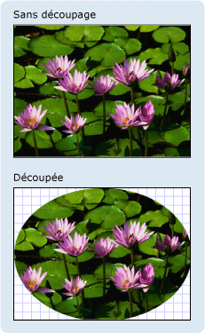

# Vue d&#39;ensemble de Geometry
Cette vue d'ensemble décrit l'utilisation des classes [!INCLUDE[TLA#tla_winclient](../../../../includes/tlasharptla-winclient-md.md)] <xref:System.Windows.Media.Geometry> pour décrire les formes.  Cette rubrique compare également les différences entre les objets <xref:System.Windows.Media.Geometry> et les éléments <xref:System.Windows.Shapes.Shape>.  
  
   
  
   
## Qu'est\-ce qu'une géométrie ?  
 La classe <xref:System.Windows.Media.Geometry> et les classes qui en dérivent, telles que <xref:System.Windows.Media.EllipseGeometry>, <xref:System.Windows.Media.PathGeometry> et <xref:System.Windows.Media.CombinedGeometry> permettent de décrire la géométrie d'une forme 2D.  Ces descriptions géométriques ont de nombreux usages, tels que la définition d'une forme pour peindre l'écran ou la définition de régions de test de recherche et de découpage.  Vous pouvez même utiliser une géométrie pour définir un chemin d'accès d'animation.  
  
 Les objets <xref:System.Windows.Media.Geometry> peuvent être simples, tels que des rectangles et des cercles, ou composites, créés à partir d'au moins deux objets géométriques.  Des géométries plus complexes peuvent être créées à l'aide des classes <xref:System.Windows.Media.PathGeometry> et <xref:System.Windows.Media.StreamGeometry> qui vous permettent de décrire des arcs et des courbes.  
  
 Comme <xref:System.Windows.Media.Geometry> est un type de <xref:System.Windows.Freezable>, les objets <xref:System.Windows.Media.Geometry> fournissent plusieurs fonctionnalités spéciales : ils peuvent être déclarés comme [ressources](../../../../docs/framework/wpf/advanced/xaml-resources.md), partagés entre de nombreux objets, configurés en lecture seule pour améliorer les performances, clonés et rendus thread\-safe.  Pour plus d'informations sur les différentes fonctionnalités fournies par les objets <xref:System.Windows.Freezable>, consultez [Vue d'ensemble des objets Freezable](../../../../docs/framework/wpf/advanced/freezable-objects-overview.md).  
  
   
## Géométries contreformes  
 Les classes <xref:System.Windows.Media.Geometry> et <xref:System.Windows.Shapes.Shape> sont apparemment semblables dans le sens où elles décrivent toutes les deux des formes 2D \(si l'on compare par exemple <xref:System.Windows.Media.EllipseGeometry> et <xref:System.Windows.Shapes.Ellipse>\), mais elles présentent des différences importantes.  
  
 Pour l'une, la classe <xref:System.Windows.Media.Geometry> hérite de la classe <xref:System.Windows.Freezable>, tandis que la classe <xref:System.Windows.Shapes.Shape> hérite de <xref:System.Windows.FrameworkElement>.  Compte tenu que ce sont des éléments, les objets <xref:System.Windows.Shapes.Shape> peuvent se rendre et participer au système de disposition, contrairement aux objets <xref:System.Windows.Media.Geometry>.  
  
 Bien que les objets <xref:System.Windows.Shapes.Shape> soient plus facilement utilisables que les objets <xref:System.Windows.Media.Geometry>, les objets <xref:System.Windows.Media.Geometry> sont plus polyvalents.  Alors qu'un objet <xref:System.Windows.Shapes.Shape> est utilisé pour rendre des graphiques 2D, un objet <xref:System.Windows.Media.Geometry> peut être utilisé pour définir la région géométrique pour les graphiques 2D, définir une région pour le découpage ou définir une région pour le test de recherche, par exemple.  
  
### Le trajet  
 Un <xref:System.Windows.Shapes.Shape>, la classe <xref:System.Windows.Shapes.Path>, utilise en fait un <xref:System.Windows.Media.Geometry> pour décrire son contenu.  En définissant la propriété <xref:System.Windows.Shapes.Path.Data%2A> du <xref:System.Windows.Shapes.Path> avec un <xref:System.Windows.Media.Geometry> et en définissant ses propriétés <xref:System.Windows.Shapes.Shape.Fill%2A> et <xref:System.Windows.Shapes.Shape.Stroke%2A>, vous pouvez rendre un <xref:System.Windows.Media.Geometry>.  
  
   
## Propriétés communes qui acceptent une géométrie  
 Les sections précédentes indiquaient que les objets Geometry pouvaient être utilisés avec d'autres objets pour diverses raisons, tels que le dessin de formes, l'animation et le découpage.  Le tableau suivant répertorie plusieurs classes qui ont des propriétés qui acceptent un objet <xref:System.Windows.Media.Geometry>.  
  
|Type|Propriété|  
|----------|---------------|  
|<xref:System.Windows.Media.Animation.DoubleAnimationUsingPath>|<xref:System.Windows.Media.Animation.DoubleAnimationUsingPath.PathGeometry%2A>|  
|<xref:System.Windows.Media.DrawingGroup>|<xref:System.Windows.Media.DrawingGroup.ClipGeometry%2A>|  
|<xref:System.Windows.Media.GeometryDrawing>|<xref:System.Windows.Media.GeometryDrawing.Geometry%2A>|  
|<xref:System.Windows.Shapes.Path>|<xref:System.Windows.Shapes.Path.Data%2A>|  
|<xref:System.Windows.UIElement>|<xref:System.Windows.UIElement.Clip%2A>|  
  
   
## Types de géométrie simples  
 La classe de base pour toutes les géométries est la classe abstraite <xref:System.Windows.Media.Geometry>.  Les classes qui dérivent de la classe <xref:System.Windows.Media.Geometry> peuvent être groupées en gros en trois catégories : géométries simples, géométries de tracés et géométries composites.  
  
 Les classes de géométrie simples incluent <xref:System.Windows.Media.LineGeometry>, <xref:System.Windows.Media.RectangleGeometry> et <xref:System.Windows.Media.EllipseGeometry> et sont utilisées pour créer des formes géométriques de base, telles que des lignes, des rectangles et des cercles.  
  
-   Un <xref:System.Windows.Media.LineGeometry> est défini en spécifiant le point de départ de la ligne et son point de terminaison.  
  
-   Un <xref:System.Windows.Media.RectangleGeometry> est défini avec une structure <xref:System.Windows.Rect> qui spécifie sa position relative ainsi que sa hauteur et sa largeur.  Vous pouvez créer un rectangle arrondi en définissant les propriétés <xref:System.Windows.Media.RectangleGeometry.RadiusX%2A> et <xref:System.Windows.Media.RectangleGeometry.RadiusY%2A>.  
  
-   Un <xref:System.Windows.Media.EllipseGeometry> est défini par un point central, un rayon x et un rayon y.  Les exemples suivants montrent comment faire pour créer des géométries simples pour le rendu et le découpage.  
  
 Ces mêmes formes, ainsi que de plus complexes, peuvent être créées à l'aide d'un <xref:System.Windows.Media.PathGeometry> ou en combinant des objets géométriques ensemble, mais ces classes fournissent un moyen plus simple de générer ces formes géométriques de base.  
  
 L'exemple suivant montre comment créer et rendre un <xref:System.Windows.Media.LineGeometry>.  Comme mentionné précédemment, un objet <xref:System.Windows.Media.Geometry> ne peut pas se dessiner lui\-même, aussi l'exemple utilise une forme <xref:System.Windows.Shapes.Path> pour rendre la ligne.  Étant donné qu'une ligne n'a pas de zone, le fait de définir la propriété <xref:System.Windows.Shapes.Shape.Fill%2A> du <xref:System.Windows.Shapes.Path> n'aurait aucun effet ; en revanche, seules les propriétés <xref:System.Windows.Shapes.Shape.Stroke%2A> et <xref:System.Windows.Shapes.Shape.StrokeThickness%2A> sont spécifiées.  L'illustration suivante indique la sortie de l'exemple.  
  
   
LineGeometry tracée de \(10,20\) à \(100,130\)  
  
 [!code-xml[GeometryOverviewSamples_snip#GraphicsMMLineGeometryExample](../../../../samples/snippets/csharp/VS_Snippets_Wpf/GeometryOverviewSamples_snip/CS/GeometryExamples.xaml#graphicsmmlinegeometryexample)]  
  
 [!code-csharp[GeometryOverviewSamples_procedural_snip#GraphicsMMLineGeometryExample](../../../../samples/snippets/csharp/VS_Snippets_Wpf/GeometryOverviewSamples_procedural_snip/CSharp/GeometryExamples.cs#graphicsmmlinegeometryexample)]
 [!code-vb[GeometryOverviewSamples_procedural_snip#GraphicsMMLineGeometryExample](../../../../samples/snippets/visualbasic/VS_Snippets_Wpf/GeometryOverviewSamples_procedural_snip/visualbasic/geometryexamples.vb#graphicsmmlinegeometryexample)]  
  
 L'exemple suivant montre comment créer et rendre un <xref:System.Windows.Media.EllipseGeometry>.  Les exemples définissent que le <xref:System.Windows.Media.EllipseGeometry.Center%2A> du <xref:System.Windows.Media.EllipseGeometry> a pour valeur le point `50,50` et que le rayon x et le rayon y ont tous deux la valeur `50`, ce qui crée un cercle avec un diamètre de 100.  L'intérieur de l'ellipse est peint en assignant une valeur à la propriété Fill de l'élément Path, dans ce cas <xref:System.Windows.Media.Brushes.Gold%2A>.  L'illustration suivante indique la sortie de l'exemple.  
  
   
EllipseGeometry tracée à \(50,50\)  
  
 [!code-xml[GeometryOverviewSamples_snip#GraphicsMMEllipseGeometryExample](../../../../samples/snippets/csharp/VS_Snippets_Wpf/GeometryOverviewSamples_snip/CS/GeometryExamples.xaml#graphicsmmellipsegeometryexample)]  
  
 [!code-csharp[GeometryOverviewSamples_procedural_snip#GraphicsMMEllipseGeometryExample](../../../../samples/snippets/csharp/VS_Snippets_Wpf/GeometryOverviewSamples_procedural_snip/CSharp/GeometryExamples.cs#graphicsmmellipsegeometryexample)]
 [!code-vb[GeometryOverviewSamples_procedural_snip#GraphicsMMEllipseGeometryExample](../../../../samples/snippets/visualbasic/VS_Snippets_Wpf/GeometryOverviewSamples_procedural_snip/visualbasic/geometryexamples.vb#graphicsmmellipsegeometryexample)]  
  
 L'exemple suivant montre comment créer et rendre un <xref:System.Windows.Media.RectangleGeometry>.  La position et les dimensions du rectangle sont définies par une structure <xref:System.Windows.Rect>.  La position est `50,50` et la hauteur et la largeur sont de `25`, ce qui crée un carré.  L'illustration suivante indique la sortie de l'exemple.  
  
   
RectangleGeometry tracée à 50,50  
  
 [!code-xml[GeometryOverviewSamples_snip#GraphicsMMRectangleGeometryExample](../../../../samples/snippets/csharp/VS_Snippets_Wpf/GeometryOverviewSamples_snip/CS/GeometryExamples.xaml#graphicsmmrectanglegeometryexample)]  
  
 [!code-csharp[GeometryOverviewSamples_procedural_snip#GraphicsMMRectangleGeometryExample](../../../../samples/snippets/csharp/VS_Snippets_Wpf/GeometryOverviewSamples_procedural_snip/CSharp/GeometryExamples.cs#graphicsmmrectanglegeometryexample)]
 [!code-vb[GeometryOverviewSamples_procedural_snip#GraphicsMMRectangleGeometryExample](../../../../samples/snippets/visualbasic/VS_Snippets_Wpf/GeometryOverviewSamples_procedural_snip/visualbasic/geometryexamples.vb#graphicsmmrectanglegeometryexample)]  
  
 L'exemple suivant montre comment utiliser un <xref:System.Windows.Media.EllipseGeometry> comme région de découpage pour une image.  Un objet <xref:System.Windows.Controls.Image> est défini avec un <xref:System.Windows.FrameworkElement.Width%2A> de 200 et un <xref:System.Windows.FrameworkElement.Height%2A> de 150.  Un <xref:System.Windows.Media.EllipseGeometry> avec une valeur <xref:System.Windows.Media.EllipseGeometry.RadiusX%2A> de 100, un <xref:System.Windows.Media.EllipseGeometry.RadiusY%2A> avec une valeur de 75 et un <xref:System.Windows.Media.EllipseGeometry.Center%2A> avec une valeur de 100,75 est défini sur la propriété <xref:System.Windows.UIElement.Clip%2A> de l'image.  Seule la partie de l'image qui se trouve dans la zone de l'ellipse sera affichée.  L'illustration suivante indique la sortie de l'exemple.  
  
   
EllipseGeometry utilisée pour découper un contrôle Image  
  
 [!code-xml[GeometryOverviewSamples_snip#GraphicsMMImageClipGeometryExample](../../../../samples/snippets/csharp/VS_Snippets_Wpf/GeometryOverviewSamples_snip/CS/GeometryExamples.xaml#graphicsmmimageclipgeometryexample)]  
  
 [!code-csharp[GeometryOverviewSamples_procedural_snip#GraphicsMMImageClipGeometryExample](../../../../samples/snippets/csharp/VS_Snippets_Wpf/GeometryOverviewSamples_procedural_snip/CSharp/GeometryExamples.cs#graphicsmmimageclipgeometryexample)]
 [!code-vb[GeometryOverviewSamples_procedural_snip#GraphicsMMImageClipGeometryExample](../../../../samples/snippets/visualbasic/VS_Snippets_Wpf/GeometryOverviewSamples_procedural_snip/visualbasic/geometryexamples.vb#graphicsmmimageclipgeometryexample)]  
  
   
## Géométries de tracés  
 La classe <xref:System.Windows.Media.PathGeometry> et son équivalent léger, la classe <xref:System.Windows.Media.StreamGeometry> permettent de décrire plusieurs illustrations complexes composées d'arcs, de courbes et de lignes.  
  
 Au cœur d'un <xref:System.Windows.Media.PathGeometry>, on trouve une collection d'objets <xref:System.Windows.Media.PathFigure> appelés ainsi car chaque illustration décrit une forme discrète du <xref:System.Windows.Media.PathGeometry>.  Chaque <xref:System.Windows.Media.PathFigure> se compose lui\-même d'un ou de plusieurs objets <xref:System.Windows.Media.PathSegment> décrivant chacun un segment de l'illustration.  
  
 Il existe de nombreux types de segments.  
  
|Type de segment|Description|Exemple|  
|---------------------|-----------------|-------------|  
|<xref:System.Windows.Media.ArcSegment>|Crée un arc elliptique entre deux points.|[Créer un arc elliptique](../../../../docs/framework/wpf/graphics-multimedia/how-to-create-an-elliptical-arc.md).|  
|<xref:System.Windows.Media.BezierSegment>|Crée une courbe de Bézier cubique entre deux points.|[Créer une courbe de Bézier cubique](../../../../docs/framework/wpf/graphics-multimedia/how-to-create-a-cubic-bezier-curve.md).|  
|<xref:System.Windows.Media.LineSegment>|Crée une ligne entre deux points.|[Créer un LineSegment dans un PathGeometry](../../../../docs/framework/wpf/graphics-multimedia/how-to-create-a-linesegment-in-a-pathgeometry.md)|  
|<xref:System.Windows.Media.PolyBezierSegment>|Crée une série de courbes de Bézier cubiques.|Consultez la page <xref:System.Windows.Media.PolyBezierSegment>.|  
|<xref:System.Windows.Media.PolyLineSegment>|Crée une série de lignes.|Consultez la page <xref:System.Windows.Media.PolyLineSegment>.|  
|<xref:System.Windows.Media.PolyQuadraticBezierSegment>|Crée une série de courbes de Bézier quadratiques.|Consultez la page <xref:System.Windows.Media.PolyQuadraticBezierSegment>.|  
|<xref:System.Windows.Media.QuadraticBezierSegment>|Crée une courbe de Bézier quadratique.|[Créer une courbe de Bézier quadratique](../../../../docs/framework/wpf/graphics-multimedia/how-to-create-a-quadratic-bezier-curve.md).|  
  
 Les segments d'un <xref:System.Windows.Media.PathFigure> sont regroupés dans une forme géométrique unique qui utilise le point de terminaison de chaque segment comme point de départ du segment suivant.  La propriété <xref:System.Windows.Media.PathFigure.StartPoint%2A> d'un <xref:System.Windows.Media.PathFigure> spécifie le point depuis lequel le premier segment est dessiné.  Chaque segment suivant démarre au point de terminaison du segment précédent.  Par exemple, une ligne verticale de `10,50` à `10,150` peut être définie en affectant à la propriété <xref:System.Windows.Media.PathFigure.StartPoint%2A> la valeur `10,50` et en créant un <xref:System.Windows.Media.LineSegment> avec un paramètre de propriété <xref:System.Windows.Media.LineSegment.Point%2A> de `10,150`.  
  
 L'exemple suivant crée un <xref:System.Windows.Media.PathGeometry> simple constitué d'un <xref:System.Windows.Media.PathFigure> unique avec un <xref:System.Windows.Media.LineSegment> et l'affiche à l'aide d'un élément <xref:System.Windows.Shapes.Path>.  Le <xref:System.Windows.Media.PathFigure.StartPoint%2A> de l'objet <xref:System.Windows.Media.PathFigure> a la valeur `10,20` et un <xref:System.Windows.Media.LineSegment> est défini avec un point de terminaison de `100,130`.  L'illustration suivante montre le <xref:System.Windows.Media.PathGeometry> créé par cet exemple.  
  
   
PathGeometry contenant un seul LineSegment  
  
 [!code-xml[GeometryOverviewSamples_snip#GraphicsMMPathGeometryLineExample](../../../../samples/snippets/csharp/VS_Snippets_Wpf/GeometryOverviewSamples_snip/CS/GeometryExamples.xaml#graphicsmmpathgeometrylineexample)]  
  
 [!code-csharp[GeometryOverviewSamples_procedural_snip#GraphicsMMPathGeometryLineExample](../../../../samples/snippets/csharp/VS_Snippets_Wpf/GeometryOverviewSamples_procedural_snip/CSharp/GeometryExamples.cs#graphicsmmpathgeometrylineexample)]
 [!code-vb[GeometryOverviewSamples_procedural_snip#GraphicsMMPathGeometryLineExample](../../../../samples/snippets/visualbasic/VS_Snippets_Wpf/GeometryOverviewSamples_procedural_snip/visualbasic/geometryexamples.vb#graphicsmmpathgeometrylineexample)]  
  
 Il est intéressant de comparer cet exemple avec le précédent exemple de <xref:System.Windows.Media.LineGeometry>.  La syntaxe utilisée pour <xref:System.Windows.Media.PathGeometry> est beaucoup plus documentée que celle utilisée pour un simple <xref:System.Windows.Media.LineGeometry> et il peut être plus judicieux d'utiliser la classe <xref:System.Windows.Media.LineGeometry> dans ce cas, mais la syntaxe détaillée de <xref:System.Windows.Media.PathGeometry> permet d'obtenir des régions géométriques extrêmement élaborées et complexes.  
  
 Il est possible de créer des géométries plus complexes à l'aide d'une combinaison d'objets <xref:System.Windows.Media.PathSegment>.  
  
 L'exemple suivant utilise un <xref:System.Windows.Media.BezierSegment>, un <xref:System.Windows.Media.LineSegment> et un <xref:System.Windows.Media.ArcSegment> pour créer une forme.  L'exemple commence par créer une courbe de Bézier cubique en définissant quatre points : un point de départ, qui est le point de terminaison du segment précédent, un point de terminaison \(<xref:System.Windows.Media.BezierSegment.Point3%2A>\) et deux points de contrôle \(<xref:System.Windows.Media.BezierSegment.Point1%2A> et <xref:System.Windows.Media.BezierSegment.Point2%2A>\).  Les deux points de contrôle d'une courbe de Bézier cubique se comportent comme des aimants qui attirent vers eux des parties qui devraient composer une ligne droite et produisent une courbe.  Le premier point de contrôle, <xref:System.Windows.Media.BezierSegment.Point1%2A>, affecte la portion de début de la courbe ; le second point de contrôle, <xref:System.Windows.Media.BezierSegment.Point2%2A>, affecte la portion de fin de la courbe.  
  
 L'exemple ajoute ensuite un <xref:System.Windows.Media.LineSegment>, tracé entre le point de terminaison du <xref:System.Windows.Media.BezierSegment> qui le précédait au point spécifié par sa propriété <xref:System.Windows.Media.LineSegment>.  
  
 L'exemple ajoute ensuite un <xref:System.Windows.Media.ArcSegment>, tracé depuis le point de terminaison du <xref:System.Windows.Media.LineSegment> qui le précédait au point spécifié par sa propriété <xref:System.Windows.Media.ArcSegment.Point%2A>.  L'exemple spécifie également les rayons x et y de l'arc \(<xref:System.Windows.Media.ArcSegment.Size%2A>\), un angle de rotation \(<xref:System.Windows.Media.ArcSegment.RotationAngle%2A>\), un indicateur stipulant la largeur que devrait avoir l'angle de l'arc résultant \(<xref:System.Windows.Media.ArcSegment.IsLargeArc%2A>\) et une valeur indiquant la direction dans laquelle est tracé l'arc \(<xref:System.Windows.Media.ArcSegment.SweepDirection%2A>\).  L'illustration suivante montre la forme créée par cet exemple.  
  
   
PathGeometry  
  
 [!code-xml[GeometryOverviewSamples_snip#GraphicsMMPathGeometryComplexExample](../../../../samples/snippets/csharp/VS_Snippets_Wpf/GeometryOverviewSamples_snip/CS/GeometryExamples.xaml#graphicsmmpathgeometrycomplexexample)]  
  
 [!code-csharp[GeometryOverviewSamples_procedural_snip#GraphicsMMPathGeometryComplexExample](../../../../samples/snippets/csharp/VS_Snippets_Wpf/GeometryOverviewSamples_procedural_snip/CSharp/GeometryExamples.cs#graphicsmmpathgeometrycomplexexample)]
 [!code-vb[GeometryOverviewSamples_procedural_snip#GraphicsMMPathGeometryComplexExample](../../../../samples/snippets/visualbasic/VS_Snippets_Wpf/GeometryOverviewSamples_procedural_snip/visualbasic/geometryexamples.vb#graphicsmmpathgeometrycomplexexample)]  
  
 Il est possible de créer des géométries encore plus complexes à l'aide de plusieurs objets <xref:System.Windows.Media.PathFigure> d'un <xref:System.Windows.Media.PathGeometry>.  
  
 L'exemple suivant crée un <xref:System.Windows.Media.PathGeometry> avec deux objets <xref:System.Windows.Media.PathFigure>, chacun desquels contenant plusieurs objets <xref:System.Windows.Media.PathSegment>.  Le <xref:System.Windows.Media.PathFigure> de l'exemple ci\-dessus et un <xref:System.Windows.Media.PathFigure> avec un <xref:System.Windows.Media.PolyLineSegment> et un <xref:System.Windows.Media.QuadraticBezierSegment> sont utilisés.  Un <xref:System.Windows.Media.PolyLineSegment> est défini avec un tableau de points et <xref:System.Windows.Media.QuadraticBezierSegment> est défini avec un point de contrôle et un point de terminaison.  L'illustration suivante montre la forme créée par cet exemple.  
  
   
PathGeometry avec plusieurs illustrations  
  
 [!code-xml[GeometryOverviewSamples_snip#GraphicsMMPathGeometryComplexMultiExample](../../../../samples/snippets/csharp/VS_Snippets_Wpf/GeometryOverviewSamples_snip/CS/GeometryExamples.xaml#graphicsmmpathgeometrycomplexmultiexample)]  
  
 [!code-csharp[GeometryOverviewSamples_procedural_snip#GraphicsMMPathGeometryComplexMultiExample](../../../../samples/snippets/csharp/VS_Snippets_Wpf/GeometryOverviewSamples_procedural_snip/CSharp/GeometryExamples.cs#graphicsmmpathgeometrycomplexmultiexample)]
 [!code-vb[GeometryOverviewSamples_procedural_snip#GraphicsMMPathGeometryComplexMultiExample](../../../../samples/snippets/visualbasic/VS_Snippets_Wpf/GeometryOverviewSamples_procedural_snip/visualbasic/geometryexamples.vb#graphicsmmpathgeometrycomplexmultiexample)]  
  
### StreamGeometry  
 À l'instar de la classe <xref:System.Windows.Media.PathGeometry>, un <xref:System.Windows.Media.StreamGeometry> définit une forme géométrique complexe pouvant contenir des courbes, des arcs et des lignes.  À la différence d'un <xref:System.Windows.Media.PathGeometry>, le contenu d'un  <xref:System.Windows.Media.StreamGeometry> ne prend pas en charge la liaison de données, l'animation ou la modification.  Utilisez un <xref:System.Windows.Media.StreamGeometry> lorsque vous devez décrire une géométrie complexe mais souhaitez éviter les charges mémoire liées à la prise en charge de la liaison des données, de l'animation ou du changement.  En raison de son efficacité, la classe <xref:System.Windows.Media.StreamGeometry> est un bon choix pour décrire des ornements.  
  
 Pour obtenir un exemple, consultez [Créer une forme à l'aide d'un StreamGeometry](../../../../docs/framework/wpf/graphics-multimedia/how-to-create-a-shape-using-a-streamgeometry.md).  
  
### Syntaxe XAML pour les tracés  
 Les types <xref:System.Windows.Media.PathGeometry> et <xref:System.Windows.Media.StreamGeometry> prennent en charge une syntaxe d'attribut [!INCLUDE[TLA#tla_xaml](../../../../includes/tlasharptla-xaml-md.md)] utilisant une série spéciale de commandes de déplacement et de dessin.  Pour plus d'informations, consultez [Syntaxe XAML pour les tracés](../../../../docs/framework/wpf/graphics-multimedia/path-markup-syntax.md).  
  
   
## Géométries composites  
 Il est possible de créer des objets à géométrie composite à l'aide d'un <xref:System.Windows.Media.GeometryGroup>, d'un <xref:System.Windows.Media.CombinedGeometry> ou en appelant la méthode statique <xref:System.Windows.Media.Geometry> <xref:System.Windows.Media.Geometry.Combine%2A>.  
  
-   L'objet <xref:System.Windows.Media.CombinedGeometry> et la méthode <xref:System.Windows.Media.Geometry.Combine%2A> exécutent une opération booléenne pour combiner la zone définie par deux géométries.  Les objets <xref:System.Windows.Media.Geometry> qui n'ont aucune zone sont ignorés.  Seuls deux objets <xref:System.Windows.Media.Geometry> peuvent être combinés \(bien que ces deux géométries puissent également être composites\).  
  
-   La classe <xref:System.Windows.Media.GeometryGroup> crée un amalgame des objets <xref:System.Windows.Media.Geometry> qu'elle contient sans combiner leur zone.  Il est possible d'ajouter n'importe quel nombre d'objets <xref:System.Windows.Media.Geometry> à un <xref:System.Windows.Media.GeometryGroup>.  Pour obtenir un exemple, consultez [Créer une forme composite](../../../../docs/framework/wpf/graphics-multimedia/how-to-create-a-composite-shape.md).  
  
 Compte tenu qu'ils n'effectuent pas une opération combinée, l'utilisation d'objets <xref:System.Windows.Media.GeometryGroup> offre des avantages en termes de performances par rapport à l'utilisation d'objets <xref:System.Windows.Media.CombinedGeometry> ou de la méthode <xref:System.Windows.Media.Geometry.Combine%2A>.  
  
   
## Géométries combinées  
 La section précédente a mentionné que l'objet <xref:System.Windows.Media.CombinedGeometry> et la méthode <xref:System.Windows.Media.Geometry.Combine%2A> combinent la zone définie par les géométries qu'ils contiennent.  L'énumération <xref:System.Windows.Media.GeometryCombineMode> spécifie la façon dont les géométries sont combinées.  Les valeurs possibles pour la propriété <xref:System.Windows.Media.CombinedGeometry.GeometryCombineMode%2A> sont : <xref:System.Windows.Media.GeometryCombineMode>, <xref:System.Windows.Media.GeometryCombineMode>, <xref:System.Windows.Media.GeometryCombineMode> et <xref:System.Windows.Media.GeometryCombineMode>.  
  
 Dans l'exemple suivant, un <xref:System.Windows.Media.CombinedGeometry> est défini avec un mode combiné de Union.  <xref:System.Windows.Media.CombinedGeometry.Geometry1%2A> et <xref:System.Windows.Media.CombinedGeometry.Geometry2%2A> sont définis tous les deux comme des cercles de même rayon mais avec des centres décalés de 50.  
  
 [!code-xml[GeometrySample#23](../../../../samples/snippets/csharp/VS_Snippets_Wpf/GeometrySample/CS/combininggeometriesexample.xaml#23)]  
  
   
  
 Dans l'exemple suivant, un <xref:System.Windows.Media.CombinedGeometry> est défini avec un mode combiné de <xref:System.Windows.Media.GeometryCombineMode>.  <xref:System.Windows.Media.CombinedGeometry.Geometry1%2A> et <xref:System.Windows.Media.CombinedGeometry.Geometry2%2A> sont définis tous les deux comme des cercles de même rayon mais avec des centres décalés de 50.  
  
 [!code-xml[GeometrySample#24](../../../../samples/snippets/csharp/VS_Snippets_Wpf/GeometrySample/CS/combininggeometriesexample.xaml#24)]  
  
   
  
 Pour des exemples supplémentaires, consultez [Créer une forme composite](../../../../docs/framework/wpf/graphics-multimedia/how-to-create-a-composite-shape.md) et [Créer une géométrie combinée](../../../../docs/framework/wpf/graphics-multimedia/how-to-create-a-combined-geometry.md).  
  
   
## Fonctionnalités Freezable  
 Étant donné qu'elle hérite de la classe <xref:System.Windows.Freezable>, la classe <xref:System.Windows.Media.Geometry> fournit plusieurs fonctionnalités spéciales : les objets <xref:System.Windows.Media.Geometry> peuvent être déclarés comme [Ressources XAML](../../../../docs/framework/wpf/advanced/xaml-resources.md), partagés entre de nombreux objets, clonés, mis en lecture seule pour améliorer les performances et rendus thread\-safe.  Pour plus d'informations sur les différentes fonctionnalités fournies par les objets <xref:System.Windows.Freezable>, consultez [Vue d'ensemble des objets Freezable](../../../../docs/framework/wpf/advanced/freezable-objects-overview.md).  
  
   
## Autres fonctionnalités de Geometry  
 La classe <xref:System.Windows.Media.Geometry> fournit également des méthodes utilitaires utiles, telles que :  
  
-   <xref:System.Windows.Media.Geometry.GetArea%2A> \- Obtient la zone de <xref:System.Windows.Media.Geometry>.  
  
-   <xref:System.Windows.Media.Geometry.FillContains%2A> \- Détermine si Geometry contient un autre <xref:System.Windows.Media.Geometry>.  
  
-   <xref:System.Windows.Media.Geometry.StrokeContains%2A> \- Détermine si le trait d'un <xref:System.Windows.Media.Geometry> contient un point spécifié.  
  
 Pour obtenir la liste complète de ses méthodes, consultez la classe <xref:System.Windows.Media.Geometry>.  
  
## Voir aussi  
 <xref:System.Windows.Media.Geometry>   
 <xref:System.Windows.Media.PathGeometry>   
 <xref:System.Windows.Shapes.Path>   
 <xref:System.Windows.Media.GeometryDrawing>   
 [Graphiques 2D et acquisition d'images](../../../../docs/framework/wpf/advanced/optimizing-performance-2d-graphics-and-imaging.md)   
 [Syntaxe XAML pour les tracés](../../../../docs/framework/wpf/graphics-multimedia/path-markup-syntax.md)   
 [Rubriques Comment](../../../../docs/framework/wpf/graphics-multimedia/geometries-how-to-topics.md)   
 [Vue d'ensemble de l'animation](../../../../docs/framework/wpf/graphics-multimedia/animation-overview.md)   
 [Vue d'ensemble des formes et dessins de base dans WPF](../../../../docs/framework/wpf/graphics-multimedia/shapes-and-basic-drawing-in-wpf-overview.md)   
 [Vue d'ensemble des objets Drawing](../../../../docs/framework/wpf/graphics-multimedia/drawing-objects-overview.md)