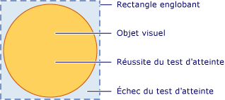

# Test de positionnement dans la couche visuelle
Cette rubrique fournit une vue d’ensemble de la fonctionnalité de test de positionnement fournie par la couche visuelle. Prise en charge du test d’atteinte vous permet de déterminer si une valeur de géométrie ou un point se trouve dans le contenu affiché d’un <xref:System.Windows.Media.Visual>, ce qui vous permet d’implémenter le comportement de l’interface utilisateur comme un rectangle de sélection pour sélectionner plusieurs objets.  
  
 
  
   
## Scénarios de test de positionnement  
 Le <xref:System.Windows.UIElement> classe fournit le <xref:System.Windows.UIElement.InputHitTest%2A> (méthode), qui permet de test de positionnement sur un élément à l’aide d’une valeur de coordonnée donnée. Dans de nombreux cas, le <xref:System.Windows.UIElement.InputHitTest%2A> méthode propose les fonctionnalités souhaitées pour implémenter le test de positionnement d’éléments. Toutefois, il existe plusieurs scénarios dans lesquels vous devrez peut-être implémenter le test de positionnement sur la couche visuelle.  
  
-   Test de positionnement sur non -<xref:System.Windows.UIElement> objets : cela s’applique si vous test de positionnement non -<xref:System.Windows.UIElement> objets, tels que <xref:System.Windows.Media.DrawingVisual> ou des objets graphiques.  
  
-   Test de positionnement à l’aide d’une géométrie : cela s’applique si vous avez besoin d’effectuer un test de positionnement à l’aide d’un objet géométrique plutôt que la valeur des coordonnées d’un point.  
  
-   Test de positionnement sur plusieurs objets : cela s’applique lorsque vous devez effectuer un test de positionnement sur plusieurs objets, tels que des objets superposés. Vous pouvez obtenir des résultats pour tous les objets visuels croisant une géométrie ou un point, pas seulement le premier.  
  
-   En ignorant <xref:System.Windows.UIElement> stratégie de test de positionnement : cela s’applique lorsque vous devez ignorer la <xref:System.Windows.UIElement> stratégie, qui prend en compte des facteurs tels que si un élément est désactivé ou invisible de test de positionnement.  
  
> [!NOTE]
>  Pour un exemple de code complet illustrant le test de positionnement sur la couche visuelle, consultez [Test de positionnement à l’aide de l’exemple DrawingVisuals](http://go.microsoft.com/fwlink/?LinkID=159994) et [Test de positionnement avec l’exemple Interopérabilité Win32](http://go.microsoft.com/fwlink/?LinkID=159995).  
  
   
## Prise en charge du test de positionnement  
 L’objectif de la <xref:System.Windows.Media.VisualTreeHelper.HitTest%2A> méthodes dans la <xref:System.Windows.Media.VisualTreeHelper> classe consiste à déterminer si une valeur de coordonnée de géométrie ou un point se trouve dans le contenu rendu d’un objet donné, tel qu’un contrôle ou un élément de graphique. Par exemple, vous pouvez utiliser le test de positionnement pour déterminer si un clic de souris dans le rectangle englobant d’un objet se trouve dans la géométrie d’un cercle. Vous pouvez également choisir de substituer l’implémentation par défaut du test de positionnement pour effectuer vos propres calculs de test de positionnement personnalisés.  
  
 L’illustration suivante montre la relation entre la région d’un objet non rectangulaire et son rectangle englobant.  
  
   
Diagramme de la région de test de positionnement valide  
  
   
## Test de positionnement et ordre de plan  
 La couche visuelle [!INCLUDE[TLA#tla_winclient](../../../../includes/tlasharptla-winclient-md.md)] prend en charge le test de positionnement sur tous les objets sous un point ou une géométrie, pas seulement l’objet de niveau supérieur. Les résultats sont retournés dans l’ordre de plan. Toutefois, l’objet visuel que vous passez en tant que paramètre à la <xref:System.Windows.Media.VisualTreeHelper.HitTest%2A> méthode détermine la partie de l’arborescence d’éléments visuels qui est atteints de test. Vous pouvez effectuer un test de positionnement sur l’arborescence visuelle entière ou une portion de celle-ci.  
  
 Dans l’illustration suivante, l’objet cercle est au-dessus des objets carré et triangle. Si vous êtes uniquement intéressé par l’objet visuel dont la valeur ordre de plan est le plus élevé de test de positionnement, vous pouvez définir l’énumération du test de positionnement visuelle pour retourner <xref:System.Windows.Media.HitTestResultBehavior.Stop> à partir de la <xref:System.Windows.Media.HitTestResultCallback> pour arrêter le parcours du test de positionnement après le premier élément.  
  
   
Diagramme de l’ordre de plan d’une arborescence d’éléments visuels  
  
 Si vous souhaitez énumérer tous les objets visuels sous un point spécifique ou une géométrie, retourner <xref:System.Windows.Media.HitTestResultBehavior.Continue> à partir de la <xref:System.Windows.Media.HitTestResultCallback>. Cela signifie que vous pouvez effectuer un test de positionnement pour des objets visuels situés sous d’autres objets, même s’ils sont complètement masqués. Pour plus d’informations, consultez l’exemple de code dans la section « Utilisation du rappel des résultats d’un test de positionnement ».  
  
> [!NOTE]
>  Un objet visuel transparent peut également être l’objet d’un test de positionnement.  
  
   
## Utilisation du test de positionnement par défaut  
 Vous pouvez identifier si un point se trouve dans la géométrie d’un objet visuel, à l’aide de la <xref:System.Windows.Media.VisualTreeHelper.HitTest%2A> méthode pour spécifier un objet visuel et un point de coordonnent pour le test. Le paramètre de l’objet visuel identifie le point de départ dans l’arborescence visuelle pour la recherche du test de positionnement. Si un objet visuel est trouvé dans l’arborescence visuelle dont la géométrie contient la coordonnée, il est défini le <xref:System.Windows.Media.HitTestResult.VisualHit%2A> propriété d’un <xref:System.Windows.Media.HitTestResult> objet. Le <xref:System.Windows.Media.HitTestResult> est ensuite retourné à partir de la <xref:System.Windows.Media.VisualTreeHelper.HitTest%2A> (méthode). Si le point n’est pas contenu dans la sous-arborescence visuelle vous test de positionnement, <xref:System.Windows.Media.VisualTreeHelper.HitTest%2A> retourne `null`.  
  
> [!NOTE]
>  Le test de positionnement par défaut retourne toujours l’objet de plus haut niveau dans l’ordre de plan. Afin d’identifier tous les objets visuels, y compris ceux partiellement ou entièrement cachés, utilisez un rappel des résultats du test de positionnement.  
  
 La valeur de coordonnée que vous passez au paramètre du point pour le <xref:System.Windows.Media.VisualTreeHelper.HitTest%2A> méthode doit être relatif à l’espace de coordonnées de l’objet visuel vous test de positionnement. Par exemple, si vous avez imbriqué des objets visuels définis sur (100, 100) dans l’espace des coordonnées du parent, alors le test de positionnement sur un objet visuel enfant à (0, 0) est équivalent au test de positionnement sur (100, 100) dans l’espace des coordonnées du parent.  
  
 Le code suivant montre comment définir des gestionnaires d’événements de souris pour un <xref:System.Windows.UIElement> objet qui est utilisé pour capturer des événements utilisés pour le test de positionnement.  
  
 [!code-csharp[HitTestingOverview#100](../../../../samples/snippets/csharp/VS_Snippets_Wpf/HitTestingOverview/CSharp/Window1.xaml.cs#100)]
 [!code-vb[HitTestingOverview#100](../../../../samples/snippets/visualbasic/VS_Snippets_Wpf/HitTestingOverview/visualbasic/window1.xaml.vb#100)]  
  
### Impact de l’arborescence visuelle sur le test de positionnement  
 Le point de départ dans l’arborescence visuelle détermine quels objets sont retournés lors de l’énumération du test de positionnement des objets. Si vous avez plusieurs objets sur lesquels vous voulez effectuer un test de positionnement, l’objet visuel utilisé comme point de départ de l’arborescence visuelle doit être l’ancêtre commun de tous les objets concernés. Par exemple, si vous voulez effectuer un test de positionnement sur l’élément bouton et l’objet visuel de dessin dans le diagramme suivant, vous devez définir le point de départ dans l’arborescence visuelle sur l’ancêtre commun des deux. Dans ce cas, l’élément canevas est l’ancêtre commun de l’élément bouton et de l’objet visuel de dessin.  
  
   
Diagramme d’une hiérarchie d’arborescence d’éléments visuels  
  
> [!NOTE]
>  Le <xref:System.Windows.UIElement.IsHitTestVisible%2A> propriété obtient ou définit une valeur qui déclare si un <xref:System.Windows.UIElement>-objet dérivé peut être retourné comme résultat d’un test de positionnement à partir d’une partie de son contenu rendu. Cela vous permet de modifier de manière sélective l’arborescence visuelle afin de déterminer les objets visuels impliqués dans un test de positionnement.  
  
   
## Utilisation d’un rappel des résultats du test de positionnement  
 Vous pouvez énumérer tous les objets visuels dans une arborescence visuelle dont la géométrie contient une valeur des coordonnées spécifiée. Cela vous permet d’identifier tous les objets visuels, y compris ceux partiellement ou entièrement cachés par d’autres objets visuels. Pour énumérer les objets visuels dans une arborescence d’éléments visuels, utilisez la <xref:System.Windows.Media.VisualTreeHelper.HitTest%2A> méthode avec une fonction de rappel de test de positionnement. La fonction de rappel du test de positionnement est appelée par le système lorsque la valeur des coordonnées que vous spécifiez est contenue dans un objet visuel.  
  
 Lors de l’énumération des résultats du test de positionnement, vous ne devez effectuer aucune opération susceptible de modifier l’arborescence visuelle. L’ajout ou la suppression d’un objet dans l’arborescence visuelle pendant qu’il est parcouru peut entraîner un comportement imprévisible. Vous pouvez modifier en toute sécurité de l’arborescence d’éléments visuels après le <xref:System.Windows.Media.VisualTreeHelper.HitTest%2A> le retour de méthode. Vous pouvez souhaiter fournir une structure de données, telles qu’une <xref:System.Collections.ArrayList>, pour stocker des valeurs lors de l’énumération des résultats du test de positionnement.  
  
 [!code-csharp[HitTestingOverview#101](../../../../samples/snippets/csharp/VS_Snippets_Wpf/HitTestingOverview/CSharp/Window1.xaml.cs#101)]
 [!code-vb[HitTestingOverview#101](../../../../samples/snippets/visualbasic/VS_Snippets_Wpf/HitTestingOverview/visualbasic/window1.xaml.vb#101)]  
  
 La méthode de rappel du test de positionnement définit les actions que vous effectuez lorsqu’un test de positionnement est identifié sur un objet visuel particulier dans l’arborescence visuelle. Après avoir effectué les actions, vous retournez un <xref:System.Windows.Media.HitTestResultBehavior> valeur qui détermine s’il faut continuer l’énumération de tous les objets visuels ou non.  
  
 [!code-csharp[HitTestingOverview#102](../../../../samples/snippets/csharp/VS_Snippets_Wpf/HitTestingOverview/CSharp/Window1.xaml.cs#102)]
 [!code-vb[HitTestingOverview#102](../../../../samples/snippets/visualbasic/VS_Snippets_Wpf/HitTestingOverview/visualbasic/window1.xaml.vb#102)]  
  
> [!NOTE]
>  L’ordre d’énumération des objets visuels de positionnement se fait selon l’ordre de plan. L’objet visuel au niveau de l’ordre de plan le plus élevé est le premier objet énuméré. Les autres objets visuels énumérés le sont dans l’ordre de plan décroissant. Cet ordre d’énumération correspond à l’ordre de rendu des objets visuels.  
  
 Vous pouvez arrêter l’énumération d’objets visuels à tout moment dans la fonction de rappel de test de positionnement en retournant <xref:System.Windows.Media.HitTestResultBehavior.Stop>.  
  
 [!code-csharp[HitTestingOverview#103](../../../../samples/snippets/csharp/VS_Snippets_Wpf/HitTestingOverview/CSharp/Window1.xaml.cs#103)]
 [!code-vb[HitTestingOverview#103](../../../../samples/snippets/visualbasic/VS_Snippets_Wpf/HitTestingOverview/visualbasic/window1.xaml.vb#103)]  
  
   
## Utilisation d’un rappel de filtre du test de positionnement  
 Vous pouvez utiliser un filtre de test de positionnement facultatif pour restreindre les objets transmis aux résultats du test de positionnement. Ceci vous permet d’ignorer les parties de l’arborescence d’éléments visuels que vous ne souhaitez pas traiter dans vos résultats de test de positionnement. Pour implémenter un filtre de test de positionnement, vous définissez une fonction de rappel de filtre de test de positionnement et passez-le en tant que valeur de paramètre lorsque vous appelez le <xref:System.Windows.Media.VisualTreeHelper.HitTest%2A> (méthode).  
  
 [!code-csharp[HitTestingOverview#104](../../../../samples/snippets/csharp/VS_Snippets_Wpf/HitTestingOverview/CSharp/Window1.xaml.cs#104)]
 [!code-vb[HitTestingOverview#104](../../../../samples/snippets/visualbasic/VS_Snippets_Wpf/HitTestingOverview/visualbasic/window1.xaml.vb#104)]  
  
 Si vous ne souhaitez pas fournir de la fonction de rappel de filtre de test de positionnement, passez un `null` valeur comme paramètre pour le <xref:System.Windows.Media.VisualTreeHelper.HitTest%2A> (méthode).  
  
 [!code-csharp[HitTestingOverview#105](../../../../samples/snippets/csharp/VS_Snippets_Wpf/HitTestingOverview/CSharp/Window1.xaml.cs#105)]
 [!code-vb[HitTestingOverview#105](../../../../samples/snippets/visualbasic/VS_Snippets_Wpf/HitTestingOverview/visualbasic/window1.xaml.vb#105)]  
  
   
Élagage d’une arborescence visuelle  
  
 La fonction de rappel de filtre de test de positionnement permet d’énumérer tous les objets visuels dont le contenu rendu contient les coordonnées que vous spécifiez. Toutefois, vous pouvez ignorer certaines branches de l’arborescence d’éléments visuels que vous ne souhaitez pas traiter dans votre fonction de rappel des résultats de test de positionnement. La valeur de retour de la fonction de rappel de filtre de test de positionnement détermine le type d’action que l’énumération des objets visuels doit prendre. Par exemple, si vous retournez la valeur, <xref:System.Windows.Media.HitTestFilterBehavior.ContinueSkipSelfAndChildren>, vous pouvez supprimer l’objet visuel actuel et ses enfants à partir de l’énumération des résultats du test de positionnement. Cela signifie que la fonction de rappel des résultats de test de positionnement ne verra pas ces objets dans son énumération. L’élagage des objets dans l’arborescence visuelle diminue la quantité de traitement au cours de la passe de l’énumération des résultats de test de positionnement. Dans l’exemple de code suivant, le filtre ignore les étiquettes et leurs descendants et effectue un test de positionnement sur tout le reste.  
  
 [!code-csharp[HitTestingOverview#106](../../../../samples/snippets/csharp/VS_Snippets_Wpf/HitTestingOverview/CSharp/Window1.xaml.cs#106)]
 [!code-vb[HitTestingOverview#106](../../../../samples/snippets/visualbasic/VS_Snippets_Wpf/HitTestingOverview/visualbasic/window1.xaml.vb#106)]  
  
> [!NOTE]
>  Le rappel de filtre du test de positionnement est parfois appelé dans les cas où le rappel des résultats du test d’atteinte n’est pas appelé.  
  
   
## Substitution du test de positionnement par défaut  
 Vous pouvez remplacer par défaut le test de positionnement un objet visuel prise en charge en remplaçant le <xref:System.Windows.Media.Visual.HitTestCore%2A> (méthode). Cela signifie que lorsque vous appelez le <xref:System.Windows.Media.VisualTreeHelper.HitTest%2A> (méthode), votre implémentation substituée de <xref:System.Windows.Media.Visual.HitTestCore%2A> est appelée. Votre méthode substituée est appelée lorsqu’un test de positionnement se situe dans le rectangle englobant de l’objet visuel, même si les coordonnées se situent en dehors du contenu rendu de l’objet visuel.  
  
 [!code-csharp[HitTestingOverview#107](../../../../samples/snippets/csharp/VS_Snippets_Wpf/HitTestingOverview/CSharp/Window1.xaml.cs#107)]
 [!code-vb[HitTestingOverview#107](../../../../samples/snippets/visualbasic/VS_Snippets_Wpf/HitTestingOverview/visualbasic/window1.xaml.vb#107)]  
  
 Vous voudrez parfois effectuer un nouveau test de positionnement sur le rectangle englobant et le contenu rendu d’un objet visuel. À l’aide de la `PointHitTestParameters` valeur du paramètre dans votre substituée <xref:System.Windows.Media.Visual.HitTestCore%2A> méthode en tant que paramètre à la méthode de base <xref:System.Windows.Media.Visual.HitTestCore%2A>, vous pouvez effectuer un test de positionnement sur le rectangle englobant d’un objet visuel, puis effectuez un deuxième test de positionnement par rapport à la rendu de contenu de l’objet visuel.  
  
 [!code-csharp[HitTestingOverview#108](../../../../samples/snippets/csharp/VS_Snippets_Wpf/HitTestingOverview/CSharp/Window1.xaml.cs#108)]
 [!code-vb[HitTestingOverview#108](../../../../samples/snippets/visualbasic/VS_Snippets_Wpf/HitTestingOverview/visualbasic/window1.xaml.vb#108)]  
  
## Voir aussi  
 <xref:System.Windows.Media.VisualTreeHelper.HitTest%2A>  
 <xref:System.Windows.Media.HitTestResult>  
 <xref:System.Windows.Media.HitTestResultCallback>  
 <xref:System.Windows.Media.HitTestFilterCallback>  
 <xref:System.Windows.UIElement.IsHitTestVisible%2A>  
 [À l’aide de DrawingVisuals, exemple de Test de positionnement](http://go.microsoft.com/fwlink/?LinkID=159994)  
 [Test de positionnement avec interopérabilité Win32, exemple](http://go.microsoft.com/fwlink/?LinkID=159995)  
 [Effectuer un test de positionnement avec Geometry dans un Visual](../../../../docs/framework/wpf/graphics-multimedia/how-to-hit-test-geometry-in-a-visual.md)  
 [Test de positionnement à l’aide d’un conteneur hôte Win32](../../../../docs/framework/wpf/graphics-multimedia/how-to-hit-test-using-a-win32-host-container.md)
