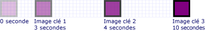
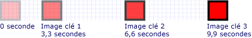
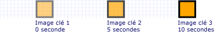

# Comment : contrôler le minutage d'une animation d'image clé
Cet exemple montre comment contrôler le minutage des images clés d’une animation d’image clé. Comme les autres animations, les animations d’image clé ont une <xref:System.Windows.Media.Animation.Timeline.Duration%2A> propriété. En plus de spécifier la durée d’une animation, vous devez spécifier quelle partie de cette durée qui est allouée à chacune de ses images clés. Pour allouer du temps, vous spécifiez un <xref:System.Windows.Media.Animation.KeyTime> pour chaque image clé de l’animation.  
  
 Le <xref:System.Windows.Media.Animation.KeyTime> pour chaque image clé spécifie la fin d’une image clé (il ne spécifie pas la durée de lecture d’une image clée). Vous pouvez spécifier un <xref:System.Windows.Media.Animation.KeyTime> comme un <xref:System.TimeSpan> valeur, sous forme de pourcentage ou en tant que le <xref:System.Windows.Media.Animation.KeyTime.Uniform%2A> ou <xref:System.Windows.Media.Animation.KeyTime.Paced%2A> valeur spéciale.  
  
## Exemple  
 L’exemple suivant utilise un <xref:System.Windows.Media.Animation.DoubleAnimationUsingKeyFrames> pour animer un rectangle sur l’écran. Temps clés des images clés sont définis avec <xref:System.TimeSpan> valeurs.  
  
 [!code-csharp[keyframes_snip#KeyTimesTimeSpanExample](../../../../samples/snippets/csharp/VS_Snippets_Wpf/keyframes_snip/CSharp/KeyTimesExample.cs#keytimestimespanexample)]
 [!code-vb[keyframes_snip#KeyTimesTimeSpanExample](../../../../samples/snippets/visualbasic/VS_Snippets_Wpf/keyframes_snip/visualbasic/keytimesexample.vb#keytimestimespanexample)]
 [!code-xaml[keyframes_snip#KeyTimesTimeSpanExample](../../../../samples/snippets/xaml/VS_Snippets_Wpf/keyframes_snip/XAML/KeyTimesExample.xaml#keytimestimespanexample)]  
  
 L’illustration suivante montre les lorsque la valeur de chaque image clé est atteinte.  
  
   
  
 L’exemple suivant montre une animation qui est identique, sauf que les temps clés des images clés sont définis avec des valeurs de pourcentage.  
  
 [!code-csharp[keyframes_snip#KeyTimesPercentageExample](../../../../samples/snippets/csharp/VS_Snippets_Wpf/keyframes_snip/CSharp/KeyTimesExample.cs#keytimespercentageexample)]
 [!code-vb[keyframes_snip#KeyTimesPercentageExample](../../../../samples/snippets/visualbasic/VS_Snippets_Wpf/keyframes_snip/visualbasic/keytimesexample.vb#keytimespercentageexample)]
 [!code-xaml[keyframes_snip#KeyTimesPercentageExample](../../../../samples/snippets/xaml/VS_Snippets_Wpf/keyframes_snip/XAML/KeyTimesExample.xaml#keytimespercentageexample)]  
  
 L’illustration suivante montre les lorsque la valeur de chaque image clé est atteinte.  
  
   
  
 L’exemple suivant utilise <xref:System.Windows.Media.Animation.KeyTime.Uniform%2A> valeurs de temps clé.  
  
 [!code-csharp[keyframes_snip#KeyTimesUniformExample](../../../../samples/snippets/csharp/VS_Snippets_Wpf/keyframes_snip/CSharp/KeyTimesExample.cs#keytimesuniformexample)]
 [!code-vb[keyframes_snip#KeyTimesUniformExample](../../../../samples/snippets/visualbasic/VS_Snippets_Wpf/keyframes_snip/visualbasic/keytimesexample.vb#keytimesuniformexample)]
 [!code-xaml[keyframes_snip#KeyTimesUniformExample](../../../../samples/snippets/xaml/VS_Snippets_Wpf/keyframes_snip/XAML/KeyTimesExample.xaml#keytimesuniformexample)]  
  
 L’illustration suivante montre les lorsque la valeur de chaque image clé est atteinte.  
  
   
  
 Le dernier exemple utilise <xref:System.Windows.Media.Animation.KeyTime.Paced%2A> valeurs de temps clé.  
  
 [!code-csharp[keyframes_snip#KeyTimesPacedExample](../../../../samples/snippets/csharp/VS_Snippets_Wpf/keyframes_snip/CSharp/KeyTimesExample.cs#keytimespacedexample)]
 [!code-vb[keyframes_snip#KeyTimesPacedExample](../../../../samples/snippets/visualbasic/VS_Snippets_Wpf/keyframes_snip/visualbasic/keytimesexample.vb#keytimespacedexample)]
 [!code-xaml[keyframes_snip#KeyTimesPacedExample](../../../../samples/snippets/xaml/VS_Snippets_Wpf/keyframes_snip/XAML/KeyTimesExample.xaml#keytimespacedexample)]  
  
 L’illustration suivante montre les lorsque la valeur de chaque image clé est atteinte.  
  
   
  
 Par souci de simplicité, les versions de code de cet exemple utilisent des animations locales, pas storyboards, car une seule animation est appliquée à une seule propriété, mais les exemples peuvent être modifiées pour utiliser à la place des animations. Pour obtenir un exemple montrant comment déclarer un storyboard dans le code, consultez [animer une propriété à l’aide d’un Storyboard](../../../../docs/framework/wpf/graphics-multimedia/how-to-animate-a-property-by-using-a-storyboard.md).  
  
 Pour l’exemple complet, consultez la page [Animation d’image clé, exemple](http://go.microsoft.com/fwlink/?LinkID=160012). Pour plus d’informations sur les animations d’image clé, consultez la [Key-Frame Animations Overview](../../../../docs/framework/wpf/graphics-multimedia/key-frame-animations-overview.md).  
  
## Voir aussi  
 [Vue d'ensemble des animations d'image clé](../../../../docs/framework/wpf/graphics-multimedia/key-frame-animations-overview.md)  
 [Vue d’ensemble de l’animation](../../../../docs/framework/wpf/graphics-multimedia/animation-overview.md)  
 [Rubriques de guide pratique](../../../../docs/framework/wpf/graphics-multimedia/animation-and-timing-how-to-topics.md)
