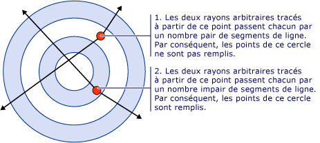
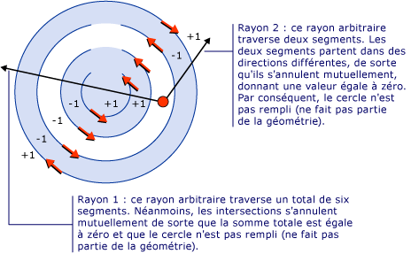
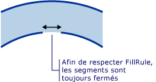

# Comment&#160;: contr&#244;ler le remplissage d&#39;une forme composite
Le <xref:System.Windows.Media.GeometryGroup.FillRule%2A> propriété d’un <xref:System.Windows.Media.GeometryGroup> ou <xref:System.Windows.Media.PathGeometry>, spécifie une « règle » que la forme composite utilise pour déterminer si un point donné fait partie de la géométrie. Il existe deux valeurs possibles pour <xref:System.Windows.Media.FillRule>: <xref:System.Windows.Media.FillRule> et <xref:System.Windows.Media.FillRule>. Les sections suivantes décrivent comment utiliser ces deux règles.  
  
 **EvenOdd :** cette règle détermine si un point est dans la région de remplissage en dessinant un rayon de ce point à l’infini dans n’importe quelle direction et en comptant le nombre de segments de chemin d’accès au sein de la forme donnée que le rayon traverse. Si ce nombre est impair, le point est à l’intérieur ; s’il est pair, le point est à l’extérieur.  
  
 Par exemple, le code XAML suivant crée une forme composite composée une série d’anneaux concentriques (cible) avec une <xref:System.Windows.Media.GeometryGroup.FillRule%2A> la valeur <xref:System.Windows.Media.FillRule>.  
  
 [!code-xml[GeometriesMiscSnippets_snip#FillRuleEvenOddValue](../../../../samples/snippets/xaml/VS_Snippets_Wpf/GeometriesMiscSnippets_snip/XAML/FillRuleExample.xaml#fillruleevenoddvalue)]  
  
 L’illustration suivante montre la forme créée dans l’exemple précédent.  
  
   
  
 Dans l’illustration ci-dessus, notez que le centre et le 3e anneau ne sont pas remplis. Il s’agit, car un rayon dessiné à partir de n’importe quel point dans une de ces deux anneaux traverse un nombre pair de segments. Voir l’illustration ci-dessous :  
  
   
  
 **NonZero :** cette règle détermine si un point est dans la région de remplissage du tracé en dessinant un rayon de ce point à l’infini dans n’importe quelle direction et en examinant ensuite les emplacements où un segment de la forme traverse le rayon. En commençant à zéro, ajoutez un chaque fois qu’un Segment croise le rayon de gauche à droite et soustrayez un chaque fois un chemin d’accès segment traverse le rayon de droite à gauche. Comptez ensuite le nombre d’intersections : si le résultat est égal à zéro, le point est à l’extérieur du tracé. Sinon, il est à l’intérieur.  
  
 [!code-xml[GeometriesMiscSnippets_snip#FillRuleNonZeroValueEllipseGeometry](../../../../samples/snippets/xaml/VS_Snippets_Wpf/GeometriesMiscSnippets_snip/XAML/FillRuleExample.xaml#fillrulenonzerovalueellipsegeometry)]  
  
 L’exemple ci-dessus, une valeur de <xref:System.Windows.Media.FillRule> de <xref:System.Windows.Media.GeometryGroup.FillRule%2A> donne par conséquent de l’illustration suivante :  
  
   
  
 Comme vous pouvez le voir, tous les anneaux sont remplis. C’est parce que tous les segments sont exécutent dans la même direction et donc un rayon dessiné à partir de n’importe quel point traversera un ou plusieurs segments et la somme des intersections ne seront pas égal à zéro. Par exemple, dans l’illustration ci-dessous, les flèches rouges représentent la direction, que les segments sont dessinés et la flèche blanche représente une part arbitraire à partir d’un point dans l’anneau intérieur. Commençant par une valeur égale à zéro, pour chaque segment que le rayon traverse, une valeur de l’un est ajoutée, car le segment traverse le rayon de gauche à droite.  
  
   
  
 Pour mieux illustrer le comportement de <xref:System.Windows.Media.FillRule> règle une forme plus complexe avec des segments en cours d’exécution dans un sens différent est requis. Le code XAML ci-dessous crée une forme semblable que l’exemple précédent, sauf qu’elle est créée avec un <xref:System.Windows.Media.PathGeometry> puis plutôt un <xref:System.Windows.Media.EllipseGeometry> cercles concentriques plutôt qui crée quatre arcs concentriques complètement fermés.  
  
 [!code-xml[GeometriesMiscSnippets_snip#FillRuleNonZeroValuePathGeometry](../../../../samples/snippets/xaml/VS_Snippets_Wpf/GeometriesMiscSnippets_snip/XAML/FillRuleExample.xaml#fillrulenonzerovaluepathgeometry)]  
  
 L’illustration suivante montre la forme créée dans l’exemple précédent.  
  
   
  
 Notez que le troisième arc à partir du centre n’est pas rempli. L’illustration ci-dessous montre pourquoi il s’agit. Dans l’illustration, les flèches rouges représentent la direction, que les segments sont dessinés. Les deux flèches blanches représentent deux rayons arbitraires qui partent d’un point dans la région « non remplie ». Comme le montre l’illustration, la somme des valeurs d’un rayon donné qui traverse les segments dans son chemin d’accès est égal à zéro. Comme indiqué ci-dessus, une somme égale à zéro signifie que le point ne fait pas partie de la géométrie (qui ne fait pas partie du remplissage) tandis qu’une somme est *pas* égal à zéro, y compris une valeur négative, fait partie de la géométrie.  
  
   
  
 **Remarque :** dans le cadre de <xref:System.Windows.Media.FillRule>, toutes les formes sont considérées comme fermées. S’il existe un écart dans un segment, dessinez une ligne imaginaire pour le fermer. Dans l’exemple ci-dessus, il existe des petits écarts dans les anneaux. Pour cette raison, il y paraît un rayon qui traverse l’intervalle donne un résultat différent puis un rayon en cours d’exécution dans une autre direction. Voici une illustration agrandie d’une de ces lacunes et « segment imaginaire » (segment dessiné afin d’appliquer les <xref:System.Windows.Media.FillRule>) qui le ferme.  
  
   
  
## Exemple  
  
## Voir aussi  
 [Créer une forme Composite](../../../../docs/framework/wpf/graphics-multimedia/how-to-create-a-composite-shape.md)   
 [Vue d’ensemble de Geometry](../../../../docs/framework/wpf/graphics-multimedia/geometry-overview.md)