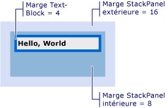

# Comment&#160;: obtenir le d&#233;calage d&#39;un Visual
Ces exemples montrent comment récupérer la valeur de décalage d'un objet visuel relative à son parent ou à tout ancêtre ou descendant.  
  
## Exemple  
 L'exemple de balise suivant montre un <xref:System.Windows.Controls.TextBlock> qui est défini avec la valeur <xref:System.Windows.FrameworkElement.Margin%2A> de 4.  
  
 [!code-xml[VisualSnippets#VisualSnippet1](../../../../samples/snippets/csharp/VS_Snippets_Wpf/VisualSnippets/CSharp/Window1.xaml#visualsnippet1)]  
  
 L'exemple de code suivant montre comment utiliser la méthode <xref:System.Windows.Media.VisualTreeHelper.GetOffset%2A> pour récupérer l'offset du <xref:System.Windows.Controls.TextBlock>.  Les valeurs d'offset sont contenues dans la valeur <xref:System.Windows.Vector> renvoyée.  
  
 [!code-csharp[VisualSnippets#VisualSnippet2](../../../../samples/snippets/csharp/VS_Snippets_Wpf/VisualSnippets/CSharp/Window1.xaml.cs#visualsnippet2)]
 [!code-vb[VisualSnippets#VisualSnippet2](../../../../samples/snippets/visualbasic/VS_Snippets_Wpf/VisualSnippets/visualbasic/window1.xaml.vb#visualsnippet2)]  
  
 L'offset prend en considération la valeur <xref:System.Windows.FrameworkElement.Margin%2A>.  Dans ce cas, <xref:System.Windows.Vector.X%2A> est égal à 4 et <xref:System.Windows.Vector.Y%2A> à 4.  
  
 La valeur de décalage renvoyée est relative au parent du <xref:System.Windows.Media.Visual>.  Si vous souhaitez renvoyer une valeur de décalage qui n'est pas relative au parent d'un <xref:System.Windows.Media.Visual>, utilisez la méthode <xref:System.Windows.Media.Visual.TransformToAncestor%2A>.  
  
## Obtention de l'offset relatif à un ancêtre  
 L'exemple de balise suivant montre un <xref:System.Windows.Controls.TextBlock> imbriqué dans deux objets <xref:System.Windows.Controls.StackPanel>.  
  
 [!code-xml[VisualSnippets#VisualSnippet7](../../../../samples/snippets/csharp/VS_Snippets_Wpf/VisualSnippets/CSharp/Window2.xaml#visualsnippet7)]  
  
 L'illustration suivante montre les résultats de la balise.  
  
   
TextBlock imbriqué dans deux StackPanels  
  
 L'exemple de code suivant montre comment utiliser la méthode <xref:System.Windows.Media.Visual.TransformToAncestor%2A> pour récupérer l'offset du <xref:System.Windows.Controls.TextBlock> relatif à la <xref:System.Windows.Window> contenante.  Les valeurs de décalage sont indiquées dans la valeur <xref:System.Windows.Media.GeneralTransform> retournée.  
  
 [!code-csharp[VisualSnippets#VisualSnippet5](../../../../samples/snippets/csharp/VS_Snippets_Wpf/VisualSnippets/CSharp/Window1.xaml.cs#visualsnippet5)]
 [!code-vb[VisualSnippets#VisualSnippet5](../../../../samples/snippets/visualbasic/VS_Snippets_Wpf/VisualSnippets/visualbasic/window1.xaml.vb#visualsnippet5)]  
  
 L'offset prend en considération les valeurs <xref:System.Windows.FrameworkElement.Margin%2A> de tous les objets dans la <xref:System.Windows.Window> contenante.  Dans ce cas, <xref:System.Windows.Vector.X%2A> est égal à 28 \(16 \+ 8 \+ 4\) et <xref:System.Windows.Vector.Y%2A> à 28.  
  
 La valeur de décalage renvoyée est relative à l'ancêtre du <xref:System.Windows.Media.Visual>.  Si vous souhaitez renvoyer une valeur de décalage relative au descendant d'un <xref:System.Windows.Media.Visual>, utilisez la méthode <xref:System.Windows.Media.Visual.TransformToDescendant%2A>.  
  
## Obtention de l'offset relatif à un descendant  
 L'exemple de balise suivant montre un <xref:System.Windows.Controls.TextBlock> contenu dans un objet <xref:System.Windows.Controls.StackPanel>.  
  
 [!code-xml[VisualSnippets#VisualSnippet4](../../../../samples/snippets/csharp/VS_Snippets_Wpf/VisualSnippets/CSharp/Window1.xaml#visualsnippet4)]  
  
 L'exemple de code suivant montre comment utiliser la méthode <xref:System.Windows.Media.Visual.TransformToDescendant%2A> pour récupérer le décalage du <xref:System.Windows.Controls.StackPanel> par rapport à son <xref:System.Windows.Controls.TextBlock> enfant.  Les valeurs de décalage sont indiquées dans la valeur <xref:System.Windows.Media.GeneralTransform> retournée.  
  
 [!code-csharp[VisualSnippets#VisualSnippet9](../../../../samples/snippets/csharp/VS_Snippets_Wpf/VisualSnippets/CSharp/Window1.xaml.cs#visualsnippet9)]
 [!code-vb[VisualSnippets#VisualSnippet9](../../../../samples/snippets/visualbasic/VS_Snippets_Wpf/VisualSnippets/visualbasic/window1.xaml.vb#visualsnippet9)]  
  
 Le décalage tient compte des valeurs <xref:System.Windows.FrameworkElement.Margin%2A> de tous les objets.  Dans ce cas, <xref:System.Windows.Vector.X%2A> est égal à \-4 et <xref:System.Windows.Vector.Y%2A> à \-4.  Les valeurs de décalage sont des valeurs négatives, car l'objet parent est décalé vers les valeurs négatives par rapport à son objet enfant.  
  
## Voir aussi  
 <xref:System.Windows.Media.Visual>   
 <xref:System.Windows.Media.VisualTreeHelper>   
 [Vue d'ensemble du rendu graphique de WPF](../../../../docs/framework/wpf/graphics-multimedia/wpf-graphics-rendering-overview.md)