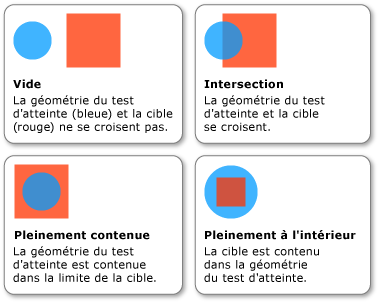

# Comment&#160;: effectuer un test de positionnement avec Geometry comme param&#232;tre
Cet exemple indique comment effectuer un [test d'atteinte](GTMT) sur un objet visuel à l'aide d'un <xref:System.Windows.Media.Geometry> comme paramètre de test d'atteinte.  
  
## Exemple  
 L'exemple suivant montre comment configurer un test d'atteinte en utilisant <xref:System.Windows.Media.GeometryHitTestParameters> pour la méthode <xref:System.Windows.Media.VisualTreeHelper.HitTest%2A>.  La valeur <xref:System.Windows.Point> qui est passée à la méthode `OnMouseDown` est utilisée pour créer un objet <xref:System.Windows.Media.Geometry> afin d'étendre la plage du test d'atteinte.  
  
 [!code-csharp[HitTestingOverview#HitTestingOverviewSnippet10](../../../../samples/snippets/csharp/VS_Snippets_Wpf/HitTestingOverview/CSharp/GeometryHitTest.cs#hittestingoverviewsnippet10)]
 [!code-vb[HitTestingOverview#HitTestingOverviewSnippet10](../../../../samples/snippets/visualbasic/VS_Snippets_Wpf/HitTestingOverview/visualbasic/geometryhittest.vb#hittestingoverviewsnippet10)]  
  
 La propriété <xref:System.Windows.Media.GeometryHitTestResult.IntersectionDetail%2A> de <xref:System.Windows.Media.GeometryHitTestResult> fournit des informations sur les résultats d'un test d'atteinte qui utilise un <xref:System.Windows.Media.Geometry> comme paramètre de test d'atteinte.  L'illustration suivante présente la relation entre la géométrie du test d'atteinte \(le cercle bleu\) et le contenu restitué de l'objet visuel cible \(le carré rouge\).  
  
   
Intersection entre la géométrie de test d'atteinte et l'objet visuel cible  
  
 L'exemple suivant indique comment implémenter un rappel de test d'atteinte lorsqu'un <xref:System.Windows.Media.Geometry> est utilisé comme paramètre de test d'atteinte.  Le paramètre `result` est casté à un <xref:System.Windows.Media.GeometryHitTestResult> afin de récupérer la valeur de la propriété <xref:System.Windows.Media.GeometryHitTestResult.IntersectionDetail%2A>.  La valeur de propriété vous permet de déterminer si le paramètre de test d'atteinte <xref:System.Windows.Media.Geometry> est contenu intégralement ou partiellement dans le contenu restitué de la cible du test d'atteinte.  Dans ce cas, l'exemple de code ajoute uniquement les résultats de test d'atteinte à la liste pour les éléments visuels contenus intégralement dans la limite cible.  
  
 [!code-csharp[HitTestingOverview#HitTestingOverviewSnippet11](../../../../samples/snippets/csharp/VS_Snippets_Wpf/HitTestingOverview/CSharp/GeometryHitTest.cs#hittestingoverviewsnippet11)]
 [!code-vb[HitTestingOverview#HitTestingOverviewSnippet11](../../../../samples/snippets/visualbasic/VS_Snippets_Wpf/HitTestingOverview/visualbasic/geometryhittest.vb#hittestingoverviewsnippet11)]  
  
> [!NOTE]
>  Le rappel <xref:System.Windows.Media.HitTestResult> ne doit pas être appelé lorsque le détail d'intersection est <xref:System.Windows.Media.IntersectionDetail>.  
  
## Voir aussi  
 [Test de positionnement dans la couche visuelle](../../../../docs/framework/wpf/graphics-multimedia/hit-testing-in-the-visual-layer.md)   
 [Effectuer un test de positionnement avec Geometry dans un Visual](../../../../docs/framework/wpf/graphics-multimedia/how-to-hit-test-geometry-in-a-visual.md)