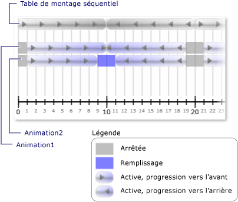

# Comment : recevoir une Notification quand une horloge au format &#39; modification de l’état s
D’une horloge <xref:System.Windows.Media.Animation.Clock.CurrentStateInvalidated> événement se produit lors de son <xref:System.Windows.Media.Animation.Clock.CurrentState%2A> devient non valide, par exemple lorsque l’horloge démarre ou s’arrête. Vous pouvez inscrire directement à l’aide de cet événement un <xref:System.Windows.Media.Animation.Clock>, ou vous pouvez effectuer à l’aide un <xref:System.Windows.Media.Animation.Timeline>.  
  
 Dans l’exemple suivant, un <xref:System.Windows.Media.Animation.Storyboard> et deux <xref:System.Windows.Media.Animation.DoubleAnimation> objets sont utilisés pour animer la largeur de deux rectangles. Le <xref:System.Windows.Media.Animation.Timeline.CurrentStateInvalidated> événement est utilisé pour écouter les changements d’état de l’horloge.  
  
## Exemple  
 [!code-xaml[timingbehaviors_snip#_graphicsmm_StateExampleMarkupWholePage](../../../../samples/snippets/csharp/VS_Snippets_Wpf/timingbehaviors_snip/CSharp/StateExample.xaml#_graphicsmm_stateexamplemarkupwholepage)]  
  
 [!code-csharp[timingbehaviors_snip#_graphicsmm_StateEventHandlers](../../../../samples/snippets/csharp/VS_Snippets_Wpf/timingbehaviors_snip/CSharp/StateExample.xaml.cs#_graphicsmm_stateeventhandlers)]
 [!code-vb[timingbehaviors_snip#_graphicsmm_StateEventHandlers](../../../../samples/snippets/visualbasic/VS_Snippets_Wpf/timingbehaviors_snip/visualbasic/stateexample.xaml.vb#_graphicsmm_stateeventhandlers)]  
  
 L’illustration suivante montre les différents États des animations en tant que la chronologie parent (*Storyboard*) progresse.  
  
   
  
 Le tableau suivant répertorie les moments qui *Animation1*de <xref:System.Windows.Media.Animation.Timeline.CurrentStateInvalidated> se déclenche des événements :  
  
||||||||  
|-|-|-|-|-|-|-|  
|Durée (en secondes)|1|10|19|21|30|39|  
|État|Actif|Actif|Arrêté|Actif|Actif|Arrêté|  
  
 Le tableau suivant répertorie les moments qui *Animation2*de <xref:System.Windows.Media.Animation.Timeline.CurrentStateInvalidated> se déclenche des événements :  
  
||||||||||  
|-|-|-|-|-|-|-|-|-|  
|Durée (en secondes)|1|9|11|19|21|29|31|39|  
|État|Actif|Remplissage|Actif|Arrêté|Actif|Remplissage|Actif|Arrêté|  
  
 Notez que *Animation1*de <xref:System.Windows.Media.Animation.Timeline.CurrentStateInvalidated> événement est déclenché au bout de 10 secondes, même si son état reste <xref:System.Windows.Media.Animation.ClockState.Active>. C’est parce que son état a changé dans 10 secondes, mais il a été remplacée par <xref:System.Windows.Media.Animation.ClockState.Active> à <xref:System.Windows.Media.Animation.ClockState.Filling> , puis revient à <xref:System.Windows.Media.Animation.ClockState.Active> dans le même battement.
