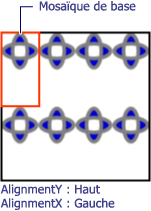

# Comment : définir l'alignement horizontal et vertical d'un TileBrushHow to: Set the Horizontal and Vertical Alignment of a TileBrush
Cet exemple montre comment contrôler l’alignement horizontal et vertical d’un contenu dans une mosaïque.This example shows how to control the horizontal and vertical alignment of content in a tile. Pour contrôler l’alignement horizontal et vertical d’un <xref:System.Windows.Media.TileBrush>, utilisez son <xref:System.Windows.Media.TileBrush.AlignmentX%2A> et <xref:System.Windows.Media.TileBrush.AlignmentY%2A> propriétés.To control the horizontal and vertical alignment of a <xref:System.Windows.Media.TileBrush>, use its <xref:System.Windows.Media.TileBrush.AlignmentX%2A> and <xref:System.Windows.Media.TileBrush.AlignmentY%2A> properties.  
  
 Le <xref:System.Windows.Media.TileBrush.AlignmentX%2A> et <xref:System.Windows.Media.TileBrush.AlignmentY%2A> propriétés d’un <xref:System.Windows.Media.TileBrush> sont utilisées lorsque une des conditions suivantes est vraie :The <xref:System.Windows.Media.TileBrush.AlignmentX%2A> and <xref:System.Windows.Media.TileBrush.AlignmentY%2A> properties of a <xref:System.Windows.Media.TileBrush> are used when either of the following conditions is true:  
  
-   Le <xref:System.Windows.Media.TileBrush.Stretch%2A> propriété <xref:System.Windows.Media.Stretch.Uniform> ou <xref:System.Windows.Media.Stretch.UniformToFill> et <xref:System.Windows.Media.TileBrush.Viewbox%2A> et <xref:System.Windows.Media.TileBrush.Viewport%2A> ont des proportions différentes.The <xref:System.Windows.Media.TileBrush.Stretch%2A> property is <xref:System.Windows.Media.Stretch.Uniform> or <xref:System.Windows.Media.Stretch.UniformToFill> and the <xref:System.Windows.Media.TileBrush.Viewbox%2A> and <xref:System.Windows.Media.TileBrush.Viewport%2A> have different aspect ratios.  
  
-   Le <xref:System.Windows.Media.TileBrush.Stretch%2A> propriété <xref:System.Windows.Media.Stretch.None> et <xref:System.Windows.Media.TileBrush.Viewbox%2A> et <xref:System.Windows.Media.TileBrush.Viewport%2A> sont de tailles différentes.The <xref:System.Windows.Media.TileBrush.Stretch%2A> property is <xref:System.Windows.Media.Stretch.None> and the <xref:System.Windows.Media.TileBrush.Viewbox%2A> and <xref:System.Windows.Media.TileBrush.Viewport%2A> are different sizes.  
  
## ExempleExample  
 L’exemple suivant aligne le contenu d’un <xref:System.Windows.Media.DrawingBrush>, qui est un type de <xref:System.Windows.Media.TileBrush>, à l’angle supérieur gauche de sa mosaïque.The following example aligns the content of a <xref:System.Windows.Media.DrawingBrush>, which is a type of <xref:System.Windows.Media.TileBrush>, to the upper-left corner of its tile. Pour aligner le contenu, l’exemple définit le <xref:System.Windows.Media.TileBrush.AlignmentX%2A> propriété de la <xref:System.Windows.Media.DrawingBrush> à <xref:System.Windows.Media.AlignmentX.Left> et <xref:System.Windows.Media.TileBrush.AlignmentY%2A> propriété <xref:System.Windows.Media.AlignmentY.Top>.To align the content, the example sets the <xref:System.Windows.Media.TileBrush.AlignmentX%2A> property of the <xref:System.Windows.Media.DrawingBrush> to <xref:System.Windows.Media.AlignmentX.Left> and the <xref:System.Windows.Media.TileBrush.AlignmentY%2A> property to <xref:System.Windows.Media.AlignmentY.Top>. Cet exemple produit la sortie suivante.This example produces the following output.  
  
   
TileBrush avec un contenu aligné dans l’angle supérieur gaucheTileBrush with content aligned to the upper-left corner  
  
 [!code-csharp[brushoverviewexamples_snip#TileBrushTopLeftAlignmentInline](../../../../samples/snippets/csharp/VS_Snippets_Wpf/BrushOverviewExamples_snip/CSharp/TileBrushAlignmentExample.cs#tilebrushtopleftalignmentinline)]
 [!code-vb[brushoverviewexamples_snip#TileBrushTopLeftAlignmentInline](../../../../samples/snippets/visualbasic/VS_Snippets_Wpf/BrushOverviewExamples_snip/visualbasic/tilebrushalignmentexample.vb#tilebrushtopleftalignmentinline)]
 [!code-xaml[brushoverviewexamples_snip#TileBrushTopLeftAlignmentInline](../../../../samples/snippets/xaml/VS_Snippets_Wpf/BrushOverviewExamples_snip/XAML/TileBrushAlignmentExample.xaml#tilebrushtopleftalignmentinline)]  
  
## ExempleExample  
 L’exemple suivant aligne le contenu d’un <xref:System.Windows.Media.DrawingBrush> vers le coin inférieur droit de sa mosaïque en définissant le <xref:System.Windows.Media.TileBrush.AlignmentX%2A> propriété <xref:System.Windows.Media.AlignmentX.Right> et le <xref:System.Windows.Media.TileBrush.AlignmentY%2A> propriété <xref:System.Windows.Media.AlignmentY.Bottom>.The next example aligns the content of a <xref:System.Windows.Media.DrawingBrush> to the lower-right corner of its tile by setting the <xref:System.Windows.Media.TileBrush.AlignmentX%2A> property to <xref:System.Windows.Media.AlignmentX.Right> and the <xref:System.Windows.Media.TileBrush.AlignmentY%2A> property to <xref:System.Windows.Media.AlignmentY.Bottom>. L’exemple produit le résultat suivant :The example produces the following output.  
  
   
TileBrush avec un contenu aligné dans l’angle inférieur droitTileBrush with content aligned to the lower-right corner  
  
 [!code-csharp[brushoverviewexamples_snip#TileBrushBottomRightAlignmentInline](../../../../samples/snippets/csharp/VS_Snippets_Wpf/BrushOverviewExamples_snip/CSharp/TileBrushAlignmentExample.cs#tilebrushbottomrightalignmentinline)]
 [!code-vb[brushoverviewexamples_snip#TileBrushBottomRightAlignmentInline](../../../../samples/snippets/visualbasic/VS_Snippets_Wpf/BrushOverviewExamples_snip/visualbasic/tilebrushalignmentexample.vb#tilebrushbottomrightalignmentinline)]
 [!code-xaml[brushoverviewexamples_snip#TileBrushBottomRightAlignmentInline](../../../../samples/snippets/xaml/VS_Snippets_Wpf/BrushOverviewExamples_snip/XAML/TileBrushAlignmentExample.xaml#tilebrushbottomrightalignmentinline)]  
  
## ExempleExample  
 L’exemple suivant aligne le contenu d’un <xref:System.Windows.Media.DrawingBrush> à l’angle supérieur gauche de sa mosaïque en définissant le <xref:System.Windows.Media.TileBrush.AlignmentX%2A> propriété <xref:System.Windows.Media.AlignmentX.Left> et le <xref:System.Windows.Media.TileBrush.AlignmentY%2A> propriété <xref:System.Windows.Media.AlignmentY.Top>.The next example aligns the content of a <xref:System.Windows.Media.DrawingBrush> to the upper-left corner of its tile by setting the <xref:System.Windows.Media.TileBrush.AlignmentX%2A> property to <xref:System.Windows.Media.AlignmentX.Left> and the <xref:System.Windows.Media.TileBrush.AlignmentY%2A> property to <xref:System.Windows.Media.AlignmentY.Top>. Il définit également la <xref:System.Windows.Media.TileBrush.Viewport%2A> et <xref:System.Windows.Media.TileBrush.TileMode%2A> de la <xref:System.Windows.Media.DrawingBrush> pour produire un modèle de vignette.It also sets the <xref:System.Windows.Media.TileBrush.Viewport%2A> and <xref:System.Windows.Media.TileBrush.TileMode%2A> of the <xref:System.Windows.Media.DrawingBrush> to produce a tile pattern. L’exemple produit le résultat suivant :The example produces the following output.  
  
   
Modèle de mosaïque avec contenu aligné en haut à gauche dans la mosaïque de baseTile pattern with content aligned to upper-left in base tile  
  
 L’illustration montre la mosaïque pour que vous puissiez voir comment son contenu est aligné.The illustration highlights abase tile so that you can see how its content is aligned. Notez que la <xref:System.Windows.Media.TileBrush.AlignmentX%2A> paramètre n’a aucun effet car le contenu de la <xref:System.Windows.Media.DrawingBrush> remplit horizontalement toute la mosaïque de base.Notice that the <xref:System.Windows.Media.TileBrush.AlignmentX%2A> setting has no effect because the content of the <xref:System.Windows.Media.DrawingBrush> completely fills the base tile horizontally.  
  
 [!code-csharp[brushoverviewexamples_snip#TileBrushTopLeftAlignmentTiledInline](../../../../samples/snippets/csharp/VS_Snippets_Wpf/BrushOverviewExamples_snip/CSharp/TileBrushAlignmentExample.cs#tilebrushtopleftalignmenttiledinline)]
 [!code-vb[brushoverviewexamples_snip#TileBrushTopLeftAlignmentTiledInline](../../../../samples/snippets/visualbasic/VS_Snippets_Wpf/BrushOverviewExamples_snip/visualbasic/tilebrushalignmentexample.vb#tilebrushtopleftalignmenttiledinline)]
 [!code-xaml[brushoverviewexamples_snip#TileBrushTopLeftAlignmentTiledInline](../../../../samples/snippets/xaml/VS_Snippets_Wpf/BrushOverviewExamples_snip/XAML/TileBrushAlignmentExample.xaml#tilebrushtopleftalignmenttiledinline)]  
  
## ExempleExample  
 Le dernier exemple aligne le contenu d’une mosaïque <xref:System.Windows.Media.DrawingBrush> à l’angle inférieur droit de sa mosaïque de base en définissant le <xref:System.Windows.Media.TileBrush.AlignmentX%2A> propriété <xref:System.Windows.Media.AlignmentX.Right> et <xref:System.Windows.Media.TileBrush.AlignmentY%2A> propriété <xref:System.Windows.Media.AlignmentY.Bottom>.The final example aligns the content of a tiled <xref:System.Windows.Media.DrawingBrush> to the lower-right of its base tile by setting the <xref:System.Windows.Media.TileBrush.AlignmentX%2A> property to <xref:System.Windows.Media.AlignmentX.Right> and the <xref:System.Windows.Media.TileBrush.AlignmentY%2A> property to <xref:System.Windows.Media.AlignmentY.Bottom>. L’exemple produit le résultat suivant :The example produces the following output.  
  
   
Modèle de mosaïque avec contenu aligné en bas à droite dans la mosaïque de baseTile pattern with content aligned to lower-right in base tile  
  
 Là encore, la <xref:System.Windows.Media.TileBrush.AlignmentX%2A> paramètre n’a aucun effet car le contenu de la <xref:System.Windows.Media.DrawingBrush> remplit horizontalement toute la mosaïque de base.Again, the <xref:System.Windows.Media.TileBrush.AlignmentX%2A> setting has no effect because the content of the <xref:System.Windows.Media.DrawingBrush> completely fills the base tile horizontally.  
  
 [!code-csharp[brushoverviewexamples_snip#TileBrushBottomRightAlignmentInline](../../../../samples/snippets/csharp/VS_Snippets_Wpf/BrushOverviewExamples_snip/CSharp/TileBrushAlignmentExample.cs#tilebrushbottomrightalignmentinline)]
 [!code-vb[brushoverviewexamples_snip#TileBrushBottomRightAlignmentInline](../../../../samples/snippets/visualbasic/VS_Snippets_Wpf/BrushOverviewExamples_snip/visualbasic/tilebrushalignmentexample.vb#tilebrushbottomrightalignmentinline)]
 [!code-xaml[brushoverviewexamples_snip#TileBrushBottomRightAlignmentInline](../../../../samples/snippets/xaml/VS_Snippets_Wpf/BrushOverviewExamples_snip/XAML/TileBrushAlignmentExample.xaml#tilebrushbottomrightalignmentinline)]  
  
 Les exemples utilisent <xref:System.Windows.Media.DrawingBrush> objets afin d’illustrer comment les <xref:System.Windows.Media.TileBrush.AlignmentX%2A> et <xref:System.Windows.Media.TileBrush.AlignmentY%2A> propriétés sont utilisées.The examples use <xref:System.Windows.Media.DrawingBrush> objects to demonstrate how the <xref:System.Windows.Media.TileBrush.AlignmentX%2A> and <xref:System.Windows.Media.TileBrush.AlignmentY%2A> properties are used. Ces propriétés se comportent de façon identique pour tous les pinceaux de mosaïque : <xref:System.Windows.Media.DrawingBrush>, <xref:System.Windows.Media.ImageBrush>, et <xref:System.Windows.Media.VisualBrush>.These properties behave identically for all the tile brushes: <xref:System.Windows.Media.DrawingBrush>, <xref:System.Windows.Media.ImageBrush>, and <xref:System.Windows.Media.VisualBrush>. Pour plus d’informations sur les pinceaux mosaïques, consultez l’article [Peinture avec des objets d’image, de dessin et visuels](../../../../docs/framework/wpf/graphics-multimedia/painting-with-images-drawings-and-visuals.md).For more information about tile brushes, see [Painting with Images, Drawings, and Visuals](../../../../docs/framework/wpf/graphics-multimedia/painting-with-images-drawings-and-visuals.md).  
  
## Voir aussiSee Also  
 <xref:System.Windows.Media.DrawingBrush>  
 <xref:System.Windows.Media.ImageBrush>  
 <xref:System.Windows.Media.VisualBrush>  
 [Peinture avec des images, des dessins et des objets visuelsPainting with Images, Drawings, and Visuals](../../../../docs/framework/wpf/graphics-multimedia/painting-with-images-drawings-and-visuals.md)
