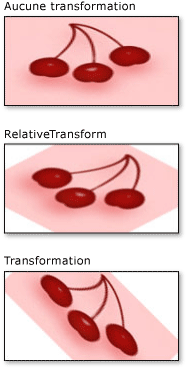

# Comment&#160;: transformer un pinceau
Cet exemple montre comment transformer des objets <xref:System.Windows.Media.Brush> en utilisant leurs deux propriétés de transformation : <xref:System.Windows.Media.Brush.RelativeTransform%2A> et <xref:System.Windows.Media.Brush.Transform%2A>.  
  
 Les exemples suivants utilisent un <xref:System.Windows.Media.RotateTransform> pour faire pivoter le contenu d'un <xref:System.Windows.Media.ImageBrush> de 45 degrés.  
  
 L'illustration suivante montre le <xref:System.Windows.Media.ImageBrush> sans <xref:System.Windows.Media.RotateTransform>, avec <xref:System.Windows.Media.RotateTransform> appliqué à la propriété <xref:System.Windows.Media.Brush.RelativeTransform%2A>, et avec <xref:System.Windows.Media.RotateTransform> appliqué à la propriété <xref:System.Windows.Media.Brush.Transform%2A>.  
  
   
  
## Exemple  
 Le premier exemple applique un <xref:System.Windows.Media.RotateTransform> à la propriété <xref:System.Windows.Media.Brush.RelativeTransform%2A> d'un <xref:System.Windows.Media.ImageBrush>.  Les propriétés <xref:System.Windows.Media.RotateTransform.CenterX%2A> et <xref:System.Windows.Media.RotateTransform.CenterY%2A> d'un objet <xref:System.Windows.Media.RotateTransform> ont la valeur 0.5, qui est la coordonnée relative du point central de ce contenu.  Par conséquent, le contenu <xref:System.Windows.Media.ImageBrush> pivote par rapport à son centre.  
  
 [!code-csharp[BrushesIntroduction_snip#ImageBrushRelativeTransformExample](../../../../samples/snippets/csharp/VS_Snippets_Wpf/BrushesIntroduction_snip/CSharp/BrushTransformExample.cs#imagebrushrelativetransformexample)]
 [!code-vb[BrushesIntroduction_snip#ImageBrushRelativeTransformExample](../../../../samples/snippets/visualbasic/VS_Snippets_Wpf/BrushesIntroduction_snip/visualbasic/brushtransformexample.vb#imagebrushrelativetransformexample)]
 [!code-xml[BrushesIntroduction_snip#ImageBrushRelativeTransformExample](../../../../samples/snippets/xaml/VS_Snippets_Wpf/BrushesIntroduction_snip/XAML/BrushTransformExample.xaml#imagebrushrelativetransformexample)]  
  
 Le deuxième exemple applique également un <xref:System.Windows.Media.RotateTransform> à un <xref:System.Windows.Media.ImageBrush> ; toutefois, cet exemple utilise la propriété <xref:System.Windows.Media.Brush.Transform%2A> au lieu de la propriété <xref:System.Windows.Media.Brush.RelativeTransform%2A>.  
  
 Pour faire pivoter le pinceau par rapport à son centre, l'exemple affecte aux propriétés <xref:System.Windows.Media.RotateTransform.CenterX%2A> et <xref:System.Windows.Media.RotateTransform.CenterY%2A> de l'objet <xref:System.Windows.Media.RotateTransform> des coordonnées absolues.  Dans la mesure où le pinceau peint un rectangle de 175 par 90 [pixels](GTMT), le point central du rectangle est \(87,5, 45\).  
  
 [!code-csharp[BrushesIntroduction_snip#ImageBrushTransformExample](../../../../samples/snippets/csharp/VS_Snippets_Wpf/BrushesIntroduction_snip/CSharp/BrushTransformExample.cs#imagebrushtransformexample)]
 [!code-vb[BrushesIntroduction_snip#ImageBrushTransformExample](../../../../samples/snippets/visualbasic/VS_Snippets_Wpf/BrushesIntroduction_snip/visualbasic/brushtransformexample.vb#imagebrushtransformexample)]
 [!code-xml[BrushesIntroduction_snip#ImageBrushTransformExample](../../../../samples/snippets/xaml/VS_Snippets_Wpf/BrushesIntroduction_snip/XAML/BrushTransformExample.xaml#imagebrushtransformexample)]  
  
 Pour une description du fonctionnement des propriétés <xref:System.Windows.Media.Brush.RelativeTransform%2A> et <xref:System.Windows.Media.Brush.Transform%2A>, consultez [Vue d'ensemble des transformations du pinceau](../../../../docs/framework/wpf/graphics-multimedia/brush-transformation-overview.md).  
  
 Pour l'exemple complet, consultez [Pinceaux, exemple](http://go.microsoft.com/fwlink/?LinkID=159973).  Pour plus d'informations sur les pinceaux, consultez [Vue d'ensemble de la peinture avec des couleurs unies ou des dégradés](../../../../docs/framework/wpf/graphics-multimedia/painting-with-solid-colors-and-gradients-overview.md).  
  
## Voir aussi  
 [Vue d'ensemble des transformations du pinceau](../../../../docs/framework/wpf/graphics-multimedia/brush-transformation-overview.md)   
 [Vue d'ensemble de la peinture avec des couleurs unies ou des dégradés](../../../../docs/framework/wpf/graphics-multimedia/painting-with-solid-colors-and-gradients-overview.md)   
 [Vue d'ensemble des transformations](../../../../docs/framework/wpf/graphics-multimedia/transforms-overview.md)