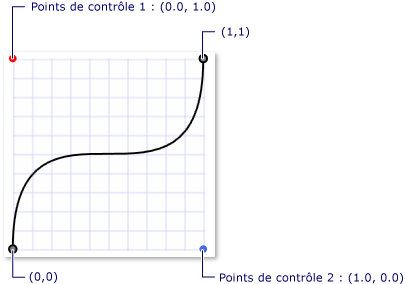
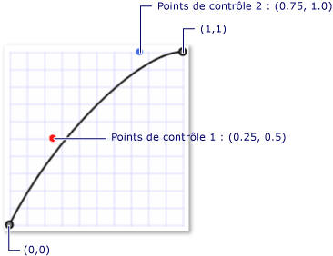

# Vue d'ensemble des animations d'image clé
Cette rubrique présente les animations d’image clé. Les animations d’image clé vous permettent d’effectuer des animation en utilisant plus de deux valeurs cibles et de contrôler la méthode d’interpolation d’une animation.  
  
   
## Prérequis  
 Pour comprendre cette vue d’ensemble, vous devez être familiarisé avec les animations et les chronologies de [!INCLUDE[TLA#tla_winclient](../../../../includes/tlasharptla-winclient-md.md)]. Pour une introduction aux animations, consultez [Vue d’ensemble de l’animation](../../../../docs/framework/wpf/graphics-multimedia/animation-overview.md). Cette rubrique vous permet également de vous familiariser avec les animations From/To/By. Pour plus d’informations, consultez la Vue d’ensemble des animations From/To/By.  
  
   
## Qu’est-ce qu’une animation d’image clé ?  
 Comme une animation From/To/By, une animation d’image clé anime la valeur d’une propriété cible. Il crée une transition parmi ses valeurs cibles sur sa <xref:System.Windows.Media.Animation.Timeline.Duration%2A>. Toutefois, contrairement à une animation From/To/By qui crée une transition entre deux valeurs, une animation d’image clé unique peut créer des transitions parmi n’importe quel nombre de valeurs cibles. Contrairement à une animation From/To/By, une animation d’image clé n’a aucune propriété From, To ou By avec lesquelles définir ses valeurs cibles. Les valeurs cibles d’une animation d’image clé sont décrites à l’aide d’objets d’images clés (d’où le terme « animation d’image clé »). Pour spécifier les valeurs des cibles de l’animation, vous créez des objets d’image clé et les ajouter à l’animation <xref:System.Windows.Media.Animation.DoubleAnimationUsingKeyFrames.KeyFrames%2A> collection. Lorsque l’animation s’exécute, elle effectue la transition entre les images que vous avez spécifiées.  
  
 Outre la prise en charge de plusieurs valeurs cibles, certaines méthodes d’image clé prennent même en charge plusieurs méthodes d’interpolation. La méthode d’interpolation d’une animation définit la manière dont elle passe d’une valeur à l’autre. Il existe trois types d’interpolations : discrète, linéaire et spline.  
  
 Pour utiliser une animation d’image clé, procédez comme suit.  
  
-   Déclarez l’animation et spécifiez sa <xref:System.Windows.Media.Animation.Timeline.Duration%2A>, tout comme vous le feriez pour une animation from/to/by.  
  
-   Pour chaque valeur cible, créez une image clé du type approprié, définissez sa valeur et <xref:System.Windows.Media.Animation.KeyTime>et l’ajouter à l’animation <xref:System.Windows.Media.Animation.DoubleAnimationUsingKeyFrames.KeyFrames%2A> collection.  
  
-   Associez l’animation à une propriété, comme vous le feriez avec une animation From/To/By. Pour plus d’informations sur l’application d’une animation à une propriété à l’aide d’une table de montage séquentiel, consultez la [Vue d’ensemble des storyboards](../../../../docs/framework/wpf/graphics-multimedia/storyboards-overview.md).  
  
 L’exemple suivant utilise un <xref:System.Windows.Media.Animation.DoubleAnimationUsingKeyFrames> pour animer un <xref:System.Windows.Shapes.Rectangle> élément à quatre emplacements différents.  
  
 [!code-xaml[keyframes_ovw_snippet#BasicKeyFrameExampleWholePage](../../../../samples/snippets/csharp/VS_Snippets_Wpf/keyframes_ovw_snippet/CS/KeyFramesIntroduction.xaml#basickeyframeexamplewholepage)]  
  
 Comme un From/To/By animation, une animation d’image clé peut être appliquée à une propriété en utilisant un <xref:System.Windows.Media.Animation.Storyboard> dans le balisage et le code ou à l’aide de la <xref:System.Windows.Media.Animation.Animatable.BeginAnimation%2A> méthode dans le code. Vous pouvez également utiliser une animation d’image clé pour créer un <xref:System.Windows.Media.Animation.AnimationClock> et l’appliquer à une ou plusieurs propriétés. Pour plus d’informations sur les différentes façons d’appliquer des animations, consultez la [Vue d’ensemble des techniques d’animation de propriétés](../../../../docs/framework/wpf/graphics-multimedia/property-animation-techniques-overview.md).  
  
   
## Types d’animations d’image clé  
 Étant donné que les animations génèrent des valeurs de propriété, il existe différents types d’animation pour différents types de propriété. Pour animer une propriété qui prend un <xref:System.Double> (par exemple d’un élément <xref:System.Windows.FrameworkElement.Width%2A> propriété), utilisez une animation qui produit <xref:System.Double> valeurs. Pour animer une propriété qui prend un <xref:System.Windows.Point>, utilisez une animation qui produit <xref:System.Windows.Point> valeurs et ainsi de suite.  
  
 Les classes d’animation d’image clé appartiennent à la <xref:System.Windows.Media.Animation> espace de noms et respecter la convention d’affectation de noms suivante :  
  
 *\<Type>* `AnimationUsingKeyFrames`  
  
 Où  *\<Type >* est le type de valeur que la classe anime.  
  
 [!INCLUDE[TLA2#tla_winclient](../../../../includes/tla2sharptla-winclient-md.md)] fournit les classes d’animation d’image clé suivantes.  
  
|Type de propriété|Animation From/To/By correspondante|Méthodes d’interpolation prises en charge|  
|-------------------|------------------------------------------------|-------------------------------------|  
|<xref:System.Boolean>|<xref:System.Windows.Media.Animation.BooleanAnimationUsingKeyFrames>|Discrète|  
|<xref:System.Byte>|<xref:System.Windows.Media.Animation.ByteAnimationUsingKeyFrames>|Discrète, linéaire, spline|  
|<xref:System.Windows.Media.Color>|<xref:System.Windows.Media.Animation.ColorAnimationUsingKeyFrames>|Discrète, linéaire, spline|  
|<xref:System.Decimal>|<xref:System.Windows.Media.Animation.DecimalAnimationUsingKeyFrames>|Discrète, linéaire, spline|  
|<xref:System.Double>|<xref:System.Windows.Media.Animation.DoubleAnimationUsingKeyFrames>|Discrète, linéaire, spline|  
|<xref:System.Int16>|<xref:System.Windows.Media.Animation.Int16AnimationUsingKeyFrames>|Discrète, linéaire, spline|  
|<xref:System.Int32>|<xref:System.Windows.Media.Animation.Int32AnimationUsingKeyFrames>|Discrète, linéaire, spline|  
|<xref:System.Int64>|<xref:System.Windows.Media.Animation.Int64AnimationUsingKeyFrames>|Discrète, linéaire, spline|  
|<xref:System.Windows.Media.Matrix>|<xref:System.Windows.Media.Animation.MatrixAnimationUsingKeyFrames>|Discrète|  
|<xref:System.Object>|<xref:System.Windows.Media.Animation.ObjectAnimationUsingKeyFrames>|Discrète|  
|<xref:System.Windows.Point>|<xref:System.Windows.Media.Animation.PointAnimationUsingKeyFrames>|Discrète, linéaire, spline|  
|<xref:System.Windows.Media.Media3D.Quaternion>|<xref:System.Windows.Media.Animation.QuaternionAnimationUsingKeyFrames>|Discrète, linéaire, spline|  
|<xref:System.Windows.Rect>|<xref:System.Windows.Media.Animation.RectAnimationUsingKeyFrames>|Discrète, linéaire, spline|  
|<xref:System.Windows.Media.Media3D.Rotation3D>|<xref:System.Windows.Media.Animation.Rotation3DAnimationUsingKeyFrames>|Discrète, linéaire, spline|  
|<xref:System.Single>|<xref:System.Windows.Media.Animation.SingleAnimationUsingKeyFrames>|Discrète, linéaire, spline|  
|<xref:System.String>|<xref:System.Windows.Media.Animation.StringAnimationUsingKeyFrames>|Discrète|  
|<xref:System.Windows.Size>|<xref:System.Windows.Media.Animation.SizeAnimationUsingKeyFrames>|Discrète, linéaire, spline|  
|<xref:System.Windows.Thickness>|<xref:System.Windows.Media.Animation.ThicknessAnimationUsingKeyFrames>|Discrète, linéaire, spline|  
|<xref:System.Windows.Media.Media3D.Vector3D>|<xref:System.Windows.Media.Animation.Vector3DAnimationUsingKeyFrames>|Discrète, linéaire, spline|  
|<xref:System.Windows.Vector>|<xref:System.Windows.Media.Animation.VectorAnimationUsingKeyFrames>|Discrète, linéaire, spline|  
  
   
## Valeurs cibles (images clés) et temps clés  
 Tout comme il existe différents types d’animations d’image clé pour animer différents types de propriété, il existe également différents types d’objets d’image clé : un pour chaque type de valeur animée et pour chaque méthode d’interpolation prise en charge. Les types d’image clé obéissent à la convention d’affectation de noms suivante :  
  
 *\<InterpolationMethod>\<Type>* `KeyFrame`  
  
 Où *\<InterpolationMethod>* est la méthode d’interpolation qu’utilise l’image clé et *\<Type>* est le type de valeur que la classe anime. Une animation d’image clé qui prend en charge les trois méthodes d’interpolation aura trois types d’image clé que vous pouvez utiliser. Par exemple, vous pouvez utiliser trois types d’image clé avec un <xref:System.Windows.Media.Animation.DoubleAnimationUsingKeyFrames>: <xref:System.Windows.Media.Animation.DiscreteDoubleKeyFrame>, <xref:System.Windows.Media.Animation.LinearDoubleKeyFrame>, et <xref:System.Windows.Media.Animation.SplineDoubleKeyFrame>. (Les méthodes d’interpolation sont décrites en détail dans une section ultérieure.)  
  
 L’objectif principal d’une image clé consiste à spécifier un <xref:System.Windows.Media.Animation.IKeyFrame.KeyTime%2A> et un <xref:System.Windows.Media.Animation.IKeyFrame.Value%2A>. Chaque type d’image clé fournit ces deux propriétés.  
  
-   Le <xref:System.Windows.Media.Animation.IKeyFrame.Value%2A> propriété spécifie la valeur cible pour cette image clé.  
  
-   Le <xref:System.Windows.Media.Animation.IKeyFrame.KeyTime%2A> propriété spécifie à quel moment (au sein de l’animation <xref:System.Windows.Media.Animation.Timeline.Duration%2A>) d’une image clé <xref:System.Windows.Media.Animation.IKeyFrame.Value%2A> est atteinte.  
  
 Lorsqu’une animation d’image clé commence, effectue une itération via ses images clés dans l’ordre défini par leurs <xref:System.Windows.Media.Animation.IKeyFrame.KeyTime%2A> propriétés.  
  
-   S’il n’existe aucune image clé à 0, l’animation crée une transition entre la valeur actuelle de la propriété cible et la <xref:System.Windows.Media.Animation.IKeyFrame.Value%2A> de la première image clé ; sinon, l’animation de sortie de valeur devient la valeur de la première image clé.  
  
-   L’animation crée une transition entre les <xref:System.Windows.Media.Animation.IKeyFrame.Value%2A> de la première et deuxième image clé à l’aide de la méthode d’interpolation spécifiée par la deuxième image clé. La transition commence à la première image clé <xref:System.Windows.Media.Animation.IKeyFrame.KeyTime%2A> et se termine lorsque l’image clé deuxième <xref:System.Windows.Media.Animation.IKeyFrame.KeyTime%2A> est atteinte.  
  
-   L’animation continue, en créant des transitions entre chaque image clé suivante et son image clé précédente.  
  
-   Enfin, l’animation passe à la valeur de l’image clé avec le plus de temps clé qui est égal ou inférieur de l’animation <xref:System.Windows.Media.Animation.Timeline.Duration%2A>.  
  
 Si de l’animation <xref:System.Windows.Media.Animation.Timeline.Duration%2A> est <xref:System.Windows.Duration.Automatic%2A> ou son <xref:System.Windows.Media.Animation.Timeline.Duration%2A> est égal à l’heure de la dernière image clé, l’animation se termine. Sinon, si de l’animation <xref:System.Windows.Duration> est supérieur au temps clé de la dernière image clé, l’animation maintient la valeur de l’image clé jusqu'à ce qu’il atteint la fin de son <xref:System.Windows.Duration>. Comme toutes les animations, une animation d’image clé utilise sa <xref:System.Windows.Media.Animation.Timeline.FillBehavior%2A> propriété pour déterminer si elle maintient sa dernière valeur lorsqu’elle atteint la fin de sa période active. Pour plus d’informations, consultez l’article [Vue d’ensemble des comportements de minutage](../../../../docs/framework/wpf/graphics-multimedia/timing-behaviors-overview.md).  
  
 L’exemple suivant utilise le <xref:System.Windows.Media.Animation.DoubleAnimationUsingKeyFrames> objet défini dans l’exemple précédent pour montrer comment les <xref:System.Windows.Media.Animation.IKeyFrame.Value%2A> et <xref:System.Windows.Media.Animation.IKeyFrame.KeyTime%2A> propriétés du travail.  
  
-   La première image clé affecte immédiatement la valeur de sortie de l’animation à 0.  
  
-   La deuxième image clé s’anime de 0 à 350. Elle démarre après la fin de la première image clé (au temps = 0 seconde) et est lue pendant 2 secondes, pour se terminer au temps = 0:0:2.  
  
-   La troisième image clé s’anime de 350 à 50. Elle démarre après la fin de la deuxième image clé (au temps = 2 secondes) et est lue pendant 5 secondes, pour se terminer au temps = 0:0:7.  
  
-   La quatrième image clé s’anime de 50 à 200. Elle démarre après la fin de la troisième image clé (au temps = 7 secondes) et est lue pendant 1 seconde, pour se terminer au temps = 0:0:8.  
  
-   Étant donné que le <xref:System.Windows.Media.Animation.Timeline.Duration%2A> propriété de l’animation a été définie à 10 secondes, l’animation maintient sa dernière valeur pendant deux secondes avant de terminer à = 0:0:10.  
  
 [!code-xaml[keyframes_ovw_snippet#BasicKeyFrameExampleWholePage](../../../../samples/snippets/csharp/VS_Snippets_Wpf/keyframes_ovw_snippet/CS/KeyFramesIntroduction.xaml#basickeyframeexamplewholepage)]  
  
   
## Méthodes d’interpolation  
 Nous avons vu dans les sections précédentes que certaines animations d’image clé prennent en charge plusieurs méthodes d’interpolation. L’interpolation d’une animation décrit la manière une animation transite entre les valeurs sur sa durée. En sélectionnant le type d’image clé que vous utilisez avec votre animation, vous pouvez définir la méthode d’interpolation correspondant à ce segment d’image clé. Il existe trois types de méthodes d’interpolation : linéaire, discrète et spline.  
  
### Interpolation linéaire  
 Avec l’interpolation linéaire, l’animation progresse à une vitesse constante pendant la durée du segment. Par exemple, si un segment d’image clé passe de 0 à 10 sur une durée de 5 secondes, l’animation générera les valeurs suivantes aux temps spécifiés :  
  
|réflexion|Valeur de sortie|  
|----------|------------------|  
|0|0|  
|1|2|  
|2|4|  
|3|6|  
|4|8|  
|4.25|8.5|  
|4.5|9|  
|5|10|  
  
### Interpolation discrète  
 Avec l’interpolation discrète, la fonction d’animation passe d’une valeur à la suivante sans interpolation. Si un segment d’image clé passe de 0 à 10 sur une durée de 5 secondes, l’animation générera les valeurs suivantes aux temps spécifiés :  
  
|Heure|Valeur de sortie|  
|----------|------------------|  
|0|0|  
|1|0|  
|2|0|  
|3|0|  
|4|0|  
|4.25|0|  
|4.5|0|  
|5|10|  
  
 Notez que l’animation ne change pas sa valeur de sortie avant la fin de la durée du segment.  
  
 L’interpolation spline est plus complexe. Elle est décrite dans la section suivante.  
  
   
### Interpolation spline  
 L’interpolation spline peut être utilisée pour obtenir des effets de minutage plus réalistes. Étant donné que les animations sont souvent utilisées pour imiter des effets qui se produisent dans le monde réel, les développeurs peuvent avoir à contrôler précisément l’accélération et la décélération des objets, et devoir manipuler précisément les segments de minutage. Les images clés spline vous permettent d’effectuer des animation avec une interpolation spline. Avec les autres images clés, vous spécifiez un <xref:System.Windows.Media.Animation.IKeyFrame.Value%2A> et <xref:System.Windows.Media.Animation.IKeyFrame.KeyTime%2A>. Avec une image clé de spline, vous spécifiez également un <xref:System.Windows.Media.Animation.SplineDoubleKeyFrame.KeySpline%2A>. L’exemple suivant montre une image clé de spline unique pour une <xref:System.Windows.Media.Animation.DoubleAnimationUsingKeyFrames>. Notez le <xref:System.Windows.Media.Animation.KeySpline> propriété ; ce qui rend une image clé de spline différente des autres types d’images clés.  
  
 [!code-xaml[keyframes_ovw_snippet#SingleSplineKeyFrameExample](../../../../samples/snippets/csharp/VS_Snippets_Wpf/keyframes_ovw_snippet/CS/InterpolationMethodsExample.xaml#singlesplinekeyframeexample)]  
  
 Une courbe de Bézier cubique est définie par un point de départ, un point de terminaison et deux points de contrôle. Le <xref:System.Windows.Media.Animation.KeySpline> propriété d’une image clé de spline définit les deux points de contrôle d’une courbe de Bézier qui s’étend de (0,0) à (1,1). Le premier point de contrôle permet de contrôler le facteur de courbe de la première moitié de la courbe de Bézier ; le deuxième point de contrôle permet de contrôler le facteur de courbe de la seconde moitié de la courbe de Bézier. La courbe obtenue décrit la vitesse de changement pour cette image clé spline. Plus la courbe est raide, plus vite l’image clé modifie ses valeurs. À mesure que la courbe s’aplatit, l’image clé modifie ses valeurs plus lentement.  
  
 Vous pouvez utiliser <xref:System.Windows.Media.Animation.KeySpline> pour simuler des trajectoires physiques comme les chutes d’eau ou rebondissent billes de roulement, ou appliquer des autres « accélération » et les effets de « atténuation » aux animations de mouvement. Pour les effets d’interaction utilisateur comme les atténuations d’arrière-plan ou le rebond du bouton de contrôle, vous pouvez appliquer l’interpolation spline pour accélérer ou ralentir la vitesse de changement d’une animation d’une façon spécifique.  
  
 L’exemple suivant spécifie un <xref:System.Windows.Media.Animation.KeySpline> de 0,1 1,0, qui crée la courbe de Bézier suivante.  
  
   
Courbe clé avec les points de contrôle (0.0, 1.0) et (1.0, 0.0)  
  
 [!code-xaml[keyframes_ovw_snippet#SingleSplineKeyFrameExample](../../../../samples/snippets/csharp/VS_Snippets_Wpf/keyframes_ovw_snippet/CS/InterpolationMethodsExample.xaml#singlesplinekeyframeexample)]  
  
 Cette image clé s’anime rapidement lorsqu’elle commence, puis ralentit et accélère à nouveau avant de se terminer.  
  
 L’exemple suivant spécifie un <xref:System.Windows.Media.Animation.KeySpline> de 0.5,0.25 0.75,1.0, qui crée la courbe de Bézier suivante.  
  
   
Courbe clé avec les points de contrôle (0.25, 0.5) et (0.75, 1.0)  
  
 [!code-xaml[keyframes_ovw_snippet#SingleSplineKeyFrameExampleInline3](../../../../samples/snippets/csharp/VS_Snippets_Wpf/keyframes_ovw_snippet/CS/InterpolationMethodsExample.xaml#singlesplinekeyframeexampleinline3)]  
  
 Étant donné que la courbure de la courbe de Bézier change très peu, cette image clé s’anime à une fréquence presque constante ; elle ralentit quelque peu vers la fin.  
  
 L’exemple suivant utilise un <xref:System.Windows.Media.Animation.DoubleAnimationUsingKeyFrames> pour animer la position du rectangle. Étant donné que la <xref:System.Windows.Media.Animation.DoubleAnimationUsingKeyFrames> utilise <xref:System.Windows.Media.Animation.SplineDoubleKeyFrame> des objets, la transition entre chaque valeur d’image clé utilise l’interpolation spline.  
  
 [!code-xaml[keyframes_ovw_snippet#SplinedInterpolationExample](../../../../samples/snippets/csharp/VS_Snippets_Wpf/keyframes_ovw_snippet/CS/InterpolationMethodsExample.xaml#splinedinterpolationexample)]  
  
 L’interpolation spline peut être difficile à comprendre ; il peut être utile d’expérimenter différents paramètres. [L’exemple d’animation de courbe clé](http://go.microsoft.com/fwlink/?LinkID=160011) vous permet de modifier les valeurs de courbe clé et de voir son résultat dans une animation.  
  
   
### Combinaison de méthodes d’interpolation  
 Vous pouvez utiliser des images clés avec différents types d’interpolation dans une animation d’image clé unique. Lorsque deux animations d’image clé avec des interpolations différentes se suivent, la méthode d’interpolation de la deuxième image clé est utilisée pour créer la transition entre la première valeur et la seconde.  
  
 Dans l’exemple suivant, un <xref:System.Windows.Media.Animation.DoubleAnimationUsingKeyFrames> est créé qui utilise une interpolation linéaire, spline et discrète.  
  
 [!code-xaml[keyframes_ovw_snippet#ComboInterpolationExample](../../../../samples/snippets/csharp/VS_Snippets_Wpf/keyframes_ovw_snippet/CS/InterpolationMethodsExample.xaml#combointerpolationexample)]  
  
   
## En savoir plus sur la durée et les temps clés  
 Comme les autres animations, les animations d’image clé ont une <xref:System.Windows.Duration> propriété. Outre la spécification de l’animation <xref:System.Windows.Duration>, vous devez spécifier quelle partie de cette durée est donné à chaque image clé. Pour cela, vous devez décrivant un <xref:System.Windows.Media.Animation.IKeyFrame.KeyTime%2A> pour chacune des images clés de l’animation. Chaque image clé <xref:System.Windows.Media.Animation.IKeyFrame.KeyTime%2A> indique quand cette image clé se termine.  
  
 Le <xref:System.Windows.Media.Animation.IKeyFrame.KeyTime%2A> propriété ne spécifie pas la lecture de la durée pendant laquelle le temps clé. La durée de lecture d’une image clé est déterminée par le moment où l’image clé se termine, par le moment où l’image clé précédente a pris fin et par la durée de l’animation. Temps clés peuvent être spécifiés comme une valeur d’heure, un pourcentage, ou comme des valeurs spéciales <xref:System.Windows.Media.Animation.KeyTime.Uniform%2A> ou <xref:System.Windows.Media.Animation.KeyTime.Paced%2A>.  
  
 La liste suivante décrit les différentes façons de spécifier des temps clés.  
  
### Valeurs TimeSpan  
 Vous pouvez utiliser <xref:System.TimeSpan> valeurs pour spécifier un <xref:System.Windows.Media.Animation.KeyTime>. La valeur doit être supérieure ou égale à 0 et inférieure ou égale à la durée de l’animation. L’exemple suivant illustre une animation d’une durée de 10 secondes qui comporte quatre images clés dont les temps clés sont spécifiés en tant que valeurs de temps.  
  
-   La première image clé s’anime entre la valeur de base et 100 pendant les 3 premières secondes, et se termine au temps = 0:0:03.  
  
-   La deuxième image clé s’anime de 100 à 200. Elle démarre après la fin de la première image clé (au temps = 3 secondes) et est lue pendant 5 secondes, pour se terminer au temps = 0:0:8.  
  
-   La troisième image clé s’anime de 200 à 500. Elle démarre après la fin de la deuxième image clé (au temps = 8 secondes) et est lue pendant 1 seconde, pour se terminer au temps = 0:0:9.  
  
-   La quatrième image clé s’anime de 500 à 600. Elle démarre après la fin de la troisième image clé (au temps = 9 secondes) et est lue pendant 1 seconde, pour se terminer au temps = 0:0:10.  
  
 [!code-xaml[keyframes_ovw_snippet#TimeSpanKeyTimeExample](../../../../samples/snippets/csharp/VS_Snippets_Wpf/keyframes_ovw_snippet/CS/KeyTimesExample.xaml#timespankeytimeexample)]  
  
### Valeurs de pourcentage  
 Une valeur de pourcentage spécifie que l’image clé se termine à un pourcentage de l’animation <xref:System.Windows.Media.Animation.Timeline.Duration%2A>. Dans [!INCLUDE[TLA2#tla_xaml](../../../../includes/tla2sharptla-xaml-md.md)], vous spécifiez le pourcentage sous la forme d’un nombre suivi par le symbole `%`. Dans le code, vous utilisez la <xref:System.Windows.Media.Animation.KeyTime.FromPercent%2A> méthode et lui passer un <xref:System.Double> qui indique le pourcentage. La valeur doit être supérieure ou égale à 0 et inférieure ou égale à 100 %. L’exemple suivant illustre une animation d’une durée de 10 secondes qui comporte quatre images clés dont les temps clés sont spécifiés en tant que pourcentages.  
  
-   La première image clé s’anime entre la valeur de base et 100 pendant les 3 premières secondes, et se termine au temps = 0:0:3.  
  
-   La deuxième image clé s’anime de 100 à 200. Elle démarre après la fin de la première image clé (au temps = 3 secondes) et est lue pendant 5 secondes, pour se terminer au temps = 0:0:8 (0.8 * 10 = 8).  
  
-   La troisième image clé s’anime de 200 à 500. Elle démarre après la fin de la deuxième image clé (au temps = 8 secondes) et est lue pendant 1 seconde, pour se terminer au temps = 0:0:9 (0.9 * 10 = 9).  
  
-   La quatrième image clé s’anime de 500 à 600. Elle démarre après la fin de la troisième image clé (au temps = 9 secondes) et est lue pendant 1 seconde, pour se terminer au temps = 0:0:10 (1 * 10 = 10).  
  
 [!code-xaml[keyframes_ovw_snippet#PercentageKeyTimeExample](../../../../samples/snippets/csharp/VS_Snippets_Wpf/keyframes_ovw_snippet/CS/KeyTimesExample.xaml#percentagekeytimeexample)]  
  
### Valeur spéciale, Uniform  
 Utilisez <xref:System.Windows.Media.Animation.KeyTime.Uniform%2A> à quel moment vous souhaitez que chaque image clé à prendre le même temps.  
  
 A <xref:System.Windows.Media.Animation.KeyTime.Uniform%2A> temps clé divise le temps disponible équitablement par le nombre d’images clés pour déterminer l’heure de fin de chaque image clé. L’exemple suivant illustre une animation avec une durée de 10 secondes et quatre images clés dont les temps clés sont spécifiés comme <xref:System.Windows.Media.Animation.KeyTime.Uniform%2A>.  
  
-   La première image clé s’anime entre la valeur de base et 100 pendant les 2,5 premières secondes, et se termine au temps = 0:0:2.5.  
  
-   La deuxième image clé s’anime de 100 à 200. Elle démarre après la fin de la première image clé (au temps = 2,5 secondes) et est lue pendant environ 2,5 secondes, pour se terminer au temps = 0:0:5.  
  
-   La troisième image clé s’anime de 200 à 500. Elle démarre après la fin de la deuxième image clé (au temps = 5 secondes) et est lue pendant 2,5 secondes, pour se terminer au temps = 0:0:7.5.  
  
-   La quatrième image clé s’anime de 500 à 600. Elle démarre après la fin de la deuxième image clé (au temps = 7,5 secondes) et est lue pendant 2,5 secondes, pour se terminer au temps = 0:0:1.  
  
 [!code-xaml[keyframes_ovw_snippet#UniformKeyTimeExample](../../../../samples/snippets/csharp/VS_Snippets_Wpf/keyframes_ovw_snippet/CS/KeyTimesExample.xaml#uniformkeytimeexample)]  
  
### Valeur spéciale, Paced  
 Utilisez <xref:System.Windows.Media.Animation.KeyTime.Paced%2A> lorsque vous souhaitez animer à un rythme constant de temporisation.  
  
 A <xref:System.Windows.Media.Animation.KeyTime.Paced%2A> temps clé alloue le temps disponible en fonction de la longueur de chacune des images clés pour déterminer la durée de chaque image.  Cela permet de maintenir constante la vitesse ou la fréquence de l’animation.  L’exemple suivant illustre une animation avec une durée de 10 secondes et trois images clés dont les temps clés sont spécifiés comme <xref:System.Windows.Media.Animation.KeyTime.Paced%2A>.  
  
 [!code-xaml[keyframes_ovw_snippet#PacedKeyTimeExample](../../../../samples/snippets/csharp/VS_Snippets_Wpf/keyframes_ovw_snippet/CS/KeyTimesExample.xaml#pacedkeytimeexample)]  
  
 Notez que, si le temps clé de la dernière image clé est <xref:System.Windows.Media.Animation.KeyTime.Paced%2A> ou <xref:System.Windows.Media.Animation.KeyTime.Uniform%2A>, son temps clé résolu est fixé à 100 pour cent. Si la première image clé dans une animation à plusieurs images est rythmée, son temps clé résolu est défini sur 0. (Si la collection d’images clé contient seulement une image clé unique et s’il s’agit d’une image clé rythmée, son temps clé résolu aura une valeur de 100 %.)  
  
 Les différentes images clés d’une même animation d’image clé peuvent utiliser des temps clés différents.  
  
   
## Combinaison de temps clés avec des images clés dans le désordre  
 Vous pouvez utiliser des images clés avec différentes <xref:System.Windows.Media.Animation.KeyTime> les types valeur dans la même animation. Et, bien qu’il soit recommandé d’ajouter des images clés dans l’ordre dans lequel elles doivent être lues, cela n’est pas forcément nécessaire. Le système d’animation et de minutage est capable de résoudre des images clés désordonnées. Les images clés avec des temps clés non valides sont ignorées.  
  
 La section suivante décrit la procédure qui permet de résoudre les temps clés pour les images clés d’une animation d’image clé.  
  
1.  Résoudre <xref:System.TimeSpan> <xref:System.Windows.Media.Animation.KeyTime> valeurs.  
  
2.  Déterminez le *temps total d’interpolation* de l’animation, c’est-à-dire la durée totale nécessaire à l’animation d’image clé pour exécuter une itération avancée.  
  
    1.  Si de l’animation <xref:System.Windows.Media.Animation.Timeline.Duration%2A> n’est pas <xref:System.Windows.Duration.Automatic%2A> ou <xref:System.Windows.Duration.Forever%2A>, la durée totale de l’interpolation est la valeur de l’animation <xref:System.Windows.Media.Animation.Timeline.Duration%2A> propriété.  
  
    2.  Sinon, la durée totale de l’interpolation est le plus grand <xref:System.TimeSpan> <xref:System.Windows.Media.Animation.KeyTime> valeur spécifiée parmi ses images clés, le cas échéant.  
  
    3.  Sinon, le temps total d’interpolation est de 1 seconde.  
  
3.  Permet de résoudre la valeur de la durée totale de l’interpolation <xref:System.Windows.Media.Animation.KeyTimeType.Percent> <xref:System.Windows.Media.Animation.KeyTime> valeurs.  
  
4.  Résolvez la dernière image clé, si elle n’a pas déjà été résolue dans les étapes précédentes. Si le <xref:System.Windows.Media.Animation.KeyTime> de la dernière image clé est <xref:System.Windows.Media.Animation.KeyTime.Uniform%2A> ou <xref:System.Windows.Media.Animation.KeyTime.Paced%2A>, sa durée résolue sera égale à la durée totale de l’interpolation.  
  
     Si le <xref:System.Windows.Media.Animation.KeyTime> de la première image clé est <xref:System.Windows.Media.Animation.KeyTime.Paced%2A> et cette animation a plusieurs images clés, résolvez sa <xref:System.Windows.Media.Animation.KeyTime> valeur à zéro ; s’il n'existe qu’une seule image clé et sa <xref:System.Windows.Media.Animation.KeyTime> valeur est <xref:System.Windows.Media.Animation.KeyTime.Paced%2A>, il est résolu au total durée de l’interpolation, comme décrit dans l’étape précédente.  
  
5.  Résoudre restant <xref:System.Windows.Media.Animation.KeyTime.Uniform%2A> <xref:System.Windows.Media.Animation.KeyTime> valeurs : elles reçoivent chacune une part égale du temps disponible.  Pendant ce processus, non résolue <xref:System.Windows.Media.Animation.KeyTime.Paced%2A> <xref:System.Windows.Media.Animation.KeyTime> valeurs sont traitées temporairement comme <xref:System.Windows.Media.Animation.KeyTime.Uniform%2A> <xref:System.Windows.Media.Animation.KeyTime> valeurs et obtenir une heure résolue temporaire.  
  
6.  Résoudre les <xref:System.Windows.Media.Animation.KeyTime> valeurs d’images clés avec des temps clés non spécifiés à l’aide des images clés déclarées le plus proche qui ont résolu <xref:System.Windows.Media.Animation.KeyTime> valeurs.  
  
7.  Résoudre restant <xref:System.Windows.Media.Animation.KeyTime.Paced%2A> <xref:System.Windows.Media.Animation.KeyTime> valeurs. <xref:System.Windows.Media.Animation.KeyTime.Paced%2A><xref:System.Windows.Media.Animation.KeyTime> utiliser le <xref:System.Windows.Media.Animation.KeyTime> valeurs d’avoisinantes clé images afin de déterminer leur heure résolue.  L’objectif est de vous assurer que la vitesse de l’animation reste constante autour du temps résolu de cette image clé.  
  
8.  Triez les images clés par ordre d’heure résolue (clé primaire) et ordre de déclaration (clé secondaire), c'est-à-dire, utilisez un tri stable basé sur l’image clé résolue <xref:System.Windows.Media.Animation.KeyTime> valeurs.  
  
## Voir aussi  
 <xref:System.Windows.Media.Animation.KeyTime>  
 <xref:System.Windows.Media.Animation.KeySpline>  
 <xref:System.Windows.Media.Animation.Timeline>  
 [Animation de Spline clé, exemple](http://go.microsoft.com/fwlink/?LinkID=160011)  
 [Animation d’image clé, exemple](http://go.microsoft.com/fwlink/?LinkID=160012)  
 [Vue d’ensemble de l’animation](../../../../docs/framework/wpf/graphics-multimedia/animation-overview.md)  
 [Vue d'ensemble des plans conceptuels](../../../../docs/framework/wpf/graphics-multimedia/storyboards-overview.md)  
 [Guides pratiques relatifs aux images clés](../../../../docs/framework/wpf/graphics-multimedia/key-frame-animation-how-to-topics.md)  
 [Vue d’ensemble des comportements de minutage](../../../../docs/framework/wpf/graphics-multimedia/timing-behaviors-overview.md)
