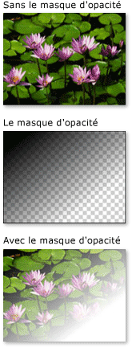
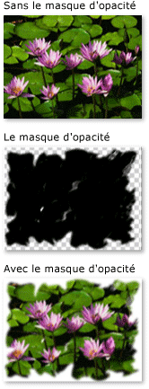
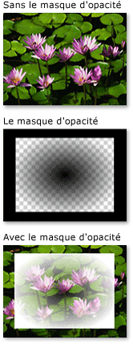

# Vue d&#39;ensemble des masques d&#39;opacit&#233;
Les masques d'opacité vous permettent de rendre transparentes ou partiellement transparentes des parties d'un élément ou d'un visuel.  Pour créer un masque d'opacité, vous appliquez un <xref:System.Windows.Media.Brush> à la propriété <xref:System.Windows.UIElement.OpacityMask%2A> d'un élément ou <xref:System.Windows.Media.Visual>.  Le pinceau est mappé à l'élément ou visuel, et la valeur d'opacité de chaque pixel de pinceau est utilisée pour déterminer l'opacité résultante de chaque pixel correspondant de l'élément ou visuel.  
  
 Cette rubrique contient les sections suivantes.  
  
   
-   [Composants requis](#prereqs)  
  
-   [Création d'effets visuels avec les masques d'opacité](#opacitymasks)  
  
-   [Création d'un masque d'opacité](#creatingopacitymasks)  
  
-   [Utilisation d'un gradient comme un masque d'opacité](#creatingopacitymaskswithgradients)  
  
-   [Spécification de points de dégradé pour un masque d'opacité](#specifyinggradientcolors)  
  
-   [Utilisation d'une image comme un masque d'opacité](#usingimageasopacitymask)  
  
-   [Création d'un masque d'opacité à partir d'un dessin](#drawingbrushasopacitymask)  
  
-   [Rubriques connexes](#seeAlsoToggle)  
  
   
## Composants requis  
 Cette vue d'ensemble suppose que vous êtes familiarisé avec les objets <xref:System.Windows.Media.Brush>.  Pour une introduction à l'utilisation de pinceaux, consultez [Vue d'ensemble de la peinture avec des couleurs unies ou des dégradés](../../../../docs/framework/wpf/graphics-multimedia/painting-with-solid-colors-and-gradients-overview.md).  Pour plus d'informations sur <xref:System.Windows.Media.ImageBrush> et <xref:System.Windows.Media.DrawingBrush>, consultez [Peinture avec des objets d'image, de dessin et visuels](../../../../docs/framework/wpf/graphics-multimedia/painting-with-images-drawings-and-visuals.md).  
  
   
## Création d'effets visuels avec les masques d'opacité  
 Un masque d'opacité consiste à mapper son contenu à l'élément ou visuel.  Le [canal alpha](GTMT) de chacun des pixels du pinceau est ensuite utilisé pour déterminer l'opacité résultante de l'élément ou des pixels correspondants du visuel ; la couleur réelle du pinceau est ignorée.  Si une partie donnée du pinceau est transparente, la partie correspondante de l'élément ou visuel devient transparente.  Si une partie donnée du pinceau est opaque, l'opacité de la partie correspondante de l'élément ou visuel reste inchangée.  L'opacité spécifiée par le masque d'opacité est combinée avec tout paramètre d'opacité présent dans l'élément ou visuel.  Par exemple, si un élément est 25 pour cent opaque et qu'un masque d'opacité est appliqué et passe de complètement opaque à complètement transparent, le résultat est un élément qui passe de 25 pour cent d'opacité à complètement transparent.  
  
> [!NOTE]
>  Bien que les exemples dans cette vue d'ensemble montrent l'utilisation de masques d'opacité sur les éléments d'image, un masque d'opacité peut être appliqué à tout élément ou <xref:System.Windows.Media.Visual>, y compris les volets et contrôles.  
  
 Les masques d'opacité sont utilisés pour créer des effets visuels intéressants, comme créer des images ou boutons qui s'effacent à l'affichage, ajouter des textures aux éléments, ou combiner des gradients pour produire des surfaces semblables au verre.  L'illustration suivante montre l'utilisation d'un masque d'opacité.  Un arrière\-plan à carreaux est utilisé pour afficher les parties transparentes du masque.  
  
   
Exemple de masque d'opacité  
  
   
## Création d'un masque d'opacité  
 Pour créer un masque d'opacité, vous créez un <xref:System.Windows.Media.Brush> et l'appliquez à la propriété <xref:System.Windows.UIElement.OpacityMask%2A> d'un élément ou visuel.  Vous pouvez utiliser tout type de <xref:System.Windows.Media.Brush> comme un masque d'opacité.  
  
-   <xref:System.Windows.Media.LinearGradientBrush>, <xref:System.Windows.Media.RadialGradientBrush>: utilisé pour qu'un élément ou visuel disparaisse de l'affichage.  
  
     L'image suivante affiche un <xref:System.Windows.Media.LinearGradientBrush> utilisé comme un masque d'opacité.  
  
       
Exemple de masque d'opacité LinearGradientBrush  
  
-   <xref:System.Windows.Media.ImageBrush>: utilisé pour créer des effets de texture ou de bord doux ou déchiré.  
  
     L'image suivante affiche un <xref:System.Windows.Media.ImageBrush> utilisé comme un masque d'opacité.  
  
       
Exemple de masque d'opacité LinearGradientBrush  
  
-   <xref:System.Windows.Media.DrawingBrush>: utilisé pour créer des masques d'opacité complexes à partir de modèles des formes, d'images et de gradients.  
  
     L'image suivante affiche un <xref:System.Windows.Media.DrawingBrush> utilisé comme un masque d'opacité.  
  
       
Exemple de masque d'opacité DrawingBrush  
  
 Les pinceaux dégradés \(<xref:System.Windows.Media.LinearGradientBrush> et <xref:System.Windows.Media.RadialGradientBrush>\) sont particulièrement bien assortis pour une utilisation comme masque d'opacité.  Du fait qu'un <xref:System.Windows.Media.SolidColorBrush> remplit une zone d'une couleur uniforme, cela en fait un masque d'opacité médiocre ; l'utilisation d'un <xref:System.Windows.Media.SolidColorBrush> est équivalent à la définition de la propriété <xref:System.Windows.UIElement.OpacityMask%2A> de l'élément ou visuel.  
  
   
## Utilisation d'un gradient comme un masque d'opacité  
 Pour créer un remplissage dégradé, vous spécifiez deux points de dégradé ou plus.  Chaque point de dégradé contient une couleur et une position \(consultez [Vue d'ensemble de la peinture avec des couleurs unies ou des dégradés](../../../../docs/framework/wpf/graphics-multimedia/painting-with-solid-colors-and-gradients-overview.md) pour plus d'informations sur la création et l'utilisation de gradients\).  Le processus est le même lors de l'utilisation d'un gradient comme un masque d'opacité, mais, au lieu de fusionner des couleurs, le gradient du masque d'opacité fusionne des valeurs de canal alpha.  De ce fait, la couleur réelle du contenu du gradient n'importe pas ; seul compte le canal alpha, l'opacité, ou chaque couleur.  Voici un exemple :  
  
 <!-- TODO: review snippet reference [!code-xml[OpacityMasksExample#LinearGradientOpacityMaskonImage](../../../../samples/snippets/csharp/VS_Snippets_Wpf/OpacityMasksExample/CS/GradientBrushExample.xaml#lineargradientopacitymaskonimage)]  -->
 <!-- TODO: review snippet reference [!code-xml[OpacityMasksExample#LinearGradientOpacityMaskonImage](../../../../samples/snippets/xaml/VS_Snippets_Wpf/OpacityMasksExample/XAML/GradientBrushExample.xaml#lineargradientopacitymaskonimage)]  -->  
  
   
## Spécification de points de dégradé pour un masque d'opacité  
 Dans l'exemple précédent, la couleur <xref:System.Windows.Media.Colors.Black%2A> définie par le système est utilisée comme couleur initiale du gradient.  Du fait que toutes les couleurs dans la classe <xref:System.Windows.Media.Colors>, sauf <xref:System.Windows.Media.Colors.Transparent%2A>, sont totalement opaques, elles peuvent être utilisées pour définir simplement une couleur initiale pour un masque d'opacité dégradé.  
  
 Pour un contrôle supplémentaire des valeurs alpha lorsque vous définissez un masque d'opacité, vous pouvez spécifier le canal alpha des couleurs à l'aide de la [!INCLUDE[TLA#tla_argb](../../../../includes/tlasharptla-argb-md.md)]notation hexadécimale dans la balise ou de la méthode <xref:System.Windows.Media.Color.FromScRgb%2A?displayProperty=fullName>.  
  
   
### Spécification de l'opacité de la couleur en « XAML »  
 En [!INCLUDE[TLA#tla_xaml](../../../../includes/tlasharptla-xaml-md.md)], vous utilisez la notation hexadécimale [!INCLUDE[TLA2#tla_argb](../../../../includes/tla2sharptla-argb-md.md)] pour spécifier l'opacité des couleurs individuelles.  La notation hexadécimale [!INCLUDE[TLA2#tla_argb](../../../../includes/tla2sharptla-argb-md.md)] utilise la syntaxe suivante :  
  
 `#`**aa** *rrvvbb*  
  
 Dans la ligne précédente, *aa* représente une valeur hexadécimale à deux chiffres utilisée pour spécifier l'opacité de la couleur.  *rr*, *vv* et *bb* représentent chacun une valeur hexadécimale à deux chiffres utilisée pour spécifier les quantités de rouge, de vert et de bleu dans la couleur.  Chaque chiffre hexadécimal peut avoir une valeur de 0 à 9 ou de A à F.  0 est la plus petite valeur et F est la plus grande.   Une valeur alpha 00 spécifie une couleur qui est totalement transparente, alors qu'une valeur alpha FF crée une couleur qui est totalement opaque.  Dans l'exemple suivant, la notation hexadécimale [!INCLUDE[TLA2#tla_argb](../../../../includes/tla2sharptla-argb-md.md)] est utilisée pour spécifier deux couleurs.  La première est totalement opaque, alors que la seconde est totalement transparente.  
  
 <!-- TODO: review snippet reference [!code-xml[OpacityMasksExample#AARRGGBBValueonOpacityMask](../../../../samples/snippets/csharp/VS_Snippets_Wpf/OpacityMasksExample/CS/GradientBrushExample.xaml#aarrggbbvalueonopacitymask)]  -->
 <!-- TODO: review snippet reference [!code-xml[OpacityMasksExample#AARRGGBBValueonOpacityMask](../../../../samples/snippets/xaml/VS_Snippets_Wpf/OpacityMasksExample/XAML/GradientBrushExample.xaml#aarrggbbvalueonopacitymask)]  -->  
  
   
## Utilisation d'une image comme un masque d'opacité  
 Les images peuvent également être utilisées comme un masque d'opacité.  L'image suivante montre un exemple.  Un arrière\-plan à carreaux est utilisé pour afficher les parties transparentes du masque.  
  
   
Exemple de masque d'opacité  
  
 Pour utiliser une image comme un masque d'opacité, utilisez un <xref:System.Windows.Media.ImageBrush> pour contenir l'image.  Lorsque vous créez une image à utiliser comme un masque d'opacité, enregistrez l'image dans un format qui prend en charge plusieurs niveaux de transparence, tel que [!INCLUDE[TLA#tla_png](../../../../includes/tlasharptla-png-md.md)].  L'exemple suivant affiche le code utilisé pour créer l'illustration précédente.  
  
 <!-- TODO: review snippet reference [!code-xml[OpacityMasksExample#UIElementOpacityMask](../../../../samples/snippets/csharp/VS_Snippets_Wpf/OpacityMasksExample/CS/ImageBrushExample.xaml#uielementopacitymask)]  -->
 <!-- TODO: review snippet reference [!code-xml[OpacityMasksExample#UIElementOpacityMask](../../../../samples/snippets/xaml/VS_Snippets_Wpf/OpacityMasksExample/XAML/ImageBrushExample.xaml#uielementopacitymask)]  -->  
  
   
### Utilisation d'une image en mosaïque comme un masque d'opacité  
 Dans l'exemple suivant, la même image est utilisée avec un autre <xref:System.Windows.Media.ImageBrush>, mais les fonctionnalités de mosaïque du pinceau sont utilisées pour produire des mosaïques de l'image de 50 pixels carrés.  
  
 <!-- TODO: review snippet reference [!code-xml[OpacityMasksExample#TiledImageasOpacityMask](../../../../samples/snippets/csharp/VS_Snippets_Wpf/OpacityMasksExample/CS/ImageBrushExample.xaml#tiledimageasopacitymask)]  -->
 <!-- TODO: review snippet reference [!code-xml[OpacityMasksExample#TiledImageasOpacityMask](../../../../samples/snippets/xaml/VS_Snippets_Wpf/OpacityMasksExample/XAML/ImageBrushExample.xaml#tiledimageasopacitymask)]  -->  
  
   
## Création d'un masque d'opacité à partir d'un dessin  
 Les dessins peuvent être utilisés comme masque d'opacité.  Les formes contenues dans le dessin peuvent être remplies de dégradés, de couleurs unies, d'images, ou même d'autres dessins.  L'image suivante montre un exemple d'un dessin utilisé comme un masque d'opacité.  Un arrière\-plan à carreaux est utilisé pour afficher les parties transparentes du masque.  
  
   
Exemple de masque d'opacité DrawingBrush  
  
 Pour utiliser un dessin comme un masque d'opacité, utilisez un <xref:System.Windows.Media.DrawingBrush> pour contenir le dessin.  L'exemple suivant affiche le code utilisé pour créer l'illustration précédente :  
  
 <!-- TODO: review snippet reference [!code-xml[OpacityMasksExample#OpacityMaskfromDrawing](../../../../samples/snippets/csharp/VS_Snippets_Wpf/OpacityMasksExample/CS/DrawingBrushExample.xaml#opacitymaskfromdrawing)]  -->
 <!-- TODO: review snippet reference [!code-xml[OpacityMasksExample#OpacityMaskfromDrawing](../../../../samples/snippets/xaml/VS_Snippets_Wpf/OpacityMasksExample/XAML/DrawingBrushExample.xaml#opacitymaskfromdrawing)]  -->  
  
   
### Utilisation d'un dessin en mosaïque comme un masque d'opacité  
 Comme le <xref:System.Windows.Media.ImageBrush>, le <xref:System.Windows.Media.DrawingBrush> peut être fait pour disposer en mosaïque son dessin.  Dans l'exemple suivant, un pinceau de dessin est utilisé pour créer un masque d'opacité en mosaïque.  
  
 <!-- TODO: review snippet reference [!code-xml[OpacityMasksExample#TiledDrawingasOpacityMask](../../../../samples/snippets/csharp/VS_Snippets_Wpf/OpacityMasksExample/CS/DrawingBrushExample.xaml#tileddrawingasopacitymask)]  -->
 <!-- TODO: review snippet reference [!code-xml[OpacityMasksExample#TiledDrawingasOpacityMask](../../../../samples/snippets/xaml/VS_Snippets_Wpf/OpacityMasksExample/XAML/DrawingBrushExample.xaml#tileddrawingasopacitymask)]  -->  
  
## Voir aussi  
 [Peinture avec des objets d'image, de dessin et visuels](../../../../docs/framework/wpf/graphics-multimedia/painting-with-images-drawings-and-visuals.md)   
 [Vue d'ensemble de la peinture avec des couleurs unies ou des dégradés](../../../../docs/framework/wpf/graphics-multimedia/painting-with-solid-colors-and-gradients-overview.md)