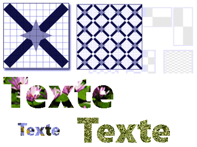

# Peinture avec des objets d'image, de dessin et visuels
Cette rubrique explique comment utiliser <xref:System.Windows.Media.ImageBrush>, <xref:System.Windows.Media.DrawingBrush>, et <xref:System.Windows.Media.VisualBrush> objets pour peindre une zone avec une image, un <xref:System.Windows.Media.Drawing>, ou un <xref:System.Windows.Media.Visual>.  
    
  
   
## Conditions préalables  
 Pour comprendre cette rubrique, vous devez connaître les différents types de pinceaux fournis par [!INCLUDE[TLA#tla_winclient](../../../../includes/tlasharptla-winclient-md.md)] et leurs fonctions de base. Pour une introduction, consultez [Vue d’ensemble des pinceaux WPF](../../../../docs/framework/wpf/graphics-multimedia/wpf-brushes-overview.md).  
  
   
## Peindre une zone avec une image  
 Un <xref:System.Windows.Media.ImageBrush> peint une zone avec une <xref:System.Windows.Media.ImageSource>. Le type le plus courant de <xref:System.Windows.Media.ImageSource> à utiliser avec un <xref:System.Windows.Media.ImageBrush> est un <xref:System.Windows.Media.Imaging.BitmapImage>, qui décrit un graphique bitmap. Vous pouvez utiliser un <xref:System.Windows.Media.DrawingImage> pour peindre à l’aide un <xref:System.Windows.Media.Drawing> objet, mais il est plus simple d’utiliser un <xref:System.Windows.Media.DrawingBrush> à la place. Pour plus d’informations sur <xref:System.Windows.Media.ImageSource> , consultez la [Imaging Overview](../../../../docs/framework/wpf/graphics-multimedia/imaging-overview.md).  
  
 Pour peindre avec un <xref:System.Windows.Media.ImageBrush>, créez un <xref:System.Windows.Media.Imaging.BitmapImage> et l’utiliser pour charger le contenu de la bitmap. Ensuite, utilisez le <xref:System.Windows.Media.Imaging.BitmapImage> pour définir le <xref:System.Windows.Media.ImageBrush.ImageSource%2A> propriété de la <xref:System.Windows.Media.ImageBrush>. Enfin, appliquez le <xref:System.Windows.Media.ImageBrush> à l’objet à peindre.  Dans [!INCLUDE[TLA#tla_xaml](../../../../includes/tlasharptla-xaml-md.md)], vous pouvez également définir le <xref:System.Windows.Media.ImageBrush.ImageSource%2A> propriété de la <xref:System.Windows.Media.ImageBrush> avec le chemin d’accès de l’image à charger.  
  
 Comme tous les <xref:System.Windows.Media.Brush> objets, un <xref:System.Windows.Media.ImageBrush> peut être utilisé pour peindre des objets tels que des formes, panneaux, les contrôles et du texte. L’illustration suivante montre certains effets qui peuvent être réalisées avec un <xref:System.Windows.Media.ImageBrush>.  
  
   
Objets peints par un élément ImageBrush  
  
 Par défaut, un <xref:System.Windows.Media.ImageBrush> étend son image pour remplir complètement la zone qui est peinte, éventuellement déformer l’image si la zone peinte a des proportions différentes de celles de l’image. Vous pouvez modifier ce comportement en modifiant le <xref:System.Windows.Media.TileBrush.Stretch%2A> propriété sa valeur par défaut de <xref:System.Windows.Media.Stretch.Fill> à <xref:System.Windows.Media.Stretch.None>, <xref:System.Windows.Media.Stretch.Uniform>, ou <xref:System.Windows.Media.Stretch.UniformToFill>. Étant donné que <xref:System.Windows.Media.ImageBrush> est un type de <xref:System.Windows.Media.TileBrush>, vous pouvez spécifier exactement comment un pinceau image remplit la zone de sortie et même crée des motifs. Pour plus d’informations sur avancées <xref:System.Windows.Media.TileBrush> fonctionnalités, consultez le [TileBrush Overview](../../../../docs/framework/wpf/graphics-multimedia/tilebrush-overview.md).  
  
   
## Exemple : Peindre un objet avec une image bitmap  
 L’exemple suivant utilise une <xref:System.Windows.Media.ImageBrush> pour peindre le <xref:System.Windows.Controls.Panel.Background%2A> d’un <xref:System.Windows.Controls.Canvas>.  
  
 [!code-xaml[BrushOverviewExamples_snip#GraphicsMMImageBrushAsCanvasBackgroundExampleWholePage](../../../../samples/snippets/xaml/VS_Snippets_Wpf/BrushOverviewExamples_snip/XAML/ImageBrushExample.xaml#graphicsmmimagebrushascanvasbackgroundexamplewholepage)]  
  
 [!code-csharp[BrushOverviewExamples_procedural_snip#GraphicsMMImageBrushAsCanvasBackgroundExampleWholePage](../../../../samples/snippets/csharp/VS_Snippets_Wpf/BrushOverviewExamples_procedural_snip/CSharp/ImageBrushExample.cs#graphicsmmimagebrushascanvasbackgroundexamplewholepage)]
 [!code-vb[BrushOverviewExamples_procedural_snip#GraphicsMMImageBrushAsCanvasBackgroundExampleWholePage](../../../../samples/snippets/visualbasic/VS_Snippets_Wpf/BrushOverviewExamples_procedural_snip/visualbasic/imagebrushexample.vb#graphicsmmimagebrushascanvasbackgroundexamplewholepage)]  
  
   
## Peindre une zone avec un dessin  
 A <xref:System.Windows.Media.DrawingBrush> vous permet de peindre une zone avec des formes, texte, images et vidéo. Formes à l’intérieur d’un pinceau de dessin peuvent elles-mêmes être peintes avec une couleur unie, dégradé, image, ou même un autre <xref:System.Windows.Media.DrawingBrush>. L’illustration suivante montre certaines utilisations d’un <xref:System.Windows.Media.DrawingBrush>.  
  
   
Objets peints par un élément DrawingBrush  
  
 A <xref:System.Windows.Media.DrawingBrush> peint une zone avec un <xref:System.Windows.Media.Drawing> objet. A <xref:System.Windows.Media.Drawing> objet décrit le contenu visible, comme une forme, bitmap, vidéo ou une ligne de texte. Différents types de dessins décrivent différents types de contenus. La liste suivante répertorie les différents types d’objets Drawing.  
  
-   <xref:System.Windows.Media.GeometryDrawing>– Dessine une forme.  
  
-   <xref:System.Windows.Media.ImageDrawing>– Dessine une image.  
  
-   <xref:System.Windows.Media.GlyphRunDrawing>– Dessine du texte.  
  
-   <xref:System.Windows.Media.VideoDrawing>– Lit un fichier audio ou vidéo.  
  
-   <xref:System.Windows.Media.DrawingGroup>– Dessine d’autres dessins. Utilisez un groupe de dessins pour faire de plusieurs dessins un seul et même dessin composite.  
  
 Pour plus d’informations sur <xref:System.Windows.Media.Drawing> , consultez la [vue d’ensemble des objets de dessin](../../../../docs/framework/wpf/graphics-multimedia/drawing-objects-overview.md).  
  
 Comme un <xref:System.Windows.Media.ImageBrush>, un <xref:System.Windows.Media.DrawingBrush> étire son <xref:System.Windows.Media.DrawingBrush.Drawing%2A> pour remplir sa zone de sortie. Vous pouvez substituer ce comportement en modifiant le <xref:System.Windows.Media.TileBrush.Stretch%2A> propriété à partir de sa valeur par défaut <xref:System.Windows.Media.Stretch.Fill>. Pour plus d'informations, consultez la propriété <xref:System.Windows.Media.TileBrush.Stretch%2A>.  
  
   
## Exemple : Peindre un objet avec un dessin  
 L’exemple suivant montre comment peindre un objet avec un dessin composé de trois ellipses. A <xref:System.Windows.Media.GeometryDrawing> est utilisé pour décrire les points de suspension.  
  
 [!code-xaml[BrushOverviewExamples_snip#GraphicsMMDrawingBrushAsButtonBackgroundExample](../../../../samples/snippets/xaml/VS_Snippets_Wpf/BrushOverviewExamples_snip/XAML/DrawingBrushExample.xaml#graphicsmmdrawingbrushasbuttonbackgroundexample)]  
  
 [!code-csharp[BrushOverviewExamples_procedural_snip#GraphicsMMDrawingBrushAsButtonBackgroundExample1](../../../../samples/snippets/csharp/VS_Snippets_Wpf/BrushOverviewExamples_procedural_snip/CSharp/DrawingBrushExample.cs#graphicsmmdrawingbrushasbuttonbackgroundexample1)]
 [!code-vb[BrushOverviewExamples_procedural_snip#GraphicsMMDrawingBrushAsButtonBackgroundExample1](../../../../samples/snippets/visualbasic/VS_Snippets_Wpf/BrushOverviewExamples_procedural_snip/visualbasic/drawingbrushexample.vb#graphicsmmdrawingbrushasbuttonbackgroundexample1)]  
  
   
## Peindre une zone avec un visuel  
 La plus souple et puissant de tous les pinceaux, le <xref:System.Windows.Media.VisualBrush> peint une zone avec un <xref:System.Windows.Media.Visual>. A <xref:System.Windows.Media.Visual> est un type de graphique de bas niveau qui sert d’ancêtre de nombreux composants graphiques. Par exemple, le <xref:System.Windows.Window>, <xref:System.Windows.FrameworkElement>, et <xref:System.Windows.Controls.Control> classes sont des types de <xref:System.Windows.Media.Visual> objets. À l’aide un <xref:System.Windows.Media.VisualBrush>, vous pouvez peindre des zones avec n’importe quel [!INCLUDE[TLA#tla_winclient](../../../../includes/tlasharptla-winclient-md.md)] objet graphique.  
  
> [!NOTE]
>  Bien que <xref:System.Windows.Media.VisualBrush> est un type de <xref:System.Windows.Freezable> de l’objet, il ne peut pas être figé (en lecture seule) lorsque sa <xref:System.Windows.Media.VisualBrush.Visual%2A> propriété est définie sur une valeur autre que `null`.  
  
 Il existe deux façons de spécifier le <xref:System.Windows.Media.VisualBrush.Visual%2A> contenu d’un <xref:System.Windows.Media.VisualBrush>.  
  
-   Créer un nouveau <xref:System.Windows.Media.Visual> et utilisez-la pour définir le <xref:System.Windows.Media.VisualBrush.Visual%2A> propriété de la <xref:System.Windows.Media.VisualBrush>. Pour obtenir un exemple, consultez la section [Exemple : Peindre un objet avec un objet visuel](#examplevisualbrush1) plus loin dans cette rubrique.  
  
-   Utiliser un existant <xref:System.Windows.Media.Visual>, ce qui crée une image dupliquée de la cible <xref:System.Windows.Media.Visual>. Vous pouvez ensuite utiliser le <xref:System.Windows.Media.VisualBrush> pour créer des effets intéressants, tels que la réflexion et l’agrandissement. Pour obtenir un exemple, consultez la section [Exemple : Créer une réflexion](#examplevisualbrush2).  
  
 Lorsque vous définissez un nouveau <xref:System.Windows.Media.VisualBrush.Visual%2A> pour un <xref:System.Windows.Media.VisualBrush> et qui <xref:System.Windows.Media.Visual> est un <xref:System.Windows.UIElement> (par exemple, un panneau de configuration ou un contrôle), le système de disposition s’exécute sur le <xref:System.Windows.UIElement> et ses éléments enfants lorsque le <xref:System.Windows.Media.VisualBrush.AutoLayoutContent%2A> est définie sur `true`. Toutefois, la racine <xref:System.Windows.UIElement> est essentiellement isolée du reste du système : les styles et la disposition externe ne peut pas franchir cette limite. Par conséquent, vous devez spécifier explicitement la taille de la racine de <xref:System.Windows.UIElement>, car son seul parent est le <xref:System.Windows.Media.VisualBrush> et par conséquent il ne peut pas se dimensionner automatiquement à la zone qui est peinte. Pour plus d’informations sur la disposition en [!INCLUDE[TLA#tla_winclient](../../../../includes/tlasharptla-winclient-md.md)], consultez [Disposition](../../../../docs/framework/wpf/advanced/layout.md).  
  
 Comme <xref:System.Windows.Media.ImageBrush> et <xref:System.Windows.Media.DrawingBrush>, un <xref:System.Windows.Media.VisualBrush> étend son contenu pour remplir sa zone de sortie. Vous pouvez substituer ce comportement en modifiant le <xref:System.Windows.Media.TileBrush.Stretch%2A> propriété à partir de sa valeur par défaut <xref:System.Windows.Media.Stretch.Fill>. Pour plus d'informations, consultez la propriété <xref:System.Windows.Media.TileBrush.Stretch%2A>.  
  
   
## Exemple : Peindre un objet avec un objet visuel  
 Dans l’exemple suivant, plusieurs contrôles et un panneau sont utilisés pour peindre un rectangle.  
  
 [!code-xaml[BrushOverviewExamples_snip#GraphicsMMVisualBrushAsRectangleBackgroundExample](../../../../samples/snippets/xaml/VS_Snippets_Wpf/BrushOverviewExamples_snip/XAML/VisualBrushExample.xaml#graphicsmmvisualbrushasrectanglebackgroundexample)]  
  
 [!code-csharp[BrushOverviewExamples_procedural_snip#GraphicsMMVisualBrushAsRectangleBackgroundExample1](../../../../samples/snippets/csharp/VS_Snippets_Wpf/BrushOverviewExamples_procedural_snip/CSharp/VisualBrushExample.cs#graphicsmmvisualbrushasrectanglebackgroundexample1)]
 [!code-vb[BrushOverviewExamples_procedural_snip#GraphicsMMVisualBrushAsRectangleBackgroundExample1](../../../../samples/snippets/visualbasic/VS_Snippets_Wpf/BrushOverviewExamples_procedural_snip/visualbasic/visualbrushexample.vb#graphicsmmvisualbrushasrectanglebackgroundexample1)]  
  
   
## Exemple : Créer une réflexion  
 L’exemple précédent a montré comment créer un nouveau <xref:System.Windows.Media.Visual> pour une utilisation en tant qu’arrière-plan. Vous pouvez également utiliser un <xref:System.Windows.Media.VisualBrush> pour afficher un effet visuel existant ; cette fonctionnalité vous permet de produire des effets visuels intéressants, tels que des réflexions et le facteur de zoom. L’exemple suivant utilise un <xref:System.Windows.Media.VisualBrush> pour créer une réflexion d’un <xref:System.Windows.Controls.Border> qui contient plusieurs éléments. L’illustration suivante montre la sortie que l’exemple génère.  
  
   
Objet Visual réfléchi  
  
 [!code-csharp[visualbrush_markup_snip#GraphicsMMVisualBrushReflectionExampleWholePage](../../../../samples/snippets/csharp/VS_Snippets_Wpf/visualbrush_markup_snip/CSharp/ReflectionExample.cs#graphicsmmvisualbrushreflectionexamplewholepage)]
 [!code-vb[visualbrush_markup_snip#GraphicsMMVisualBrushReflectionExampleWholePage](../../../../samples/snippets/visualbasic/VS_Snippets_Wpf/visualbrush_markup_snip/visualbasic/reflectionexample.vb#graphicsmmvisualbrushreflectionexamplewholepage)]
 [!code-xaml[visualbrush_markup_snip#GraphicsMMVisualBrushReflectionExampleWholePage](../../../../samples/snippets/xaml/VS_Snippets_Wpf/visualbrush_markup_snip/XAML/ReflectionExample.xaml#graphicsmmvisualbrushreflectionexamplewholepage)]  
  
 Pour obtenir des exemples supplémentaires qui montrent comment agrandir des parties de l’écran et créer des réflexions, consultez [VisualBrush Sample](http://go.microsoft.com/fwlink/?LinkID=160049) (Exemple de VisualBrush).  
  
   
## Fonctionnalités de TileBrush  
 <xref:System.Windows.Media.ImageBrush>, <xref:System.Windows.Media.DrawingBrush>, et <xref:System.Windows.Media.VisualBrush> sont des types de <xref:System.Windows.Media.TileBrush> objets. <xref:System.Windows.Media.TileBrush>objets vous permettent de contrôler la peinture d’une zone avec une image, le dessin ou le visual précisément. Par exemple, au lieu de simplement peindre une zone avec une seule image étirée, vous pouvez peindre une zone avec une série de mosaïques d’image qui créent un motif.  
  
 A <xref:System.Windows.Media.TileBrush> a trois composants principaux : le contenu, les mosaïques et la zone de sortie.  
  
   
Composants d’un TileBrush avec une seule mosaïque  
  
   
Composants d’un élément TileBrush avec plusieurs mosaïques  
  
 Pour plus d’informations sur les fonctionnalités de disposition en mosaïque de <xref:System.Windows.Media.TileBrush> , consultez la [TileBrush Overview](../../../../docs/framework/wpf/graphics-multimedia/tilebrush-overview.md).  
  
## Voir aussi  
 <xref:System.Windows.Media.ImageBrush>  
 <xref:System.Windows.Media.DrawingBrush>  
 <xref:System.Windows.Media.VisualBrush>  
 <xref:System.Windows.Media.TileBrush>  
 [Vue d’ensemble de TileBrush](../../../../docs/framework/wpf/graphics-multimedia/tilebrush-overview.md)  
 [Vue d’ensemble des pinceaux WPF](../../../../docs/framework/wpf/graphics-multimedia/wpf-brushes-overview.md)  
 [Vue d’ensemble de la création d’images](../../../../docs/framework/wpf/graphics-multimedia/imaging-overview.md)  
 [Vue d’ensemble des objets de dessin](../../../../docs/framework/wpf/graphics-multimedia/drawing-objects-overview.md)  
 [Vue d'ensemble des masques d'opacité](../../../../docs/framework/wpf/graphics-multimedia/opacity-masks-overview.md)  
 [Vue d’ensemble du rendu graphique de WPF](../../../../docs/framework/wpf/graphics-multimedia/wpf-graphics-rendering-overview.md)  
 [ImageBrush, exemple](http://go.microsoft.com/fwlink/?LinkID=160005)  
 [VisualBrush Sample](http://go.microsoft.com/fwlink/?LinkID=160049) (Exemple de VisualBrush)
