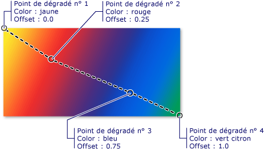
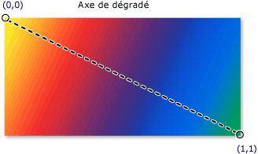
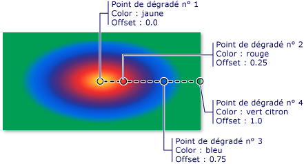

# Vue d'ensemble de la peinture avec des couleurs unies ou des dégradésPainting with Solid Colors and Gradients Overview
Cette rubrique explique comment utiliser <xref:System.Windows.Media.SolidColorBrush>, <xref:System.Windows.Media.LinearGradientBrush>, et <xref:System.Windows.Media.RadialGradientBrush> objets à peindre avec des couleurs unies, des dégradés linéaires et des dégradés radiaux.This topic describes how to use <xref:System.Windows.Media.SolidColorBrush>, <xref:System.Windows.Media.LinearGradientBrush>, and <xref:System.Windows.Media.RadialGradientBrush> objects to paint with solid colors, linear gradients, and radial gradients.  
  

  
   
## Peindre une zone avec une couleur uniePainting an Area with a Solid Color  
 Une des opérations plus courantes dans n’importe quelle plateforme consiste à peindre une zone avec un solide <xref:System.Windows.Media.Color>.One of the most common operations in any platform is to paint an area with a solid <xref:System.Windows.Media.Color>. Pour accomplir cette tâche, [!INCLUDE[TLA#tla_winclient](../../../../includes/tlasharptla-winclient-md.md)] fournit la <xref:System.Windows.Media.SolidColorBrush> classe.To accomplish this task, [!INCLUDE[TLA#tla_winclient](../../../../includes/tlasharptla-winclient-md.md)] provides the <xref:System.Windows.Media.SolidColorBrush> class. Les sections suivantes décrivent les différentes manières de peindre avec un <xref:System.Windows.Media.SolidColorBrush>.The following sections describe the different ways to paint with a <xref:System.Windows.Media.SolidColorBrush>.  
  
   
### Utiliser un élément SolidColorBrush en « XAML »Using a SolidColorBrush in "XAML"  
 Pour peindre une zone avec une couleur unie en [!INCLUDE[TLA2#tla_xaml](../../../../includes/tla2sharptla-xaml-md.md)], utilisez l’une des options suivantes.To paint an area with a solid color in [!INCLUDE[TLA2#tla_xaml](../../../../includes/tla2sharptla-xaml-md.md)], use one of the following options.  
  
-   Sélectionnez un pinceau couleur unie prédéfinie en fonction d’un nom.Select a predefined solid color brush by name.  Par exemple, vous pouvez définir un bouton <xref:System.Windows.Controls.Control.Background%2A> « Rouge » ou « MediumBlue ».For example, you can set a button's <xref:System.Windows.Controls.Control.Background%2A> to "Red" or "MediumBlue".  Pour une liste d’autres prédéfinies pinceaux de couleur unie, consultez les propriétés statiques de la <xref:System.Windows.Media.Brushes> classe.For a list of other predefined solid color brushes, see the static properties of the <xref:System.Windows.Media.Brushes> class. Voici un exemple.The following is an example.  
  
     [!code-xaml[BrushOverviewExamples_snip#SolidColorBrushNamedColor1XAML](../../../../samples/snippets/xaml/VS_Snippets_Wpf/BrushOverviewExamples_snip/XAML/SolidColorBrushExample.xaml#solidcolorbrushnamedcolor1xaml)]  
  
-   Choisissez une couleur dans la palette de couleurs 32 bits en spécifiant les quantités de rouge, de vert et de bleu à combiner en une seule couleur unie.Choose a color from the 32-bit color palette by specifying the amounts of red, green, and blue to combine into a single solid color.  Le format pour spécifier une couleur de la palette 32 bits est « *#rrggbb* », où *rr* est un nombre hexadécimal à deux chiffres spécifiant la quantité relative de rouge, où *gg* spécifie la quantité de vert et où *bb* spécifie la quantité de bleu.The format for specifying a color from the 32-bit palette is "*#rrggbb*", where *rr* is a two digit hexadecimal number specifying the relative amount of red, *gg* specifies the amount of green, and *bb* specifies the amount of blue.  En outre, la couleur peut être spécifiée sous la forme « #*aarrggbb* » où *aa* spécifie la valeur *alpha*, ou transparence, de la couleur.Additionally, the color can be specified as "#*aarrggbb*" where *aa* specifies the *alpha* value, or transparency, of the color. Cette approche vous permet de créer des couleurs qui sont partiellement transparentes.This approach enables you to create colors that are partially transparent.  Dans l’exemple suivant, la <xref:System.Windows.Controls.Control.Background%2A> d’un <xref:System.Windows.Controls.Button> est défini sur rouge entièrement opaque à l’aide de la notation hexadécimale.In the following example, the <xref:System.Windows.Controls.Control.Background%2A> of a <xref:System.Windows.Controls.Button> is set to fully-opaque red using hexadecimal notation.  
  
     [!code-xaml[BrushOverviewExamples_snip#SolidColorBrushHex1XAML](../../../../samples/snippets/xaml/VS_Snippets_Wpf/BrushOverviewExamples_snip/XAML/SolidColorBrushExample.xaml#solidcolorbrushhex1xaml)]  
  
-   Utiliser la syntaxe de balise de propriété pour décrire un <xref:System.Windows.Media.SolidColorBrush>.Use property tag syntax to describe a <xref:System.Windows.Media.SolidColorBrush>. Cette syntaxe est plus détaillée mais vous permet de spécifier des paramètres supplémentaires, tels que l’opacité du pinceau.This syntax is more verbose but enables you to specify additional settings, such as the brush's opacity. Dans l’exemple suivant, la <xref:System.Windows.Controls.Control.Background%2A> propriétés de deux <xref:System.Windows.Controls.Button> éléments ont la valeur rouge entièrement opaque.In the following example, the <xref:System.Windows.Controls.Control.Background%2A> properties of two <xref:System.Windows.Controls.Button> elements are set to fully-opaque red. La première couleur du pinceau est décrite à l’aide d’un nom de couleur prédéfinie.The first brush's color is described using a predefined color name. La deuxième couleur du pinceau est décrite à l’aide de la notation hexadécimale.The second brush's color is described using hexadecimal notation.  
  
     [!code-xaml[BrushOverviewExamples_snip#SolidColorBrushPropertyTag1XAML](../../../../samples/snippets/xaml/VS_Snippets_Wpf/BrushOverviewExamples_snip/XAML/SolidColorBrushExample.xaml#solidcolorbrushpropertytag1xaml)]  
  
   
### Peindre avec un élément SolidColorBrush dans le codePainting with a SolidColorBrush in Code  
 Pour peindre une zone avec une couleur unie dans le code, utilisez l’une des options suivantes.To paint an area with a solid color in code, use one of the following options.  
  
-   Utilisez une des pinceaux prédéfinis fournis par le <xref:System.Windows.Media.Brushes> classe.Use one of the predefined brushes provided by the <xref:System.Windows.Media.Brushes> class. Dans l’exemple suivant, la <xref:System.Windows.Controls.Control.Background%2A> d’un <xref:System.Windows.Controls.Button> a la valeur <xref:System.Windows.Media.Brushes.Red%2A>.In the following example, the <xref:System.Windows.Controls.Control.Background%2A> of a <xref:System.Windows.Controls.Button> is set to <xref:System.Windows.Media.Brushes.Red%2A>.  
  
     [!code-csharp[BrushOverviewExamples_snip#SolidColorBrushPredefinedBrush1CSharp](../../../../samples/snippets/csharp/VS_Snippets_Wpf/BrushOverviewExamples_snip/CSharp/SolidColorBrushExample.cs#solidcolorbrushpredefinedbrush1csharp)]  
  
-   Créer un <xref:System.Windows.Media.SolidColorBrush> et définir son <xref:System.Windows.Media.SolidColorBrush.Color%2A> à l’aide de la propriété un <xref:System.Windows.Media.Color> structure.Create a <xref:System.Windows.Media.SolidColorBrush> and set its <xref:System.Windows.Media.SolidColorBrush.Color%2A> property using a <xref:System.Windows.Media.Color> structure. Vous pouvez utiliser une couleur prédéfinie dans le <xref:System.Windows.Media.Colors> classe ou vous pouvez créer un <xref:System.Windows.Media.Color> à l’aide de la méthode statique <xref:System.Windows.Media.Color.FromArgb%2A> (méthode).You can use a predefined color from the <xref:System.Windows.Media.Colors> class or you can create a <xref:System.Windows.Media.Color> using the static <xref:System.Windows.Media.Color.FromArgb%2A> method.  
  
     L’exemple suivant montre comment définir la <xref:System.Windows.Media.SolidColorBrush.Color%2A> propriété d’un <xref:System.Windows.Media.SolidColorBrush> à l’aide d’une couleur prédéfinie.The following example shows how to set the <xref:System.Windows.Media.SolidColorBrush.Color%2A> property of a <xref:System.Windows.Media.SolidColorBrush> using a predefined color.  
  
     [!code-csharp[BrushOverviewExamples_snip#SolidColorBrushPredefinedColor1CSharp](../../../../samples/snippets/csharp/VS_Snippets_Wpf/BrushOverviewExamples_snip/CSharp/SolidColorBrushExample.cs#solidcolorbrushpredefinedcolor1csharp)]  
  
 La méthode statique <xref:System.Windows.Media.Color.FromArgb%2A> vous permet de spécifier les valeurs de la couleur alpha, rouge, vert et bleu.The static <xref:System.Windows.Media.Color.FromArgb%2A> enables you to specify the color's alpha, red, green, and blue values. La plage par défaut pour chacune de ces valeurs est comprise entre 0 et 255.The typical range for each of these values is 0-255. Par exemple, une valeur alpha de 0 indique qu’une couleur est entièrement transparente, tandis qu’une valeur de 255 indique que la couleur est entièrement opaque.For example, an alpha value of 0 indicates that a color is completely transparent, while a value of 255 indicates the color is completely opaque. De même, une valeur de rouge de 0 indique qu’une couleur n’est pas composée de rouge, tandis qu’une valeur de 255 indique qu’une couleur est composée de la quantité maximale de rouge possible.Likewise, a red value of 0 indicates that a color has no red in it, while a value of 255 indicates a color has the maximum amount of red possible.  Dans l’exemple suivant, la couleur d’un pinceau est décrite en spécifiant des valeurs alpha, de rouge, de vert et de bleu.In the following example, a brush's color is described by specifying alpha, red, green, and blue values.  
  
 [!code-csharp[BrushOverviewExamples_snip#SolidColorBrushfromArgbExample1CSharp](../../../../samples/snippets/csharp/VS_Snippets_Wpf/BrushOverviewExamples_snip/CSharp/SolidColorBrushExample.cs#solidcolorbrushfromargbexample1csharp)]  
  
 Comment spécifier des couleurs, consultez la <xref:System.Windows.Media.Color> rubrique de référence.For additional ways to specify color, see the <xref:System.Windows.Media.Color> reference topic.  
  
   
## Peindre une zone avec un dégradéPainting an Area with a Gradient  
 Un pinceau de dégradé peint une zone avec plusieurs couleurs qui se mélangent le long d’un axe.A gradient brush paints an area with multiple colors that blend into each other along an axis. Vous pouvez les utiliser pour créer des impressions de lumière et d’ombre et ainsi donner à vos contrôles une apparence 3D.You can use them to create impressions of light and shadow, giving your controls a three-dimensional feel. Vous pouvez également les utiliser pour simuler le verre, le chrome, l’eau et d’autres surfaces lisses.You can also use them to simulate glass, chrome, water, and other smooth surfaces.  [!INCLUDE[TLA2#tla_winclient](../../../../includes/tla2sharptla-winclient-md.md)]fournit deux types de pinceaux de dégradé : <xref:System.Windows.Media.LinearGradientBrush> et <xref:System.Windows.Media.RadialGradientBrush>. provides two types of gradient brushes: <xref:System.Windows.Media.LinearGradientBrush> and <xref:System.Windows.Media.RadialGradientBrush>.  
  
   
## Dégradés linéairesLinear Gradients  
 A <xref:System.Windows.Media.LinearGradientBrush> peint une zone avec un dégradé défini le long d’une ligne, la *axe du dégradé*.A <xref:System.Windows.Media.LinearGradientBrush> paints an area with a gradient defined along a line, the *gradient axis*.  Vous spécifiez des couleurs de dégradé et leur emplacement le long de l’axe du dégradé à l’aide <xref:System.Windows.Media.GradientStop> objets.You specify the gradient's colors and their location along the gradient axis using <xref:System.Windows.Media.GradientStop> objects.  Vous pouvez également modifier l’axe du dégradé, ce qui vous permet de créer des dégradés horizontaux et verticaux et d’inverser le sens du dégradé.You may also modify the gradient axis, which enables you to create horizontal and vertical gradients and to reverse the gradient direction. L’axe du dégradé est décrit dans la section suivante.The gradient axis is described in the next section. Par défaut, un dégradé diagonal est créé.By default, a diagonal gradient is created.  
  
 L’exemple suivant montre le code qui crée un dégradé linéaire avec quatre couleurs.The following example shows the code that creates a linear gradient with four colors.  
  
 [!code-xaml[GradientBrushExamples_snip#DiagonalGradient1XAML](../../../../samples/snippets/xaml/VS_Snippets_Wpf/GradientBrushExamples_snip/XAML/LinearGradientBrushExample.xaml#diagonalgradient1xaml)]  
  
 [!code-csharp[GradientBrushExamples_snip#DiagonalGradient1CSharp](../../../../samples/snippets/csharp/VS_Snippets_Wpf/GradientBrushExamples_snip/CSharp/LinearGradientBrushExample.cs#diagonalgradient1csharp)]  
  
 Ce code génère le dégradé suivant :This code produces the following gradient:  
  
   
  
 **Remarque :** les exemples de dégradé présentés dans cette rubrique utilisent le système de coordonnées par défaut pour la définition des points de départ et des points de fin.**Note:** The gradient examples in this topic use the default coordinate system for setting start points and end points. Le système de coordonnées par défaut est relatif à un rectangle englobant : 0 indique 0 % du rectangle englobant et 1 indique 100 % du rectangle englobant.The default coordinate system is relative to a bounding box: 0 indicates 0 percent of the bounding box and 1 indicates 100 percent of the bounding box. Vous pouvez modifier ce système de coordonnées en définissant le <xref:System.Windows.Media.GradientBrush.MappingMode%2A> valeur à la propriété <xref:System.Windows.Media.BrushMappingMode.Absolute>.You can change this coordinate system by setting the <xref:System.Windows.Media.GradientBrush.MappingMode%2A> property to the value <xref:System.Windows.Media.BrushMappingMode.Absolute>. Un système de coordonnées absolu n’est pas relatif à un rectangle englobant.An absolute coordinate system is not relative to a bounding box. Les valeurs sont interprétées directement dans l’espace local.Values are interpreted directly in local space.  
  
 Le <xref:System.Windows.Media.GradientStop> est le bloc de construction de base d’un pinceau de dégradé.The <xref:System.Windows.Media.GradientStop> is the basic building block of a gradient brush.  Un point de dégradé spécifie une <xref:System.Windows.Media.GradientStop.Color%2A> à un <xref:System.Windows.Media.GradientStop.Offset%2A> le long de l’axe du dégradé.A gradient stop specifies a <xref:System.Windows.Media.GradientStop.Color%2A> at an <xref:System.Windows.Media.GradientStop.Offset%2A> along the gradient axis.  
  
-   Du point de dégradé <xref:System.Windows.Media.GradientStop.Color%2A> propriété spécifie la couleur du point de dégradé.The gradient stop's <xref:System.Windows.Media.GradientStop.Color%2A> property specifies the color of the gradient stop. Vous pouvez définir la couleur à l’aide d’une couleur prédéfinie (fournie par la <xref:System.Windows.Media.Colors> classe) ou en spécifiant des valeurs ScRGB ou ARVB.You may set the color by using a predefined color (provided by the <xref:System.Windows.Media.Colors> class) or by specifying ScRGB or ARGB values. En [!INCLUDE[TLA2#tla_xaml](../../../../includes/tla2sharptla-xaml-md.md)], vous pouvez également utiliser la notation hexadécimale pour décrire une couleur.In [!INCLUDE[TLA2#tla_xaml](../../../../includes/tla2sharptla-xaml-md.md)], you may also use hexadecimal notation to describe a color. Pour plus d’informations, consultez le <xref:System.Windows.Media.Color> structure.For more information, see the <xref:System.Windows.Media.Color> structure.  
  
-   Du point de dégradé <xref:System.Windows.Media.GradientStop.Offset%2A> propriété spécifie la position de couleur de dégradé sur l’axe du dégradé.The gradient stop's <xref:System.Windows.Media.GradientStop.Offset%2A> property specifies the position of the gradient stop's color on the gradient axis. Le décalage est un <xref:System.Double> qui comprise entre 0 et 1.The offset is a <xref:System.Double> that ranges from 0 to 1. Plus une valeur de décalage de point de dégradé est proche de 0, plus la couleur est proche du début du dégradé.The closer a gradient stop's offset value is to 0, the closer the color is to the start of the gradient. Plus une valeur de décalage de point de dégradé est proche de 1, plus la couleur est proche de la fin du dégradé.The closer the gradient's offset value is to 1, the closer the color is to the end of the gradient.  
  
 La couleur de chaque point entre les points de dégradé est interpolée de façon linéaire comme une combinaison de la couleur spécifiée par les deux points de dégradé liés.The color of each point between gradient stops is linearly interpolated as a combination of the color specified by the two bounding gradient stops. L’illustration suivante met en évidence les points de dégradé de l’exemple précédent.The following illustration highlights the gradient stops in the previous example. Les cercles indiquent l’emplacement des points de dégradé et une ligne en pointillés montre l’axe du dégradé.The circles mark the position of gradient stops and a dashed line shows the gradient axis.  
  
   
  
 Le premier point de dégradé spécifie la couleur jaune pour un décalage de `0.0`.The first gradient stop specifies the color yellow at an offset of `0.0`.  Le deuxième point de dégradé spécifie la couleur rouge pour un décalage de `0.25`.The second gradient stop specifies the color red at an offset of `0.25`.  Les points entre ces deux points passent graduellement du jaune au rouge lorsque vous passez de gauche à droite le long de l’axe du dégradé.The points between these two stops gradually change from yellow to red as you move from left to right along the gradient axis.  Le troisième point de dégradé spécifie la couleur bleue pour un décalage de `0.75`.The third gradient stop specifies the color blue at an offset of `0.75`.  Les points situés entre le deuxième et le troisième point de dégradé passent progressivement du rouge au bleu.The points between the second and third gradient stops gradually change from red to blue. Le quatrième point de dégradé spécifie la couleur vert citron pour un décalage de `1.0`.The fourth gradient stop specifies the color lime green at an offset of `1.0`. Les points situés entre le troisième et le quatrième point de dégradé passent progressivement du bleu au vert citron.The points between the third and fourth gradient stops gradually change from blue to lime green.  
  
   
### Axe du dégradéThe Gradient Axis  
 Comme mentionné précédemment, les points de dégradé d’un pinceau dégradé linéaire sont positionnés le long d’une ligne, l’axe du dégradé.As previously mentioned, a linear gradient brush's gradient stops are positioned along a line, the gradient axis. Vous pouvez modifier l’orientation et la taille de la ligne à l’aide du pinceau <xref:System.Windows.Media.LinearGradientBrush.StartPoint%2A> et <xref:System.Windows.Media.LinearGradientBrush.EndPoint%2A> propriétés.You may change the orientation and size of the line using the brush's <xref:System.Windows.Media.LinearGradientBrush.StartPoint%2A> and <xref:System.Windows.Media.LinearGradientBrush.EndPoint%2A> properties. En manipulant du pinceau <xref:System.Windows.Media.LinearGradientBrush.StartPoint%2A> et <xref:System.Windows.Media.LinearGradientBrush.EndPoint%2A>, vous pouvez créer horizontale et des dégradés verticaux, inverser le sens du dégradé, réduisent la dispersion du dégradé et bien plus encore.By manipulating the brush's <xref:System.Windows.Media.LinearGradientBrush.StartPoint%2A> and <xref:System.Windows.Media.LinearGradientBrush.EndPoint%2A>, you can create horizontal and vertical gradients, reverse the gradient direction, condense the gradient spread, and more.  
  
 Par défaut, le pinceau de dégradé linéaire <xref:System.Windows.Media.LinearGradientBrush.StartPoint%2A> et <xref:System.Windows.Media.LinearGradientBrush.EndPoint%2A> sont relatives à la zone qui est peinte.By default, the linear gradient brush's <xref:System.Windows.Media.LinearGradientBrush.StartPoint%2A> and <xref:System.Windows.Media.LinearGradientBrush.EndPoint%2A> are relative to the area being painted. Le point (0,0) représente l’angle supérieur gauche de la zone que vous êtes en train de peindre, tandis que (1,1) représente le coin inférieur droit de la zone que vous êtes en train de peindre.The point (0,0) represents the upper-left corner of the area being painted, and (1,1) represents the lower-right corner of the area being painted. La valeur par défaut <xref:System.Windows.Media.LinearGradientBrush.StartPoint%2A> d’un <xref:System.Windows.Media.LinearGradientBrush> est (0,0) et sa valeur par défaut <xref:System.Windows.Media.LinearGradientBrush.EndPoint%2A> est (1,1), ce qui crée un dégradé diagonal qui commence à l’angle supérieur gauche et l’extension à l’angle inférieur droit de la zone qui est peinte.The default <xref:System.Windows.Media.LinearGradientBrush.StartPoint%2A> of a <xref:System.Windows.Media.LinearGradientBrush> is (0,0), and its default <xref:System.Windows.Media.LinearGradientBrush.EndPoint%2A> is (1,1), which creates a diagonal gradient starting at the upper-left corner and extending to the lower-right corner of the area being painted. L’illustration suivante montre l’axe de dégradé d’un pinceau de dégradé linéaire avec la valeur par défaut <xref:System.Windows.Media.LinearGradientBrush.StartPoint%2A> et <xref:System.Windows.Media.LinearGradientBrush.EndPoint%2A>.The following illustration shows the gradient axis of a linear gradient brush with default <xref:System.Windows.Media.LinearGradientBrush.StartPoint%2A> and <xref:System.Windows.Media.LinearGradientBrush.EndPoint%2A>.  
  
   
  
 L’exemple suivant montre comment créer une horizontale dégradé en spécifiant le pinceau <xref:System.Windows.Media.LinearGradientBrush.StartPoint%2A> et <xref:System.Windows.Media.LinearGradientBrush.EndPoint%2A>.The following example shows how to create a horizontal gradient by specifying the brush's <xref:System.Windows.Media.LinearGradientBrush.StartPoint%2A> and <xref:System.Windows.Media.LinearGradientBrush.EndPoint%2A>. Notez que les points de dégradé sont les mêmes que dans les exemples précédents ; en modifiant simplement la <xref:System.Windows.Media.LinearGradientBrush.StartPoint%2A> et <xref:System.Windows.Media.LinearGradientBrush.EndPoint%2A>, le dégradé a été modifié de diagonal à horizontal.Notice that the gradient stops are the same as in the previous examples; by simply changing the <xref:System.Windows.Media.LinearGradientBrush.StartPoint%2A> and <xref:System.Windows.Media.LinearGradientBrush.EndPoint%2A>, the gradient has been changed from diagonal to horizontal.  
  
 [!code-xaml[GradientBrushExamples_snip#HorizontalGradient1XAML](../../../../samples/snippets/xaml/VS_Snippets_Wpf/GradientBrushExamples_snip/XAML/LinearGradientBrushExample.xaml#horizontalgradient1xaml)]  
  
 [!code-csharp[GradientBrushExamples_snip#HorizontalGradient1CSharp](../../../../samples/snippets/csharp/VS_Snippets_Wpf/GradientBrushExamples_snip/CSharp/LinearGradientBrushExample.cs#horizontalgradient1csharp)]  
  
 L’illustration suivante montre le dégradé qui est créé.The following illustration shows the gradient that is created. L’axe du dégradé est indiqué avec une ligne en pointillés et les points de dégradé sont indiqués par des cercles.The gradient axis is marked with a dashed line, and the gradient stops are marked with circles.  
  
   
  
 L’exemple suivant montre comment créer un dégradé vertical.The next example shows how to create a vertical gradient.  
  
 [!code-xaml[GradientBrushExamples_snip#VerticalGradient1XAML](../../../../samples/snippets/xaml/VS_Snippets_Wpf/GradientBrushExamples_snip/XAML/LinearGradientBrushExample.xaml#verticalgradient1xaml)]  
  
 [!code-csharp[GradientBrushExamples_snip#VerticalGradient1CSharp](../../../../samples/snippets/csharp/VS_Snippets_Wpf/GradientBrushExamples_snip/CSharp/LinearGradientBrushExample.cs#verticalgradient1csharp)]  
  
 L’illustration suivante montre le dégradé qui est créé.The following illustration shows the gradient that is created. L’axe du dégradé est indiqué avec une ligne en pointillés et les points de dégradé sont indiqués par des cercles.The gradient axis is marked with a dashed line, and the gradient stops are marked with circles.  
  
   
  
   
## Dégradés radiauxRadial Gradients  
 Comme un <xref:System.Windows.Media.LinearGradientBrush>, un <xref:System.Windows.Media.RadialGradientBrush> peint une zone avec des couleurs qui fusionnent le long d’un axe.Like a <xref:System.Windows.Media.LinearGradientBrush>, a <xref:System.Windows.Media.RadialGradientBrush> paints an area with colors that blend together along an axis. Les exemples précédents ont montré comment un axe de pinceau dégradé linéaire est une ligne droite.The previous examples showed how a linear gradient brush's axis is a straight line. Un axe de pinceau dégradé radial est défini par un cercle ; ses couleurs « rayonnent » de l’extérieur vers son origine.A radial gradient brush's axis is defined by a circle; its colors "radiate" outward from its origin.  
  
 Dans l’exemple suivant, un pinceau dégradé radial est utilisé pour peindre l’intérieur d’un rectangle.In the following example, a radial gradient brush is used to paint the interior of a rectangle.  
  
 [!code-xaml[GradientBrushExamples_snip#RadialGradient1XAML](../../../../samples/snippets/xaml/VS_Snippets_Wpf/GradientBrushExamples_snip/XAML/RadialGradientBrushExample.xaml#radialgradient1xaml)]  
  
 [!code-csharp[GradientBrushExamples_snip#RadialGradient1CSharp](../../../../samples/snippets/csharp/VS_Snippets_Wpf/GradientBrushExamples_snip/CSharp/RadialGradientBrushExample.cs#radialgradient1csharp)]  
  
 L’illustration suivante montre le dégradé créé dans l’exemple précédent.The following illustration shows the gradient created in the previous example. Les points de dégradé du pinceau ont été mis en évidence.The brush's gradient stops have been highlighted. Notez que, même si les résultats sont différents, les points de dégradé de cet exemple sont identiques aux points de dégradé des exemples précédents de pinceau dégradé linéaire.Notice that, even though the results are different, the gradient stops in this example are identical to the gradient stops in the previous linear gradient brush examples.  
  
   
  
 Le <xref:System.Windows.Media.RadialGradientBrush.GradientOrigin%2A> Spécifie le point de départ de l’axe du dégradé d’un pinceau de dégradé radial.The <xref:System.Windows.Media.RadialGradientBrush.GradientOrigin%2A> specifies the start point of a radial gradient brush's gradient axis. L’axe du dégradé rayonne de l’origine du dégradé vers le cercle du dégradé.The gradient axis radiates from the gradient origin to the gradient circle. Cercle de dégradé d’un pinceau est défini par son <xref:System.Windows.Media.RadialGradientBrush.Center%2A>, <xref:System.Windows.Media.RadialGradientBrush.RadiusX%2A>, et <xref:System.Windows.Media.RadialGradientBrush.RadiusY%2A> propriétés.A brush's gradient circle is defined by its <xref:System.Windows.Media.RadialGradientBrush.Center%2A>, <xref:System.Windows.Media.RadialGradientBrush.RadiusX%2A>, and <xref:System.Windows.Media.RadialGradientBrush.RadiusY%2A> properties.  
  
 L’illustration suivante montre plusieurs dégradés radiaux avec différents <xref:System.Windows.Media.RadialGradientBrush.GradientOrigin%2A>, <xref:System.Windows.Media.RadialGradientBrush.Center%2A>, <xref:System.Windows.Media.RadialGradientBrush.RadiusX%2A>, et <xref:System.Windows.Media.RadialGradientBrush.RadiusY%2A> paramètres.The following illustration shows several radial gradients with different <xref:System.Windows.Media.RadialGradientBrush.GradientOrigin%2A>, <xref:System.Windows.Media.RadialGradientBrush.Center%2A>, <xref:System.Windows.Media.RadialGradientBrush.RadiusX%2A>, and <xref:System.Windows.Media.RadialGradientBrush.RadiusY%2A> settings.  
  
   
Éléments RadialGradientBrushes avec divers paramètres GradientOrigin, Center, RadiusX et Radius.RadialGradientBrushes with different GradientOrigin, Center, RadiusX, and RadiusY settings.  
  
   
## Spécifier des points de dégradé transparents ou partiellement transparentsSpecifying Transparent or Partially-Transparent Gradient Stops  
 Points de dégradé ne fournissant pas de propriété d’opacité, vous devez spécifier le canal alpha des couleurs à l’aide de [!INCLUDE[TLA#tla_argb](../../../../includes/tlasharptla-argb-md.md)] notation hexadécimale dans le balisage ou utiliser la <xref:System.Windows.Media.Color.FromScRgb%2A?displayProperty=nameWithType> méthode pour créer un dégradé qui sont entièrement ou partiellement transparent.Because gradient stops do not provide an opacity property, you must specify the alpha channel of colors using  [!INCLUDE[TLA#tla_argb](../../../../includes/tlasharptla-argb-md.md)] hexadecimal notation in markup or use the <xref:System.Windows.Media.Color.FromScRgb%2A?displayProperty=nameWithType> method to create gradient stops that are transparent or partially transparent. Les sections suivantes expliquent comment créer des points de dégradé partiellement transparents en [!INCLUDE[TLA2#tla_xaml](../../../../includes/tla2sharptla-xaml-md.md)] et dans le code.The following sections explain how to create partially transparent gradient stops in [!INCLUDE[TLA2#tla_xaml](../../../../includes/tla2sharptla-xaml-md.md)] and code.  
  
   
### Spécifier l’opacité de couleur en « XAML »Specifying Color Opacity in "XAML"  
 En [!INCLUDE[TLA2#tla_xaml](../../../../includes/tla2sharptla-xaml-md.md)], vous utilisez la notation hexadécimale [!INCLUDE[TLA2#tla_argb](../../../../includes/tla2sharptla-argb-md.md)] pour spécifier l’opacité des couleurs individuelles.In [!INCLUDE[TLA2#tla_xaml](../../../../includes/tla2sharptla-xaml-md.md)], you use  [!INCLUDE[TLA2#tla_argb](../../../../includes/tla2sharptla-argb-md.md)] hexadecimal notation to specify the opacity of individual colors. La notation hexadécimale [!INCLUDE[TLA2#tla_argb](../../../../includes/tla2sharptla-argb-md.md)] utilise la syntaxe suivante :[!INCLUDE[TLA2#tla_argb](../../../../includes/tla2sharptla-argb-md.md)] hexadecimal notation uses the following syntax:  
  
 `#` **aa** *rrggbb*`#` **aa** *rrggbb*  
  
 *aa* dans la ligne précédente représente une valeur hexadécimale à deux chiffres utilisée pour spécifier l’opacité de la couleur.The *aa* in the previous line represents a two-digit hexadecimal value used to specify the opacity of the color. *rr*, *gg* et *bb* représentent une valeur hexadécimale à deux chiffres utilisée pour spécifier la quantité de rouge, de vert et de bleu dans la couleur.The *rr*, *gg*, and *bb* each represent a two digit hexadecimal value used to specify the amount of red, green, and blue in the color. Chaque chiffre hexadécimal peut avoir une valeur comprise entre 0 et 9 ou A et F.Each hexadecimal digit may have a value from 0-9 or A-F. 0 est la plus petite valeur et F est la plus grande.0 is the smallest value, and F is the greatest. Une valeur alpha de 00 indique qu’une couleur est entièrement transparente, tandis qu’une valeur alpha de FF crée une couleur entièrement opaque.An alpha value of 00 specifies a color that is completely transparent, while an alpha value of FF creates a color that is fully opaque.  Dans l’exemple suivant, la notation hexadécimale [!INCLUDE[TLA2#tla_argb](../../../../includes/tla2sharptla-argb-md.md)] est utilisée pour spécifier deux couleurs.In the following example, hexadecimal [!INCLUDE[TLA2#tla_argb](../../../../includes/tla2sharptla-argb-md.md)] notation is used to specify two colors. La première est partiellement transparente (elle a une valeur alpha de x20), tandis que la deuxième est entièrement opaque.The first is partially transparent (it has an alpha value of x20), while the second is completely opaque.  
  
 [!code-xaml[GradientBrushExamples_snip#TransparentGradientStopExample1XAML](../../../../samples/snippets/xaml/VS_Snippets_Wpf/GradientBrushExamples_snip/XAML/GradientStopsExample.xaml#transparentgradientstopexample1xaml)]  
  
   
### Spécifier l’opacité de couleur dans le codeSpecifying Color Opacity in Code  
 Lors de l’utilisation de code, la méthode statique <xref:System.Windows.Media.Color.FromArgb%2A> méthode vous permet de spécifier une valeur alpha lorsque vous créez une couleur.When using code, the static <xref:System.Windows.Media.Color.FromArgb%2A> method enables you to specify an alpha value when you create a color. La méthode accepte quatre paramètres de type <xref:System.Byte>.The method takes four parameters of type <xref:System.Byte>. Le premier paramètre spécifie le canal alpha de la couleur ; les trois autres paramètres spécifient les valeurs de rouge, de vert et de bleu de la couleur.The first parameter specifies the alpha channel of the color; the other three parameters specify the red, green, and blue values of the color. Cette valeur doit être comprise entre 0 et 255 inclus.Each value should be between 0 to 255, inclusive. Une valeur alpha de 0 indique que la couleur est entièrement transparente, tandis qu’une valeur alpha de 255 indique que la couleur est entièrement opaque.An alpha value of 0 specifies that the color is completely transparent, while an alpha value of 255 specifies that the color is completely opaque. Dans l’exemple suivant, la <xref:System.Windows.Media.Color.FromArgb%2A> méthode est utilisée pour produire deux couleurs.In the following example, the <xref:System.Windows.Media.Color.FromArgb%2A> method is used to produce two colors. La première couleur est partiellement transparente (elle a une valeur alpha de 32), tandis que la deuxième est entièrement opaque.The first color is partially transparent (it has an alpha value of 32), while the second is fully opaque.  
  
 [!code-csharp[GradientBrushExamples_snip#TransparentGradientStopExample1CSharp](../../../../samples/snippets/csharp/VS_Snippets_Wpf/GradientBrushExamples_snip/CSharp/GradientStopsExample.cs#transparentgradientstopexample1csharp)]  
  
 Vous pouvez également utiliser le <xref:System.Windows.Media.Color.FromScRgb%2A> (méthode), ce qui vous permet d’utiliser les valeurs ScRGB pour créer une couleur.Alternatively, you may use the <xref:System.Windows.Media.Color.FromScRgb%2A> method, which enables you to use ScRGB values to create a color.  
  
   
## Peindre avec des images, des dessins, des objets visuels et des motifsPainting with Images, Drawings, Visuals, and Patterns  
 <xref:System.Windows.Media.ImageBrush>, <xref:System.Windows.Media.DrawingBrush>, et <xref:System.Windows.Media.VisualBrush> classes permettent de peindre une zone avec des images, des dessins ou des éléments visuels.<xref:System.Windows.Media.ImageBrush>, <xref:System.Windows.Media.DrawingBrush>, and <xref:System.Windows.Media.VisualBrush> classes enable you to paint an area with images, drawings, or visuals. Pour plus d’informations sur la peinture avec des images, des dessins et des motifs, consultez [Peinture avec des images, des dessins et des objets visuels](../../../../docs/framework/wpf/graphics-multimedia/painting-with-images-drawings-and-visuals.md).For information about painting with images, drawings, and patterns, see [Painting with Images, Drawings, and Visuals](../../../../docs/framework/wpf/graphics-multimedia/painting-with-images-drawings-and-visuals.md).  
  
## Voir aussiSee Also  
 <xref:System.Windows.Media.Brush>  
 <xref:System.Windows.Media.SolidColorBrush>  
 <xref:System.Windows.Media.LinearGradientBrush>  
 <xref:System.Windows.Media.RadialGradientBrush>  
 [Peinture avec des images, des dessins et des objets visuelsPainting with Images, Drawings, and Visuals](../../../../docs/framework/wpf/graphics-multimedia/painting-with-images-drawings-and-visuals.md)  
 [Vue d'ensemble des transformations du pinceauBrush Transformation Overview](../../../../docs/framework/wpf/graphics-multimedia/brush-transformation-overview.md)  
 [Couches de rendu graphiquesGraphics Rendering Tiers](../../../../docs/framework/wpf/advanced/graphics-rendering-tiers.md)
