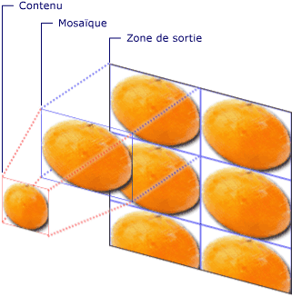
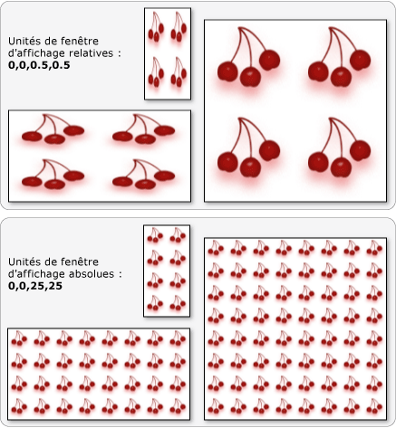

# Vue d'ensemble de TileBrushTileBrush Overview
<xref:System.Windows.Media.TileBrush>objets vous permettent de contrôler la peinture d’une zone avec une image, précisément <xref:System.Windows.Media.Drawing>, ou <xref:System.Windows.Media.Visual>.<xref:System.Windows.Media.TileBrush> objects provide you with a great deal of control over how an area is painted with an image, <xref:System.Windows.Media.Drawing>, or <xref:System.Windows.Media.Visual>. Cette rubrique explique comment utiliser <xref:System.Windows.Media.TileBrush> fonctionnalités pour mieux contrôler la façon un <xref:System.Windows.Media.ImageBrush>, <xref:System.Windows.Media.DrawingBrush>, ou <xref:System.Windows.Media.VisualBrush> peint une zone.This topic describes how to use <xref:System.Windows.Media.TileBrush> features to gain more control over how an <xref:System.Windows.Media.ImageBrush>, <xref:System.Windows.Media.DrawingBrush>, or <xref:System.Windows.Media.VisualBrush> paints an area.  
  
  
   
## Conditions préalablesPrerequisites  
 Pour comprendre cette rubrique, il est utile de comprendre comment utiliser les fonctionnalités de base de la <xref:System.Windows.Media.ImageBrush>, <xref:System.Windows.Media.DrawingBrush>, ou <xref:System.Windows.Media.VisualBrush> classe.To understand this topic, it's helpful to understand how to use the basic features of the <xref:System.Windows.Media.ImageBrush>, <xref:System.Windows.Media.DrawingBrush>, or <xref:System.Windows.Media.VisualBrush> class. Pour une introduction à ces types, consultez le [peinture avec des Images, des dessins et des éléments visuels](../../../../docs/framework/wpf/graphics-multimedia/painting-with-images-drawings-and-visuals.md).For an introduction to these types, see the [Painting with Images, Drawings, and Visuals](../../../../docs/framework/wpf/graphics-multimedia/painting-with-images-drawings-and-visuals.md).  
  
   
## Peindre une zone avec des mosaïquesPainting an Area with Tiles  
 <xref:System.Windows.Media.ImageBrush>, <xref:System.Windows.Media.DrawingBrush>, sont <xref:System.Windows.Media.VisualBrush> sont des types de <xref:System.Windows.Media.TileBrush> objets.<xref:System.Windows.Media.ImageBrush>, <xref:System.Windows.Media.DrawingBrush>, are <xref:System.Windows.Media.VisualBrush> are types of <xref:System.Windows.Media.TileBrush> objects. Les pinceaux mosaïque vous permettent de bien contrôler le remplissage d’une zone avec une image, un dessin ou un objet visuel.Tile brushes provide you with a great deal of control over how an area is painted with an image, drawing, or visual. Par exemple, au lieu de simplement peindre une zone avec une seule image étendue, vous pouvez peindre une zone avec une série de mosaïques d’image qui créent un motif.For example, instead of just painting an area with a single stretched image, you can paint an area with a series of image tiles that create a pattern.  
  
 Peindre une zone avec un pinceau mosaïque implique trois composants : un contenu, une mosaïque de base et une zone de sortie.Painting an area with a tile brush involves three components: content, the base tile, and the output area.  
  
   
Composants d’un TileBrush avec une seule mosaïqueComponents of a TileBrush with a single tile  
  
   
Composants d’un TileBrush avec un TileMode de mosaïqueComponents of a TileBrush with a TileMode of Tile  
  
 La zone de sortie est la zone de peinture, telle que la <xref:System.Windows.Shapes.Shape.Fill%2A> d’un <xref:System.Windows.Shapes.Ellipse> ou le <xref:System.Windows.Controls.Control.Background%2A> d’un <xref:System.Windows.Controls.Button>.The output area is the area being painted, such as the <xref:System.Windows.Shapes.Shape.Fill%2A> of an <xref:System.Windows.Shapes.Ellipse> or the <xref:System.Windows.Controls.Control.Background%2A> of a <xref:System.Windows.Controls.Button>. Les sections suivantes décrivent les deux autres composants d’un <xref:System.Windows.Media.TileBrush>.The next sections describe the other two components of a <xref:System.Windows.Media.TileBrush>.  
  
   
## Contenu de pinceauBrush Content  
 Il existe trois types différents de <xref:System.Windows.Media.TileBrush> et chaque peint avec un autre type de contenu.There are three different types of <xref:System.Windows.Media.TileBrush> and each paints with a different type of content.  
  
-   Si le pinceau est un <xref:System.Windows.Media.ImageBrush>, ce contenu est une image de la <xref:System.Windows.Media.ImageBrush.ImageSource%2A> propriété spécifie le contenu de la <xref:System.Windows.Media.ImageBrush>.If the brush is an <xref:System.Windows.Media.ImageBrush>, this content is an image The <xref:System.Windows.Media.ImageBrush.ImageSource%2A> property specifies the contents of the <xref:System.Windows.Media.ImageBrush>.  
  
-   Si le pinceau est un <xref:System.Windows.Media.DrawingBrush>, ce contenu est un dessin.If the brush is a <xref:System.Windows.Media.DrawingBrush>, this content is a drawing. Le <xref:System.Windows.Media.DrawingBrush.Drawing%2A> propriété spécifie le contenu de la <xref:System.Windows.Media.DrawingBrush>.The <xref:System.Windows.Media.DrawingBrush.Drawing%2A> property specifies the contents of the <xref:System.Windows.Media.DrawingBrush>.  
  
-   Si le pinceau est un <xref:System.Windows.Media.VisualBrush>, ce contenu est un élément visuel.If the brush is a <xref:System.Windows.Media.VisualBrush>, this content is a visual. Le <xref:System.Windows.Media.VisualBrush.Visual%2A> propriété spécifie le contenu de la <xref:System.Windows.Media.VisualBrush>.The <xref:System.Windows.Media.VisualBrush.Visual%2A> property specifies the content of the <xref:System.Windows.Media.VisualBrush>.  
  
 Vous pouvez spécifier la position et les dimensions de <xref:System.Windows.Media.TileBrush> contenu à l’aide de la <xref:System.Windows.Media.TileBrush.Viewbox%2A> propriété, bien qu’il soit courant de conserver le <xref:System.Windows.Media.TileBrush.Viewbox%2A> défini à sa valeur par défaut.You can specify the position and dimensions of <xref:System.Windows.Media.TileBrush> content by using the <xref:System.Windows.Media.TileBrush.Viewbox%2A> property, although it is common to leave the <xref:System.Windows.Media.TileBrush.Viewbox%2A> set to its default value. Par défaut, le <xref:System.Windows.Media.TileBrush.Viewbox%2A> est configuré pour englober intégralement le contenu du pinceau.By default, the <xref:System.Windows.Media.TileBrush.Viewbox%2A> is configured to completely contain the brush's contents. Pour plus d’informations sur la configuration de la <xref:System.Windows.Controls.Viewbox>, consultez le <xref:System.Windows.Controls.Viewbox> page de propriétés.For more information about configuring the <xref:System.Windows.Controls.Viewbox>, see the <xref:System.Windows.Controls.Viewbox> property page.  
  
   
## La mosaïque de baseThe Base Tile  
 A <xref:System.Windows.Media.TileBrush> projette son contenu sur une mosaïque de base.A <xref:System.Windows.Media.TileBrush> projects its content onto a base tile. Le <xref:System.Windows.Media.TileBrush.Stretch%2A> propriété détermine comment <xref:System.Windows.Media.TileBrush> contenu est étiré pour remplir la mosaïque de base.The <xref:System.Windows.Media.TileBrush.Stretch%2A> property controls how <xref:System.Windows.Media.TileBrush> content is stretched to fill the base tile. Le <xref:System.Windows.Media.TileBrush.Stretch%2A> propriété accepte les valeurs suivantes, définies par le <xref:System.Windows.Media.Stretch> énumération :The <xref:System.Windows.Media.TileBrush.Stretch%2A> property accepts the following values, defined by the <xref:System.Windows.Media.Stretch> enumeration:  
  
-   <xref:System.Windows.Media.Stretch.None>: Le contenu du pinceau n’est pas étiré pour remplir la mosaïque.<xref:System.Windows.Media.Stretch.None>: The brush's content is not stretched to fill the tile.  
  
-   <xref:System.Windows.Media.Stretch.Fill>: Le contenu du pinceau est ajusté en fonction de la vignette.<xref:System.Windows.Media.Stretch.Fill>: The brush's content is scaled to fit the tile. Étant donné que la hauteur et la largeur du contenu sont mis à l’échelle indépendamment, les proportions d’origine du contenu risquent de ne pas être conservées.Because the content's height and width are scaled independently, the original aspect ratio of the content might not be preserved. Autrement dit, le contenu du pinceau peut être déformé pour remplir complètement la mosaïque de sortie.That is, the brush's content might be warped in order to completely fill the output tile.  
  
-   <xref:System.Windows.Media.Stretch.Uniform>: Le contenu du pinceau est mis à l’échelle afin qu’elle s’adapte parfaitement au sein de la vignette.<xref:System.Windows.Media.Stretch.Uniform>: The brush's content is scaled so that it fits completely within the tile. Les proportions du contenu sont conservées.The content's aspect ratio is preserved.  
  
-   <xref:System.Windows.Media.Stretch.UniformToFill>: Le contenu du pinceau est mis à l’échelle afin qu’il remplisse complètement la zone de sortie tout en conservant les proportions d’origine du contenu.<xref:System.Windows.Media.Stretch.UniformToFill>: The brush's content is scaled so that it completely fills the output area while preserving the content's original aspect ratio.  
  
 L’image suivante illustre les différentes <xref:System.Windows.Media.TileBrush.Stretch%2A> paramètres.The following image illustrates the different <xref:System.Windows.Media.TileBrush.Stretch%2A> settings.  
  
   
  
 Dans l’exemple suivant, le contenu d’un <xref:System.Windows.Media.ImageBrush> est définie afin qu’il ne s’étire pas pour remplir la zone de sortie.In the following example, the content of an <xref:System.Windows.Media.ImageBrush> is set so that it does not stretch to fill the output area.  
  
 [!code-xaml[BrushOverviewExamples_snip#GraphicsMMNoStretchExample](../../../../samples/snippets/xaml/VS_Snippets_Wpf/BrushOverviewExamples_snip/XAML/StretchExample.xaml#graphicsmmnostretchexample)]  
  
 [!code-csharp[BrushOverviewExamples_procedural_snip#GraphicsMMNoStretchExample](../../../../samples/snippets/csharp/VS_Snippets_Wpf/BrushOverviewExamples_procedural_snip/CSharp/StretchExample.cs#graphicsmmnostretchexample)]
 [!code-vb[BrushOverviewExamples_procedural_snip#GraphicsMMNoStretchExample](../../../../samples/snippets/visualbasic/VS_Snippets_Wpf/BrushOverviewExamples_procedural_snip/visualbasic/stretchexample.vb#graphicsmmnostretchexample)]  
  
 Par défaut, un <xref:System.Windows.Media.TileBrush> génère une seule mosaïque (la mosaïque de base) et étire cette mosaïque pour remplir complètement la zone de sortie.By default, a <xref:System.Windows.Media.TileBrush> generates a single tile (the base tile) and stretches that tile to completely fill the output area. Vous pouvez modifier la taille et la position de la mosaïque de base en définissant le <xref:System.Windows.Media.TileBrush.Viewport%2A> et <xref:System.Windows.Media.TileBrush.ViewportUnits%2A> propriétés.You can change the size and position of the base tile by setting the <xref:System.Windows.Media.TileBrush.Viewport%2A> and <xref:System.Windows.Media.TileBrush.ViewportUnits%2A> properties.  
  
   
### Taille de la mosaïque de baseBase Tile Size  
 Le <xref:System.Windows.Media.TileBrush.Viewport%2A> propriété détermine la taille et la position de la mosaïque de base et le <xref:System.Windows.Media.TileBrush.ViewportUnits%2A> propriété détermine si le <xref:System.Windows.Media.TileBrush.Viewport%2A> est spécifié à l’aide de coordonnées absolues ou relatives.The <xref:System.Windows.Media.TileBrush.Viewport%2A> property determines the size and position of the base tile, and the <xref:System.Windows.Media.TileBrush.ViewportUnits%2A> property determines whether the <xref:System.Windows.Media.TileBrush.Viewport%2A> is specified using absolute or relative coordinates. Si les coordonnées sont relatives, elles sont relatives à la taille de la zone de sortie.If the coordinates are relative, they are relative to the size of the output area. Le point (0,0) représente le coin supérieur gauche de la zone de sortie et (1,1) représente le coin inférieur droit de la zone de sortie.The point (0,0) represents the top left corner of the output area, and (1,1) represents the bottom right corner of the output area. Pour spécifier que le <xref:System.Windows.Media.TileBrush.Viewport%2A> propriété utilise des coordonnées absolues, définissez la <xref:System.Windows.Media.TileBrush.ViewportUnits%2A> propriété <xref:System.Windows.Media.BrushMappingMode.Absolute>.To specify that the <xref:System.Windows.Media.TileBrush.Viewport%2A> property uses absolute coordinates, set the <xref:System.Windows.Media.TileBrush.ViewportUnits%2A> property to <xref:System.Windows.Media.BrushMappingMode.Absolute>.  
  
 L’illustration suivante montre la différence de sortie entre un <xref:System.Windows.Media.TileBrush> relative ou absolue <xref:System.Windows.Media.TileBrush.ViewportUnits%2A>.The following illustration shows the difference in output between a <xref:System.Windows.Media.TileBrush> with relative versus absolute <xref:System.Windows.Media.TileBrush.ViewportUnits%2A>. Notez que chaque illustration représente un motif en mosaïque ; la section suivante décrit comment spécifier un tel motif.Notice that the illustrations each show a tiled pattern; the next section describes how to specify tile pattern.  
  
   
  
 Dans l’exemple suivant, une image est utilisée pour créer une mosaïque ayant une largeur et une hauteur de 50 %.In the following example, an image is used to create a tile that has a width and height of 50%. La mosaïque de base se trouve au point (0,0) de la zone de sortie.The base tile is located at (0,0) of the output area.  
  
 [!code-xaml[BrushOverviewExamples_snip#GraphicsMMRelativeViewportUnitsExample1](../../../../samples/snippets/xaml/VS_Snippets_Wpf/BrushOverviewExamples_snip/XAML/TileSizeExample.xaml#graphicsmmrelativeviewportunitsexample1)]  
  
 [!code-csharp[BrushOverviewExamples_procedural_snip#GraphicsMMRelativeViewportUnitsExample1](../../../../samples/snippets/csharp/VS_Snippets_Wpf/BrushOverviewExamples_procedural_snip/CSharp/TileSizeExample.cs#graphicsmmrelativeviewportunitsexample1)]
 [!code-vb[BrushOverviewExamples_procedural_snip#GraphicsMMRelativeViewportUnitsExample1](../../../../samples/snippets/visualbasic/VS_Snippets_Wpf/BrushOverviewExamples_procedural_snip/visualbasic/tilesizeexample.vb#graphicsmmrelativeviewportunitsexample1)]  
  
 L’exemple suivant définit les vignettes d’un <xref:System.Windows.Media.ImageBrush> à 25 par 25 pixels indépendants du périphérique.The next example sets the tiles of an <xref:System.Windows.Media.ImageBrush> to 25 by 25 device independent pixels. Étant donné que la <xref:System.Windows.Media.TileBrush.ViewportUnits%2A> sont absolu, le <xref:System.Windows.Media.ImageBrush> vignettes sont toujours 25 par 25 pixels, quelle que soit la taille de la zone qui est peinte.Because the <xref:System.Windows.Media.TileBrush.ViewportUnits%2A> are absolute, the <xref:System.Windows.Media.ImageBrush> tiles are always 25 by 25 pixels, regardless of the size of the area being painted.  
  
 [!code-xaml[BrushOverviewExamples_snip#GraphicsMMAbsoluteViewportUnitsExample1](../../../../samples/snippets/xaml/VS_Snippets_Wpf/BrushOverviewExamples_snip/XAML/TileSizeExample.xaml#graphicsmmabsoluteviewportunitsexample1)]  
  
 [!code-csharp[BrushOverviewExamples_procedural_snip#GraphicsMMAbsoluteViewportUnitsExample1](../../../../samples/snippets/csharp/VS_Snippets_Wpf/BrushOverviewExamples_procedural_snip/CSharp/TileSizeExample.cs#graphicsmmabsoluteviewportunitsexample1)]
 [!code-vb[BrushOverviewExamples_procedural_snip#GraphicsMMAbsoluteViewportUnitsExample1](../../../../samples/snippets/visualbasic/VS_Snippets_Wpf/BrushOverviewExamples_procedural_snip/visualbasic/tilesizeexample.vb#graphicsmmabsoluteviewportunitsexample1)]  
  
   
### Comportement des mosaïquesTiling Behavior  
 A <xref:System.Windows.Media.TileBrush> génère un modèle en mosaïque lorsque sa mosaïque de base ne remplit pas entièrement la zone de sortie et un mode de mosaïque autre <xref:System.Windows.Media.TileMode.None> est spécifié.A <xref:System.Windows.Media.TileBrush> produces a tiled pattern when its base tile does not completely fill the output area and a tiling mode other then <xref:System.Windows.Media.TileMode.None> is specified. Lorsque mosaïque un pinceau ne remplit pas entièrement la zone de sortie, son <xref:System.Windows.Media.TileBrush.TileMode%2A> propriété spécifie si la mosaïque de base doit être dupliquée pour remplir la zone de sortie et, dans ce cas, comment la mosaïque de base doit être dupliqué.When a tile brush's tile does not completely fill the output area, its <xref:System.Windows.Media.TileBrush.TileMode%2A> property specifies whether the base tile should be duplicated to fill the output area and, if so, how the base tile should be duplicated. Le <xref:System.Windows.Media.TileBrush.TileMode%2A> propriété accepte les valeurs suivantes, définies par le <xref:System.Windows.Media.TileMode> énumération :The <xref:System.Windows.Media.TileBrush.TileMode%2A> property accepts the following values, defined by the <xref:System.Windows.Media.TileMode> enumeration:  
  
-   <xref:System.Windows.Media.TileMode.None>: Seule la mosaïque de base est dessinée.<xref:System.Windows.Media.TileMode.None>: Only the base tile is drawn.  
  
-   <xref:System.Windows.Media.TileMode.Tile>: La mosaïque de base est dessinée et la zone restante est remplie en répétant la mosaïque de base telles que le bord droit d’une mosaïque est adjacent sur le bord gauche de la suivante et de la même façon et du bas.<xref:System.Windows.Media.TileMode.Tile>: The base tile is drawn and the remaining area is filled by repeating the base tile such that the right edge of one tile is adjacent to the left edge of the next, and similarly for bottom and top.  
  
-   <xref:System.Windows.Media.TileMode.FlipX>: Identique à <xref:System.Windows.Media.TileMode.Tile>, mais les autres colonnes de mosaïques sont retournées horizontalement.<xref:System.Windows.Media.TileMode.FlipX>: The same as <xref:System.Windows.Media.TileMode.Tile>, but alternate columns of tiles are flipped horizontally.  
  
-   <xref:System.Windows.Media.TileMode.FlipY>: Identique à <xref:System.Windows.Media.TileMode.Tile>, mais une ligne de mosaïques est retournée verticalement.<xref:System.Windows.Media.TileMode.FlipY>: The same as <xref:System.Windows.Media.TileMode.Tile>, but alternate rows of tiles are flipped vertically.  
  
-   <xref:System.Windows.Media.TileMode.FlipXY>: Une combinaison de <xref:System.Windows.Media.TileMode.FlipX> et <xref:System.Windows.Media.TileMode.FlipY>.<xref:System.Windows.Media.TileMode.FlipXY>: A combination of <xref:System.Windows.Media.TileMode.FlipX> and <xref:System.Windows.Media.TileMode.FlipY>.  
  
 Les images suivantes illustrent les différents modes de mosaïque.The following image illustrates the different tiling modes.  
  
   
  
 Dans l’exemple suivant, une image est utilisée pour peindre un rectangle de 100 pixels de large et 100 pixels de haut.In the following example, an image is used to paint a rectangle that is 100 pixels wide and 100 pixels tall. En définissant le pinceau <xref:System.Windows.Media.TileBrush.Viewport%2A> a été défini à 0,0,0.25,0.25, la mosaïque de base du pinceau est effectuée à 1/4 de la zone de sortie.By setting the brush's <xref:System.Windows.Media.TileBrush.Viewport%2A> has been set to 0,0,0.25,0.25, the brush's base tile is made to be 1/4 of the output area. Le pinceau <xref:System.Windows.Media.TileBrush.TileMode%2A> a la valeur <xref:System.Windows.Media.TileMode.FlipXY>.The brush's <xref:System.Windows.Media.TileBrush.TileMode%2A> is set to <xref:System.Windows.Media.TileMode.FlipXY>. afin qu’il remplisse le rectangle de lignes de mosaïques.so that it fills the rectangle with rows of tiles.  
  
 [!code-xaml[BrushOverviewExamples_snip#GraphicsMMFlipXYExample](../../../../samples/snippets/xaml/VS_Snippets_Wpf/BrushOverviewExamples_snip/XAML/TilingExample.xaml#graphicsmmflipxyexample)]  
  
 [!code-csharp[BrushOverviewExamples_procedural_snip#GraphicsMMFlipXYExample](../../../../samples/snippets/csharp/VS_Snippets_Wpf/BrushOverviewExamples_procedural_snip/CSharp/TilingExample.cs#graphicsmmflipxyexample)]
 [!code-vb[BrushOverviewExamples_procedural_snip#GraphicsMMFlipXYExample](../../../../samples/snippets/visualbasic/VS_Snippets_Wpf/BrushOverviewExamples_procedural_snip/visualbasic/tilingexample.vb#graphicsmmflipxyexample)]  
  
## Voir aussiSee Also  
 <xref:System.Windows.Media.ImageBrush>  
 <xref:System.Windows.Media.DrawingBrush>  
 <xref:System.Windows.Media.VisualBrush>  
 <xref:System.Windows.Media.TileBrush>  
 [Peinture avec des images, des dessins et des objets visuelsPainting with Images, Drawings, and Visuals](../../../../docs/framework/wpf/graphics-multimedia/painting-with-images-drawings-and-visuals.md)  
 [Rubriques de guide pratiqueHow-to Topics](../../../../docs/framework/wpf/graphics-multimedia/brushes-how-to-topics.md)  
 [Vue d’ensemble des objets FreezableFreezable Objects Overview](../../../../docs/framework/wpf/advanced/freezable-objects-overview.md)  
 [ImageBrush, exempleImageBrush Sample](http://go.microsoft.com/fwlink/?LinkID=160005)  
 [VisualBrush Sample](http://go.microsoft.com/fwlink/?LinkID=160049) (Exemple de VisualBrush)[VisualBrush Sample](http://go.microsoft.com/fwlink/?LinkID=160049)
