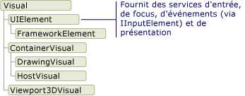
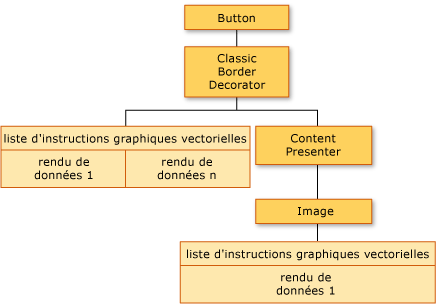
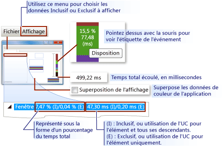
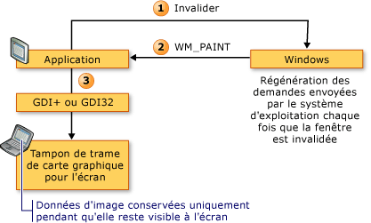
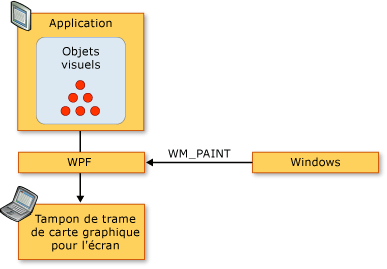
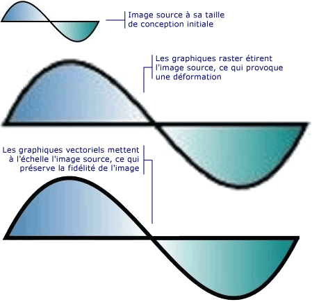
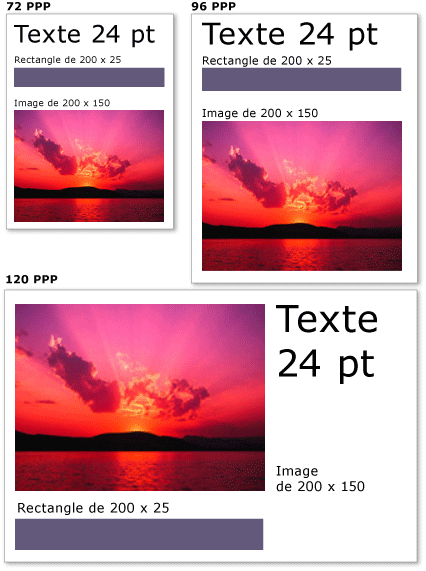

# Vue d'ensemble du rendu graphique de WPF
Cette rubrique offre une vue d’ensemble de la couche visuelle [!INCLUDE[TLA2#tla_winclient](../../../../includes/tla2sharptla-winclient-md.md)]. Il se concentre sur le rôle de la <xref:System.Windows.Media.Visual> classe pour le rendu de prise en charge dans la [!INCLUDE[TLA2#tla_winclient](../../../../includes/tla2sharptla-winclient-md.md)] modèle.  
  
  
   
## Rôle de l’objet visuel  
 Le <xref:System.Windows.Media.Visual> classe est l’abstraction de base à partir de laquelle chaque <xref:System.Windows.FrameworkElement> dérive de l’objet. Elle sert également de point d’entrée pour l’écriture de nouveaux contrôles dans [!INCLUDE[TLA2#tla_winclient](../../../../includes/tla2sharptla-winclient-md.md)] et peut être considérée de diverses manières comme le handle de fenêtre (HWND) dans le modèle d’application Win32.  
  
 Le <xref:System.Windows.Media.Visual> est un objet [!INCLUDE[TLA2#tla_winclient](../../../../includes/tla2sharptla-winclient-md.md)] objet, dont le rôle principal consiste à fournir la prise en charge du rendu. Contrôles d’interface utilisateur, tel que <xref:System.Windows.Controls.Button> et <xref:System.Windows.Controls.TextBox>, dérivent de la <xref:System.Windows.Media.Visual> classe et utilisez-la pour conserver leurs données de rendu. Le <xref:System.Windows.Media.Visual> objet prend en charge :  
  
-   Affichage de sortie : rendu du contenu de dessin sérialisé persistant d’un objet visuel.  
  
-   Transformations : exécution de transformations sur un objet visuel.  
  
-   Détourage : prise en charge de la zone de détourage d’un objet visuel.  
  
-   Test des résultats : détermination si une coordonnée ou une géométrie est contenue dans les limites d’un objet visuel.  
  
-   Calculs de rectangle englobant : détermination du rectangle englobant d’un objet visuel.  
  
 Toutefois, le <xref:System.Windows.Media.Visual> objet n’inclut pas de prise en charge des fonctionnalités de rendu non, telles que :  
  
-   Gestion des événements  
  
-   Disposition  
  
-   Styles  
  
-   Liaison de données  
  
-   Globalisation  
  
 <xref:System.Windows.Media.Visual>est exposé en tant que classe publique abstraite à partir de laquelle doivent être dérivées les classes enfants. L’illustration suivante montre la hiérarchie des objets visuels exposés dans [!INCLUDE[TLA2#tla_winclient](../../../../includes/tla2sharptla-winclient-md.md)].  
  
   
Hiérarchie de classe d’objet visuel  
  
### Classe DrawingVisual  
 Le <xref:System.Windows.Media.DrawingVisual> est une classe qui est utilisé pour restituer le texte, des images ou des formes de dessin légère. Cette classe est considérée comme légère, car elle n’offre pas de dispositions ni d’options de gestion des événements, ce qui améliore ses performances d’exécution. C’est pourquoi, les dessins de ce type sont idéaux pour les arrière-plans et les images clipart. Le <xref:System.Windows.Media.DrawingVisual> peut être utilisé pour créer un objet visuel personnalisé. Pour plus d’informations, consultez [Utilisation d’objets DrawingVisual](../../../../docs/framework/wpf/graphics-multimedia/using-drawingvisual-objects.md).  
  
### Classe Viewport3DVisual  
 Le <xref:System.Windows.Media.Media3D.Viewport3DVisual> fournit un pont entre 2D <xref:System.Windows.Media.Visual> et <xref:System.Windows.Media.Media3D.Visual3D> objets. Le <xref:System.Windows.Media.Media3D.Visual3D> est la classe de base pour tous les éléments visuels 3D. Le <xref:System.Windows.Media.Media3D.Viewport3DVisual> nécessite que vous définissiez un <xref:System.Windows.Media.Media3D.Viewport3DVisual.Camera%2A> valeur et un <xref:System.Windows.Media.Media3D.Viewport3DVisual.Viewport%2A> valeur. La caméra vous permet d’afficher la scène. La fenêtre d’affichage détermine où la projection est mappée sur la surface 2D. Pour plus d’informations sur la 3D dans [!INCLUDE[TLA2#tla_winclient](../../../../includes/tla2sharptla-winclient-md.md)], consultez [Vue d’ensemble des graphiques 3D](../../../../docs/framework/wpf/graphics-multimedia/3-d-graphics-overview.md).  
  
### Classe ContainerVisual  
 Le <xref:System.Windows.Media.ContainerVisual> classe est utilisée comme un conteneur pour une collection de <xref:System.Windows.Media.Visual> objets. Le <xref:System.Windows.Media.DrawingVisual> classe dérive de la <xref:System.Windows.Media.ContainerVisual> (classe), ce qui permet de contenir une collection d’objets visuels.  
  
### Dessin de contenu dans des objets visuels  
 A <xref:System.Windows.Media.Visual> objet stocke ses données de rendu comme un **liste d’instructions graphiques vectorielles**. Chaque élément de la liste d’instructions représente un ensemble de bas niveau de données graphiques et des ressources associées dans un format sérialisé. Quatre types de données de rendu différents peuvent du contenu de dessin.  
  
|Type de contenu de dessin|Description|  
|--------------------------|-----------------|  
|Graphismes vectoriels|Représente des données graphiques et tout programme associé de vecteur <xref:System.Windows.Media.Brush> et <xref:System.Windows.Media.Pen> plus d’informations.|  
|Image|Représente une image dans une région définie par un <xref:System.Windows.Rect>.|  
|Glyphe|Représente un dessin qui restitue une <xref:System.Windows.Media.GlyphRun>, qui est une séquence de glyphes à partir d’une ressource de police spécifiée. Il s’agit de la représentation du texte.|  
|Vidéo|Représente un dessin qui rend de la vidéo.|  
  
 Le <xref:System.Windows.Media.DrawingContext> vous permet de remplir un <xref:System.Windows.Media.Visual> avec un contenu visuel. Lorsque vous utilisez un <xref:System.Windows.Media.DrawingContext> commandes de dessin de l’objet, vous stockez réellement un jeu de données de rendu qui seront utilisées ultérieurement par le système graphique ; vous ne dessinez pas à l’écran en temps réel.  
  
 Lorsque vous créez un [!INCLUDE[TLA2#tla_winclient](../../../../includes/tla2sharptla-winclient-md.md)] contrôle, tel qu’un <xref:System.Windows.Controls.Button>, le contrôle génère implicitement les données de rendu pour le dessin de lui-même. Par exemple, si le <xref:System.Windows.Controls.ContentControl.Content%2A> propriété de la <xref:System.Windows.Controls.Button> force le contrôle à stocker une représentation de rendu d’un glyphe.  
  
 A <xref:System.Windows.Media.Visual> décrit son contenu comme un ou plusieurs <xref:System.Windows.Media.Drawing> les objets contenus dans un <xref:System.Windows.Media.DrawingGroup>. A <xref:System.Windows.Media.DrawingGroup> décrit également des masques d’opacité, des transformations, des effets bitmap et d’autres opérations qui sont appliquées à son contenu. <xref:System.Windows.Media.DrawingGroup>Lorsque le contenu est affiché, les opérations sont appliquées dans l’ordre suivant : <xref:System.Windows.Media.DrawingGroup.OpacityMask%2A>, <xref:System.Windows.Media.DrawingGroup.Opacity%2A>, <xref:System.Windows.Media.DrawingGroup.BitmapEffect%2A>, <xref:System.Windows.Media.DrawingGroup.ClipGeometry%2A>, <xref:System.Windows.Media.DrawingGroup.GuidelineSet%2A>, puis <xref:System.Windows.Media.DrawingGroup.Transform%2A>.  
  
 L’illustration suivante montre l’ordre dans lequel <xref:System.Windows.Media.DrawingGroup> les opérations sont appliquées lors de la séquence de rendu.  
  
   
Ordre des opérations DrawingGroup  
  
 Pour plus d’informations, consultez [Vue d’ensemble des objets de dessin](../../../../docs/framework/wpf/graphics-multimedia/drawing-objects-overview.md).  
  
#### Contenu de dessin sur la couche visuelle  
 Vous instanciez jamais directement un <xref:System.Windows.Media.DrawingContext>; vous pouvez toutefois acquérir un contexte de dessin de certaines méthodes, telles que <xref:System.Windows.Media.DrawingGroup.Open%2A?displayProperty=nameWithType> et <xref:System.Windows.Media.DrawingVisual.RenderOpen%2A?displayProperty=nameWithType>. L’exemple suivant récupère un <xref:System.Windows.Media.DrawingContext> d’un <xref:System.Windows.Media.DrawingVisual> et l’utilise pour dessiner un rectangle.  
  
 [!code-csharp[drawingvisualsample#101](../../../../samples/snippets/csharp/VS_Snippets_Wpf/DrawingVisualSample/CSharp/Window1.xaml.cs#101)]
 [!code-vb[drawingvisualsample#101](../../../../samples/snippets/visualbasic/VS_Snippets_Wpf/DrawingVisualSample/visualbasic/window1.xaml.vb#101)]  
  
#### Énumération du contenu de dessin sur la couche visuelle  
 Outre leurs autres utilisations, <xref:System.Windows.Media.Drawing> objets fournissent également un modèle d’objet pour énumérer le contenu d’un <xref:System.Windows.Media.Visual>.  
  
> [!NOTE]
>  Lorsque vous énumérez le contenu de l’élément visuel, vous récupérez <xref:System.Windows.Media.Drawing> objets et pas la représentation sous-jacente des données rendues comme liste d’instructions graphiques vectorielles.  
  
 L’exemple suivant utilise le <xref:System.Windows.Media.VisualTreeHelper.GetDrawing%2A> pour récupérer le <xref:System.Windows.Media.DrawingGroup> valeur d’un <xref:System.Windows.Media.Visual> et énumérer.  
  
 [!code-csharp[DrawingMiscSnippets_snip#GraphicsMMRetrieveDrawings](../../../../samples/snippets/csharp/VS_Snippets_Wpf/DrawingMiscSnippets_snip/CSharp/EnumerateDrawingsExample.xaml.cs#graphicsmmretrievedrawings)]  
  
   
## Comment les objets visuels sont utilisés pour générer des contrôles  
 Un grand nombre d’objets dans [!INCLUDE[TLA2#tla_winclient](../../../../includes/tla2sharptla-winclient-md.md)] sont composés d’autres objets visuels, ce qui signifie qu’ils peuvent contenir différentes hiérarchies d’objets descendants. Un grand nombre d’éléments de l’interface utilisateur dans [!INCLUDE[TLA2#tla_winclient](../../../../includes/tla2sharptla-winclient-md.md)], tels que les contrôles, sont composés de plusieurs objets visuels représentant différents types d’éléments de rendu. Par exemple, le <xref:System.Windows.Controls.Button> contrôle peut contenir un nombre d’autres objets, y compris <xref:Microsoft.Windows.Themes.ClassicBorderDecorator>, <xref:System.Windows.Controls.ContentPresenter>, et <xref:System.Windows.Controls.TextBlock>.  
  
 Le code suivant illustre un <xref:System.Windows.Controls.Button> définie dans le balisage de contrôle.  
  
 [!code-xaml[VisualsOverview#VisualsOverviewSnippet1](../../../../samples/snippets/csharp/VS_Snippets_Wpf/VisualsOverview/CSharp/Window1.xaml#visualsoverviewsnippet1)]  
  
 Vous avez la possibilité d’énumérer les objets visuels qui constituent la valeur par défaut <xref:System.Windows.Controls.Button> (contrôle), vous trouverez la hiérarchie d’objets visuels illustrée ci-dessous :  
  
   
Diagramme de la hiérarchie de l’arborescence d’éléments visuels  
  
 Le <xref:System.Windows.Controls.Button> contrôle contient un <xref:Microsoft.Windows.Themes.ClassicBorderDecorator> élément, qui à son tour, contient un <xref:System.Windows.Controls.ContentPresenter> élément. Le <xref:Microsoft.Windows.Themes.ClassicBorderDecorator> élément est chargé de dessiner une bordure et un arrière-plan pour le <xref:System.Windows.Controls.Button>. Le <xref:System.Windows.Controls.ContentPresenter> élément est responsable de l’affichage du contenu de la <xref:System.Windows.Controls.Button>. Dans ce cas, étant donné que vous affichez le texte, le <xref:System.Windows.Controls.ContentPresenter> élément contient un <xref:System.Windows.Controls.TextBlock> élément. Le fait que le <xref:System.Windows.Controls.Button> de contrôles utilise un <xref:System.Windows.Controls.ContentPresenter> signifie que le contenu peut être représenté par d’autres éléments, tels qu’une <xref:System.Windows.Controls.Image> ou une géométrie, tels qu’une <xref:System.Windows.Media.EllipseGeometry>.  
  
### Modèles de contrôle  
 La clé de l’expansion d’un contrôle dans une hiérarchie de contrôles est le <xref:System.Windows.Controls.ControlTemplate>. Un modèle de contrôle spécifie la hiérarchie d’objets visuels par défaut d’un contrôle. Lorsque vous référencez explicitement un contrôle, vous référencez implicitement sa hiérarchie d’objets visuels. Vous pouvez remplacer les valeurs par défaut d’un modèle de contrôle afin de créer une apparence visuelle personnalisée pour un contrôle. Par exemple, vous pouvez modifier la valeur de couleur d’arrière-plan de la <xref:System.Windows.Controls.Button> contrôle afin qu’il utilise une valeur de couleur de dégradé linéaire plutôt qu’une valeur de couleur unie. Pour plus d’informations, consultez [Styles et modèles de bouton](../../../../docs/framework/wpf/controls/button-styles-and-templates.md).  
  
 Une interface utilisateur élément, comme un <xref:System.Windows.Controls.Button> contrôler, contient plusieurs listes d’instructions graphiques vectorielles qui décrivent la définition de rendu complète d’un contrôle. Le code suivant illustre un <xref:System.Windows.Controls.Button> définie dans le balisage de contrôle.  
  
 [!code-xaml[VisualsOverview#VisualsOverviewSnippet2](../../../../samples/snippets/csharp/VS_Snippets_Wpf/VisualsOverview/CSharp/Window1.xaml#visualsoverviewsnippet2)]  
  
 Si vous deviez énumérer les objets visuels et vectoriels des listes d’instructions graphiques qui composent le <xref:System.Windows.Controls.Button> (contrôle), vous trouverez la hiérarchie d’objets illustrée ci-dessous :  
  
   
Diagramme de l’arborescence d’éléments visuels et des données de rendu  
  
 Le <xref:System.Windows.Controls.Button> contrôle contient un <xref:Microsoft.Windows.Themes.ClassicBorderDecorator> élément, qui à son tour, contient un <xref:System.Windows.Controls.ContentPresenter> élément. Le <xref:Microsoft.Windows.Themes.ClassicBorderDecorator> élément est chargé de dessiner tous les éléments graphiques discrètes qui composent la bordure et l’arrière-plan d’un bouton. Le <xref:System.Windows.Controls.ContentPresenter> élément est responsable de l’affichage du contenu de la <xref:System.Windows.Controls.Button>. Dans ce cas, puisque vous affichez une image, le <xref:System.Windows.Controls.ContentPresenter> élément contient un <xref:System.Windows.Controls.Image> élément.  
  
 Prenez note des différents points suivants sur la hiérarchie d’objets visuels et les listes d’instructions de graphismes vectoriels :  
  
-   L’ordre de la hiérarchie représente l’ordre de rendu des informations de dessin. À partir de l’élément visuel racine, les éléments enfants sont parcourus de gauche à droite et de haut en bas. Si un élément comporte des éléments enfants, ils sont parcourus avant les frères de l’élément.  
  
-   Les éléments de nœuds non terminaux dans la hiérarchie, tels que <xref:System.Windows.Controls.ContentPresenter>, sont utilisés pour contenir des éléments enfants, ils ne contiennent pas de listes d’instructions.  
  
-   Si un élément visuel contient une liste d’instructions de graphismes vectoriels et des enfants visuels, la liste d’instructions de l’élément visuel parent est rendue avant les dessins des objets enfants visuels.  
  
-   Les éléments dans la liste d’instructions de graphismes vectoriels sont rendus de gauche à droite.  
  
   
## Arborescence d'éléments visuels  
 L’arborescence d’éléments visuels contient tous les éléments visuels utilisés dans l’interface utilisateur d’une application. Étant donné qu’un élément visuel contient des informations de dessin persistantes, vous pouvez considérer l’arborescence d’éléments visuels comme un graphique de scène contenant toutes les informations de rendu nécessaires pour composer la sortie vers le périphérique d’affichage. Cette arborescence est l’accumulation de tous les éléments visuels créés directement par l’application, que ce soit dans le code ou dans la balise. L’arborescence d’éléments visuels contient également tous les éléments visuels créés par l’expansion du modèle d’éléments comme les contrôles et les objets de données.  
  
 Le code suivant illustre un <xref:System.Windows.Controls.StackPanel> élément défini dans le balisage.  
  
 [!code-xaml[VisualsOverview#VisualsOverviewSnippet3](../../../../samples/snippets/csharp/VS_Snippets_Wpf/VisualsOverview/CSharp/Window1.xaml#visualsoverviewsnippet3)]  
  
 Vous avez la possibilité d’énumérer les objets visuels qui constituent le <xref:System.Windows.Controls.StackPanel> élément dans l’exemple de balise, vous trouveriez la hiérarchie d’objets visuels illustrée ci-dessous :  
  
   
Diagramme de la hiérarchie de l’arborescence d’éléments visuels  
  
### Ordre de rendu  
 L’arborescence d’éléments visuels détermine l’ordre de rendu des objets visuels et de dessin [!INCLUDE[TLA2#tla_winclient](../../../../includes/tla2sharptla-winclient-md.md)]. L’ordre de parcours démarre avec l’objet visuel racine qui est le nœud supérieur de l’arborescence d’éléments visuels. Les enfants de l’objet visuel racine sont ensuite parcourus de gauche à droite. Si un objet visuel comporte des enfants, ses enfants sont parcourus avant les frères de l’objet visuel. Cela signifie que le contenu d’un objet visuel enfant est rendu avant le contenu de l’objet visuel.  
  
   
Diagramme de l’ordre de rendu de l’arborescence d’éléments visuels  
  
### Objet visuel racine  
 L’**objet visuel racine** est le premier élément d’une hiérarchie d’arborescence d’éléments visuels. Dans la plupart des applications, la classe de base de l’élément racine est soit <xref:System.Windows.Window> ou <xref:System.Windows.Navigation.NavigationWindow>. Toutefois, si vous hébergiez des objets visuels dans une application Win32, l’objet visuel racine serait le premier objet visuel hébergé dans la fenêtre Win32. Pour plus d’informations, consultez [Didacticiel : hébergement d’objets visuels dans une application Win32](../../../../docs/framework/wpf/graphics-multimedia/tutorial-hosting-visual-objects-in-a-win32-application.md).  
  
### Relation à l’arborescence logique  
 L’arborescence logique dans [!INCLUDE[TLA2#tla_winclient](../../../../includes/tla2sharptla-winclient-md.md)] représente les éléments d’une application au moment de l’exécution. Même si vous ne manipulez pas directement cette arborescence, cette vue de l’application est utile pour comprendre l’héritage de propriété et le routage d’événement. Contrairement à l’arborescence d’éléments visuels, l’arborescence logique peut représenter des objets de données non visuels, tels que <xref:System.Windows.Documents.ListItem>. Dans de nombreux cas, l’arborescence logique est très étroitement liée aux définitions de balise d’une application. Le code suivant illustre un <xref:System.Windows.Controls.DockPanel> élément défini dans le balisage.  
  
 [!code-xaml[VisualsOverview#VisualsOverviewSnippet5](../../../../samples/snippets/csharp/VS_Snippets_Wpf/VisualsOverview/CSharp/Window1.xaml#visualsoverviewsnippet5)]  
  
 Vous avez la possibilité d’énumérer les objets logiques qui constituent le <xref:System.Windows.Controls.DockPanel> élément dans l’exemple de balise, vous trouveriez la hiérarchie d’objets logiques illustrée ci-dessous :  
  
   
Diagramme de l’arborescence logique  
  
 L’arborescence d’éléments visuels et l’arborescence logique sont synchronisées avec l’ensemble actuel d’éléments d’application, reflétant tout ajout, suppression ou modification d’éléments. Toutefois, les arborescences présentent différentes vues de l’application. Contrairement à l’arborescence d’éléments visuels, l’arborescence logique ne développe pas d’un contrôle <xref:System.Windows.Controls.ContentPresenter> élément. Cela signifie qu’il n’existe pas de correspondance directe entre une arborescence logique et une arborescence d’éléments visuels pour le même ensemble d’objets. En fait, appeler le **méthode LogicalTreeHelper** l’objet <xref:System.Windows.LogicalTreeHelper.GetChildren%2A> (méthode) et le **VisualTreeHelper** l’objet <xref:System.Windows.Media.VisualTreeHelper.GetChild%2A> méthode à l’aide du même élément comme paramètre génère des résultats différents .  
  
 Pour plus d’informations sur l’arborescence logique, consultez [Arborescences dans WPF](../../../../docs/framework/wpf/advanced/trees-in-wpf.md).  
  
### Affichage de l’arborescence d’éléments visuels avec XamlPad  
 L’outil [!INCLUDE[TLA2#tla_winclient](../../../../includes/tla2sharptla-winclient-md.md)], XamlPad, fournit une option permettant d’afficher et d’explorer l’arborescence d’éléments visuels qui correspond au contenu [!INCLUDE[TLA#tla_titlexaml](../../../../includes/tlasharptla-titlexaml-md.md)] actuellement défini. Cliquez sur le bouton **Show Visual Tree** (Afficher l’arborescence d’éléments visuels) de la barre de menus pour afficher l’arborescence d’éléments visuels. L’exemple suivant illustre l’expansion du contenu [!INCLUDE[TLA#tla_titlexaml](../../../../includes/tlasharptla-titlexaml-md.md)] dans des nœuds d’arborescence d’éléments visuels dans le volet **Explorateur de l’arborescence d’éléments visuels** de XamlPad :  
  
   
Volet Explorateur de l’arborescence d’éléments visuels dans XamlPad  
  
 Notez comment la <xref:System.Windows.Controls.Label>, <xref:System.Windows.Controls.TextBox>, et <xref:System.Windows.Controls.Button> chaque contrôle affiche une hiérarchie d’objet visuel distincte dans le **Visual Explorateur de l’arborescence** Panneau de configuration de XamlPad. C’est parce que [!INCLUDE[TLA2#tla_winclient](../../../../includes/tla2sharptla-winclient-md.md)] les contrôles ont un <xref:System.Windows.Controls.ControlTemplate> qui contient l’arborescence d’éléments visuels de ce contrôle. Lorsque vous référencez explicitement un contrôle, vous référencez implicitement sa hiérarchie d’objets visuels.  
  
### Profilage des performances visuelles  
 [!INCLUDE[TLA2#tla_winclient](../../../../includes/tla2sharptla-winclient-md.md)] fournit une suite d’outils de profilage des performances qui vous permettent d’analyser le comportement au moment de l’exécution de votre application et de déterminer les types d’optimisations des performances que vous pouvez appliquer. L’outil Profileur Visual fournit une vue graphique détaillée des données de performances en mappant directement à l’arborescence d’éléments visuels de l’application. Dans cette capture d’écran, la section **Utilisation du processeur** du Profileur Visual décrit précisément l’utilisation de services [!INCLUDE[TLA2#tla_winclient](../../../../includes/tla2sharptla-winclient-md.md)] de l’objet, tels que le rendu et la disposition.  
  
   
Sortie du Générateur de profils Visual  
  
   
## Comportement de rendu d’objet visuel  
 [!INCLUDE[TLA2#tla_winclient](../../../../includes/tla2sharptla-winclient-md.md)] introduit plusieurs fonctionnalités qui affectent le comportement de rendu d’objets visuels : graphiques en mode retenu, graphismes vectoriels et graphiques indépendants du périphérique.  
  
### Graphiques en mode retenu  
 Une des clés pour comprendre le rôle de l’objet visuel est de comprendre la différence entre les systèmes graphiques en **mode exécution** et en **mode retenu**. Une application Win32 standard basée sur GDI ou GDI+ utilise un système graphique en mode exécution. Cela signifie que l’application est responsable de la mise à jour la partie de la zone client qui est invalidée en raison d’une action telle que le redimensionnement d’une fenêtre ou de la modification de l’apparence visuelle d’un objet.  
  
   
Diagramme de la séquence de rendu Win32  
  
 Au contraire, [!INCLUDE[TLA2#tla_winclient](../../../../includes/tla2sharptla-winclient-md.md)] utilise un système en mode retenu. Cela signifie que les objets d’application ayant une apparence visuelle définissent un ensemble de données de dessin sérialisées. Une fois que les données de dessin sont définies, le système est ensuite responsable de répondre à toutes les demandes de mise à jour pour le rendu des objets d’application. Même au moment de l’exécution, vous pouvez modifier ou créer des objets d’application en vous appuyant toujours sur le système pour répondre aux demandes de dessin. La puissance d’un système graphique en mode retenu est telle que les informations de dessin restent dans un état sérialisé par l’application, mais la responsabilité du rendu est laissée au système. Le diagramme suivant illustre comment l’application s’appuie sur [!INCLUDE[TLA2#tla_winclient](../../../../includes/tla2sharptla-winclient-md.md)] pour répondre aux demandes de dessin.  
  
   
Diagramme de la séquence de rendu WPF  
  
#### Nouveau dessin intelligent  
 L’un des principaux avantages de l’utilisation de graphiques en mode retenu est que [!INCLUDE[TLA2#tla_winclient](../../../../includes/tla2sharptla-winclient-md.md)] peut optimiser efficacement ce qui doit être redessiné dans l’application. Même si vous avez une scène complexe avec différents niveaux d’opacité, vous ne devez généralement pas écrire du code spécial pour optimiser le nouveau dessin. Comparez cela avec la programmation Win32 dans laquelle vous pouvez consacrer beaucoup de temps à optimiser votre application en réduisant la quantité de nouveau dessin dans la région de mise à jour. Consultez [Nouveau dessin dans la région de mise à jour](https://msdn.microsoft.com/library/dd162909.aspx) pour obtenir un exemple du type de complexité impliquée dans l’optimisation du nouveau dessin dans les applications Win32.  
  
### Graphismes vectoriels  
 [!INCLUDE[TLA2#tla_winclient](../../../../includes/tla2sharptla-winclient-md.md)] utilise des **graphismes vectoriels** comme format des données de rendu. Les graphiques vectoriels, qui incluent les SVG (Scalable Vector Graphics), les métafichiers Windows (.wmf) et les polices TrueType, stockent les données de rendu et les transmettent sous forme de liste d’instructions qui décrivent comment recréer une image à l’aide de primitives graphiques. Par exemple, les polices TrueType sont des polices vectorielles qui décrivent un ensemble de lignes, de courbes et de commandes, plutôt qu’un tableau de pixels. L’un des principaux avantages des graphismes vectoriels est la possibilité de mettre à l’échelle à toute taille et résolution.  
  
 Contrairement aux graphismes vectoriels, les graphiques bitmap stockent les données de rendu sous forme de représentation pixel par pixel d’une image, prérendue pour une résolution spécifique. L’une des principales différences entre les formats de graphiques bitmap et de graphismes vectoriels est la fidélité à l’image source d’origine. Par exemple, lorsque la taille d’une image source est modifiée, les systèmes de graphiques bitmap étirent l’image, tandis que les systèmes de graphismes vectoriels mettent l’image à l’échelle, restant ainsi fidèle à l’image.  
  
 L’illustration suivante montre une image source qui a été redimensionnée à 300 %. Remarquez les distorsions qui apparaissent lorsque l’image source est étirée dans une image graphique bitmap plutôt que mise à l’échelle dans une image de graphisme vectoriel.  
  
   
Différences entre graphiques raster et vectoriels  
  
 Le balisage suivant montre deux <xref:System.Windows.Shapes.Path> éléments définis. Le deuxième élément utilise un <xref:System.Windows.Media.ScaleTransform> pour redimensionner les instructions de dessin du premier élément à 300 %. Notez que les instructions de dessin dans la <xref:System.Windows.Shapes.Path> éléments restent inchangés.  
  
 [!code-xaml[VectorGraphicsSnippets#VectorGraphicsSnippet1](../../../../samples/snippets/csharp/VS_Snippets_Wpf/VectorGraphicsSnippets/CS/PageOne.xaml#vectorgraphicssnippet1)]  
  
### À propos des graphiques indépendants de la résolution et du périphérique  
 Deux facteurs système déterminent la taille du texte et des graphiques sur votre écran : la résolution et les points par pouce (PPP). La résolution décrit le nombre de pixels qui apparaissent sur l’écran. Plus la résolution est élevée, plus les pixels sont petits, générant ainsi des graphiques et du texte plus petits. Un graphique affiché sur un écran défini sur 1024 x 768 apparaîtra beaucoup plus petit lorsque la résolution est définie sur 1600 x 1200.  
  
 L’autre paramètre système, PPP, décrit la taille d’un pouce d’écran en pixels. La plupart des systèmes [!INCLUDE[TLA#tla_mswin](../../../../includes/tlasharptla-mswin-md.md)] sont définis sur un paramètre PPP de 96, ce qui signifie qu’un pouce d’écran correspond à 96 pixels. L’augmentation du paramètre PPP rend le pouce d’écran plus grand ; la réduction du paramètre PPP rend le pouce d’écran plus petit. Cela signifie qu’un pouce d’écran n’a pas la même taille qu’un pouce réel ; dans la plupart des systèmes, ceci n’est probablement pas le cas. Lorsque vous augmentez le paramètre PPP, les graphiques et le texte reconnaissant la résolution sont plus volumineux car vous avez augmenté la taille du pouce d’écran. L’augmentation du paramètre PPP peut rendre du texte plus facile à lire, notamment à des hautes résolutions.  
  
 Toutes les applications ne reconnaissent pas la résolution : certaines utilisent les pixels matériels comme unité de mesure principale ; la modification du paramètre PPP système n’a aucun effet sur ces applications. Beaucoup d’autres applications utilisent des unités reconnaissant la résolution pour décrire les tailles de police, mais utilisent des pixels pour décrire tout le reste. La définition du paramètre PPP sur une valeur trop basse ou trop élevée peut entraîner des problèmes de disposition pour ces applications, car le texte des applications évolue avec le paramètre PPP du système, mais pas l’interface utilisateur des applications. Ce problème a été résolu pour les applications développées à l’aide de [!INCLUDE[TLA2#tla_winclient](../../../../includes/tla2sharptla-winclient-md.md)].  
  
 [!INCLUDE[TLA2#tla_winclient](../../../../includes/tla2sharptla-winclient-md.md)] prend en charge la mise à l’échelle automatique en utilisant le pixel indépendant du périphérique comme unité de mesure principale au lieu des pixels matériels ; les graphiques et le texte sont correctement mis à l’échelle sans intervention supplémentaire du développeur de l’application. L’illustration suivante montre un exemple d’affichage du texte et des graphiques [!INCLUDE[TLA2#tla_winclient](../../../../includes/tla2sharptla-winclient-md.md)] avec différents paramètres PPP.  
  
   
Graphique et texte avec différents paramètres PPP  
  
   
## Classe VisualTreeHelper  
 Le <xref:System.Windows.Media.VisualTreeHelper> est une classe d’assistance statique qui fournit des fonctionnalités de bas niveau pour la programmation au niveau de l’objet visuel est utile dans certains scénarios spécifiques, tels que le développement de contrôles personnalisés de hautes performances. Dans la plupart des cas, le niveau supérieur [!INCLUDE[TLA2#tla_winclient](../../../../includes/tla2sharptla-winclient-md.md)] framework objets, tels que <xref:System.Windows.Controls.Canvas> et <xref:System.Windows.Controls.TextBlock>, offrent une plus grande flexibilité et facilité d’utilisation.  
  
### Test des résultats  
 La <xref:System.Windows.Media.VisualTreeHelper> classe fournit des méthodes pour le test sur des objets visuels lorsque la valeur par défaut atteint la prise en charge du test de positionnement ne répond pas à vos besoins. Vous pouvez utiliser la <xref:System.Windows.Media.VisualTreeHelper.HitTest%2A> méthodes dans la <xref:System.Windows.Media.VisualTreeHelper> classe pour déterminer si une valeur de coordonnée de géométrie ou un point est dans les limites d’un objet donné, tel qu’un contrôle ou un élément de graphique. Par exemple, vous pouvez utiliser le test des résultats pour déterminer si un clic de souris dans le rectangle englobant d’un objet se trouve dans la géométrie d’un cercle. Vous pouvez également choisir de substituer l’implémentation par défaut du test des résultats pour effectuer vos propres calculs de test des résultats personnalisés.  
  
 Pour plus d’informations sur le test des résultats, consultez [Test des résultats dans la couche visuelle](../../../../docs/framework/wpf/graphics-multimedia/hit-testing-in-the-visual-layer.md).  
  
### Énumération de l’arborescence d’éléments visuels  
 La <xref:System.Windows.Media.VisualTreeHelper> classe fournit une fonctionnalité pour énumérer les membres d’une arborescence d’éléments visuels. Pour récupérer un parent, appelez le <xref:System.Windows.Media.VisualTreeHelper.GetParent%2A> (méthode). Pour récupérer un enfant ou descendant direct d’un objet visuel, appelez le <xref:System.Windows.Media.VisualTreeHelper.GetChild%2A> (méthode). Cette méthode retourne un enfant <xref:System.Windows.Media.Visual> du parent à l’index spécifié.  
  
 L’exemple suivant montre comment énumérer tous les descendants d’un objet visuel, qui est une technique utile si vous voulez sérialiser toutes les informations de rendu d’une hiérarchie d’objets visuels.  
  
 [!code-csharp[VisualsOverview#101](../../../../samples/snippets/csharp/VS_Snippets_Wpf/VisualsOverview/CSharp/Window1.xaml.cs#101)]
 [!code-vb[VisualsOverview#101](../../../../samples/snippets/visualbasic/VS_Snippets_Wpf/VisualsOverview/visualbasic/window1.xaml.vb#101)]  
  
 Dans la plupart des cas, l’arborescence logique est une représentation plus utile des éléments dans une application [!INCLUDE[TLA2#tla_winclient](../../../../includes/tla2sharptla-winclient-md.md)]. Même si vous ne modifiez pas directement l’arborescence logique, cette vue de l’application est utile pour comprendre l’héritage de propriété et le routage d’événement. Contrairement à l’arborescence d’éléments visuels, l’arborescence logique peut représenter des objets de données non visuels, tels que <xref:System.Windows.Documents.ListItem>. Pour plus d’informations sur l’arborescence logique, consultez [Arborescences dans WPF](../../../../docs/framework/wpf/advanced/trees-in-wpf.md).  
  
 La <xref:System.Windows.Media.VisualTreeHelper> classe fournit des méthodes pour retourner le rectangle englobant d’objets visuels. Vous pouvez retourner le rectangle englobant d’un objet visuel en appelant <xref:System.Windows.Media.VisualTreeHelper.GetContentBounds%2A>. Vous pouvez retourner le rectangle englobant de tous les descendants d’un objet visuel, y compris l’objet visuel lui-même, en appelant <xref:System.Windows.Media.VisualTreeHelper.GetDescendantBounds%2A>. Le code suivant montre comment vous pourriez calculer le rectangle englobant d’un objet visuel et de tous ses descendants.  
  
 [!code-csharp[VisualsOverview#102](../../../../samples/snippets/csharp/VS_Snippets_Wpf/VisualsOverview/CSharp/Window1.xaml.cs#102)]
 [!code-vb[VisualsOverview#102](../../../../samples/snippets/visualbasic/VS_Snippets_Wpf/VisualsOverview/visualbasic/window1.xaml.vb#102)]  
  
## Voir aussi  
 <xref:System.Windows.Media.Visual>  
 <xref:System.Windows.Media.VisualTreeHelper>  
 <xref:System.Windows.Media.DrawingVisual>  
 [Graphiques 2D et acquisition d'images](../../../../docs/framework/wpf/advanced/optimizing-performance-2d-graphics-and-imaging.md)  
 [Test de positionnement dans la couche visuelle](../../../../docs/framework/wpf/graphics-multimedia/hit-testing-in-the-visual-layer.md)  
 [Utilisation d’objets DrawingVisual](../../../../docs/framework/wpf/graphics-multimedia/using-drawingvisual-objects.md)  
 [Didacticiel : hébergement d’objets visuels dans une application Win32](../../../../docs/framework/wpf/graphics-multimedia/tutorial-hosting-visual-objects-in-a-win32-application.md)  
 [Optimisation des performances des applications WPF](../../../../docs/framework/wpf/advanced/optimizing-wpf-application-performance.md)
