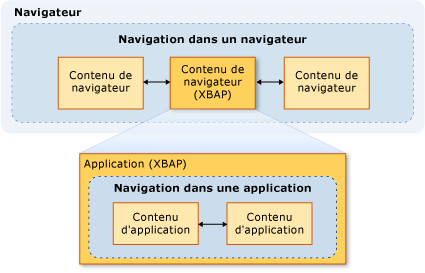

# Sécurité (WPF)
Lors du développement [!INCLUDE[TLA#tla_wpf](../../../includes/tlasharptla-wpf-md.md)] autonomes et des applications hébergées par un navigateur, vous devez prendre en compte le modèle de sécurité. [!INCLUDE[TLA2#tla_wpf](../../../includes/tla2sharptla-wpf-md.md)]exécutent des applications autonomes avec des autorisations illimitées ( [!INCLUDE[TLA2#tla_cas](../../../includes/tla2sharptla-cas-md.md)] **FullTrust** jeu d’autorisations), qu’il soit déployé à l’aide de Windows Installer (.msi), XCopy, ou [!INCLUDE[TLA2#tla_clickonce](../../../includes/tla2sharptla-clickonce-md.md)]. Le déploiement d’applications WPF autonomes de confiance partielle avec ClickOnce n’est pas pris en charge. Toutefois, une application hôte de niveau de confiance totale peut créer un niveau de confiance partiel <xref:System.AppDomain> à l’aide du modèle de complément .NET Framework. Pour plus d’informations, consultez [vue d’ensemble des compléments WPF](../../../docs/framework/wpf/app-development/wpf-add-ins-overview.md).  
  
 [!INCLUDE[TLA2#tla_wpf](../../../includes/tla2sharptla-wpf-md.md)]les applications hébergées par un navigateur sont hébergées par [!INCLUDE[TLA#tla_iegeneric](../../../includes/tlasharptla-iegeneric-md.md)] ou Firefox, et peut être [!INCLUDE[TLA#tla_xbap#plural](../../../includes/tlasharptla-xbapsharpplural-md.md)] ou mal [!INCLUDE[TLA#tla_xaml](../../../includes/tlasharptla-xaml-md.md)] des documents pour plus d’informations, consultez [vue d’ensemble des Applications de navigateur XAML WPF](../../../docs/framework/wpf/app-development/wpf-xaml-browser-applications-overview.md).  
  
 [!INCLUDE[TLA2#tla_wpf](../../../includes/tla2sharptla-wpf-md.md)]les applications hébergées par un navigateur s’exécutent dans un bac à sable de la sécurité de confiance partielle, par défaut, qui est limité à la valeur par défaut [!INCLUDE[TLA2#tla_cas](../../../includes/tla2sharptla-cas-md.md)] **Internet** jeu d’autorisations de zone. Cela permet d’isoler efficacement [!INCLUDE[TLA2#tla_wpf](../../../includes/tla2sharptla-wpf-md.md)] les applications hébergées par un navigateur à partir de l’ordinateur client de la même façon que vous attendez pour des applications Web classiques. Une application XBAP peut élever des privilèges jusqu’à la confiance totale, selon la zone de sécurité de l’URL de déploiement et la configuration de sécurité du client. Pour plus d’informations, consultez [Sécurité de confiance partielle de WPF](../../../docs/framework/wpf/wpf-partial-trust-security.md).  
  
 Cette rubrique décrit le modèle de sécurité pour [!INCLUDE[TLA#tla_wpf](../../../includes/tlasharptla-wpf-md.md)] autonomes et des applications hébergées par le navigateur.  
  
 Cette rubrique contient les sections suivantes :  
  
-   [Sécurité de la navigation](#SafeTopLevelNavigation)  
  
-   [Paramètres de sécurité des logiciels de navigation web](#InternetExplorerSecuritySettings)  
  
-   [Contrôle WebBrowser et contrôles de fonctionnalités](#webbrowser_control_and_feature_controls)  
  
-   [Désactivation des assemblys APTCA pour les applications clientes partiellement fiables](#APTCA)  
  
-   [Comportement de bac à sable pour les fichiers en XAML libre](#LooseContentSandboxing)  
  
-   [Ressources pour le développement d’applications WPF promouvant la sécurité](#BestPractices)  
  
   
## Sécurité de la navigation  
 Pour [!INCLUDE[TLA2#tla_xbap#plural](../../../includes/tla2sharptla-xbapsharpplural-md.md)], [!INCLUDE[TLA2#tla_wpf](../../../includes/tla2sharptla-wpf-md.md)] distingue deux types de navigation : application et le navigateur.  
  
 La *navigation dans une application* est la navigation entre les éléments de contenu dans une application hébergée par un navigateur. La *navigation dans un navigateur* est la navigation qui modifie l’URL de contenu et d’emplacement d’un navigateur lui-même. La relation entre la navigation dans l’application (en général XAML) et la navigation dans un navigateur (généralement HTML) est indiquée dans l’illustration suivante :
  
   
  
 Le type de contenu est considéré comme sûr pour un [!INCLUDE[TLA2#tla_xbap](../../../includes/tla2sharptla-xbap-md.md)] à atteindre est déterminée principalement par si navigation dans l’application ou la navigation dans un navigateur est utilisée.  
  
   
### Sécurité de la navigation dans une application  
 Navigation dans l’application est considérée comme sécurisée si elle peut être identifiée avec un pack [!INCLUDE[TLA2#tla_uri](../../../includes/tla2sharptla-uri-md.md)], qui prend en charge quatre types de contenu :  
  
|Type de contenu|Description|Exemple d’URI|  
|------------------|-----------------|-----------------|  
|Ressource|Les fichiers qui sont ajoutés à un projet avec un type de build **ressources**.|`pack://application:,,,/MyResourceFile.xaml`|  
|Contenu|Les fichiers qui sont ajoutés à un projet avec un type de build **contenu**.|`pack://application:,,,/MyContentFile.xaml`|  
|Site d’origine|Les fichiers qui sont ajoutés à un projet avec un type de build **aucun**.|`pack://siteoforigin:,,,/MySiteOfOriginFile.xaml`|  
|Code de l’application|Ressources XAML avec un code-behind compilé.   - ou -   Fichiers XAML qui sont ajoutés à un projet avec un type de build **Page**.|`pack://application:,,,/MyResourceFile` `.xaml`|  
  
> [!NOTE]
>  Pour plus d’informations sur les fichiers de données d’application et de pack [!INCLUDE[TLA2#tla_uri#plural](../../../includes/tla2sharptla-urisharpplural-md.md)], consultez [ressource d’Application WPF, contenu et les fichiers de données](../../../docs/framework/wpf/app-development/wpf-application-resource-content-and-data-files.md).  
  
 Les fichiers ayant ces types de contenu sont accessibles par l’utilisateur et par programme :  
  
-   **Navigation utilisateur**. L’utilisateur navigue en cliquant sur un <xref:System.Windows.Documents.Hyperlink> élément.  
  
-   **Navigation par programme**. L’application navigue sans impliquer l’utilisateur, par exemple, en définissant le <xref:System.Windows.Navigation.NavigationWindow.Source%2A?displayProperty=nameWithType> propriété.  
  
   
### Sécurité de la navigation dans un navigateur  
 La navigation dans un navigateur est considérée comme sûre uniquement si les conditions suivantes sont respectées :  
  
-   **Navigation utilisateur**. L’utilisateur navigue en cliquant sur un <xref:System.Windows.Documents.Hyperlink> élément situé dans le principal <xref:System.Windows.Navigation.NavigationWindow>, et non dans une liste imbriquée <xref:System.Windows.Controls.Frame>.  
  
-   **Zone**. Le contenu cible de la navigation se trouve sur Internet ou sur l’intranet local.  
  
-   **Protocole**. Le protocole utilisé est soit **http**, **https**, **fichier**, ou **mailto**.  
  
 Si un [!INCLUDE[TLA2#tla_xbap](../../../includes/tla2sharptla-xbap-md.md)] tente d’accéder au contenu d’une manière qui n’est pas conforme à ces conditions, un <xref:System.Security.SecurityException> est levée.  
  
   
## Paramètres de sécurité des logiciels de navigation web  
 Les paramètres de sécurité de votre ordinateur déterminent l’accès accordé à n’importe quel logiciel de navigation web. Logiciel de navigation Web inclut toute application ou composant qui utilise le [WinINet](http://go.microsoft.com/fwlink/?LinkId=179379) ou [UrlMon](http://go.microsoft.com/fwlink/?LinkId=179383) API, y compris Internet Explorer et PresentationHost.exe.  
  
 [!INCLUDE[TLA2#tla_iegeneric](../../../includes/tla2sharptla-iegeneric-md.md)]fournit un mécanisme par lequel vous pouvez configurer les fonctionnalités qui ne peut être exécutée en ou à partir de [!INCLUDE[TLA2#tla_iegeneric](../../../includes/tla2sharptla-iegeneric-md.md)], notamment les suivantes :  
  
-   Composants dépendant du [!INCLUDE[TLA2#tla_winfx](../../../includes/tla2sharptla-winfx-md.md)]  
  
-   Plug-ins et contrôles ActiveX  
  
-   Téléchargements  
  
-   Scripts  
  
-   Authentification utilisateur  
  
 La collection de fonctionnalités qui peuvent être sécurisées de cette façon est configurée sur une base par zone pour le **Internet**, **Intranet**, **Sites de confiance**, et  **Sites sensibles** zones. Les étapes suivantes décrivent comment configurer vos paramètres de sécurité :  
  
1.  Ouvrez le **Panneau de configuration**.  
  
2.  Cliquez sur **réseau et Internet** puis cliquez sur **Options Internet**.  
  
     La boîte de dialogue Options Internet apparaît.  
  
3.  Sur le **sécurité** , sélectionnez la zone à configurer les paramètres de sécurité.  
  
4.  Cliquez sur le **niveau personnalisé** bouton.  
  
     Le **paramètres de sécurité** boîte de dialogue s’affiche et vous pouvez configurer les paramètres de sécurité pour la zone sélectionnée.  
  
       
  
> [!NOTE]
>  Vous pouvez également accéder à la boîte de dialogue Options Internet à partir d’Internet Explorer. Cliquez sur **outils** puis cliquez sur **Options Internet**.  
  
 En commençant par [!INCLUDE[TLA#tla_ie7](../../../includes/tlasharptla-ie7-md.md)], paramètres de sécurité suivants, en particulier pour [!INCLUDE[TLA2#tla_winfx](../../../includes/tla2sharptla-winfx-md.md)] sont incluses :  
  
-   **XAML libre**. Contrôles si [!INCLUDE[TLA2#tla_iegeneric](../../../includes/tla2sharptla-iegeneric-md.md)] peut atteindre et perdre [!INCLUDE[TLA2#tla_xaml](../../../includes/tla2sharptla-xaml-md.md)] fichiers. (Options Activer, Désactiver et Demander).  
  
-   **Applications du navigateur XAML**. Contrôles si [!INCLUDE[TLA2#tla_iegeneric](../../../includes/tla2sharptla-iegeneric-md.md)] peuvent accéder à et exécuter [!INCLUDE[TLA2#tla_xbap#plural](../../../includes/tla2sharptla-xbapsharpplural-md.md)]. (Options Activer, Désactiver et Demander).  
  
 Par défaut, ces paramètres sont tous activés pour le **Internet**, **intranet Local**, et **sites de confiance** zones, mais désactivé pour le **sites sensibles**  zone.  
  
   
### Paramètres du Registre WPF relatifs à la sécurité  
 Outre les paramètres de sécurité disponibles avec les options Internet, les valeurs de Registre suivantes sont disponibles pour le blocage sélectif de certaines fonctionnalités WPF liées à la sécurité. Les valeurs sont définies sous la clé suivante :  
  
 `HKEY_LOCAL_MACHINE\SOFTWARE\Microsoft\.NETFramework\Windows Presentation Foundation\Features`  
  
 Le tableau ci-dessous répertorie les valeurs qui peuvent être définies.  
  
|Nom de la valeur|Type valeur|Données de la valeur|  
|----------------|----------------|----------------|  
|XBAPDisallow|REG_DWORD|1 pour interdire ; 0 pour autoriser.|  
|LooseXamlDisallow|REG_DWORD|1 pour interdire ; 0 pour autoriser.|  
|WebBrowserDisallow|REG_DWORD|1 pour interdire ; 0 pour autoriser.|  
|MediaAudioDisallow|REG_DWORD|1 pour interdire ; 0 pour autoriser.|  
|MediaImageDisallow|REG_DWORD|1 pour interdire ; 0 pour autoriser.|  
|MediaVideoDisallow|REG_DWORD|1 pour interdire ; 0 pour autoriser.|  
|ScriptInteropDisallow|REG_DWORD|1 pour interdire ; 0 pour autoriser.|  
  
   
## Contrôle WebBrowser et contrôles de fonctionnalités  
 WPF <xref:System.Windows.Controls.WebBrowser> contrôle peut être utilisé pour héberger le contenu Web. WPF <xref:System.Windows.Controls.WebBrowser> contrôle encapsule le contrôle WebBrowser ActiveX sous-jacent. WPF fournit une prise en charge pour la sécurisation de votre application lorsque vous utilisez le format WPF <xref:System.Windows.Controls.WebBrowser> du contrôle hôte non approuvé de contenu Web. Toutefois, certaines fonctionnalités de sécurité doivent être directement appliquées par les applications à l’aide de la <xref:System.Windows.Controls.WebBrowser> contrôle. Pour plus d’informations sur le contrôle WebBrowser ActiveX, consultez [vues d’ensemble du contrôle WebBrowser et didacticiels](http://go.microsoft.com/fwlink/?LinkId=179388).  
  
> [!NOTE]
>  Cette section s’applique également à la <xref:System.Windows.Controls.Frame> contrôler, car elle utilise le <xref:System.Windows.Controls.WebBrowser> pour accéder au contenu HTML.  
  
 Si le WPF <xref:System.Windows.Controls.WebBrowser> contrôle est utilisé pour héberger le contenu Web non fiable, votre application doit utiliser un niveau de confiance partiel <xref:System.AppDomain> pour permettre d’isoler votre code d’application à partir du code de script HTML potentiellement malveillant. Cela est particulièrement vrai si votre application interagit avec le script hébergé à l’aide de la <xref:System.Windows.Controls.WebBrowser.InvokeScript%2A> (méthode) et le <xref:System.Windows.Controls.WebBrowser.ObjectForScripting%2A> propriété. Pour plus d’informations, consultez [vue d’ensemble des compléments WPF](../../../docs/framework/wpf/app-development/wpf-add-ins-overview.md).  
  
 Si votre application utilise le format WPF <xref:System.Windows.Controls.WebBrowser> contrôle, un autre pour renforcer la sécurité et d’atténuer les attaques consiste à activer les contrôles de fonctionnalité d’Internet Explorer. Contrôles de fonctionnalités sont des ajouts à Internet Explorer qui permettent aux administrateurs et aux développeurs de configurer les fonctionnalités d’Internet Explorer et les applications qui hébergent le contrôle WebBrowser ActiveX, lequel WPF <xref:System.Windows.Controls.WebBrowser> inclut dans un wrapper de contrôle. Contrôles de fonctionnalité peuvent être configurés à l’aide de la [CoInternetSetFeatureEnabled](http://go.microsoft.com/fwlink/?LinkId=179394) (fonction) ou en modifiant les valeurs dans le Registre. Pour plus d’informations sur les contrôles de fonctionnalité, consultez [Introduction aux contrôles de fonctionnalité](http://go.microsoft.com/fwlink/?LinkId=179390) et [contrôles de fonctionnalités Internet](http://go.microsoft.com/fwlink/?LinkId=179392).  
  
 Si vous développez une application WPF autonome qui utilise le format WPF <xref:System.Windows.Controls.WebBrowser> contrôle, WPF active automatiquement les contrôles de fonctionnalités suivants pour votre application.  
  
|Contrôle de fonctionnalité|  
|---------------------|  
|FEATURE_MIME_HANDLING|  
|FEATURE_MIME_SNIFFING|  
|FEATURE_OBJECT_CACHING|  
|FEATURE_SAFE_BINDTOOBJECT|  
|FEATURE_WINDOW_RESTRICTIONS|  
|FEATURE_ZONE_ELEVATION|  
|FEATURE_RESTRICT_FILEDOWNLOAD|  
|FEATURE_RESTRICT_ACTIVEXINSTALL|  
|FEATURE_ADDON_MANAGEMENT|  
|FEATURE_HTTP_USERNAME_PASSWORD_DISABLE|  
|FEATURE_SECURITYBAND|  
|FEATURE_UNC_SAVEDFILECHECK|  
|FEATURE_VALIDATE_NAVIGATE_URL|  
|FEATURE_DISABLE_TELNET_PROTOCOL|  
|FEATURE_WEBOC_POPUPMANAGEMENT|  
|FEATURE_DISABLE_LEGACY_COMPRESSION|  
|FEATURE_SSLUX|  
  
 Étant donné que ces contrôles de fonctionnalités sont activés sans condition, ils peuvent perturber une application de confiance totale. Dans ce cas, s’il n’existe aucun risque de sécurité pour l’application spécifique et le contenu qu’elle héberge, le contrôle de fonctionnalité correspondant peut être désactivé.  
  
 Contrôles de fonctionnalités sont appliquées par le processus d’instanciation de l’objet WebBrowser ActiveX. Par conséquent, si vous créez une application autonome qui peut accéder à un contenu non approuvé, vous devez sérieusement envisager d’activer des contrôles de fonctionnalités supplémentaires.  
  
> [!NOTE]
>  Cette recommandation est basée sur les recommandations générales sur la sécurité des hôtes MSHTML et SHDOCVW. Pour plus d’informations, consultez [FAQ sur la sécurité hôte de MSHTML : partie I, II](http://go.microsoft.com/fwlink/?LinkId=179396) et [FAQ sur la sécurité hôte de MSHTML : partie II sur II](http://go.microsoft.com/fwlink/?LinkId=179415).  
  
 Pour votre fichier exécutable, envisagez d’activer les contrôles de fonctionnalités suivants en définissant la valeur de Registre sur 1.  
  
|Contrôle de fonctionnalité|  
|---------------------|  
|FEATURE_ACTIVEX_REPURPOSEDETECTION|  
|FEATURE_BLOCK_LMZ_IMG|  
|FEATURE_BLOCK_LMZ_OBJECT|  
|FEATURE_BLOCK_LMZ_SCRIPT|  
|FEATURE_RESTRICT_RES_TO_LMZ|  
|FEATURE_RESTRICT_ABOUT_PROTOCOL_IE7|  
|FEATURE_SHOW_APP_PROTOCOL_WARN_DIALOG|  
|FEATURE_LOCALMACHINE_LOCKDOWN|  
|FEATURE_FORCE_ADDR_AND_STATUS|  
|FEATURE_RESTRICTED_ZONE_WHEN_FILE_NOT_FOUND|  
  
 Pour votre fichier exécutable, envisagez de désactiver le contrôle de fonctionnalité suivant en définissant la valeur de Registre sur 0.  
  
|Contrôle de fonctionnalité|  
|---------------------|  
|FEATURE_ENABLE_SCRIPT_PASTE_URLACTION_IF_PROMPT|  
  
 Si vous exécutez un niveau de confiance partiel [!INCLUDE[TLA#tla_xbap](../../../includes/tlasharptla-xbap-md.md)] qui inclut un WPF <xref:System.Windows.Controls.WebBrowser> contrôler dans [!INCLUDE[TLA#tla_iegeneric](../../../includes/tlasharptla-iegeneric-md.md)], WPF héberge le contrôle WebBrowser ActiveX dans l’espace d’adressage du processus Internet Explorer. Étant donné que le contrôle WebBrowser ActiveX est hébergé dans le [!INCLUDE[TLA2#tla_iegeneric](../../../includes/tla2sharptla-iegeneric-md.md)] processus, tous les contrôles de fonctionnalités pour Internet Explorer sont également activés pour le contrôle WebBrowser ActiveX.  
  
 Les applications XBAP exécutées dans Internet Explorer bénéficient également d’un niveau de sécurité supplémentaire par rapport aux applications autonomes normales. Cette sécurité supplémentaire est comme Internet Explorer et par conséquent, le contrôle WebBrowser ActiveX, s’exécute en protégé en mode par défaut sur [!INCLUDE[TLA#tla_winvista](../../../includes/tlasharptla-winvista-md.md)] et [!INCLUDE[win7](../../../includes/win7-md.md)]. Pour plus d’informations sur le mode protégé, consultez [comprendre et utiliser dans Internet Explorer en Mode protégé](http://go.microsoft.com/fwlink/?LinkId=179393).  
  
> [!NOTE]
>  Si vous essayez d’exécuter une application XBAP qui inclut un WPF <xref:System.Windows.Controls.WebBrowser> contrôle dans Firefox, dans la zone Internet, un <xref:System.Security.SecurityException> sera levée. conformément à la stratégie de sécurité de WPF.  
  
   
## Désactivation des assemblys APTCA pour les applications clientes partiellement fiables  
 Si les assemblys managés sont installés dans le [!INCLUDE[TLA#tla_gac](../../../includes/tlasharptla-gac-md.md)], elles sont entièrement fiables, car l’utilisateur doit fournir une autorisation explicite pour les installer. Dans la mesure où ils sont entièrement fiables, seules les applications clientes managées entièrement fiables peuvent les utiliser. Pour autoriser les applications de confiance partielle pour les utiliser, ils doivent être marqués avec le <xref:System.Security.AllowPartiallyTrustedCallersAttribute> (APTCA). Seuls les assemblys dont la sécurité d’exécution a été testée pour une confiance partielle doivent être marqués avec cet attribut.  
  
 Toutefois, il est possible qu’un assembly APTCA présente une faille de sécurité après avoir été installé dans le [!INCLUDE[TLA2#tla_gac](../../../includes/tla2sharptla-gac-md.md)]. Lorsqu’une faille de sécurité est découverte, les éditeurs d’assembly peuvent produire une mise à jour de sécurité pour résoudre le problème sur les installations existantes et pour assurer une protection vis-à-vis des installations effectuées après la détection du problème. Pour la mise à jour, une option consiste à désinstaller l’assembly, bien que cela risque de bloquer d’autres applications clientes entièrement fiables qui utilisent l’assembly.  
  
 [!INCLUDE[TLA2#tla_wpf](../../../includes/tla2sharptla-wpf-md.md)]fournit un mécanisme par lequel un assembly APTCA peut être désactivé pour partiellement approuvé [!INCLUDE[TLA2#tla_xbap#plural](../../../includes/tla2sharptla-xbapsharpplural-md.md)] sans désinstaller l’assembly APTCA.  
  
 Pour désactiver un assembly APTCA, vous devez créer une clé de Registre spéciale :  
  
 `HKEY_LOCAL_MACHINE\SOFTWARE\Microsoft\.NETFramework\policy\APTCA\<AssemblyFullName>, FileVersion=<AssemblyFileVersion>`  
  
 Un exemple est fourni ci-après :  
  
 `HKEY_LOCAL_MACHINE\SOFTWARE\Microsoft\.NETFramework\policy\APTCA\aptcagac, Version=1.0.0.0, Culture=neutral, PublicKeyToken=215e3ac809a0fea7, FileVersion=1.0.0.0`  
  
 Cette clé établit une entrée pour l’assembly APTCA. Vous devez également créer une valeur dans cette clé, qui active ou désactive l’assembly. Voici les détails de la valeur :  
  
-   Nom de la valeur : **APTCA_FLAG**.  
  
-   Type de valeur : **REG_DWORD**.  
  
-   Données de la valeur : **1** pour désactiver ; **0** à activer.  
  
 Si un assembly doit être désactivé pour des applications clientes partiellement fiables, vous pouvez écrire une mise à jour qui crée la clé de Registre et la valeur.  
  
> [!NOTE]
>  Core [!INCLUDE[TLA2#tla_winfx](../../../includes/tla2sharptla-winfx-md.md)] assemblys ne sont pas affectés par leur désactivation de cette façon, car ils sont requis pour exécuter des applications managées. La prise en charge de la désactivation des assemblys APTCA est principalement destinée aux applications tierces.  
  
   
## Comportement de bac à sable pour les fichiers en XAML libre  
 Faible [!INCLUDE[TLA2#tla_xaml](../../../includes/tla2sharptla-xaml-md.md)] fichiers sont des fichiers XAML de balisage uniquement qui ne dépendent pas de n’importe quel code-behind, le Gestionnaire d’événements ou l’assembly spécifique à l’application. Perdre lorsque [!INCLUDE[TLA2#tla_xaml](../../../includes/tla2sharptla-xaml-md.md)] accède aux fichiers directement à partir du navigateur, ils sont chargés dans un sandbox de sécurité basé sur le jeu d’autorisations zone Internet par défaut.  
  
 Toutefois, le comportement de sécurité est différent lors de la faible [!INCLUDE[TLA2#tla_xaml](../../../includes/tla2sharptla-xaml-md.md)] accède aux fichiers à partir de l’un <xref:System.Windows.Navigation.NavigationWindow> ou <xref:System.Windows.Controls.Frame> dans une application autonome.  
  
 Dans les deux cas, les pertes de connexion [!INCLUDE[TLA2#tla_xaml](../../../includes/tla2sharptla-xaml-md.md)] fichier est accédé à hérite des autorisations de son application hôte. Toutefois, ce comportement peut être pas souhaitable du point de vue de la sécurité, en particulier si libre [!INCLUDE[TLA2#tla_xaml](../../../includes/tla2sharptla-xaml-md.md)] fichier a été généré par une entité qui est inconnue ou non fiable. Ce type de contenu est appelé *contenu externe*, alors que les <xref:System.Windows.Controls.Frame> et <xref:System.Windows.Navigation.NavigationWindow> peuvent être configurés pour isoler, lors de la navigation. L’isolation est obtenue en définissant le **SandboxExternalContent** propriété sur true, comme indiqué dans les exemples suivants pour <xref:System.Windows.Controls.Frame> et <xref:System.Windows.Navigation.NavigationWindow>:  
  
 [!code-xaml[SecurityOverviewSnippets#FrameMARKUP](../../../samples/snippets/csharp/VS_Snippets_Wpf/SecurityOverviewSnippets/CS/Window2.xaml#framemarkup)]  
  
 [!code-xaml[SecurityOverviewSnippets#NavigationWindowMARKUP](../../../samples/snippets/csharp/VS_Snippets_Wpf/SecurityOverviewSnippets/CS/Window1.xaml#navigationwindowmarkup)]  
  
 Avec ce paramétrage, le contenu externe sera chargé dans un processus distinct du processus qui héberge l’application. Ce processus, limité au jeu d’autorisations de la zone Internet par défaut, l’isole efficacement de l’application d’hébergement et de l’ordinateur client.  
  
> [!NOTE]
>  Bien que la navigation vers un [!INCLUDE[TLA2#tla_xaml](../../../includes/tla2sharptla-xaml-md.md)] fichiers à partir de l’un <xref:System.Windows.Navigation.NavigationWindow> ou <xref:System.Windows.Controls.Frame> dans une autonome application est implémentée selon le navigateur WPF qui héberge l’infrastructure, impliquant le processus PresentationHost, le niveau de sécurité est légèrement inférieure lorsque le contenu est chargé directement dans Internet Explorer sur [!INCLUDE[wiprlhext](../../../includes/wiprlhext-md.md)] et [!INCLUDE[win7](../../../includes/win7-md.md)] (qui serait toujours via PresentationHost). En effet, une application WPF autonome utilisant un navigateur web ne fournit pas la fonctionnalité de sécurité supplémentaire du mode protégé d’Internet Explorer.  
  
   
## Ressources pour le développement d’applications WPF promouvant la sécurité  
 Voici quelques ressources supplémentaires pour aider à développer [!INCLUDE[TLA2#tla_wpf](../../../includes/tla2sharptla-wpf-md.md)] les applications qui favorisent la sécurité :  
  
|Domaine|Ressource|  
|----------|--------------|  
|Code managé|[Index des directives, conseils et procédures de sécurité pour les applications](http://go.microsoft.com/fwlink/?LinkId=117426)|  
|[!INCLUDE[TLA2#tla_cas](../../../includes/tla2sharptla-cas-md.md)]|[Sécurité d’accès du code](../../../docs/framework/misc/code-access-security.md)|  
|[!INCLUDE[TLA2#tla_clickonce](../../../includes/tla2sharptla-clickonce-md.md)]|[Sécurité et déploiement ClickOnce](/visualstudio/deployment/clickonce-security-and-deployment)|  
|[!INCLUDE[TLA2#tla_wpf](../../../includes/tla2sharptla-wpf-md.md)]|[Sécurité de confiance partielle de WPF](../../../docs/framework/wpf/wpf-partial-trust-security.md)|  
  
## Voir aussi  
 [Sécurité de confiance partielle de WPF](../../../docs/framework/wpf/wpf-partial-trust-security.md)  
 [Stratégie de sécurité de WPF - sécurité de la plateforme](../../../docs/framework/wpf/wpf-security-strategy-platform-security.md)  
 [Stratégie de sécurité de WPF - ingénierie de sécurité](../../../docs/framework/wpf/wpf-security-strategy-security-engineering.md)  
 [Index des directives, conseils et procédures de sécurité pour les applications](http://go.microsoft.com/fwlink/?LinkId=117426)  
 [Sécurité d’accès du code](../../../docs/framework/misc/code-access-security.md)  
 [Sécurité et déploiement ClickOnce](/visualstudio/deployment/clickonce-security-and-deployment)  
 [Vue d’ensemble du langage XAML (WPF)](../../../docs/framework/wpf/advanced/xaml-overview-wpf.md)
