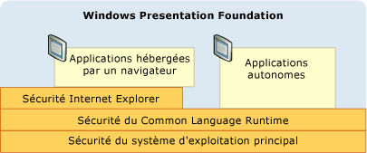
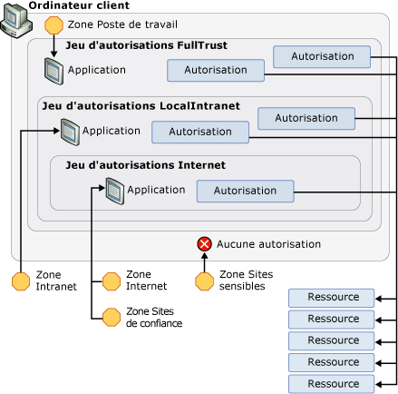

# Strat&#233;gie de s&#233;curit&#233; de WPF&#160;- ing&#233;nierie de la plateforme
Bien que [!INCLUDE[TLA#tla_wpf](../../../includes/tlasharptla-wpf-md.md)] fournisse divers services de sécurité, il tire aussi parti des fonctionnalités de sécurité de la plateforme sous\-jacente, qui inclut le système d'exploitation, le [!INCLUDE[TLA2#tla_clr](../../../includes/tla2sharptla-clr-md.md)] et [!INCLUDE[TLA2#tla_ie](../../../includes/tla2sharptla-ie-md.md)].  Ces couches se combinent pour fournir à [!INCLUDE[TLA2#tla_wpf](../../../includes/tla2sharptla-wpf-md.md)] un modèle de sécurité de défense en profondeur renforcé qui essaie d'éviter le moindre point de défaillance, comme cela est illustré dans l'image suivante :  
  
   
  
 Le reste de cette rubrique traite des fonctionnalités dans chacune de ces couches qui concernent plus particulièrement [!INCLUDE[TLA2#tla_wpf](../../../includes/tla2sharptla-wpf-md.md)].  
  
   
  
   
## Sécurité du système d'exploitation  
 Le niveau minimal de système d'exploitation exigé par [!INCLUDE[TLA2#tla_wpf](../../../includes/tla2sharptla-wpf-md.md)] est [!INCLUDE[TLA2#tla_winxpsp2](../../../includes/tla2sharptla-winxpsp2-md.md)].  Le cœur de [!INCLUDE[TLA2#tla_winxpsp2](../../../includes/tla2sharptla-winxpsp2-md.md)] fournit plusieurs fonctionnalités de sécurité qui constituent la base de sécurité de toutes les applications [!INCLUDE[TLA2#tla_win](../../../includes/tla2sharptla-win-md.md)], y compris celles créées avec [!INCLUDE[TLA2#tla_wpf](../../../includes/tla2sharptla-wpf-md.md)].  [!INCLUDE[TLA#tla_longhorn](../../../includes/tlasharptla-longhorn-md.md)] intègre les fonctionnalités de sécurité de [!INCLUDE[TLA2#tla_wpf](../../../includes/tla2sharptla-wpf-md.md)] et les étend.  Cette rubrique traite de l'ampleur de ces fonctionnalités de sécurité qui sont importantes pour [!INCLUDE[TLA2#tla_wpf](../../../includes/tla2sharptla-wpf-md.md)], ainsi que de la manière dont [!INCLUDE[TLA2#tla_wpf](../../../includes/tla2sharptla-wpf-md.md)] les intègre pour offrir une défense en profondeur supplémentaire.  
  
   
### Microsoft Windows XP Service Pack 2 \(SP2\)  
 Outre un tour d'horizon général et le renforcement de [!INCLUDE[TLA2#tla_win](../../../includes/tla2sharptla-win-md.md)], trois fonctionnalités clés de [!INCLUDE[TLA2#tla_winxpsp2](../../../includes/tla2sharptla-winxpsp2-md.md)] seront abordées dans cette rubrique :  
  
-   Compilation \/GS  
  
-   [!INCLUDE[TLA#tla_win_update](../../../includes/tlasharptla-win-update-md.md)].  
  
#### Compilation \/GS  
 [!INCLUDE[TLA2#tla_winxpsp2](../../../includes/tla2sharptla-winxpsp2-md.md)] offre une protection en recompilant de nombreuses bibliothèques système de base, notamment toutes les dépendances [!INCLUDE[TLA2#tla_wpf](../../../includes/tla2sharptla-wpf-md.md)] telles que le [!INCLUDE[TLA2#tla_clr](../../../includes/tla2sharptla-clr-md.md)], pour aider à atténuer les dépassements de mémoire tampon.  Cela est accompli en utilisant le paramètre \/GS avec le compilateur de ligne de commande C\/C\+\+.  Même s'il est clairement préférable d'éviter les dépassements de mémoire, la compilation \/GS fournit un exemple de défense en profondeur contre les vulnérabilités potentielles qui sont créées par inadvertance ou par malveillance par ces derniers.  
  
 Historiquement, les dépassements de mémoire tampon ont été la cause de nombreuses attaques de sécurité à fort impact.  Un dépassement de mémoire tampon se produit quand un intrus tire parti d'une vulnérabilité de code qui autorise l'injection de code malveillant qui écrit au\-delà des limites d'une mémoire tampon.  Cela permet ensuite à un intrus de détourner le processus dans lequel s'exécute le code en remplaçant l'adresse de retour d'une fonction pour provoquer l'exécution du code de l'intrus.  Le résultat est un code malveillant qui exécute du code arbitraire avec les mêmes privilèges que le processus détourné.  
  
 À un niveau élevé, l'indicateur de compilateur \/GS protège contre quelques dépassements de mémoire tampon potentiels en injectant un cookie de sécurité spécial pour protéger l'adresse de retour d'une fonction qui a des mémoires tampon de chaînes locales.  Après le retour d'une fonction, le cookie de sécurité est comparé à sa valeur précédente.  Si la valeur a changé, cela signifie qu'un dépassement de mémoire tampon a pu se produire et le processus est arrêté avec une condition d'erreur.  L'arrêt du processus empêche l'exécution de code potentiellement malveillant.  Consultez [\/GS \(Vérification de la sécurité de la mémoire tampon\)](http://msdn.microsoft.com/library/8dbf701c.aspx) pour plus de détails.  
  
 [!INCLUDE[TLA2#tla_wpf](../../../includes/tla2sharptla-wpf-md.md)] est compilé avec l'indicateur \/GS pour ajouter encore une autre couche de défense aux applications [!INCLUDE[TLA2#tla_wpf](../../../includes/tla2sharptla-wpf-md.md)].  
  
#### Améliorations de Microsoft Windows Update  
 [!INCLUDE[TLA#tla_win_update](../../../includes/tlasharptla-win-update-md.md)] a aussi été amélioré dans [!INCLUDE[TLA2#tla_winxpsp2](../../../includes/tla2sharptla-winxpsp2-md.md)] pour simplifier le processus de téléchargement et d'installation des mises à jour.  Ces modifications améliorent considérablement la sécurité pour les clients [!INCLUDE[TLA2#tla_wpf](../../../includes/tla2sharptla-wpf-md.md)] en s'assurant que leurs systèmes sont à jour, en particulier en ce qui concerne les mises à jour de sécurité.  
  
   
### Windows Vista  
 Les utilisateurs [!INCLUDE[TLA2#tla_wpf](../../../includes/tla2sharptla-wpf-md.md)] sur [!INCLUDE[TLA#tla_longhorn](../../../includes/tlasharptla-longhorn-md.md)] bénéficieront des améliorations de sécurité supplémentaires du système d'exploitation, y compris l'« accès utilisateur de moindre privilège », les contrôles d'intégrité du code et l'isolation des privilèges.  
  
#### Contrôle de compte d'utilisateur \(UAC\)  
 Aujourd'hui, les utilisateurs [!INCLUDE[TLA2#tla_win](../../../includes/tla2sharptla-win-md.md)] ont tendance à travailler avec des privilèges d'administrateur, car de nombreuses applications en ont besoin pour l'installation, l'exécution ou les deux à la fois.  Le fait de pouvoir écrire les paramètres d'application par défaut dans le Registre en est un exemple.  
  
 Une exécution avec des privilèges d'administrateur signifie en réalité que les applications s'exécutent à partir de processus auxquels sont accordés des privilèges d'administrateur.  L'impact de cela sur la sécurité est que tout code malveillant qui détourne un processus s'exécutant avec des privilèges d'administrateur héritera automatiquement de ces privilèges, y compris l'accès aux ressources système critiques.  
  
 Une façon de se protéger contre cette menace de sécurité est d'exécuter les applications avec le moins de privilèges requis.  C'est ce que l'on appelle le principe du moindre privilège, qui est une fonctionnalité de base du système d'exploitation [!INCLUDE[TLA#tla_longhorn](../../../includes/tlasharptla-longhorn-md.md)].  Cette fonctionnalité est appelée Contrôle de compte d'utilisateur \(UAC\) et est utilisée par [!INCLUDE[TLA#tla_longhorn](../../../includes/tlasharptla-longhorn-md.md)] de deux façons principales :  
  
-   Pour exécuter la plupart des applications avec les privilèges de contrôle de compte d'utilisateur par défaut, même si l'utilisateur est administrateur ; seules les applications qui ont besoin de privilèges d'administrateur s'exécuteront avec les privilèges d'administrateur.  Pour s'exécuter avec des privilèges d'administrateur, les applications doivent être marquées explicitement dans leur manifeste d'application ou comme entrée dans la stratégie de sécurité.  
  
-   Pour fournir des solutions de compatibilité comme la virtualisation.  Par exemple, de nombreuses applications tentent d'écrire dans des emplacements restreints comme C:\\Program Files.  Pour les applications s'exécutant sous contrôle de compte d'utilisateur, il existe un autre emplacement par utilisateur dans lequel les opérations d'écriture ne nécessitent pas de privilèges d'administrateur.  Pour les applications s'exécutant sous contrôle de compte d'utilisateur, cette fonctionnalité virtualise C:\\Program Files de sorte que les applications qui pensent écrire à cet emplacement écrivent en réalité à l'autre emplacement utilisateur.  Ce type de travail de compatibilité permet au système d'exploitation d'exécuter de nombreuses applications qui ne pouvaient pas s'exécuter précédemment dans le contrôle de compte d'utilisateur.  
  
#### Contrôles d'intégrité du code  
 [!INCLUDE[TLA#tla_longhorn](../../../includes/tlasharptla-longhorn-md.md)] incorpore des contrôles d'intégrité du code plus approfondis pour éviter que le code malveillant soit injecté dans les fichiers système ou dans le noyau au moment du chargement\/exécution.  Cela va au\-delà de la protection des fichiers système.  
  
   
### Processus de droits limités pour les applications hébergées par un navigateur  
 Les applications [!INCLUDE[TLA2#tla_wpf](../../../includes/tla2sharptla-wpf-md.md)] hébergées par un navigateur s'exécutent dans le bac à sable \(sandbox\) de la zone Internet.  L'intégration de [!INCLUDE[TLA2#tla_wpf](../../../includes/tla2sharptla-wpf-md.md)] à [!INCLUDE[TLA#tla_ie](../../../includes/tlasharptla-ie-md.md)] étend cette protection avec une prise en charge supplémentaire.  
  
#### Internet Explorer 6 Service Pack 2 et Internet Explorer 7 pour XP  
 [!INCLUDE[TLA2#tla_wpf](../../../includes/tla2sharptla-wpf-md.md)] tire parti de la sécurité du système d'exploitation en limitant les privilèges de processus pour les [!INCLUDE[TLA#tla_winfxwebapp#plural](../../../includes/tlasharptla-winfxwebappsharpplural-md.md)] en vue d'assurer une meilleure protection.  Avant le lancement d'une application [!INCLUDE[TLA2#tla_wpf](../../../includes/tla2sharptla-wpf-md.md)] hébergée par un navigateur, le système d'exploitation crée un processus hôte qui supprime les privilèges inutiles du jeton du processus.  Ainsi, le fait de pouvoir arrêter l'ordinateur de l'utilisateur, de charger des pilotes et d'accéder en lecture à tous les fichiers de l'ordinateur sont autant d'exemples de privilèges supprimés.  
  
#### Internet Explorer 7 pour Vista  
 Dans [!INCLUDE[TLA#tla_ie7](../../../includes/tlasharptla-ie7-md.md)], les applications [!INCLUDE[TLA2#tla_wpf](../../../includes/tla2sharptla-wpf-md.md)] s'exécutent en mode protégé.  En particulier, les [!INCLUDE[TLA#tla_xbap#plural](../../../includes/tlasharptla-xbapsharpplural-md.md)] s'exécutent avec une intégrité de niveau moyen.  
  
#### Couche de défense en profondeur  
 Sachant que les [!INCLUDE[TLA#tla_winfxwebapp#plural](../../../includes/tlasharptla-winfxwebappsharpplural-md.md)] sont généralement placées dans le bac à sable \(sandbox\) par le jeu d'autorisations de la zone Internet, la suppression de ces privilèges ne nuit pas aux [!INCLUDE[TLA#tla_winfxwebapp#plural](../../../includes/tlasharptla-winfxwebappsharpplural-md.md)] du point de vue de la compatibilité.  En revanche, une couche de défense en profondeur supplémentaire est créée. Si une application sandbox peut exploiter d'autres couches et détourner le processus, celui\-ci aura encore des privilèges limités.  
  
 Consultez [Utilisation d'un compte d'utilisateur à faibles privilèges](http://technet.microsoft.com/library/cc700846.aspx).  
  
   
## Sécurité du Common Language Runtime  
 Le [!INCLUDE[TLA#tla_clr](../../../includes/tlasharptla-clr-md.md)] offre plusieurs avantages de sécurité clés qui englobent la validation et la vérification, [!INCLUDE[TLA#tla_cas](../../../includes/tlasharptla-cas-md.md)] et la méthodologie de sécurité critique.  
  
   
### Validation et vérification  
 Pour assurer l'isolation et l'intégrité des assemblys, le [!INCLUDE[TLA2#tla_clr](../../../includes/tla2sharptla-clr-md.md)] utilise un processus de validation.  La validation du [!INCLUDE[TLA2#tla_clr](../../../includes/tla2sharptla-clr-md.md)] garantit que les assemblys sont isolés en validant leur format de fichier PE \(Portable Executable\) pour les adresses qui pointent à l'extérieur des assemblys.  De même, la validation du [!INCLUDE[TLA2#tla_clr](../../../includes/tla2sharptla-clr-md.md)] valide l'intégrité des métadonnées incorporées dans un assembly.  
  
 Pour garantir la cohérence des types, empêcher les problèmes de sécurité courants \(par exemple,  les dépassements de mémoire tampon\) et permettre le sandboxing via l'isolation de sous\-processus, la sécurité [!INCLUDE[TLA2#tla_clr](../../../includes/tla2sharptla-clr-md.md)] utilise le concept de vérification.  
  
 Les applications managées sont compilées en langage MSIL \(Microsoft Intermediate Language\).  Quand les méthodes d'une application managée sont exécutées, son code MSIL est compilé en code natif par le biais de la compilation juste\-à\-temps \(JIT\).  La compilation JIT inclut un processus de vérification qui applique de nombreuses règles de sécurité et de robustesse qui garantissent que le code :  
  
-   ne viole pas les contrats des types ;  
  
-   n'introduit pas de dépassements de mémoire tampon ;  
  
-   n'accède pas intensément à la mémoire.  
  
 Le code managé qui ne se conforme pas aux règles de vérification n'est pas autorisé à s'exécuter, à moins qu'il soit considéré comme un code approuvé.  
  
 L'avantage du code vérifiable est la raison essentielle pour laquelle [!INCLUDE[TLA2#tla_wpf](../../../includes/tla2sharptla-wpf-md.md)] s'appuie sur [!INCLUDE[TLA2#tla_winfx](../../../includes/tla2sharptla-winfx-md.md)].  Dans la mesure où du code vérifiable est utilisé, la possibilité d'exploiter des failles éventuelles est considérablement réduite.  
  
   
### Sécurité d'accès du code  
 Un ordinateur client expose une grande variété de ressources auxquelles une application managée peut avoir accès, notamment le système de fichiers, le Registre, les services d'impression, l'interface utilisateur, la réflexion et les variables d'environnement.  Pour pouvoir accéder aux ressources d'un ordinateur client, une application managée doit disposer de l'autorisation [!INCLUDE[TLA#tla_cas](../../../includes/tlasharptla-cas-md.md)] de [!INCLUDE[TLA2#tla_winfx](../../../includes/tla2sharptla-winfx-md.md)].  Dans [!INCLUDE[TLA2#tla_cas](../../../includes/tla2sharptla-cas-md.md)], une autorisation est une sous\-classe de <xref:System.Security.CodeAccessPermission> ; [!INCLUDE[TLA2#tla_cas](../../../includes/tla2sharptla-cas-md.md)] implémente une sous\-classe pour chaque ressource à laquelle les applications managées peuvent accéder.  
  
 L'ensemble des autorisations accordées à une application managée par [!INCLUDE[TLA2#tla_cas](../../../includes/tla2sharptla-cas-md.md)] quand elle commence à s'exécuter est appelé jeu d'autorisations et est déterminé par une preuve fournie par l'application.  Pour les applications [!INCLUDE[TLA2#tla_wpf](../../../includes/tla2sharptla-wpf-md.md)], la preuve fournie est l'emplacement, ou zone, à partir duquel les applications sont lancées.  [!INCLUDE[TLA2#tla_cas](../../../includes/tla2sharptla-cas-md.md)] identifie les zones suivantes :  
  
-   **Poste de travail** :  applications lancées à partir de l'ordinateur client \(entièrement fiable\).  
  
-   **Intranet local** :  applications lancées à partir de l'intranet  \(niveau de confiance moyen\).  
  
-   **Internet** :  applications lancées à partir d'Internet  \(niveau de confiance le plus faible\).  
  
-   **Sites de confiance** :  applications identifiées par un utilisateur comme dignes de confiance  \(niveau de confiance le plus faible\).  
  
-   **Sites non fiable** :  applications identifiées par un utilisateur comme étant non fiables  \(non approuvé\).  
  
 Pour chacune de ces zones, [!INCLUDE[TLA2#tla_cas](../../../includes/tla2sharptla-cas-md.md)] fournit un jeu d'autorisations prédéfini qui inclut les autorisations qui correspondent au niveau de confiance associé à chacune.  Elles incluent notamment :  
  
-   **FullTrust** :  pour les applications lancées à partir de la zone **Poste de travail**.  Toutes les autorisations possibles sont accordées.  
  
-   **LocalIntranet** :  pour les applications lancées à partir de la zone **Intranet local**.  Un sous\-ensemble d'autorisations est accordé pour fournir un accès modéré aux ressources d'un ordinateur client : emplacement de stockage isolé, accès illimité à l'interface utilisateur, accès illimité aux boîtes de dialogue de fichier, réflexion limitée et accès limité aux variables d'environnement.  Les autorisations permettant d'accéder aux ressources critiques comme le Registre ne sont pas fournies.  
  
-   **Internet** :  pour les applications lancées à partir de la zone **Internet** ou **Sites de confiance**.  Un sous\-ensemble d'autorisations est accordé pour octroyer un accès limité aux ressources d'un ordinateur client : emplacement de stockage isolé, ouverture des fichiers uniquement et interface utilisateur limitée.  En fait, ce jeu d'autorisations isole les applications de l'ordinateur client.  
  
 Les applications identifiées comme provenant de la zone **Sites non fiables** ne se voient accorder aucune autorisation par [!INCLUDE[TLA2#tla_cas](../../../includes/tla2sharptla-cas-md.md)].  Par conséquent, il n'existe pas de jeu d'autorisations prédéfini pour ces applications.  
  
 Le schéma suivant illustre la relation entre les zones, les jeux d'autorisations, les autorisations et les ressources.  
  
   
  
 Les restrictions du bac à sable \(sandbox\) de sécurité de la zone Internet s'appliquent de la même manière à tout code importé par une application [!INCLUDE[TLA2#tla_winfxwebapp](../../../includes/tla2sharptla-winfxwebapp-md.md)] à partir d'une bibliothèque système, y compris au code [!INCLUDE[TLA2#tla_wpf](../../../includes/tla2sharptla-wpf-md.md)].  Cela garantit que chaque partie du code est verrouillée, même pour [!INCLUDE[TLA2#tla_wpf](../../../includes/tla2sharptla-wpf-md.md)].  Malheureusement, pour pouvoir s'exécuter, une application [!INCLUDE[TLA2#tla_winfxwebapp](../../../includes/tla2sharptla-winfxwebapp-md.md)] doit exécuter des fonctionnalités qui nécessitent davantage d'autorisations que celles permises par le bac à sable de sécurité de la zone Internet.  
  
 Examinons le cas d'une application [!INCLUDE[TLA2#tla_winfxwebapp](../../../includes/tla2sharptla-winfxwebapp-md.md)] qui comprend la page suivante :  
  
 [!code-csharp[WPFPlatformSecuritySnippets#Permission](../../../samples/snippets/csharp/VS_Snippets_Wpf/WPFPlatformSecuritySnippets/CSharp/Page1.xaml.cs#permission)]
 [!code-vb[WPFPlatformSecuritySnippets#Permission](../../../samples/snippets/visualbasic/VS_Snippets_Wpf/WPFPlatformSecuritySnippets/VisualBasic/Page1.xaml.vb#permission)]  
  
 Pour exécuter cette application [!INCLUDE[TLA2#tla_winfxwebapp](../../../includes/tla2sharptla-winfxwebapp-md.md)], le code [!INCLUDE[TLA2#tla_wpf](../../../includes/tla2sharptla-wpf-md.md)] sous\-jacent doit exécuter plus de fonctionnalités que celles auxquelles l'application [!INCLUDE[TLA2#tla_winfxwebapp](../../../includes/tla2sharptla-winfxwebapp-md.md)] appelant a accès, à savoir :  
  
-   création d'un handle de fenêtre \(hWnd\) pour le rendu ;  
  
-   distribution de messages ;  
  
-   chargement de la police Tahoma.  
  
 Du point de vue de la sécurité, il serait catastrophique d'autoriser l'application sandbox à accéder directement à l'une de ces opérations.  
  
 Heureusement, [!INCLUDE[TLA2#tla_wpf](../../../includes/tla2sharptla-wpf-md.md)] prévoit ce cas en autorisant l'exécution de ces opérations avec des privilèges élevés pour le compte de l'application sandbox.  Si toutes les opérations [!INCLUDE[TLA2#tla_wpf](../../../includes/tla2sharptla-wpf-md.md)] sont vérifiées par rapport aux autorisations de sécurité limitées de la zone Internet du domaine d'application de l'application [!INCLUDE[TLA2#tla_winfxwebapp](../../../includes/tla2sharptla-winfxwebapp-md.md)], [!INCLUDE[TLA2#tla_wpf](../../../includes/tla2sharptla-wpf-md.md)] \(comme les autres bibliothèques système\) se voit accorder un jeu d'autorisations qui inclut toutes les autorisations possibles.  
  
 Cela suppose que [!INCLUDE[TLA2#tla_wpf](../../../includes/tla2sharptla-wpf-md.md)] reçoive des privilèges élevés tout en empêchant ces privilèges d'être régis par le jeu d'autorisations de la zone Internet du domaine d'application hôte.  
  
 Pour cela, [!INCLUDE[TLA2#tla_wpf](../../../includes/tla2sharptla-wpf-md.md)] utilise la méthode **Assert** d'une autorisation.  Le code suivant en donne l'illustration.  
  
 [!code-csharp[WPFPlatformSecuritySnippets#Permission](../../../samples/snippets/csharp/VS_Snippets_Wpf/WPFPlatformSecuritySnippets/CSharp/Page1.xaml.cs#permission)]
 [!code-vb[WPFPlatformSecuritySnippets#Permission](../../../samples/snippets/visualbasic/VS_Snippets_Wpf/WPFPlatformSecuritySnippets/VisualBasic/Page1.xaml.vb#permission)]  
  
 En fait, la méthode **Assert** évite que les autorisations illimitées exigées par [!INCLUDE[TLA2#tla_wpf](../../../includes/tla2sharptla-wpf-md.md)] soient restreintes par les autorisations de zone Internet de l'application [!INCLUDE[TLA2#tla_winfxwebapp](../../../includes/tla2sharptla-winfxwebapp-md.md)].  
  
 Du point de vue de la plateforme, [!INCLUDE[TLA2#tla_wpf](../../../includes/tla2sharptla-wpf-md.md)] est responsable d'une utilisation correcte de la méthode **Assert** ; une utilisation incorrecte de **Assert** pourrait permettre à du code malveillant d'élever les privilèges.  Par conséquent, il est important de n'appeler **Assert** qu'en cas de nécessité et de s'assurer que les restrictions du bac à sable \(sandbox\) restent intactes.  Par exemple, le code en mode sandbox n'est pas autorisé à ouvrir des fichiers aléatoires, mais il est autorisé à utiliser des polices.  [!INCLUDE[TLA2#tla_wpf](../../../includes/tla2sharptla-wpf-md.md)] permet aux applications sandbox d'utiliser la fonctionnalité de police en appelant **Assert** et à [!INCLUDE[TLA2#tla_wpf](../../../includes/tla2sharptla-wpf-md.md)] de lire les fichiers connus pour contenir ces polices pour le compte de l'application sandbox.  
  
   
### Déploiement ClickOnce  
 [!INCLUDE[TLA#tla_clickonce](../../../includes/tlasharptla-clickonce-md.md)] est une technologie de déploiement complète qui est fournie avec [!INCLUDE[TLA2#tla_winfx](../../../includes/tla2sharptla-winfx-md.md)] et qui s'intègre à [!INCLUDE[TLA#tla_visualstu](../../../includes/tlasharptla-visualstu-md.md)] \(consultez [Vue d'ensemble du déploiement ClickOnce](http://msdn.microsoft.com/library/142dbbz4.aspx) pour plus d'informations\).  Les applications [!INCLUDE[TLA2#tla_wpf](../../../includes/tla2sharptla-wpf-md.md)] autonomes peuvent être déployées à l'aide de [!INCLUDE[TLA#tla_clickonce](../../../includes/tlasharptla-clickonce-md.md)], tandis que les applications hébergées par un navigateur doivent être déployées avec [!INCLUDE[TLA2#tla_clickonce](../../../includes/tla2sharptla-clickonce-md.md)].  
  
 Les applications déployées à l'aide de [!INCLUDE[TLA2#tla_clickonce](../../../includes/tla2sharptla-clickonce-md.md)] bénéficient d'une couche de sécurité supplémentaire par rapport à [!INCLUDE[TLA#tla_cas](../../../includes/tlasharptla-cas-md.md)] ; en fait, les applications [!INCLUDE[TLA#tla_clickonce](../../../includes/tlasharptla-clickonce-md.md)] déployées demandent les autorisations dont elles ont besoin.  Seules ces autorisations leur sont accordées si elles ne dépassent pas le jeu d'autorisations pour la zone à partir de laquelle l'application est déployée.  En limitant le jeu d'autorisations à celles qui sont uniquement nécessaires, même si elles sont moins nombreuses que celles fournies par le jeu d'autorisations de la zone de lancement, le nombre de ressources auxquelles a accès l'application est réduite au strict minimum.  Par conséquent, si l'application est détournée, les risques de dommages sur l'ordinateur client sont réduits.  
  
   
### Méthodologie critique de sécurité  
 Le code [!INCLUDE[TLA2#tla_wpf](../../../includes/tla2sharptla-wpf-md.md)] qui utilise des autorisations pour activer le bac à sable \(sandbox\) de la zone Internet pour les applications [!INCLUDE[TLA2#tla_winfxwebapp](../../../includes/tla2sharptla-winfxwebapp-md.md)] doit être maintenu au niveau d'audit et de contrôle de sécurité le plus élevé possible.  Pour faciliter cette exigence, [!INCLUDE[TLA2#tla_winfx](../../../includes/tla2sharptla-winfx-md.md)] fournit une nouvelle prise en charge qui permet de gérer le code qui élève le privilège.  En particulier, le [!INCLUDE[TLA2#tla_clr](../../../includes/tla2sharptla-clr-md.md)] vous permet d'identifier le code qui élève le privilège et de le marquer avec <xref:System.Security.SecurityCriticalAttribute> ; dans le cadre de cette méthodologie, tout code non marqué avec <xref:System.Security.SecurityCriticalAttribute> devient *transparent*.  Inversement, le code managé qui n'est pas marqué avec <xref:System.Security.SecurityCriticalAttribute> est empêché d'élever le privilège.  
  
 La méthodologie critique de sécurité permet d'organiser le code [!INCLUDE[TLA2#tla_wpf](../../../includes/tla2sharptla-wpf-md.md)] qui élève le privilège dans le *noyau de sécurité critique*, en laissant le reste transparent.  Le fait d'isoler le code critique de sécurité permet à l'équipe d'ingénierie [!INCLUDE[TLA2#tla_wpf](../../../includes/tla2sharptla-wpf-md.md)] d'orienter une analyse de sécurité et un contrôle de code source supplémentaires vers le noyau critique de sécurité au\-delà des pratiques de sécurité standard \(consultez [Stratégie de sécurité de WPF \- ingénierie de sécurité](../../../docs/framework/wpf/wpf-security-strategy-security-engineering.md)\).  
  
 Notez que [!INCLUDE[TLA2#tla_winfx](../../../includes/tla2sharptla-winfx-md.md)] autorise le code de confiance à étendre le bac à sable \(sandbox\) de la zone Internet [!INCLUDE[TLA2#tla_winfxwebapp](../../../includes/tla2sharptla-winfxwebapp-md.md)] en permettant aux développeurs d'écrire des assemblys managés marqués avec <xref:System.Security.AllowPartiallyTrustedCallersAttribute> \(APTCA\) et déployés vers le Global Assembly Cache \(GAC\) de l'utilisateur.  Marquer un assembly avec APTCA est une opération de sécurité très sensible, car n'importe quel code peut appeler cet assembly, y compris du code malveillant en provenance d'Internet.  Cette opération exige la plus grande prudence et le respect des meilleures pratiques. De plus, les utilisateurs doivent décider d'approuver ce logiciel pour pouvoir l'installer.  
  
   
## Sécurité de Microsoft Internet Explorer  
 En plus de réduire les problèmes de sécurité et de simplifier la configuration de sécurité, [!INCLUDE[TLA#tla_ie6sp2](../../../includes/tlasharptla-ie6sp2-md.md)] intègre plusieurs fonctionnalités qui améliorent la sécurité pour les utilisateurs des [!INCLUDE[TLA#tla_winfxwebapp#plural](../../../includes/tlasharptla-winfxwebappsharpplural-md.md)].  L'idée\-force de ces fonctionnalités est d'offrir aux utilisateurs un contrôle accru sur leur navigation.  
  
 Avant [!INCLUDE[TLA2#tla_ie6sp2](../../../includes/tla2sharptla-ie6sp2-md.md)], les utilisateurs pouvaient être confrontés aux situations suivantes :  
  
-   affichage de fenêtres intempestives aléatoires ;  
  
-   redirection de script confuse ;  
  
-   nombreuses boîtes de dialogue de sécurité sur certains sites web.  
  
 Dans certains cas, des sites web non fiables pouvaient essayer de tromper les utilisateurs en imitant l'[!INCLUDE[TLA#tla_ui](../../../includes/tlasharptla-ui-md.md)] d'installation ou en affichant une boîte de dialogue d'installation [!INCLUDE[TLA#tla_actx](../../../includes/tlasharptla-actx-md.md)] de manière répétée, même après avoir été annulée par l'utilisateur.  Il possible que ces techniques aient amené un nombre significatif d'utilisateurs à prendre de mauvaises décisions aboutissant à l'installation de logiciels espions.  
  
 [!INCLUDE[TLA2#tla_ie6sp2](../../../includes/tla2sharptla-ie6sp2-md.md)] intègre plusieurs fonctionnalités destinées à limiter ces types de problèmes, qui tournent autour du concept d'intervention de l'utilisateur.  [!INCLUDE[TLA2#tla_ie6sp2](../../../includes/tla2sharptla-ie6sp2-md.md)] détecte à quel moment un utilisateur a cliqué sur un lien ou un élément de page préalablement à une action \(opération connue sous le nom d'*intervention de l'utilisateur*\) et la traite autrement qu'une action similaire déclenchée par le script d'une page.  Par exemple, [!INCLUDE[TLA2#tla_ie6sp2](../../../includes/tla2sharptla-ie6sp2-md.md)] intègre un **bloqueur de fenêtres publicitaires** qui détecte à quel moment un utilisateur clique sur un bouton avant que la page crée une fenêtre contextuelle.  Cela permet à [!INCLUDE[TLA2#tla_ie6sp2](../../../includes/tla2sharptla-ie6sp2-md.md)] d'autoriser les fenêtre contextuelles les plus inoffensives tout en bloquant celles que l'utilisateur n'a ni sollicitées ni voulues.  Les fenêtres contextuelles bloquées sont interceptées sous la nouvelle **barre d'informations**, ce qui permet à l'utilisateur de substituer le bloc manuellement et d'afficher la fenêtre contextuelle.  
  
 La même logique d'intervention de l'utilisateur prévaut pour les invites de sécurité **Ouvrir**\/**Enregistrer**.  Les boîtes de dialogue d'installation [!INCLUDE[TLA2#tla_actx](../../../includes/tla2sharptla-actx-md.md)] sont toujours interceptées sous la barre d'informations, sauf si elles représentent une mise à niveau d'un contrôle installé précédemment.  Ces mesures se combinent pour donner à l'utilisateur une expérience plus sûre et mieux contrôlée, puisqu'ils sont protégés contre les sites qui les poussent à installer des logiciel indésirables ou malveillants.  
  
 De même, ces fonctionnalités protègent les clients qui utilisent [!INCLUDE[TLA2#tla_ie6sp2](../../../includes/tla2sharptla-ie6sp2-md.md)] pour accéder à des sites web qui leur permettent de télécharger et installer des applications [!INCLUDE[TLA2#tla_wpf](../../../includes/tla2sharptla-wpf-md.md)].  En particulier, cela est lié au fait que [!INCLUDE[TLA2#tla_ie6sp2](../../../includes/tla2sharptla-ie6sp2-md.md)] offre une meilleure expérience utilisateur qui réduit le risque pour les utilisateurs d'installer des applications malveillantes ou sournoises, quelle que soit la technologie utilisée pour la créer, y compris [!INCLUDE[TLA2#tla_wpf](../../../includes/tla2sharptla-wpf-md.md)].  [!INCLUDE[TLA2#tla_wpf](../../../includes/tla2sharptla-wpf-md.md)] renforce ces protections en utilisant [!INCLUDE[TLA#tla_clickonce](../../../includes/tlasharptla-clickonce-md.md)] pour faciliter le téléchargement de ses applications via Internet.  Comme les [!INCLUDE[TLA#tla_winfxwebapp#plural](../../../includes/tlasharptla-winfxwebappsharpplural-md.md)] s'exécutent dans un bac à sable \(sandbox\) de sécurité de la zone Internet, elles peuvent être lancées de manière transparente.  En revanche, les applications [!INCLUDE[TLA2#tla_wpf](../../../includes/tla2sharptla-wpf-md.md)] autonome nécessitent une confiance totale pour s'exécuter.  Pour ces applications, [!INCLUDE[TLA#tla_clickonce](../../../includes/tlasharptla-clickonce-md.md)] affiche une boîte de dialogue de sécurité pendant le processus de lancement pour notifier de la mise en œuvre des exigences de sécurité supplémentaires des applications.  Cependant, cette opération nécessite également l'intervention de l'utilisateur et peut être annulée.  
  
 [!INCLUDE[TLA2#tla_ie7](../../../includes/tla2sharptla-ie7-md.md)] intègre et étend les fonctionnalités de sécurité d'[!INCLUDE[TLA2#tla_ie6sp2](../../../includes/tla2sharptla-ie6sp2-md.md)] dans un souci constant de renforcer la sécurité.  
  
## Voir aussi  
 [Fonctionnement de la sécurité dans Microsoft Internet Explorer 6 dans Windows XP SP2](http://www.microsoft.com/downloads/details.aspx?FamilyId=E550F940-37A0-4541-B5E2-704AB386C3ED&displaylang=en)   
 [Fonctionnement et utilisation du mode protégé d'Internet Explorer](http://msdn.microsoft.com/library/bb250462.aspx)   
 [Windows XP Service Pack 3](http://www.microsoft.com/windows/products/windowsxp/sp3/default.mspx)   
 [Guide de sécurité Windows Vista](http://www.microsoft.com/downloads/details.aspx?familyid=a3d1bbed-7f35-4e72-bfb5-b84a526c1565&displaylang=en)   
 [Sécurité d'accès du code](../../../docs/framework/misc/code-access-security.md)   
 [Sécurité](../../../docs/framework/wpf/security-wpf.md)   
 [Sécurité de confiance partielle de WPF](../../../docs/framework/wpf/wpf-partial-trust-security.md)   
 [Stratégie de sécurité de WPF \- ingénierie de sécurité](../../../docs/framework/wpf/wpf-security-strategy-security-engineering.md)