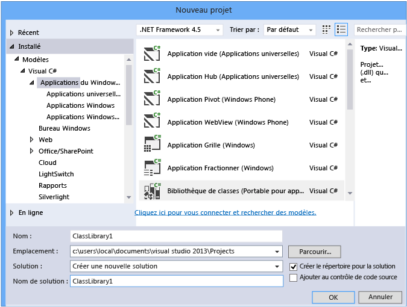
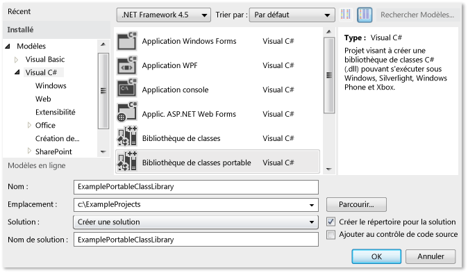
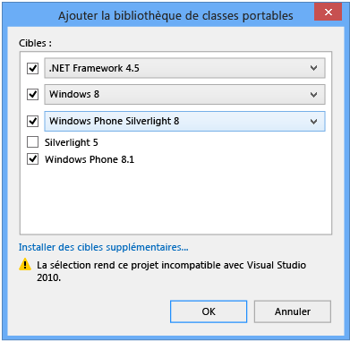
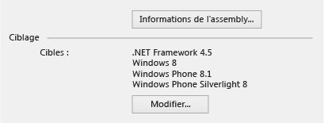
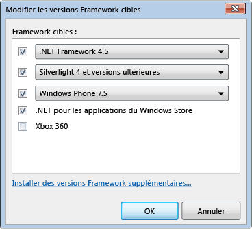
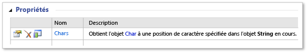
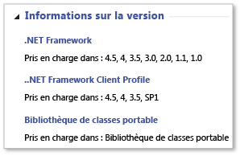

# <a name="cross-platform-development-with-the-portable-class-library"></a>Développement interplateforme avec la bibliothèque de classes portable
Le type de projet de bibliothèque de classes portables .NET Framework dans Visual Studio vous permet de créer rapidement et facilement des applications interplateformes et des bibliothèques pour les plateformes Microsoft.  
  
 Les bibliothèques de classes portables vous aident à réduire le temps et les coûts de développement et de test du code. Utilisez ce type de projet pour écrire et créer des assemblys .NET Framework portables, avant de les référencer à partir d'applications qui ciblent plusieurs plateformes telles que Windows et Windows Phone.  
  
 Même après avoir créé un projet de bibliothèque de classes portables dans Visual Studio et commencé à le développer, vous pouvez modifier les plateformes cibles. Visual Studio compile votre bibliothèque avec les nouveaux assemblys, ce qui vous permet d'identifier les changements à effectuer dans votre code.  
  
 Cet article aborde le développement d'application dans Visual Studio, mais Microsoft fournit également des assemblys de référence de bibliothèque de classes portables que vous pouvez utiliser pour développer des applications et des bibliothèques avec des outils tiers tels que Xamarin. Vous pouvez utiliser ces applications et bibliothèques sur n'importe quel runtime .NET Framework sur les plateformes non-Microsoft. Pour plus d’informations sur les assemblys de référence, consultez le billet de blog [Portable classe bibliothèque (PCL) désormais disponible sur toutes les plateformes](http://blogs.msdn.com/b/dotnet/archive/2013/10/14/portable-class-library-pcl-now-available-on-all-platforms.aspx). Pour télécharger les assemblys, consultez [assemblys de référence de bibliothèque Portable Microsoft .NET](http://www.microsoft.com/download/details.aspx?id=40727) dans du Microsoft Download Center. Pour plus d’informations sur l’utilisation d’assemblys avec Xamarin, consultez le billet de blog [de classes portables et les bibliothèques .NET NuGet sont désormais activées pour Xamarin](http://blogs.msdn.com/b/dotnet/archive/2013/11/13/pcl-and-net-nuget-libraries-are-now-enabled-for-xamarin.aspx).  
  
 Visual Studio fournit des modèles qui vous aident à développer avec la bibliothèque de classes portables. Suivant la version de Visual Studio que vous utilisez, les modèles et menus disponibles peuvent différer de ceux décrits dans cet article.  
  
> [!WARNING]
>  [Visual Studio 2013 Update 2](http://go.microsoft.com/fwlink/p/?LinkId=393658) inclut les mises à jour pour les modèles de bibliothèque de classes portables. Si vous disposez d’une version antérieure de Visual Studio et Visual Studio 2013 est installé sur le même ordinateur, puis que vous installez Update 2, les modifications apportées à la **Framework cible** choix est appliquées aux deux versions de Visual Studio.  
  
 Dans cette rubrique :  
  
 [Prise en charge de Visual Studio](#vs_support)  
 [Création d’un projet de bibliothèque de classes Portable](#create_pcl)  
 [Options cibles](#platforms)  
 [Modification des cibles](#change_targets)  
 [Fonctionnalités prises en charge](#features)  
 [Les membres et types pris en charge](#members)  
 [Différences d’API dans la bibliothèque de classes Portable](#API_diff)  
 [À l’aide de la bibliothèque de classes Portable](#using)  
  
<a name="vs_support"></a>   
## <a name="visual-studio-support"></a>Prise en charge par Visual Studio  
 La prise en charge de la création de la bibliothèque de classes portables par Visual Studio dépend de la version de Visual Studio que vous utilisez. Dans certains cas, vous disposez de tous les éléments nécessaires, tandis que dans d'autres, vous devez installer des éléments supplémentaires, comme le montre le tableau suivant.  
  
|Référence Visual Studio|Prise en charge de la création d'une bibliothèque de classes portables|  
|-----------------------|---------------------------------------------------|  
|Visual Studio 2010 Professional, Premium ou Ultimate|Oui, quand vous installez le [outils de bibliothèque Portable](https://marketplace.visualstudio.com/items?itemName=BCLTeam.PortableLibraryTools2).|  
|Versions Visual Studio Express 2010|Non.|  
|Visual Studio 2012 Professional, Premium ou Ultimate|Oui. Pour un support téléphonique, vous devez installer le [Windows Phone SDK 8.0](http://go.microsoft.com/fwlink/?LinkId=265772).|  
|Versions Visual Studio Express 2012|Non.|  
|Visual Studio 2013 Professional, Premium ou Ultimate|Oui. Pour la prise en charge de Windows Phone 8.1, installez [Visual Studio 2013 Update 2](http://go.microsoft.com/fwlink/p/?LinkId=393658).|  
|Visual Studio Express 2013 pour Windows|Oui, quand vous installez le [version la plus récente de Visual Studio Express](http://go.microsoft.com/fwlink/p/?LinkId=394629), qui inclut la mise à jour 2, ou ajoutez [Visual Studio 2013 Update 2](http://go.microsoft.com/fwlink/p/?LinkId=393658).|  
  
<a name="create_pcl"></a>   
## <a name="creating-a-portable-class-library-project"></a>Création d'un projet de bibliothèque de classes portables  
 Pour créer une bibliothèque de classes portables, vous devez utiliser l'un des modèles fournis dans Visual Studio. Créer un nouveau projet, puis, dans le **nouveau projet** boîte de dialogue **modèles**, sélectionnez votre langue cible (c# ou Visual Basic), puis sélectionnez une des plateformes à cibler. Vous pouvez sélectionner des plateformes supplémentaires à l'étape suivante.  
  
 Dans Visual Studio 2013 Update 2, vous pouvez choisir le **bibliothèque de classes (Portable)** modèle pour votre langage choisi et de la plateforme pour créer une bibliothèque de classes Portable. Ce modèle est disponible pour les plateformes suivantes :  
  
-   Applications du Windows Store  
  
-   Bureau Windows  
  
-   Silverlight  
  
 Si vous souhaitez créer une bibliothèque pour cible Windows Phone 8.1 et Windows 8.1 en c#, vous pouvez choisir **applications du Windows Store**, puis choisissez **bibliothèque de classes (Portable pour applications universelles)**.  
  
   
  
 Ce modèle sélectionne automatiquement Windows 8.1 et Windows Phone 8.1 comme cibles. Si vous créez une bibliothèque qui cible uniquement Windows Phone 8.1 ou Windows 8.1, vous pouvez modifier les plateformes cibles et ajouter des plateformes ultérieurement.  
  
 Si vous utilisez Visual Studio 2012 ou Visual Studio 2013 sans Update 2, vous créez un projet et choisissez la **bibliothèque de classes portables** modèle sous Visual c# ou Visual Basic.  
  
   
  
 Le **ajouter une bibliothèque de classes portables** boîte de dialogue s’affiche, et vous pouvez sélectionner des plateformes supplémentaires. La boîte de dialogue indique des avertissements de compatibilité en fonction des cibles que vous sélectionnez.  
  
   
Boîte de dialogue Ajouter la bibliothèque de classes portables dans Visual Studio 2013 Update 2  
  
 Que vous utilisiez Visual Studio 2012 ou Visual Studio 2013, vous pouvez sélectionner les plateformes quand vous créez un projet de bibliothèque de classes portables, ou vous pouvez utiliser les propriétés de projet pour modifier les plateformes cibles après avoir créé le projet.  
  
<a name="platforms"></a>   
## <a name="target-options"></a>Options cibles  
 Quand vous créez un projet de bibliothèque de classes portables, vous pouvez choisir le système d'exploitation et la version .NET Framework à cibler. Si vous utilisez Visual Studio 2013 et vous avez installé Update 2 ou version ultérieure, vous pouvez choisir le **bibliothèque de classes (Portable pour applications universelles)** modèle pour créer une bibliothèque de classes portables ciblant Windows 8.1 et Windows Phone 8.1. Le tableau suivant indique les cibles disponibles en fonction de la version de Visual Studio utilisée.  
  
|Option cible|Visual Studio 2012|Visual Studio 2013|Visual Studio 2013 Update 2 ou version ultérieure|  
|-|-|-|-|  
|.NET Framework|-.NET framework 4 et versions ultérieures<br /><br /> -.NET framework 4.0.3 et versions ultérieures<br /><br /> -.NET framework 4.5|-.NET framework 4 et versions ultérieures<br /><br /> -.NET framework 4.0.3 et versions ultérieures<br /><br /> -.NET framework 4.5 et versions ultérieures<br /><br /> -.NET framework 4.5.1|-.NET framework 4<br /><br /> -.NET framework 4.0.3<br /><br /> -.NET framework 4.5<br /><br /> -.NET framework 4.5.1|  
|Windows Phone|-Windows Phone 7 et versions ultérieures<br /><br /> -Windows Phone 7.5 et versions ultérieures<br /><br /> -Windows Phone 8|-Windows Phone 8|-Windows Phone Silverlight 8<br /><br /> -Windows Phone Silverlight 8.1<br /><br /> Pour la prise en charge de Windows Runtime et de la syntaxe XAML, choisissez :<br /><br /> -Windows Phone 8.1|  
|Windows Store|-.NET pour les applications du Windows Store|-Applications de Store Windows (Windows 8) et versions ultérieures<br /><br /> -Windows Store Apps (Windows 8.1)|-Windows 8<br /><br /> -Windows 8.1|  
|-Silverlight|-Silverlight 4 et versions ultérieures<br /><br /> -Silverlight 5|-Silverlight 5|-Silverlight 5|  
|Xbox|-Xbox 360|N/A|N/A|  
  
<a name="change_targets"></a>   
## <a name="changing-targets"></a>Modification des cibles  
 Quand vous choisissez un modèle de bibliothèque de classes portables, les plateformes par défaut sont automatiquement sélectionnées, en fonction toutefois de la version de Visual Studio installée et des cibles sélectionnées par vos soins. Vous pouvez modifier les plateformes quand vous créez la bibliothèque de classes portables ou après avoir démarré le développement d'une bibliothèque de classes portables.  
  
 Si vous souhaitez modifier les cibles après avoir créé votre projet, dans **l’Explorateur de solutions**, ouvrez le menu contextuel pour votre projet de bibliothèque de classes portables (pas la solution), puis choisissez **propriétés** . Dans la page de propriétés de projet, le **bibliothèque** onglet affiche les plateformes que votre projet cible actuellement.  
  
   
Page de propriétés de la bibliothèque de classes portables dans Visual Studio 2013 Update 2  
  
 Pour ajouter ou supprimer des cibles, choisissez le **modification** bouton, puis sélectionnez et désactivez les cases à cocher appropriées.  
  
 Quand vous modifiez les cibles, les API disponibles pour le développement de votre projet changent en conséquence. Visual Studio indique les erreurs et les avertissements éventuellement engendrés par la modification des cibles.  
  
 Si vous souhaitez évaluer la portabilité de vos assemblys avant d’apporter des modifications dans Visual Studio, vous pouvez utiliser la [Analyseur de portabilité .NET](http://visualstudiogallery.msdn.microsoft.com/1177943e-cfb7-4822-a8a6-e56c7905292b).  
  
 Les options de menu varient suivant la version de Visual Studio utilisée.  
  
   
Boîte de dialogue Modifier les cibles dans Visual Studio 2012  
  
<a name="features"></a>   
## <a name="supported-features"></a>Fonctionnalités prises en charge  
 Le tableau ci-dessous indique les fonctionnalités prises en charge sur les plateformes et versions disponibles. Dans certains cas, Microsoft prend également en charge un package NuGet nouvellement publié, et cela est indiqué par un renvoi. Pour plus d’informations sur les packages NuGet pour le .NET Framework, consultez [du .NET Framework et les versions hors-bande](../../../docs/framework/get-started/the-net-framework-and-out-of-band-releases.md).  
  
|Fonctionnalité|.NET Framework|.NET Framework|.NET Framework|Windows Store|Windows Store|Windows Phone Store|Windows Phone Silverlight|Windows Phone Silverlight|Windows Phone Silverlight|Silverlight|Silverlight|Xbox 360|  
|-------------|--------------------|--------------------|--------------------|-------------------|-------------------|-------------------------|-------------------------------|-------------------------------|-------------------------------|-----------------|-----------------|--------------|  
||**4**|**4.0.3**|**4.5**|**8**|**8.1**|**8.1**|**7.5**|**8**|**8.1**|**4**|**5**||  
|Bibliothèques principales|✓|✓|✓|✓|✓|✓|✓|✓|✓|✓|✓|✓|  
|Prise en charge asynchrone|➊|➊|✓|✓|✓|✓|➊|➊|✓|➊|➊||  
|Compression|||✓|✓|✓|✓||➋|➋||||  
|Annotations de données||✓|✓|✓|✓|||||✓|✓||  
|Mot clé dynamique|✓|✓|✓|✓|✓|||||✓|✓||  
|Client HTTP|➌|➌|✓|✓|✓|✓|➌|➌|➌|➌|➌||  
|IQueryable|✓|✓|✓|✓|✓|✓|✓|✓|✓|✓|✓||  
|LINQ (Language Integrated Query)|✓|✓|✓|✓|✓|✓|✓|✓|✓|✓|✓||  
|Managed Extensibility Framework (MEF)|✓|✓|✓|✓|✓|||||✓|✓||  
|Bibliothèque de classes de réseau (NCL)|✓|✓|✓|✓|✓|✓|✓|✓|✓|✓|✓||  
|Sérialisation (contrat de données, XML et JSON)|✓|✓|✓|✓|✓|✓|✓|✓|✓|✓|✓||  
|System.Numerics|✓|✓|✓|✓|✓|||||✓|✓||  
|Modèles d'affichage (MVVM)|||✓|✓|✓|✓|✓|✓|✓|✓|✓||  
|Windows Communication Foundation (WCF)|✓|✓|✓|✓|✓||✓|✓|✓|✓|✓||  
|API Windows Runtime|||||✓|✓|||||||  
|Windows.UI.XAML|||||✓|✓|||||||  
|XLINQ||✓|✓|✓|✓|✓|✓|✓|✓|✓|✓|✓|  
  
 ➊ Nécessite le [Microsoft Async](https://www.nuget.org/packages/Microsoft.Bcl.Async/) package  
 ➋ Nécessite le [Microsoft Compression](https://www.nuget.org/packages/Microsoft.Bcl.Compression) package  
 ➌ Nécessite le [Microsoft HTTP Client Libraries](http://www.nuget.org/packages/Microsoft.Net.Http) package  
  
> [!WARNING]
>  Vous pouvez rencontrer des erreurs lorsque vous référencez le [Microsoft Compression](https://www.nuget.org/packages/Microsoft.Bcl.Compression) et [Microsoft HTTP Client Libraries](http://www.nuget.org/packages/Microsoft.Net.Http) packages à partir d’une bibliothèque portable utilisée par une application Windows Phone Silverlight 8.1. Pour plus d’informations, consultez [compatibilité de la plateforme et modifications récentes pour les applications Windows Phone Silverlight 8.1](http://go.microsoft.com/fwlink/p/?LinkId=394744).  
  
<a name="members"></a>   
## <a name="supported-types-and-members"></a>Types et membres pris en charge  
 Les types et les membres disponibles dans les projets de bibliothèque de classes portables dépendent de plusieurs facteurs de compatibilité :  
  
-   Ils doivent être partagés entre les cibles que vous avez sélectionnées.  
  
-   Leur comportement doit être similaire sur ces cibles.  
  
-   Ils ne doivent pas être candidats pour la dépréciation.  
  
-   Ils doivent s'avérer utiles dans un environnement portable, en particulier lorsque les membres qui les prennent en charge ne sont pas portables.  
  
 Par exemple, la bibliothèque de classes portables ne contient des types liés à l'interface utilisateur que quand vous ciblez Windows 8.1 et Windows Phone 8.1. En outre, vous pouvez rencontrer des limitations si vous ciblez les plateformes (telles que Xbox, .NET Framework 4 et Windows Phone 7) qui sont sorties avant l'introduction de la bibliothèque de classes portables. Par le biais de NuGet, le .NET Framework publie des packages qui améliorent la prise en charge de la bibliothèque de classes portables pour certaines de ces anciennes plateformes. Pour plus d’informations et une liste des packages NuGet, consultez [du .NET Framework et les versions hors-bande](../../../docs/framework/get-started/the-net-framework-and-out-of-band-releases.md).  
  
 Si un membre est pris en charge dans la bibliothèque de classes portables et pour les cibles que vous avez sélectionnées, il apparaît dans votre projet dans IntelliSense. En outre, l’icône de bibliothèque de classes portables  apparaît dans les tables membres, dans le [bibliothèque de classes .NET Framework](https://msdn.microsoft.com/library/mt472912.aspx) suivant pour les membres pris en charge. Par exemple, la table de membres suivante montre que la propriété <xref:System.String.Chars%2A> de la classe <xref:System.String> est prise en charge dans la bibliothèque de classes portables :  
  
   
Icône de bibliothèque de classes portables  
  
 Vous pouvez également consulter le **les informations de Version** section d’une rubrique de référence pour une note qui indique qu’un type ou membre est pris en charge dans le projet de bibliothèque de classes portables :  
  
   
Exemple d'informations sur la version  
  
 Toutefois, gardez à l'esprit que même si une API est prise en charge dans la bibliothèque de classes portables, ce sont les cibles que vous sélectionnez qui déterminent si vous pouvez utiliser cette API.  
  
<a name="API_diff"></a>   
## <a name="api-differences-in-the-portable-class-library"></a>Différences d'API dans la bibliothèque de classes portables  
 Pour rendre les assemblys de bibliothèque de classes portables compatibles sur toutes les plateformes prises en charge, certains membres ont été légèrement modifiés dans la bibliothèque de classes portables.  
  
<a name="using"></a>   
## <a name="using-the-portable-class-library"></a>Utilisation de la bibliothèque de classes portable  
 Après avoir créé votre projet de bibliothèque de classes portables, vous n'avez plus qu'à le référencer à partir d'autres projets. Vous pouvez référencer le projet ou des assemblys spécifiques qui contiennent les classes auxquelles vous souhaitez accéder.  
  
 Pour exécuter une application qui référence un assembly de bibliothèque de classes portables, la version requise (ou version ultérieure) des plateformes ciblées doit être installée sur votre ordinateur. Visual Studio contient toutes les infrastructures requises pour que vous puissiez exécuter l'application sans modification supplémentaire sur l'ordinateur que vous avez utilisé pour développer l'application.  
  
### <a name="deploying-a-windows-store-or-windows-phone-app"></a>Déploiement d'une application du Windows Store ou Windows Phone  
 Quand vous créez une application du Windows store ou Windows Phone qui référence un assembly de bibliothèque de classes portables, tout ce dont vous avez besoin pour déployer l'application se trouve dans le package d'application, et aucune étape supplémentaire n'est nécessaire.  
  
### <a name="deploying-a-net-framework-app"></a>Déploiement d'une application .NET Framework  
 Quand vous déployez une application .NET Framework qui référence un assembly de bibliothèque de classes portables, vous devez spécifier une dépendance sur la version appropriée du .NET Framework. En spécifiant cette dépendance, vous êtes assuré que la version requise est installée avec votre application. Si vous ciblez .NET Framework 4 ou version ultérieure, l’ordinateur doit disposer de .NET Framework 4 avec une [mettre à jour](http://go.microsoft.com/fwlink/?LinkId=210824), mise à jour 4.0.3 pour .NET Framework 4 ou .NET Framework 4.5 est installé.  
  
-   Pour créer une dépendance avec le déploiement ClickOnce : dans **l’Explorateur de solutions**, choisissez le nœud du projet pour le projet que vous voulez publier. (Il s'agit du projet qui référence le projet de bibliothèque de classes portables.) Dans la barre de menus, choisissez **projet**, **propriétés**, puis choisissez le **publier** onglet. Sur le **publier** choisissez **conditions préalables**. Sélectionnez la version requise du .NET Framework (ou la mise à jour pour .NET Framework 4) comme composant requis.  
  
-   Pour créer une dépendance avec un projet d’installation : dans **l’Explorateur de solutions**, choisissez le projet d’installation. Dans la barre de menus, choisissez **projet**, **propriétés**, **conditions préalables**. Sélectionnez la version requise du .NET Framework en tant que composant requis.  
  
 Pour plus d’informations sur le déploiement des applications .NET Framework, consultez [Guide de déploiement pour les développeurs](../../../docs/framework/deployment/deployment-guide-for-developers.md).  
  
### <a name="deploying-a-silverlight-based-app"></a>Déploiement d'une application Silverlight  
 Quand vous déployez une application Silverlight qui référence un assembly de bibliothèque de classes portables, vous devez vous assurer que la version minimale du runtime requise pour l'application corresponde à sa version ciblée. Si vous ciblez Silverlight 4, il convient d'utiliser la version 4.0.60129.0 ou une version ultérieure. Vous définissez la version en incluant `<param name="minRuntimeVersion" value="4.0.60129.0" />` dans la page web qui héberge l'application Silverlight, comme suit :  
  
```xaml  
<div id="silverlightControlHost">  
    <object data="data:application/x-silverlight-2,"   
           type="application/x-silverlight-2" width="100%" height="100%">  
    <param name="source" value="ClientBin/SilverlightApplication.xap"/>  
    <param name="onError" value="onSilverlightError" />  
    <param name="background" value="white" />  
    <param name="minRuntimeVersion" value="4.0.60129.0" />  
    <param name="autoUpgrade" value="true" />  
    <a href="http://go.microsoft.com/fwlink/?LinkID=149156&v=4.0.50826.0"   
             style="text-decoration:none">  
        
    </a>  
  </object>  
   <iframe id="_sl_historyFrame"   
              style="visibility:hidden;height:0px;width:0px;border:0px">  
   </iframe>  
</div>  
```  
  
## <a name="see-also"></a>Voir aussi  
 [Utilisation de la bibliothèque de classes portable avec MVVM](../../../docs/standard/cross-platform/using-portable-class-library-with-model-view-view-model.md)  
 [Ressources d’application pour les bibliothèques qui ciblent plusieurs plateformes](../../../docs/standard/cross-platform/app-resources-for-libraries-that-target-multiple-platforms.md)  
 [Analyseur de portabilité .NET](http://visualstudiogallery.msdn.microsoft.com/1177943e-cfb7-4822-a8a6-e56c7905292b)  
 [Prise en charge .NET Framework pour les applications Windows Store et Windows Runtime](../../../docs/standard/cross-platform/support-for-windows-store-apps-and-windows-runtime.md)  
 [Déploiement](../../../docs/framework/deployment/net-framework-applications.md)
