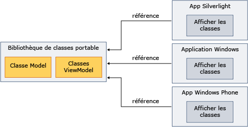

# Utilisation de la Bibliothèque de classes portable avec le modèle d'affichage Modèle-Affichage
Vous pouvez utiliser le .NET Framework [bibliothèque de classes portables](../../../docs/standard/cross-platform/cross-platform-development-with-the-portable-class-library.md) pour implémenter le modèle de modèle-affichage MVVM (Model) et de partager des assemblys sur plusieurs plateformes.  
  
 MVVM est un modèle d’application qui isole l’interface utilisateur à partir de la logique métier sous-jacente. Vous pouvez implémenter les classes de modèle de modèle et la vue dans un [!INCLUDE[net_portable](../../../includes/net-portable-md.md)] projet [!INCLUDE[vs_dev11_long](../../../includes/vs-dev11-long-md.md)], puis créer des vues personnalisées pour les différentes plateformes. Cette approche vous permet d’écrire les données de modèle et une logique métier qu’une seule fois et utilisez ce code à partir de .NET Framework, Silverlight, Windows Phone, et [!INCLUDE[win8_appname_long](../../../includes/win8-appname-long-md.md)] applications, comme indiqué dans l’illustration suivante.  
  
   
  
 Cette rubrique ne fournit pas d’informations générales sur le modèle MVVM. Il fournit uniquement des informations sur l’utilisation de [!INCLUDE[net_portable](../../../includes/net-portable-md.md)] pour implémenter MVVM. Pour plus d’informations sur MVVM, consultez le [MVVM Quickstart](http://go.microsoft.com/fwlink/?LinkId=234934).  
  
## Classes qui prennent en charge MVVM  
 Lorsque vous ciblez le [!INCLUDE[net_v45](../../../includes/net-v45-md.md)], [!INCLUDE[net_win8_profile](../../../includes/net-win8-profile-md.md)], Silverlight ou 7.5 de Windows Phone pour votre [!INCLUDE[net_portable](../../../includes/net-portable-md.md)] projet, les classes suivantes sont disponibles pour implémenter le modèle MVVM :  
  
-   Classe <xref:System.Collections.ObjectModel.ObservableCollection%601?displayProperty=nameWithType>  
  
-   Classe <xref:System.Collections.ObjectModel.ReadOnlyObservableCollection%601?displayProperty=nameWithType>  
  
-   Classe <xref:System.Collections.Specialized.INotifyCollectionChanged?displayProperty=nameWithType>  
  
-   Classe <xref:System.Collections.Specialized.NotifyCollectionChangedAction?displayProperty=nameWithType>  
  
-   Classe <xref:System.Collections.Specialized.NotifyCollectionChangedEventArgs?displayProperty=nameWithType>  
  
-   Classe <xref:System.Collections.Specialized.NotifyCollectionChangedEventHandler?displayProperty=nameWithType>  
  
-   Classe <xref:System.ComponentModel.DataErrorsChangedEventArgs?displayProperty=nameWithType>  
  
-   Classe <xref:System.ComponentModel.INotifyDataErrorInfo?displayProperty=nameWithType>  
  
-   Classe <xref:System.ComponentModel.INotifyPropertyChanged?displayProperty=nameWithType>  
  
-   Classe <xref:System.Windows.Input.ICommand?displayProperty=nameWithType>  
  
-   Toutes les classes dans le <xref:System.ComponentModel.DataAnnotations?displayProperty=nameWithType> espace de noms  
  
## Implémentation MVVM  
 Pour implémenter MVVM, vous créez en général, le modèle et le modèle d’affichage dans un [!INCLUDE[net_portable](../../../includes/net-portable-md.md)] de projet, car un [!INCLUDE[net_portable](../../../includes/net-portable-md.md)] projet ne peut pas faire référence à un projet non portable. Le modèle et le modèle d’affichage peuvent être dans le même projet ou dans des projets distincts. Si vous utilisez des projets distincts, vous pouvez ajouter une référence à partir du projet de modèle de vue pour le projet de modèle.  
  
 Après la compilation du modèle et afficher les projets de modèle, vous référencez les assemblys dans l’application qui contient la vue. Si la vue interagit uniquement avec le modèle d’affichage, vous devez uniquement référencer l’assembly qui contient le modèle d’affichage.  
  
### Modèle  
 L’exemple suivant montre une classe de modèle simplifié qui peut résider dans un [!INCLUDE[net_portable](../../../includes/net-portable-md.md)] projet.  
  
 [!code-csharp[PortableClassLibraryMVVM#1](../../../samples/snippets/csharp/VS_Snippets_CLR/portableclasslibrarymvvm/cs/customer.cs#1)]
 [!code-vb[PortableClassLibraryMVVM#1](../../../samples/snippets/visualbasic/VS_Snippets_CLR/portableclasslibrarymvvm/vb/customer.vb#1)]  
  
 L’exemple suivant illustre une méthode simple pour remplir, extraire et mettre à jour les données dans un [!INCLUDE[net_portable](../../../includes/net-portable-md.md)] projet. Dans une application réelle, vous devez récupérer les données à partir d’une source telle qu’un service Windows Communication Foundation (WCF).  
  
 [!code-csharp[PortableClassLibraryMVVM#2](../../../samples/snippets/csharp/VS_Snippets_CLR/portableclasslibrarymvvm/cs/customerrepository.cs#2)]
 [!code-vb[PortableClassLibraryMVVM#2](../../../samples/snippets/visualbasic/VS_Snippets_CLR/portableclasslibrarymvvm/vb/customerrepository.vb#2)]  
  
### Modèle d’affichage  
 Une classe de base pour les modèles de la vue est fréquemment ajoutée lors de l’implémentation du modèle MVVM. L’exemple suivant montre une classe de base.  
  
 [!code-csharp[PortableClassLibraryMVVM#3](../../../samples/snippets/csharp/VS_Snippets_CLR/portableclasslibrarymvvm/cs/viewmodelbase.cs#3)]
 [!code-vb[PortableClassLibraryMVVM#3](../../../samples/snippets/visualbasic/VS_Snippets_CLR/portableclasslibrarymvvm/vb/viewmodelbase.vb#3)]  
  
 Une implémentation de la <xref:System.Windows.Input.ICommand> interface est fréquemment utilisée avec le modèle MVVM. L'exemple suivant illustre une implémentation de l'interface <xref:System.Windows.Input.ICommand>.  
  
 [!code-csharp[PortableClassLibraryMVVM#4](../../../samples/snippets/csharp/VS_Snippets_CLR/portableclasslibrarymvvm/cs/relaycommand.cs#4)]
 [!code-vb[PortableClassLibraryMVVM#4](../../../samples/snippets/visualbasic/VS_Snippets_CLR/portableclasslibrarymvvm/vb/relaycommand.vb#4)]  
  
 L’exemple suivant montre un modèle de vue simplifiée.  
  
 [!code-csharp[PortableClassLibraryMVVM#5](../../../samples/snippets/csharp/VS_Snippets_CLR/portableclasslibrarymvvm/cs/mainpageviewmodel.cs#5)]
 [!code-vb[PortableClassLibraryMVVM#5](../../../samples/snippets/visualbasic/VS_Snippets_CLR/portableclasslibrarymvvm/vb/customerviewmodel.vb#5)]  
  
### Vue  
 À partir d’un [!INCLUDE[net_v45](../../../includes/net-v45-md.md)] app, [!INCLUDE[win8_appname_long](../../../includes/win8-appname-long-md.md)] application, application Silverlight ou une application du Windows Phone 7.5, vous pouvez référencer l’assembly qui contient les projets de modèle de modèle et la vue.  Vous permet ensuite de créer un affichage qui interagit avec le modèle d’affichage. L’exemple suivant montre une application Windows Presentation Foundation (WPF) simplifié qui Récupère et met à jour des données à partir du modèle de vue. Vous pouvez créer des vues similaires dans Silverlight, Windows Phone, ou [!INCLUDE[win8_appname_long](../../../includes/win8-appname-long-md.md)] applications.  
  
 [!code-xaml[PortableClassLibraryMVVM#6](../../../samples/snippets/csharp/VS_Snippets_CLR/portableclasslibrarymvvm/cs/mainwindow.xaml#6)]  
  
## Voir aussi  
 [Bibliothèque de classes portable](../../../docs/standard/cross-platform/cross-platform-development-with-the-portable-class-library.md)
