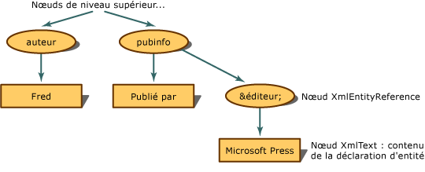

# <a name="entity-references-are-preserved"></a><span data-ttu-id="69c46-102">Conservation des références d'entité</span><span class="sxs-lookup"><span data-stu-id="69c46-102">Entity References are Preserved</span></span>
<span data-ttu-id="69c46-103">Une fois que la référence d’entité n’est pas développée, mais préservée, le modèle d’objet Document (DOM) XML crée un **XmlEntityReference** nœud lorsqu’il rencontre une référence d’entité.</span><span class="sxs-lookup"><span data-stu-id="69c46-103">When the entity reference is not expanded, but preserved, the XML Document Object Model (DOM) builds an **XmlEntityReference** node when it encounters an entity reference.</span></span>  
  
 <span data-ttu-id="69c46-104">À l'aide du code XML suivant,</span><span class="sxs-lookup"><span data-stu-id="69c46-104">Using the following XML,</span></span>  
  
```xml  
<author>Fred</author>  
<pubinfo>Published by &publisher;</pubinfo>  
```  
  
 <span data-ttu-id="69c46-105">le DOM crée un **XmlEntityReference** nœud lorsqu’il rencontre le `&publisher;` référence.</span><span class="sxs-lookup"><span data-stu-id="69c46-105">the DOM builds an **XmlEntityReference** node when it encounters the `&publisher;` reference.</span></span> <span data-ttu-id="69c46-106">Le **XmlEntityReference** contient des nœuds enfants copiés à partir du contenu dans la déclaration d’entité.</span><span class="sxs-lookup"><span data-stu-id="69c46-106">The **XmlEntityReference** contains child nodes copied from the content in the entity declaration.</span></span> <span data-ttu-id="69c46-107">L’exemple de code précédent contient du texte dans la déclaration d’entité, par conséquent, un **XmlText** nœud est créé en tant que le nœud enfant du nœud de référence d’entité.</span><span class="sxs-lookup"><span data-stu-id="69c46-107">The preceding code example contains text in the entity declaration, so an **XmlText** node is created as the child node of the entity reference node.</span></span>  
  
 <span data-ttu-id="69c46-108"></span><span class="sxs-lookup"><span data-stu-id="69c46-108"></span></span>  
<span data-ttu-id="69c46-109">Structure d’arborescence avec références d’entité préservées</span><span class="sxs-lookup"><span data-stu-id="69c46-109">Tree structure for entity references that are preserved</span></span>  
  
 <span data-ttu-id="69c46-110">Les nœuds enfants de la **XmlEntityReference** sont des nœuds créés à partir de copies de tous les enfants du **XmlEntity** nœud lors de la déclaration d’entité a été rencontrée.</span><span class="sxs-lookup"><span data-stu-id="69c46-110">The child nodes of the **XmlEntityReference** are copies of all the child nodes created from the **XmlEntity** node when the entity declaration was encountered.</span></span>  
  
> [!NOTE]
>  <span data-ttu-id="69c46-111">Les nœuds copiés à partir de la **XmlEntity** ne sont pas toujours des copies exactes une fois placés sous le nœud de référence d’entité.</span><span class="sxs-lookup"><span data-stu-id="69c46-111">The nodes copied from the **XmlEntity** are not always exact copies once placed under the entity reference node.</span></span> <span data-ttu-id="69c46-112">Il peut y avoir des espaces de noms qui sont dans la portée au niveau du nœud de référence d'entité et qui ont une incidence sur la configuration finale des nœuds enfants.</span><span class="sxs-lookup"><span data-stu-id="69c46-112">There can be namespaces that are in scope at the entity reference node, and that affects the final configuration of the child nodes.</span></span>  
  
 <span data-ttu-id="69c46-113">Par défaut, des entités générales telles que `&abc;` sont conservés et **XmlEntityReference** nœuds toujours créés.</span><span class="sxs-lookup"><span data-stu-id="69c46-113">By default, general entities like `&abc;` are preserved and **XmlEntityReference** nodes always created.</span></span>  
  
## <a name="see-also"></a><span data-ttu-id="69c46-114">Voir aussi</span><span class="sxs-lookup"><span data-stu-id="69c46-114">See Also</span></span>  
 [<span data-ttu-id="69c46-115">Document Object Model (DOM) XML</span><span class="sxs-lookup"><span data-stu-id="69c46-115">XML Document Object Model (DOM)</span></span>](../../../../docs/standard/data/xml/xml-document-object-model-dom.md)
